# 1\. JVM基础要点
## JVM基础要点


### 什么是JVM?
- JVM的三个特性: 虚拟机、字节码、平台无关.
- 最广泛的虚拟机类型是Sun公司的HotSpot，除此之外还有BEA的JRockit , 最后都被Oracle收购.

### JVM组成部分以及描述
- 大致结构如下图所示:
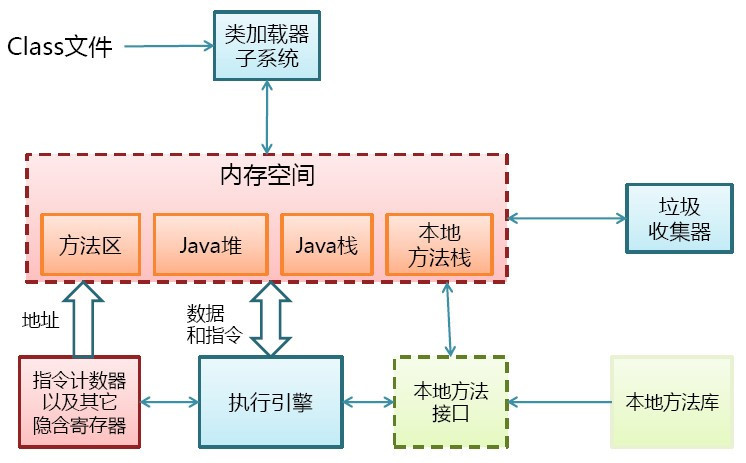
    - 组成部分有: **类加载子系统、方法区、Java堆、直接内存、Java栈、本地方法栈、PC寄存器、垃圾回收系统、执行引擎**
- 各个组成部分描述如下:
    - **类加载子系统:** <font color="green"> 线程公用</font> 负责从文件系统或者网络中加载Class信息, 加载的信息存放在被称之为方法区的内存空间.
    - **方法区:** <font color="green">线程公用</font> 存放类信息、常量信息、常量池信息、包括字符串字面量和常量等.
    - **Java堆:** <font color="green">线程公用</font> 在Java虚拟机启动时建立Java堆，它是Java程序的主要内存工作区，几乎所有的java实例对象都存放到Java堆中.
    - **直接内存:** <font color="green">线程公用</font> Java的NIO库允许Java程序直接使用内存, 从而提高性能, 读写频繁的场合会考虑使用.
    - **Java栈(Java虚拟机栈):** <font color="green">线程私有</font> 每个虚拟机线程都有一个私有的栈。一个线程的Java栈在线程被创建的时候创建，java栈中存放在局部变量、方法参数、以及方法的调用和返回值等.
    - **本地方法栈:** <font color="green">线程私有</font> 本地方法栈和Java栈非常类似，最大不同为本地方法栈用于本地方法调用例如native, Java虚拟机允许java直接调用底层库的本地方法(通常使用C编写 底层库文件在Linux/Windows显示为.so/.dll，调用方式通常为Jna或Jnative).
    - **垃圾回收系统:** <font color="green"> 线程公用</font> Java有一套自己的垃圾清理机制, 无需开发人员手动清理.
    - **PC寄存器:** <font color="green">线程私有</font> 寄存器是每个线程私有的空间, Java虚拟机会为每个线程创建PC寄存器。在任意时刻，Java线程总是在执行一个方法，这个方法被称之为当前方法，如果当前方法不是本地方法，PC寄存器就会执行当前正在被执行的指令；如果是本地方法，则PC寄存器的值为undefined。PC寄存器存放如当前执行环境的指针、程序计数器、操作栈指针、计算的变量指针等信息.
    - **执行引擎:** <font color="green">线程公用</font> 虚拟机最核心的组件就是执行引擎，它负责执行虚拟机字节码，一版会将字节码编译成机器码后执行.

------------

### Java堆与栈具体组成
- Java堆
    - 大致结构如下图:
    - 描述: 
        1. java堆是和java应用程序最密切的内存空间，几乎所有的对象都存放其中，而且java堆完全是自动化管理的，通过垃圾回收机制垃圾对象会自动清理，不需要显式的释放；
        2. 根据垃圾回收机制不同，java堆有可能拥有不同的结构，最常见的就是将整个java堆分为新生代和老年代，其中新生代存放新生年龄不大且较小的对象。老年代存放老年对象或者大对象。
        3. 新生代分为eden区、s0区、s1区，s0和s1区也被称为from和to区，它们是两块大小相等并且可以互换角色的空间。(注意eden区通常也被称之为伊甸园区).
        4. 绝大多数情况下，对象首先分配在eden区，在一次新生代回收后，如果对象还存活，则会进入s0或s1区，之后每经过一次新生代回收，如果对象存活则它的年龄就+1，当对象达到一定的年龄后则进入老年代.
- Java栈
    - java栈结构大致如下: 
    - 描述:
        1. java栈是线程私有的一块空间，一个栈一般由三个部分组成: 局部变量表、操作数栈、帧数据区.
        2. 局部变量表: 用于报错函数的参数以及局部变量.
        3. 操作数栈: 主要保存计算过程的中间结果，同时作为计算过程中变量临时的存储空间.
        4. 帧数据区: 除了局部变量表和操作数栈之外，栈还需要一些数据来支持常量池的解析。这里的帧数据区保存着访问常量池的指针，方便程序访问常量池。另外当函数返回或者出现异常时，虚拟机必须有一个异常处理表，方便发生异常时找到异常的代码，因此异常处理表也是也是帧数据区的一部分.
- 方法区
    - 描述: java方法区和堆一样，方法区是一块所有线程共享的内存区域，它保存系统的类信息，比如类的方法、字段、常量池等相关的信息。方法区的大小决定了系统可以保存多少类，如果系统定义太多的类会导致方法区溢出. 虚拟机同样会跑出内存溢出的错误。方法区也可以简单理解为永久区(Perm)

------------

### JVM中堆的结构布局/JVM常用的参数
- Java中内存(堆)的结构布局如下: 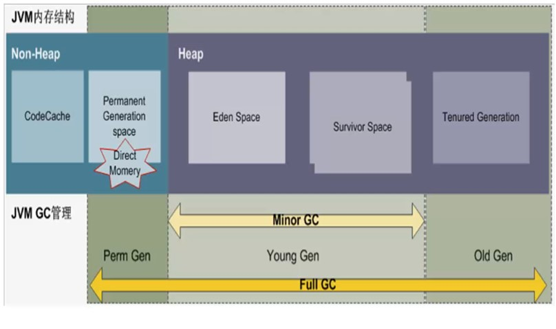
- JVM堆整体配置参数:
    1. **-Xms** 初始堆大小： 默认是物理内存的1/64 (< 1GB).
    2. **-Xmx** 最大堆大小: 默认是物理内存的1/4 (< 1GB)， 实际中建议不大于4GB。
    3. **建议 -Xms=-Xmx** : 好处是避免每次在GC后，调整堆的大小，减小系统内存的分配开销.
    4. **整个堆大小 = 新生代大小 + 老年代大小 + 持久代大小(方法区和直接内存)**
- JVM新生代(Young Gen)配置参数
    1. **新生代 = 1个eden区 + 2个Survivor区**.
    2. **-Xmn** 年轻代的总大小(1/3 ~ 1/4): ** -XX:NewSize  -XX:MaxNewSize （设置新生代大小)** .
    3. **-XX:NewRatio** : 年轻代(包括eden + 2个Survivor区) 与老年代的比值. 在设置-Xms = -Xmx 且设置了-Xmn的情况下, 该参数不需要设置.
    4. **-XX:SurvivorRatio** : Eden区与Survivor区大小的比值，若设置为8，则两个Survivor去与一个Eden区的比值为2:8，一个Survivor区占整个新生代的1/10.
- JVM老年代(Tenured/Old Gen) 配置参数:
    1. **老年代 = 整个堆 - 新生代大小 - 持久代大小** .
    2. 新生代经过垃圾回收经过一定次数且没有被回收掉的对象被复制到老年代.
    3. 新建的大对象也有可能直接进入老年代.
        - 大对象: 可以通过启动参数设置 **XX:PretenureSizeThreshold=1024**(单位是字节，默认是0) 来代表超过多大时就不在新生代分配，而是直接进入老年代。默认值为0表示直接进入eden区.
        - 大的数组对象: 且数组中无外部引用对象.
    4. 老年代大小无配置参数.
- JVM持久代(Perm Gen)
    1. **持久代 = 整个堆 - 新生代大小 - 老年代大小** .
    2. **-XX:PermSize -XX:MaxPermSize** : 设置持久代大小，一般情况下推荐将-XX:PermSize设置成-XX:MaxPermSize的值为相同的值，因为**永久代大小的调整也会导致堆内存需要触发FullGC** .
    3. 存放Class、Method元信息，其大小与项目的规模、类、方法的数量有关。一般设置为128M就足够，设置的原则是预留30%的空间.
- 堆栈分配内存的优缺:
    1. 栈分配: (-Xss 分配栈内存，默认是1M)
        - 栈分配优点: 存取速度快，仅次于寄存器.
        - 栈分配的缺点: 存在栈中的数据的大小在编译时就确定的，导致其缺乏灵活性.
    2. 堆分配:
        - 堆分配优点: 动态分配内存大小，生存期不必事先告诉编译器，它是在运行期动态分配的；垃圾回收器会自动回收不再使用的区域.
        - 堆分配的缺点: 运行时动态分配内存，在分配和销毁时都需要占用时间，因此堆的效率较低.

------------

### JVM特殊永久代的回收要有什么前提?
永久代的回收:
- 常量池中的常量, 无用的类信息, 常量的回收很简单没有引用了就可以回收.
- 对于无用的类进行回收, 必须保证3点:
<font color="green">
    - 类的所有实例都已经被回收.
    - 加载类的ClassLoader已经被回收.
    - 类对象的Class对象没有引用 (即没有通过反射引用该类的地方)
</font>

------------
### JVM分配对象的过程-涉及栈上分配/TLAB分配/逃逸分析/标量替换
- 分配对象总体流程如下图: <br/>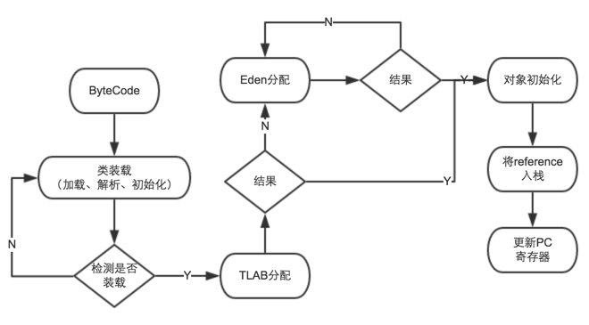
- 分配对象的详细流程如下图:<br/> 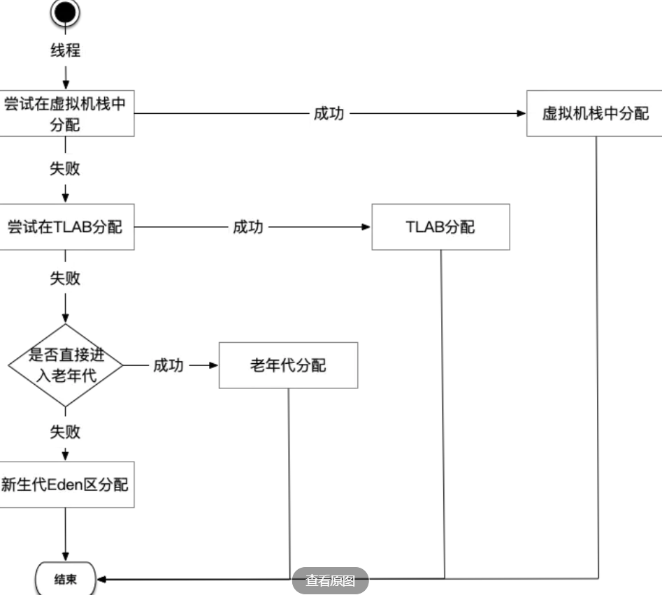
- 栈上分配
    - 详解: java堆中的对象对于各个线程都是共享和可见的，只要持有这个对象的引用，就可以访问堆中存放的对象数据，虚拟机垃圾收集系统可以回收堆中不再使用的对象，但回收过程无论是筛选可回收的对象还是回收整理内存都需要耗费时间。如果**确定一个对象不会逃逸出方法之外，那么让这个对象在栈上分配将会是一个不错的方案，对象所占用的内存空间就可以随栈帧出栈而销**毁。在一般应用中，不会逃逸的对象所占比例很大，如果能使用栈上分配，那大量的对象就会随着方法的结束而自动销毁，垃圾收集系统的压力会小很多。在实际的应用程序中，尤其是大型程序中而发现实施逃逸分析可能出现效果不稳定的情况，或因分析过程耗时但却无法辨别出非逃逸对象而导致性能(即时编译)有所下降，所以在很长的一段时间里，即使是Server compiler，也默认不开启逃逸分析，甚至在某些版本中还曾经短暂的完全禁止了这项优化。
    - 概述：栈上分配技术是java虚拟机提供的一项优化技术，它的基本思想是对那些线程私有对象(指不可能被其它线程访问的对象) 可以将它们打散分配到栈上，而不是分配在堆上。
    - 优点: 分配在栈上可以结束后自行销毁，不需要垃圾回收器介入。
    - 局限性: 栈空间小，对于大对象无法实现栈上分配。另外可能会因逃逸分析耗时过长导致性能下降。
    - 前提: **栈上分配依赖于逃逸分析和标量替换**。
- 逃逸分析
    - 引言: JVM 运行时，JVM会将.class字节码转成机器能够识别的指令，指令的转换过程会产生耗时，延缓程序的运行速度；为了解决这种问题出现了(JIT-即时编译)技术，JIT主要有两个功能:
        - 缓存热点代码(Hot Spot Code: 频繁运行的方法或代码块)对应的机器指令, 方便下次调用.
        - 代码编译优化.
        - 而在JIT的代码优化过程中，最重要的就是逃逸分析(Escape Analysis).
    - 定义:  逃逸分析就是分析Java对象的动态作用域，当一个对象在方法中被定义时，它可能会被外部方法所引用。
        - 方法逃逸: 例如作为调用参数传递到其他方法中。
        - 线程逃逸: 有可能会被外部线程访问到，譬如赋值给类变量或者可以在其他线程中访问的实例变量。
    - 利用逃逸分析，编译器可以对代码做以下优化 (**同步省略/标量替换/栈上分配**)
    - **同步省略**：在JIT编译过程中，如果发现一个对象**不会被多线程访**问，那么针对这个对象的同步措施就可以省略掉，即(**锁消除**)。例如Vector和StringBuffer这样的类，它们中的很多方法是有锁的，当某个对象在确定是线程安全的情况下，JIT编译器会在编译这段代码时进行锁消除来提高效率。
    - **标量替换**: **标量**在Scala是指无法分解成更小粒度的数据，例如Java中的原始数据类型(int, long等)，相对如果一个数据可以继续分解，则称之为**聚合量**；例如在JAVA对象中，在JIT的编译过程中，经过逃逸分析确定一个对象不会被其他线程或者方法访问，那么会将对象的创建替换成为多个成员变量的创建，称之为标量替换。可以各自分别在栈帧或寄存器上分配空间，原本的对象就无需整体分配空间了.
    - 涉及相关参数如下图: 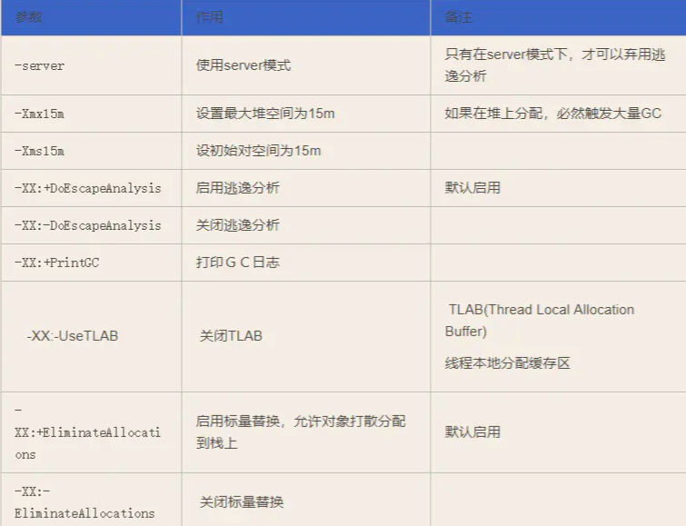
- TLAB分配
    - 定义: TLAB, 全称Thread Local Allocation Buffer 即：线程本地分配缓存。这是一块线程专用的内存分配区域。TLAB占用的是eden区的空间。在TLAB启用的情况下(默认开启)，JVM会为每一个线程分配一块TLAB区域。
    - 为什么需要TLAB？这是为了加速对象的分配。由于对象一般分配在堆上，而堆是线程公用的，因此可能会有多个线程在堆上申请空间，而每一次的对象分配都必须线程同步，会使分配的效率下降。考虑到对象分配几乎是Java中最常用的操作，因此JVM使用了TLAB这样的线程专有区域来避免多线程冲突，提高对象分配的效率。
    - TLAB分配策略: JVM选择的策略是，在虚拟机内部维护一个叫**refill_waste**的值，当请求对象大于refill_waste时会选择在堆中分配，反之，则会废弃当前TLAB，新建TLAB来分配对象。
    - 默认情况下: TLAB和refill_waste都是会在运行时不断调整的，使系统的运行状态达到最优。
    - 相关参数如下:
        - **-XX:+UseTLAB** 表示启用TLAB，默认启用。
        - **-XX:TLABRefillWasteFraction** 表示设置允许空间浪费的比例，默认值是64, 即: 使用1/64的TLAB空间作为refill_waste值。
        - **-XX:ResizeTLAB** 表示禁止系统自动调整TLAB大小。
        - **-XX:TLABSize** 指定TLAB的大小，大小 B。
- 堆内存分配对象
    - 为对象分配空间的任务等同于把一块确定大小的内存从JAVA堆中划分出来。
    - 堆内存分配的两种方法:
        - **指针碰撞**(Serial/ParNew等带Compact过程的收集器)： 假设Java堆中内存是绝对规整的，所有用过的内存都放在一边，空闲的内存放在另一边，中间放着一个指针作为分界点的指示器，那所分配的内存就仅仅是把那个指针向空闲空间挪动一一段与对象大小相等的距离，这种分配方式称为是"指针碰撞"(Bump the pointer)
        - **空闲列表**(CMS这种基于Mark-Sweep算法的收集器)：如果Java堆中的内存并不是规整的，已使用的内存和空闲的内存相互交错，那就没有办法简单的进行指针碰撞了，虚拟机就必须维护一个列表，记录哪些内存块是可用的，在分配的时候从列中找到一个一块足够大的空间划分给对象实例，并更新列表上的记录，这种分配方式称为"空闲列表"(Free List)
    - 选择哪种分配方式由Java堆是否规整决定，而java堆是否规整又是由所采用的的垃圾收集器是否带有压缩整理功能决定。因此，在使用Serial、ParNew等带Compact过程的收集器时，采用的分配算法是指针碰撞，而使用CMS这种基于Mark-Sweep算法的收集器时，通常采用空闲列表法。


① 标量替换代码示例如下:

``` java
public class EscapeObject {

    private static void getUser() {
        User user = new User("张三", 18);
        System.out.println("user name is " + user.name + ", age is " + user.age);
    }

    public static void main(String[] args) {
        getUser();
    }
}

public class User {
    String name;
    int age;

    public User(String name, int age) {
        this.name = name;
        this.age = age;
    }
}

```
在上述代码中，对象 user 只会在`getUser()`方法中被调用，那么 JIT动态编译时，不会创建对象 user，而之创建它的两个成员变量 name 和 age，类似：

```java
private static void getUser() {
    String name = "张三";
    int age = 18;

    System.out.println("user name is " + user.name + ", age is " + user.age);

}

public static void main(String[] args) {
    getUser();
}
```

② 逃逸分析代码示例如下：
```java
public static StringBuffer craeteStringBuffer(String s1, String s2) {
    StringBuffer sb = new StringBuffer();
    sb.append(s1);
    sb.append(s2);
    return sb;
}
```
如上所示：StringBuffer sb是一个方法内部变量，上述代码中直接将sb返回，这样这个StringBuffer有可能被其他方法所改变，这样它的作用域就不只是在方法内部，虽然它是一个局部变量，称其逃逸到了方法外部。甚至有可能被外部线程访问到，譬如赋值给类变量或可以在其他线程中访问的实例变量，称为线程逃逸。
上述代码如果想要StringBuffer sb不逃出方法，可以这样写:

```java
public static String createStringBuffer(String s1, String s2) {
    StringBuffer sb = new StringBuffer();
    sb.append(s1);
    sb.append(s2);
    return sb.toString();
}
```
这样不直接返回StringBuffer，那么StringBuffer将不会逃逸出方法。

------------

### 深入剖析栈上分配/JIT/逃逸分析与标量替换
(1) 逃逸分析&标量替换-代码剖析
代码示例:
```java
public class OnStackTest {
    public static void alloc(){
        byte[] b=new byte[2];
        b[0]=1;
    }
    public static void main(String[] args) {
        long b=System.currentTimeMillis();
        for(int i=0;i<100000000;i++){
            alloc();
        }
        long e=System.currentTimeMillis();
        System.out.println(e-b);
    }
}
```
**-XX:+DoEscapeAnalysis** 开启逃逸分析(JDK8默认开启)
**-XX:-DoEscapeAnalysis** 关闭逃逸分析
开启逃逸分析，执行时间为4毫秒，如下图:

关闭逃逸分析，执行的时间为618毫秒，并且伴随的大量的GC日志信息。如下图：
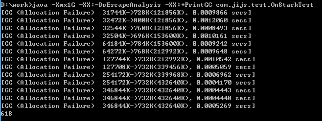

通过以上开启和关闭逃逸分析:
开启逃逸分析后，对象没有分配在堆上，没有进行GC，而是把对象分配在栈上。
关闭逃逸分析后，对象全部分配在堆中，当堆中存满对象后，进行多次GC，导致执行时间大大延长，堆上分配比栈上分配慢上百倍。
即时编译器(Just-in-time Compilation，JIT)
1. 使用Client编译器时，默认执行为**1500**次才被认为是热代码；
2. 使用Server编译器时，默认执行**10000**次才被认为是热代码；
上面的例子开启逃逸分析后，并不是所有的对象都直接在栈上分配，而是通过JIT分析此代码是热代码，才进行异步编译成本地机器码，并通过逃逸分析，把对象分配到栈上。(如果是server编译器: 在前10000次循环和编译成机器码这段时间，对象都会在堆中分配对象，编译成机器码后才会在栈上分配)。
-XX:+EliminateAllocations开启标量替换(JDK1.8默认开启)
**标量替换基于逃逸分析基础之上，开启标量替换必须开启逃逸分析**。
关闭标量替换后测试如下:

这次我们打开逃逸分析，并且把标量替换功能关闭，我们发现对象又分配到堆里了，并执行了多次GC。**由此可以看出java中没有实现真正意义上的栈上分配，而是通过标量替换来实现栈上分配**的。

(2) 锁消除(同步省略)深入分析
将上面的OneStackTest代码稍微修改下，加了一个同步块。**默认数组长度大于64的是不会在栈上分**配的，我们都以堆上分配为例来测试锁消除带来的影响。
```java
public class OnStackTest {
    public static void alloc(){
        byte[] b=new byte[65];
        synchronized (b) {  //同步代码块
            b[0]=1;
        }
    }
    public static void main(String[] args) throws IOException {
        long b=System.currentTimeMillis();
        for(int i=0;i<100000000;i++){
            alloc();
        }
        long e=System.currentTimeMillis();
        System.out.println(e-b);
    }
}
```
**-XX:+EliminateLocks开启锁消除**（jdk1.8默认开启，其它版本未测试）
**-XX:-EliminateLocks 关闭锁消除。
锁消除基于分析逃逸基础之上，开启锁消除必须开启逃逸分析**。
开启锁消除，执行结果如下：

关闭锁消除，执行结果如下:

可以看到开启锁消除性能至少提升一倍以上。

(3) 方法逃逸的几种方式
```java
public class EscapeTest {
    public static Object obj;
    public void globalVariableEscape() {  // 给全局变量赋值，发生逃逸
        obj = new Object();
    }
    public Object methodEscape() {  // 方法返回值，发生逃逸
        return new Object();
    }
    public void instanceEscape() {  // 实例引用发生逃逸
        test(this); 
    }
}
```

------------

### JVM垃圾搜集与垃圾回收方法以及垃圾回收器方式/区别/优缺点/应用场景
##### JVM垃圾收集算法
1. **引用计数法**：每个对象有一个引用计数属性，新增一个引用计数加1，引用释放时减1，计数为0时可以回收。此方法简单，但无法解决对象相互引用以及精准计数的问题。
2. **根搜索法**(GC Roots): 从GC Roots开始向下搜索，搜索所走过的路径被称之为引用链，当一个对象到GC Roots没有引用链相连时，则证明对象是不可用的。不可达对象。
    - 在JAVA对象中，GC Roots包括以下对象：
        - 虚拟机栈中引用的对象。
        - 方法区中类静态属性实体引用的对象。
        - 方法区中常量引用的对象。
        - 本地方法栈中JNI引用的对象。

##### JVM垃圾回收算法
- 常见的垃圾回收算法主要包括复制算法copying, 标记清除算法Mark-Sweep，标记整理压缩算法Mark-Compac。
- **复制算法**
    - 图示如下：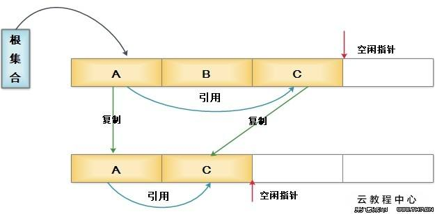
    - 算法概述: 复制算法采用从根集合扫描，并将存活对象复制到一块新的，没有使用过的空间中，这种算法当空间存活的对象比较少的时候极为高效，但是带来的成本是需要一块内存交换空间用于进行对象的移动。此算法用于新生代的回收
- **标记清除算法**
    - 图示如下: 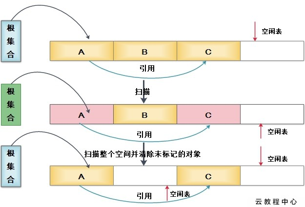
    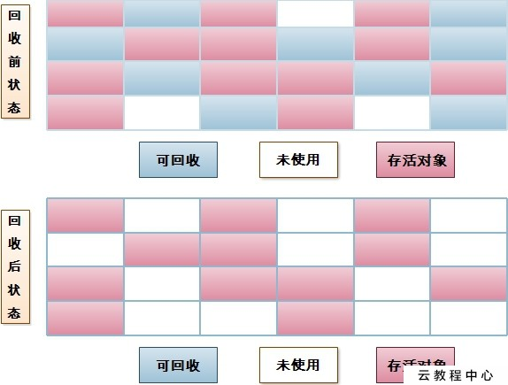
    - 算法描述：标记清除算法采用从根集合进行扫描，对存活的对象进行标记，标记完毕后，再扫描整个空间中未被标记的对象，进行回收。标记清除算法不需要进行对象的移动，并且仅对不存活的对象进行处理，在存活对象比较多的情况下极为高效，但是由于标记清除算法直接回收不存活的对象，因此会造成内存碎片。
- **标记整理压缩算法**
    - 如下图所示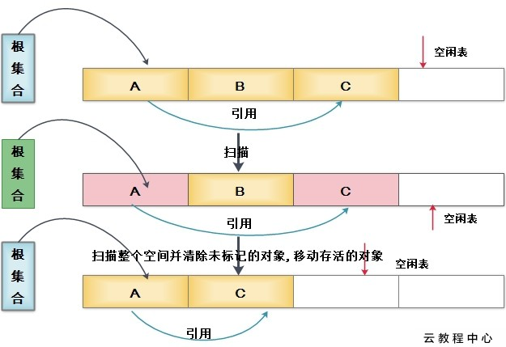
    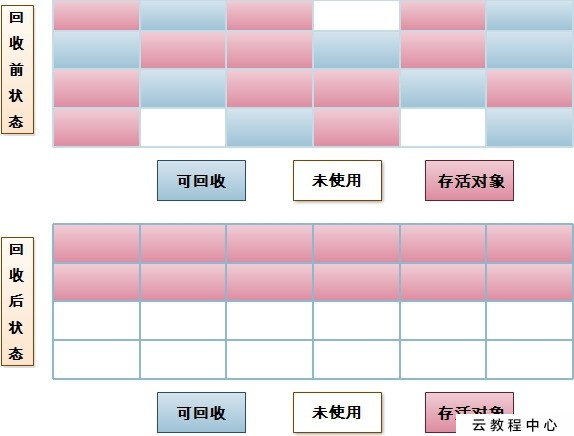
    - 算法描述：标记整理算法采用标记清除算法一样的方式进行对象的标记，但在清除时不同，在回收不同的对象占用的空间后，会将，会将所有存活对象往左端空闲空间移动，并更新对应的指针。标记整理算法是在标记清除算法的基础之上，又进行了对象的移动，因此成本较高，但是却解决了内存碎片的问题。
##### JVM垃圾垃圾收集器回收方式以及组合使用
- 常见的回收方式有以下三种
    1. **串行回收**：GC单线程内存回收、会暂停所有用户线程。
    2. **并行回收**：收集是指多个GC线程并行工作，但此时用户线程是暂停的；所以Serial是串行的，Parallel收集器时并行的，而CMS是并发的。
    3. **并发回收**：是指用户线程与GC线程同时执行(不一定并行，可能是交替，但总体上是同时执行的)，不需要停顿用户线程（其实在CMS中用户线程还是需要停顿的，只是非常短，GC线程在另一个CPU上执行）。
- 老年代和新生代回收器器组合方式，如下图所示：


##### JVM常见的垃圾回收器
1. Serial回收器(串行回收器)
    - 处理过程如下图: 
    - 是一个单线程收集器，只能使用一个CPU或一个线程去完成垃圾收集；在进行垃圾收集时，必须暂停所有其他工作线程，直到收集完毕。
    - 缺点: 独占性，收集期间会暂停所有用户线程。
    - 优势：简单。对于单CPU的情况，由于没有多线程的交互开销，反而可以更高效。是**client模式下默认的新生代收集器**。
    - 新生代Serial回收器特点：-XX:UseSerialGC 来开启，使用复制算法，独占式垃圾回收。
    - 老年代Serial回收器特点: -XX:UseSerialGC来开启，使用标记压缩算法，独占式的垃圾回收(因为内存比较大原因，回收比新生代慢).
2. ParNew回收器(并行回收器)
    - 处理过程如下图: 
    - 并行回收器也是独占式的回收器，在收集过程中，应用程序会全部暂停，但由于并行回收器使用多线程进行垃圾回收，因此在并发能力比较强的CPU上，它产生的停顿时间要短于串行回收器，而在单个CPU或者并发能力比较弱的系统中，并行回收器的效果不会比串行回收器好，由于多线程压力，它的实际表现很可能比串行回收器差。
    - 新生代ParNew回收器特点：-XX:+UseParNewGC 开启(新生代使用并行回收收集器，老年代使用串行收集器)、XX:ParallelGCThreads指定线程数(默认最好与CPU数量相当，避免过多的线程数影响垃圾回收性能)、使用复制算法、并行独占式的垃圾回收器。它只是在串行回收器上优化为多线程执行而已。
3. 新生代Parallel Scavenge回收器
    1. 吞吐量优先的回收器：关注CPU的吞吐量，即运行用户代码的时间/总时间，比如：JVM运行100分钟，其中运行用户代码99分钟，垃圾收集1分钟，则吞吐量是99%，这种收集器能高效的利用CPU，适合运行后台运算。
    2. -XX:UseParallelGC开启：**使用Parallel Scavenge + Serial Old收集器组合回收垃圾，这也是在Server模式下的默认值**。
    3. -XX:GCTimeRatio 用来设置用户执行时间占总时间的比例，默认是99，即1%的时间用来进行垃圾回收。
    4. -XX:MaxGCPauseMillis 设置GC最大停顿时间。
    5. 使用复制算法
4. 老年代Parallel Old回收器
    1. -XX:+UseParallelOldGC 开启, 使用Parallel Scavenge + Parallel Old组合收集器进行收集。
    2. 使用标记整理算法。
    3. 并行的、独占式的垃圾回收器。
5. CMS(并发标记清除)回收器
    - 回收过程如下图所示：
    - 运行过程分为4个阶段:
        - 初始标记(CMS initial Mark)：指标记GC Roots能直接关联到的对象。
        - 并发标记(CMS Concurrent mark): 进行GC Roots Tracing的过程。
        - 重新标记(CMS remark): 修正并发标记期间因用户程序继续运行而导致标记发生改变的那一部分对象的标记。
        - 并发清除
    - 其中标记和重新标记两个阶段仍然需要Stop-The-World，整个过程中耗时最长的并发标记和并发清除过程中收集器都可以和用户线程一起工作。
    - CMS并发标记清除回收器参数
        1. 标记清除算法：同时它又是一个使用多线程并发回收的垃圾收集器。
        2. -XX:ParallelCMSThreads ：手工设定CMS线程数量，CMS默认启动的线程数是(ParallelGCThreads+3)/4 。
        3. -XX:+UseConcMarkSweepGC 开启：使用ParNew + CMS + Serial Old的收集器组合进行内存回收，Serial Old作为CMS出现 "Concurrent Mode Failure" 失败后的后备收集器使用。
        4. -XX:CMSInitiatingOccupancyFraction ：设置CMS收集器在老年代空间被使用多少后出发垃圾收集，默认值是68%，仅在CMS收集器时有效。
        5. -XX:+UseCMSCompactAtFullCollection ：由于CMS收集器会产生碎片，此参数设置在垃圾收集后是否需要一次内存碎片整理过程，仅在CMS收集器时有效。
        6. -XX:+CMSFullGCBeforeCompaction ：设置CMS收集器在进行若干次垃圾收集后再进行一次碎片整理过程，通常与UseCMSCompactAtFullCollection结合使用。
        7. -XX:CMSInitiatingPermOccupancyFraction：设置Perm Gen使用达到多少比率时触发，默认是92%。

##### GC性能指标
- GC的性能指标通常有以下几点：
    1. 吞吐量：应用花在非GC上的时间百分比。
    2. GC负荷：与吞吐量相反，指应用花在GC上的时间百分比。
    3. 暂停时间：应用花在GC stop-the-world的时间。
    4. GC频率
    5. 反应速度：从一个对象变成垃圾到对象被回收的时间。
- 一个交互式应用要求暂停时间越少越好，然而一个非交互性的应用，当然希望GC负荷越低越好。
- 一个实时系统对暂停时间和GC负荷的要求，都是越低越好。

------------

### JVM中MajorGC与FullGC发生区别以及触发方式涉及空间分配担保
##### MinorGC 与 MajorGC 以及FullGC的定义
- MinorGC：是清理年轻代。
- MajorGC：是清理老年代。
- FullGC：是清理整个堆空间。(包括年轻代、老年代和Perm持久代)
- 一般很多情况下，，MinorGC满足条件触发MajorGC，MajorGC触发FullGC。

##### MinorGC与FullGC触发条件
- MinorGC触发条件：当Eden区满时，新生代剩余空间放不下新对象时，触发MinorGC。
- FullGC触发条件
    1. 调用System.gc()时，系统建议执行Full GC，但是不必然执行。
    2. 老年代空间不足：老年代空间只有在新生代对象转入以及创建为大对象、大数组时才会出现不足的现象，当执行Full GC后空间仍然不足，则抛出如下错误`java.lang.OutOfMemoryError: Java heap space` 。为了避免以上两种情况引起的FullGC，调优时应尽量做到让对象在MinorGC阶段被回收、让对象在新生代多存活一段时间及不要创建过大的对象及数组。
    3. 方法区空间不足(持久代、元空间)：存放的为一些class的信息等，当系统中要加载的类、反射的类和调用的方法较多时，方法区可能会被占满，在未配置为CMS GC的情况下会执行FullGC。如果经过FullGC仍然回收不了，那么JVM会抛出`java.lang.OutOfMemoryError: PermGen space` 元空间报错之类的，为避免Perm Gen占满造成Full GC现象，可采用的方法为增大PermGen空间或转为使用CMS回收器。
    4. 由Eden区、From Space向To Space区复制时，对象大小大于To Space可用内存，则将该对象转存到老年代，且老年代的可用内存小于该对象大小。这里有两种：CMS GC时出现**promotion failed** (担保s1s2->old)  和 **concurrent mode failure** ，对于采用CMS进行老年代GC的程序而言，尤其注意GC日志中是否有promotion failed和concurrent mode failure两种情况，当这两种情况出现时可能会触发FullGC。
        - promotion failed：是在进行Minor GC时，survivor space放不下，对象只能放入老年代，而此时老年代也放不下造成的；
        - concurrent mode failure：是在执行CMS GC的过程中同时有对象放入老年代而此时老年代也空间也不足造成的。
        - 应对措施：增大survivorspace、老年代空间或者调低并发GC的比率，但在JDK 5.0+、6.0+的版本中有可能会由于JDK的bug29导致CMS在remark完毕后很久才触发sweeping     动作。对于这种状况，可通过设置-XX:CMSMaxAbortablePrecleanTime=5（单位为ms）来避免。
    5. 统计得到的Minor GC晋升到老年代的平均大小大于老年代的剩余空间。
    - 这是一个比较复杂的触发情况，Hotspot为了避免由于新生代对象晋升到老年代导致老年代空间不足的情况，在进行MinorGC时，做了一个判断，如果统计之前所得到的Minor GC晋升到老年代的平均大小大于老年代的剩余空间，那么就直接触发Full GC。
    - 例如，程序第一次触发MinorGC后，有6MB的对象晋升到老年代，那么当下次MinorGC发生时，首先检查老年代的剩余空间是否大于6MB，如果小于6MB，则执行FullGC。

##### 空间分配担保失败(避免频繁的FullGC)
在发生MajorGC之前，虚拟机会检查**老年代最大可用连续空间**是否大于**新生代所有对象的总空间**。
- 如果大于，则此次**Major GC是安全的**。
- 如果小于，则虚拟机会查看**HandlePromotionFailure**设置值是否允许担保失败。如果HandlePromotionFailure=true，那么会继续检查老年代最大可用连续空间是否大于**历次晋升到老年代对象的平均大小**，如果大于，则尝试进行一次Major GC，但这次Major GC依然是有风险的；如果小于或HandlePromotionFailure=false，则改为进行一次FullGC。

上面提到的Major GC依然会有风险，是因为新生代采用**复制回收算法**，假设大量对象在MinorGC后仍然存活(最极端的情况下内存回收后新生代中所有对象存活)，而survivor空间比较小，这时需要老年代进行分配担保，把Survivor无法容纳的对象放到老年代。**老年代要进行空间分配担保，前提是老年代有足够的空间来容纳这些对象**，但一共有多少对象在内存回收后存活下来是不可预知的，**因此只好取之前每次垃圾回收后晋升到老年代的对象大小的平均值作为参考**。使用这个平均值与老年代剩余空间进行比较，来决定是否进行FullGC来让老年代腾出更多空间。
取平均值仍然是一种**概率性事件**，如果某次MinorGC后存活的对象陡增，必然导致担保失败，如果出现了分配担保失败，**就只能在失败后重新发起一次FullGC**。虽然存在发生这种情况的概率，但大部分时候都是能够成功分配担保的，这样就避免了过于频繁的FullGC。


------------

### JVM对象存在哪几种引用关系?涉及强/弱/软/虚引用
##### 强引用 (StrongReference)
&emsp; 强引用是使用最普遍的引用。如果一个对象具有强引用，那么垃圾回收器绝不会回收它。如下``` Object o = new Object() // 强引用 ``` 当内存不足时，java虚拟机宁愿抛出OutOfMemoryError错误，使用程序异常终止，也不会靠随意回收具有强引用的对象来解决内存不足的问题。如果不使用时，需要使用如下方法来弱化引用，如下: ``` o = null; //帮助垃圾搜集器回收此对象 ```
&emsp; 显式的设置o为null或超出对象生命周期范围，则GC认为该对象不存在引用，这时就可以回收这个对象，具体什么时候搜集取决于GC的算法。实例如下：
```
public void test(){
    Object o=new Object();
    // 省略其他操作
}

```
&emsp; 在一个方法的内部有一个强引用，这个引用保存在栈中，而真正的内容(Object) 保存在堆中，当这个方法运行完成后就会退出方法栈，则引用内容的引用不存在，这个Object会被回收。
&emsp; 强引用在实际中有非常重要的用处，举个ArrayList的实现源码:
```java
private transient Object[] elementData;
public void clear() {
        modCount++;
        // Let gc do its work
        for (int i = 0; i < size; i++)
            elementData[i] = null;
        size = 0;
}
```
在ArrayList类中定义了一个私有的变量elementData数组，在调用方法清空数组时可以看到为每个数组内容赋值为null。不同于elementData=null，强引用仍然存在，避免在后续调用 add()等方法添加元素时进行重新的内存分配。 使用如clear()方法中释放内存的方法对数组中存放的引用类型特别适用，这样就可以及时释放内存。

##### 软引用 (SoftReference)
&emsp; 如果一个对象只具有软引用，则内存空间足够，垃圾回收器就不会回收它；如果内存空间不足了，就会回收这些对象。只要垃圾回收器没有回收它，该对象就可以被程序使用。<font color='green'>软引用可用来实现内存敏感的高速缓存。</font>
```java
 String str=new String("abc"); // 强引用
 SoftReference<String> softRef=new SoftReference<String>(str); // 软引用  
```
&emsp; 当内存不足时，等价于：
```java
If(JVM.内存不足()) {
   str = null;  // 转换为软引用
   System.gc(); // 垃圾回收器进行回收
}
```
&emsp; 虚引用在实际中有重要的作用，例如浏览器的后退按钮。按后退时，这个后退时显示的网页内容是重新进行请求还是从缓存中取出？这就要看具体的实现策略了。
&emsp; (1) 如果一个网页在浏览结束时就进行内容回收，则按后退键查看前面浏览过的页面时，需要重新构建。
&emsp; (2) 如果将浏览过的网页全部存储到内存中会造成内存的大量浪费，甚至会造成内存溢出。
这时候就可以使用软引用: 
```java
Browser prev = new Browser(); // 获取页面进行浏览
SoftReference sr = new SoftReference(prev); // 浏览完毕后置为软引用        
if(sr.get()!=null){ 
    rev = (Browser) sr.get(); // 还没有被回收器回收，直接获取
}else{
    prev = new Browser(); // 由于内存吃紧，所以对软引用的对象回收了
    sr = new SoftReference(prev); // 重新构建
}
```
这样就很好的解决了实际的问题。
&emsp; 软引用可以和一个引用队列(ReferenceQueue)联合使用，如果软引用所引用的对象被垃圾回收器回收，java虚拟机就会把这个软引用加入到与之关联的引用队列中。

##### 弱引用 (WeakReference)
&emsp; 弱引用与软引用的区别在于: 只具有弱引用的对象拥有更短的生命周期。在垃圾回收器线程扫描它管辖的内存区域过程中，一旦发现了只具有弱引用的对象，<font color="green">不管当前内存足够与否，都会回收它的内存。</font>不过，由于垃圾回收器是一个优先级很低的线程，因此不一定会发现那些只具有弱引用的对象。
```java
String str=new String("abc");    
WeakReference<String> abcWeakRef = new WeakReference<String>(str);
str=null;  
```
当垃圾回收器进行扫描回收时等价于:
```java
str = null;
System.gc();
```
&emsp; <font color="green">如果这个对象是偶尔的使用，并且希望在使用时随时就能获取到，那么就应该使用Weak Reference来记住此对象。</font>
&emsp; 下面的代码会让str再次变为一个强引用。
```java
String  abc = abcWeakRef.get();
```
&emsp; 弱引用可以和一个引用队列(ReferenceQueue) 联合使用，如果弱引用所引用的对象被垃圾回收，java虚拟机就会把这个弱引用加入到与之关联的引用队列中。

##### 虚引用 (PhantomReference)
&emsp; 虚引用 顾名思义就是形同虚设，与其他几种引用都不同，虚引用并不会决定对象的生命周期。如果一个对象仅持有虚引用，那么它就和没有任何引用一样，在任何时候都可能被垃圾回收器回收。
&emsp; <font color="green">虚引用主要用来跟踪对象被垃圾回收器回收的活动。虚引用与软引用和弱引用的一个区别在于：虚引用必须和引用队列(ReferenceQueue)联合使用。</font> 当垃圾回收器准备回收一个对象时，如果发现它还有虚引用，就会在回收对象的内存之前，把这个虚引用加入到与之关联的引用队列中。

##### 总结:
&emsp; java 4种引用的级别由高到低依次为:
&emsp;&emsp;<font color="green">强引用  >  软引用  >  弱引用 > 虚引用</font>

------------

### JVM中对象的内存布局是怎样的?
#### Shallow size 与 Retained size
&emsp; 所有包含Heap Profiling(堆分析)功能的工具(MAT, Yourkit, JProfiler, TPTP等) 都会使用到两个名词，一个是Shallow Size， 另一个是Retained size。
- Shallow Size：对象自身占用的内存大小，不包括它引用的对象。
    - 针对非数组类型的对象，它的大小就是对象与它自身所有成员变量大小的总和。当然这里面还会包括一些java语言特性的数据存储单元(引用和基本数据类型)。
    - 针对数组类型的对象，它的大小是数组元素对象的大小总和。
- Retained Size：深层次的大小，不仅仅包括对象自身占用内存的大小。
    - Retained Size= 当前对象的大小 + 当前对象可直接或间接引用到的对象的大小总和。(间接引用的含义: A->B->C, C就是间接引用)。
    - 换句话说，**Retained Size就是当前对象被GC后，从Heap(堆)上总共释放掉的内存。**
    - <font color="green"> 不过，释放的时候还要排除被GC Roots直接或间接引用的对象。它们暂时不会被当做垃圾</font>

&emsp; 举例说明Retained Size，如下图所示:

&emsp; 图中A、B、C、D四个实例，为了方便计算，我们假设所有实例的Shallow Size都是1kb。
- D实例：D实例没有引用其他实例，所以移除D实例只会释放它自己的空间，因此
```
D实例的Retained Size = Shallow Size = 1kb
```
- C实例：当我们移除C实例，C实例引用了D实例，同时D实例没有被其他实例引用，所以D实例也会被GC，因此
```
C实例的Retained Size = C实例的Shallow Size + D实例的Shallow Size = 2kb
```
- B实例：当我们移除B实例, 虽然B实例引用了C实例, 但是A实例也引用了C实例, 所以移除B实例不会让C实例被GC, 所以
```
B实例的Retained Size=Shallow Size=1kb
```
- A实例：当我们移除A实例, 显然A, B, C, D实例都会被GC, 所以
```
A实例的Retained Size=4kb
```

#### 对象内存布局基本原理
##### 对象的内存布局
&emsp; 一个Java对象在内存中包括**对象头**、**实例数据**和**补齐填充**三个部分: 如下图所示:

###### 对象头
- **Mark Word**: 包含一系列的标志位，比如轻量级锁的标记位、偏向锁标记位等等。在32位系统中占4字节，在64位系统中占8字节；
- **Class Pointer**：用来指向对象对应的Class对象(其对应的元数据对象)的内存地址。在32位系统占4字节，在64位系统中占8字节。
- **Length**：如果是数组对象 ，还有一个保存数组长度的空间，占4个字节。

###### 对象实际数据
&emsp; 对象实际数据包括了对象的所有成员变量，其大小由各个成员变量的大小决定，比如byte和boolean是1个字节，short和char是2个字节，int和float是4个字节，long和double是8个字节，reference是4个字节(64位系统中是8个字节)。

| Primitive Type  |  Memory Required(bytes) |
| ------------ | ------------ |
|  boolean | 1  |
|  byte |  1 |
| short  | 2  |
| char  |  2 |
| int  |  4 |
| float  |  4 |
| long  | 8  |
| double  | 8  |
&emsp; 对于reference类型来说，在32位系统上占用4bytes，在64位系统上占用8bytes。

###### 对齐补充
&emsp; Java对象占用空间是8字节对齐的，即所有Java对象占用bytes数必须是8的倍数。例如，一个包含两个属性的对象：int和byte，这个对象需要占用8 + 4 + 1 = 13个字节，这时就需要加上大小为3字节的**`padding`** 进行8字节对齐，最终占用大小为16字节。
&emsp; 注意: 以上对64位操作系统的描述是未开启指针压缩的情况，关于指针压缩会在下文中介绍。

##### 对象头占用空间大小
&emsp; 这里说明下32位操作系统和64位操作系统中对象所占用内存空间的大小。
- 在32位系统下，存放Class Pointer的空间大小是4字节，MarkWord是4字节，对象头为8字节。
- 在64位系统下，存放Class Pointer的空间大小是8字节，MarkWord是8字节，对象头为16字节。
- 64位开启指针压缩的情况下，存放Class Pointer的空间大小是4字节，MarkWord是8字节，对象头为12字节。
- 如果是数组对象，对象头的大小为：数组对象头8字节 + 数组长度4字节 + 对齐4字节 = 16字节。其中对象引用占4字节(未开启指针压缩的64位为8字节)，数组MarkWord为4字节(64位未开启指针压缩的为8字节)；
- 静态属性不算在对象对象大小内。

##### 指针压缩
&emsp; 从上文的分析中可以看到，64位JVM消耗的内存会比32位的要多大约1.5倍，这是因为对象指针在64位JVM下有更宽的寻址。对于那些将要从32位平台移植到64位的应用来说，平白无辜的多了1/2的内存占用。这是开发者不愿意看到的、
&emsp; 从JDK 1.6 update14开始，64位的JVM正式支持了 `-XX:+UseCompressedOops ` 这个可以压缩指针、起到节约内存占用的新参数。

###### 什么是OOP ?
&emsp; OOP的全称为: Ordinary Object Pointer, 就是普通对象指针。启用CompressOops后，会压缩的指针有以下几种:
- 每个Class的属性指针 (静态成员变量)；
- 每个对象的属性指针；
- 普通对象数组的每个元素指针。

&emsp; <font color="green">当然，压缩也不是所有指针都会压缩，对一些特殊类型的指针，JVM是不会优化的，例如**指向PermGen的Class对象指针**、**本地变量(局部或方法中定义的变量)**、**堆栈元素**、**入参**、**返回值和NULL指针**不会被压缩。</font>

###### 启用指针压缩
&emsp; 在Java程序启动时增加JVM参数: `-XX:+UseCompressedOops` 来启用。
&emsp; *注意： 32位HotSpot VM是不支持UseCompressedOops参数的，只有64位HotSpot VM 才只支持。*

###### 查看对象的大小
&emsp; 接下来我们使用[http://www.javamex.com/](http://www.javamex.com/ "http://www.javamex.com/") 中提供的[classmexer.jar](https://link.jianshu.com/?t=http://www.javamex.com/classmexer/classmexer-0_03.zip "classmexer.jar") 来计算对象的大小。
&emsp; 运行环境: JDK 1.8, Java HotSpot(TM) 64-Bit Server VM

###### 基本数据类型
&emsp; 对于基本数据类型来说，是比较简单的，因为我们已经知道每个基本数据类型的大小，代码如下:
```java
/**
 * VM options:
 * -javaagent:/Users/sangjian/dev/source-files/classmexer-0_03/classmexer.jar
 * -XX:+UseCompressedOops
 */
public class TestObjectSize {

    int a;
    long b;
    static int c;

    public static void main(String[] args) throws IOException {
        TestObjectSize testObjectSize = new TestObjectSize();
        // 打印对象的shallow size
        System.out.println("Shallow Size: " + MemoryUtil.memoryUsageOf(testObjectSize) + " bytes");
        // 打印对象的 retained size
        System.out.println("Retained Size: " + MemoryUtil.deepMemoryUsageOf(testObjectSize) + " bytes");
        System.in.read();
    }
}
```
&emsp; *注意: 在运行前需要设置javaagent参数，在JVM启动参数中添加 `-javaagent:/path_to_agent/classmexer.jar` 来运行 。*

① 开启指针压缩的情况
&emsp; 运行查看结果：
```
Shallow Size: 24 bytes
Retained Size: 24 bytes
```
根据上文分析可以得知，64位开启指针压缩的情况下:
- 对象头大小 = `Class Pointer`的空间大小为4字节 + `MarkWord`为8字节 = 12字节；
- 实际数据大小=int类型4字节 + long类型8字节=12字节 (静态变量不在计算范围之内)

在MAT中分析的结果如下：


所以大小是24字节。其实这里并没有padding，因为正好是24字节。如果我们把`long b;`换成`int b;`之后，再看一下结果:
```
Shallow Size: 24 bytes
Retained Size: 24 bytes
```
大小并没有变化，说明这里做了padding，并且padding的大小是4字节。

② 关闭指针压缩的情况
&emsp; 如果要关闭指针压缩，在JVM中添加`-XX:-UseCompressedOops` 来关闭，再运行上述代码查看结果：
```
Shallow Size: 32 bytes
Retained Size: 32 bytes
```
&emsp; 分析一下在64位未开启指针压缩的情况下：
- 对象头大小= `Class Pointer`的空间大小为8字节 + `MarkWord` 为8字节 = 16字节；
- 实际数据大小=int类型4字节 + long类型8字节=12字节 (静态变量不在计算范围内)；
&emsp; 这里计算后大小为16+12=28字节，这时候就需要padding补齐了，所以padding为4字节，最后的大小为32字节。
&emsp; 我们再把`long b;`换成`int b;`之后呢？通过上面的计算结果可以知道，实际数据大小就应该是int类型4字节+int类型4字节=8字节，对象头大小为16字节，那么不需要做padding，对象的大小为24字节：
```
Shallow Size: 24 bytes
Retained Size: 24 bytes
```

###### 数组类型
&emsp; 64位系统中，数组对象的对象头占用24 bytes,启用压缩后占用16字节。比普通对象占用内存内存多是因为需要额外的空间存储数组的长度。基本数据类型数组占用的空间包括数组对象对象头以及基本数据占用的内存空间。由于对象数组中存的是对象的引用，所以数组对象的Shallow Size=数组对象头 + length * 引指针大小。Retained Size=Shallow Size + length * 每个元素的Retained Size。
代码如下：
```java
/**
 * VM options:
 * -javaagent:/Users/sangjian/dev/source-files/classmexer-0_03/classmexer.jar
 * -XX:+UseCompressedOops
 */
public class TestObjectSize {


    long[] arr = new long[6];

    public static void main(String[] args) throws IOException {
        TestObjectSize testObjectSize = new TestObjectSize();
        // 打印对象的shallow size
        System.out.println("Shallow Size: " + MemoryUtil.memoryUsageOf(testObjectSize) + " bytes");
        // 打印对象的 retained size
        System.out.println("Retained Size: " + MemoryUtil.deepMemoryUsageOf(testObjectSize) + " bytes");
        System.in.read();
    }
}
```

① 开启指针压缩:
结果如下：
```
Shallow Size: 16 bytes
Retained Size: 80 bytes
```

&emsp; Shallow Size比较简单，这里对象头大小为12字节， 实际数据大小(即数组引用)为4字节，所以Shallow Size为16。

&emsp; 对于Retained Size来说，要计算数组占用的大小，对于数组来说，它的对象头部多了一个用来存储数组长度的空间，该空间大小为4字节，所以__数组对象的大小=引用对象头大小12字节+存储数组长度的空间大小4字节+数组的长度_数组中对象的Retained Size+padding大小_*。

&emsp;上述代码中的`long[] arr = new long[6];`，它是一个长度为6的long类型的数组，由于long类型的大小为8字节，所以数组中的实际数据是6*8=48字节，那么数组对象的大小=12+4+6*8+0=64，最终的Retained Size=Shallow Size + 数组对象大小=16+64=80。
通过MAT工具查看如下:


② 关闭指针压缩的情况
结果如下：
```
Shallow Size: 24 bytes
Retained Size: 96 bytes
```
此时，对象头为MarkWord(8字节) + ClassPointer(8字节) = 16字节。那么该外层对象的大小(Shallow Size)= 对象头(16字节) + 实例数据(数组引用8字节) = 24字节。数组的大小=数组对象头(16字节) + length(4字节) + 实例数据(6*8=48字节) + padding(4字节) = 72字节。`testObjectSize对象的Retained Size = testObjectSize对象的Shallow Size + arr数组对象的Shallow Size =  24 + 72 = 96 字节 `。
通过MAT工具查看如下：


###### 包装类型
&emsp; 包装类(Byte/Boolean/Short/Character/Integer/Float/Long/Double)占用对象的大小等于对象头的大小加上底层基础数据类型的大小。

| Numberic Wrappers | +useCompressedOops | -useCompressedOops |
| --- | --- | --- |
| Byte, Boolean | 16 bytes | 24 bytes |
| Short, Character | 16 bytes | 24 bytes |
| Integer, Float | 16 bytes | 24 bytes |
| Long, Double | 24 bytes | 24 bytes |

###### String类型
&emsp; 在JDK1.7以上版本中，`java.lang.String`中包含2个属性，一个用于存放字符串数据的char[], 一个int类型的hashcode，部分源码如下：
```java
public final class String
    implements java.io.Serializable, Comparable<String>, CharSequence {
    /** The value is used for character storage. */
    private final char value[];

    /** Cache the hash code for the string */
    private int hash; // Default to 0
    ...
}
```
因此在关闭指针压缩时，一个String对象的大小为:
- **Shallow Size = 对象头大小16字节 + int类型大小4字节 + char数组引用大小8字节 + padding为4字节 =  32字节；**
- **Retained Size = Shallow Size + char数组的Retained Size；**

在开启指针压缩时，一个String对象的大小为:
- **Shallow Size=对象头大小12字节+int类型大小4字节+数组引用大小4字节+padding4字节=24字节**；
-  **Retained Size=Shallow Size+char数组的Retained Size**。

代码如下：
```java
/**
 * VM options:
 * -javaagent:/Users/sangjian/dev/source-files/classmexer-0_03/classmexer.jar
 * -XX:+UseCompressedOops
 */
public class TestObjectSize {
    String s = "test";

    public static void main(String[] args) throws IOException {
        TestObjectSize testObjectSize = new TestObjectSize();
        // 打印对象的shallow size
        System.out.println("Shallow Size: " + MemoryUtil.memoryUsageOf(testObjectSize) + " bytes");
        // 打印对象的 retained size
        System.out.println("Retained Size: " + MemoryUtil.deepMemoryUsageOf(testObjectSize) + " bytes");
        System.in.read();
    }
}
```
① 开启指针压缩的情况
结果如下：
```
Shallow Size: 16 bytes
Retained Size: 64 bytes
```
MAT中结果如下：


② 关闭指针压缩的情况
结果如下:
```
Shallow Size: 24 bytes
Retained Size: 88 bytes
```
MAT中结果如下：


###### 其它引用类型的大小
&emsp; 根据上面分析，可以计算出一个对象在内存中的占用空间的大小。其他的引用类型可以参考分析计算过程来计算内存的占用情况。

#### 深入剖析对象头

##### Mark Word
&emsp; 用于存储对象自身的运行时数据，如哈希码（HashCode）、GC分代年龄、
锁状态标识、线程持有的锁、偏向线程ID、偏向时间戳等等。
&emsp; Mark Word在32位JVM中的长度是32bit，在64位JVM中长度是64bit。我们打开[openjdk的源码包](https://download.java.net/openjdk/jdk8/promoted/b132/openjdk-8-src-b132-03_mar_2014.zip)，对应路径`/openjdk/hotspot/src/share/vm/oops`，Mark Word对应到C++的代码`markOop.hpp`，可以从注释中看到它们的组成，本文所有代码是基于Jdk1.8。


&emsp; Mark Word在不同的锁状态下存储的内容不同，在32位JVM中是这么存的。


&emsp; 在64位系统中是这么存的：


&emsp; 虽然它们在不同位数的JVM中长度不一样，但是基本组成内容是一致的。
- **锁标志位 (Lock)**: 区分锁状态，11 时表示对象待GC回收状态，只有最后两位锁标识为11时有效。
- **biased_lock** : 是否是偏向锁，由于无锁状态和偏向锁的锁标识都是01，没办法区分，这里引入一位的偏向锁标识位。
- **分代年龄 (age)** ： 表示对象被GC的次数，当该次数达到阈值的时候，对象就会转移到老年代。
- **对象的hashcode (hash)**: 运行期间调用`System.identityHashCode()` 来计算，延迟计算，并把结果赋值到这里。当对象加锁后，计算的结果31位不够表示，在偏向锁，轻量锁，重量锁的情况下则hashcode会被转移到Monitor中。
- **偏向锁的线程ID（JavaThread）**：偏向模式的时候，当某个线程持有对象的时候，对象这里就会被置为该线程的ID。 在后面的操作中，就无需再进行尝试获取锁的动作。
- **epoch**：偏向锁在CAS锁操作过程中，偏向性标识，表示对象更偏向哪个锁。
- **ptr_to_lock_record**：轻量级锁状态下，指向栈中锁记录的指针。当锁获取是无竞争的时，JVM使用原子操作而不是OS互斥。这种技术称为轻量级锁定。在轻量级锁定的情况下，JVM通过CAS操作在对象的标题字中设置指向锁记录的指针。
- **ptr_to_heavyweight_monitor**：重量级锁状态下，指向对象监视器Monitor的指针。如果两个不同的线程同时在同一个对象上竞争，则必须将轻量级锁定升级到Monitor以管理等待的线程。在重量级锁定的情况下，JVM在对象的ptr_to_heavyweight_monitor设置指向Monitor的指针。

##### 为何要有padding(对齐数据)
&emsp; 字段内存对齐的其中一个原因，是让字段只出现在同一CPU的缓存行中。如果字段不是对齐的，那么就有可能出现跨缓存行的字段。也就是说，该字段的读取可能需要替换两个缓存行，而该字段的存储也会同时污染两个缓存行。这两种情况对程序的执行效率而言都是不利的。其实对其填充的最终目的**是为了计算机高效寻址**。

##### jol-core 打印对象信息
&emsp; openjdk 给我们提供了一个工具包，可以用来获取对象的信息和虚拟机的信息，我们只需引入 jol-core 依赖，如下

```
<dependency>
  <groupId>org.openjdk.jol</groupId>
  <artifactId>jol-core</artifactId>
  <version>0.8</version>
</dependency>

```

jol-core 常用的三个方法

- `ClassLayout.parseInstance(object).toPrintable()`：查看对象内部信息.
-  `GraphLayout.parseInstance(object).toPrintable()`：查看对象外部信息，包括引用的对象.
-  `GraphLayout.parseInstance(object).totalSize()`：查看对象总大小.

64位开启指针压缩(默认开启)的情况下测试：
```
public static void main(String[] args) {
    int[] a = {1};
    System.out.println(ClassLayout.parseInstance(a).toPrintable());
}

```

打印的内存布局信息，如下


&emsp; 可以看到有 OFFSET、SIZE、TYPE DESCRIPTION、VALUE 这几个名词头，它们的含义分别是
- OFFSET：偏移地址，单位字节；
- SIZE：占用的内存大小，单位为字节；
- TYPE DESCRIPTION：类型描述，其中object header为对象头；
- VALUE：对应内存中当前存储的值，二进制32位；

&emsp; 可以看到这时总SIZE为共24byte，对象头占16byte，其中Mark Work占8byte，Klass Point 占4byte，array length 占4byte，因为里面只有一个int 类型的1，所以数组对象的实例数据占据4byte，剩余对齐填充占据4byte。

------------

### JVM是如何加载Java字节码信息的? 
#### 类的生命周期
&emsp; 类的生命周期是指一个class从加载到内存直至卸载出内存的过程，共包含**加载(Loading)**、**验证(Verification)** 、**准备(Preparation)**、**解析(Resolution)**、**初始化(Initialization)**、**使用(Using)**、和**卸载(Unloading)**七个阶段，如下图所示:
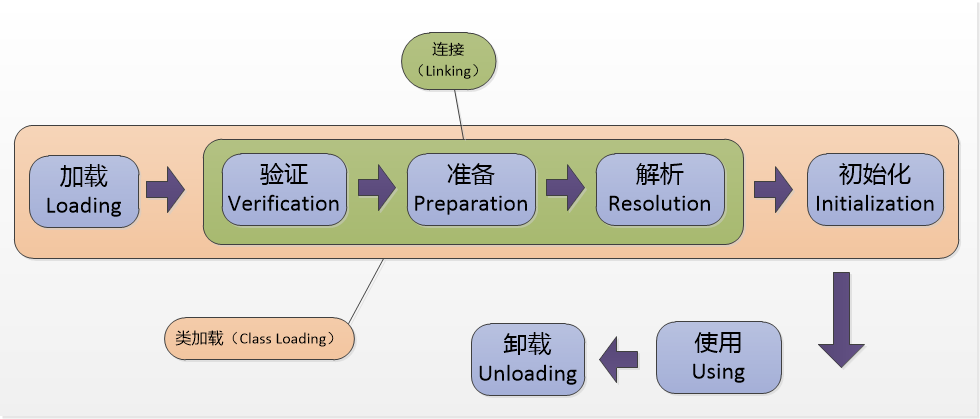
其中验证、准备、解析三个阶段统称为**连接(Linking)**，而加载、连接、初始化又可以称为**类加载的过程**，所以我们又可以称为类的生命周期包含加载、连接、初始化、使用和卸载这5个阶段，或者是类加载、使用、卸载这三个阶段。
&emsp; 回到上图，加载、验证、准备、初始化和卸载这5个阶段的**开始顺序**是确定的，如图中箭头所示。之所以强调“开始顺序”，是因为这里的先后顺序仅仅是各阶段开始时间的顺序，而不是进行或完成的顺序，这些阶段**通常是相互交叉地混合式进行的**。比如加载和验证，并不是说非要等到加载完成之后，才开始验证阶段，在加载的阶段中，会穿插各种检验动作，否则对于连格式都不符合的字节流，又怎能正确解析出其中的静态数据结构从而转化为方法区中的数据结构呢？对于解析阶段，**其开始时间则比较特殊**，既可能在加载阶段就开始（对常量池中的符号引用的解析），也可能在初始化阶段之后才开始（支持Java语言的动态绑定）。

##### 一、类加载的过程
&emsp; 类加载的过程包含**加载**、**连接**和**初始化**三个阶段。

###### 1.1 加载
&emsp; 加载是类加载过程的第一阶段，此时虚拟机将查找并加载类的二进制数据，具体分为三个步骤。
- 通过一个类的全限定名来获取定义此类的二进制流。
- 将这个字节流所代表的静态存储结构转化为方法区的运行时数据结构。
- 在内存中生成一个代表此类的`java.lang.Class`对象, 作为方法区中此类的各种数据的访问入口。

&emsp; 二进制流的获取方式：
- **从ZIP包中获取**，后来的类加载器可从JAR、EAR、WAR等格式文件中加载class的基础。
- **从网络中获取字节流**，我们熟知的Applet是这种场景的典型应用。
- **程序动态生成字节流**，这种场景应用最多的就是动态代理，通过字节码技术动态生成代理类的二进制字节流。
- **由除了Java源文件之外的其它文件编译而成**，如JSP、Scala源文件等。

&emsp; 加载阶段完成后，原本定义类的二进制流就按照虚拟机所需的格式存储在方法区中，这里的存储格式视具体的虚拟机实现而定 一般是永久区中，新版本放在MetaSpace(堆)中。
&emsp; 加载的注意事项：<font color="green"> 数组类的加载比较特殊，它本身并不通过类加载器创建，而是由Java虚拟机直接创建，但数组类的元素类型（去掉所有维度后的类型，比如A[][]的元素类型，就是A）是由类加载器加载的  </font>

###### 1.2 连接
&emsp; 连接可细分为三个阶段: 验证、准备和解析。

###### 1.2-1 验证：
&emsp; 连接的第一个阶段，确保class文件中所加载的字节流符合当前虚拟机的要求，且**不会危害虚拟机自身的安全**。该阶段会依次进行如下验证:
- **文件格式验证**：判断当前字节流是否符合**class文件格式**的规范。如是否以class文件的魔数**oxCAFEBABE**开头、主次版本是否在当前虚拟机的处理范围之内、常量池中常量的类型是否合法等等。校验的目的是保证字节流能正确解析并存储于方法区中，通过验证后，会在方法区中存储，后面的校验动作都是根据方法区的存储结构进行，不再直接操作字节流。
- **元数据验证**：语义分析，判断其描述信息是否符合Java语言的规范要求。如该类除了**java.lang,Object**之外是否有其他父类；该类的父类是否继承了不允许被继承的final类等。
- **字节码验证**：通过数据流和控制流分析，判断程序语义是否合法、符合逻辑。如保证跳转指令不会跳转到方法体以外的字节码指令上、方法体中的类型转换是否有效等。
- **符号引用验证**：发生在解析阶段将符号引用转为直接引用的时候，确保解析动作能正确执行。如符号引用中通过字符串描述的全限定名是否能找到对应类。

&emsp; 从上面可以看出，验证阶段非常重要，关乎虚拟机的安全，**但它并不是必须的**，它对程序运行期没有影响，如果所引用的类已被反复使用和验证过，那么可以考虑采用`-Xverifynone`参数来关闭大部分的类验证措施，以缩短虚拟机类加载的时间。通常来讲，应用所加载的class文件都是由我们本地或服务器的JDK编译通过的，我们都确定它是符合虚拟机要求的，对于这类class文件其实并不需要验证，主要是像从网络加载的class字节流或是通过动态字节码技术生成的字节流，出于安全的考虑，是必须要经过严格验证的。

###### 1.2-2 准备
&emsp; 准备阶段做的唯一一件事就是为类的静态变量分配内存，并将其初始化为默认值。注意这里的初始化和后面的 "初始化阶段" 是不同的，容易混淆。**这些内存都在方法区中分配。** 几点注意事项：
- 对于初始化为默认值这一点，有两个角度的理解：从Java应用层面讲，会为不同的类型设置对应的**零值**，如对于int、long、byte等整数对应就是0，对于float、double等浮点数则是0.0，而对于引用类型则是null，有个零值映射表，具体就不在这一一列举了；从JVM层面，实际上就是分配了一块全0值的内存，只是不同的数据类型对于0值有不同的解释含义，这是Java编译器自动为我们做的。
- 如果类的静态变量是**final**的，即它的字段属性表中存在**ConstantValue**属性，那么在准备阶段就会被初始化为程序指定的值，比如对于`public static final int len = 5`，在准备阶段`len`的值已经被设置为5了。实际上对于final的类变量，在编译时就已经将其结果放入了调用它的类的常量池中，这种类变量的访问并不会触发其所属类的初始化阶段。

###### 1.2-3 解析
&emsp; 该阶段把类在常量池中的符号引用转为直接引用。符号引用就是一组用来描述目标的字面量，说白了就是静态的占位符，与内存布局无关，而直接引用则是在运行时的，是指在内存中直接指向目标的指针、相对偏移量或间接定位到目标的句柄。解析工作主要针对类或接口、字段、类方法、接口方法、方法类型、方法句柄和调用限定符这7类符号引用，将其替换为直接引用。
&emsp; 虚拟机规范规定，在执行**anewarray、checkcast、getfield、getstatic、instanceof、invokedynamic、invokeinterface、invokespecial、invokestatic、invokevirtual、ldc、ldc_w、multianewarray、new、putfield**和**putstatic**这16个用于操作符号引用的字节码指令之前，必须先对符号引用进行解析。至于具体时间并未要求，交由虚拟机实现自行决定：在类被加载时就对常量池中的符号引用进行解析（静态指令，除invokedynamic之外的），或是等到一个符号引用将要被使用前才去解析（动态指令：invokedynamic，为了支持动态绑定）。

###### 1.3 初始化
&emsp; 为类的静态变量赋予程序设定的初始值。在Java中对类变量设定初始值有两种方式：声明类变量时指定初始值和静态代码块为静态变量赋值。类的初始化步骤如下：
- 若该类还没有被加载和连接，则先加载并连接该类。
- 若该类的直接父类没有被初始化，则先初始化父类（接口没有此规则）。
- 若该类有初始化语句（赋值语句和静态代码块），则按照代码中申明的顺序依次执行初始化语句。

&emsp; 我们可以从字节码层面获知上述初始化步骤的原理：
编译器在编译Java源文件时，自动收集类中所有类变量的赋值操作和静态语句块中的语句（**按照源码中声明先后顺序**），将其合并产生<**clinit**>方法，即**类构造器**（注意与实例构造器<**init**>相区分）。该方法的执行过程遵循以下规则：
- 虚拟机保证在子类的<**clinit**>方法执行之前，会先执行父类的<**clinit**>方法（**若父类是接口，则忽略不执行**），依次递归。
- <**clinit**>方法并不是必须的。若一个类或接口中既没有类变量的赋值操作也没有静态语句块(**接口没有此项**)，编译器可以不为它生成<**clinit**>方法。
- 虚拟机会保证<**clinit**>方法在多线程环境中被正确的加锁、同步，确保同一时刻只会有一个线程去执行该方法。这也是单例模式中其中一种（定义静态实例）的依据。

**初始化时机**
&emsp; 虚拟机规范严格规定，当发生对一个类的**主动引用**时，会自动触发类的初始化阶段。**主动引用**有且仅有以下5种情况：
- 遇到**new 、getstatic、putstatic**或**invokestatic**这四条字节码时，如果类没有被初始化，则先触发其初始化。从Java代码层面来讲，就是使用**new**关键字实例化对象、读取或设置类的静态字段(**final**修饰的常量字段除外)、调用静态方法的时候。
- 使用**java'lang.reflect**包的方法对类进行反射调用时，如`Class.forName(...)` 。
- 当初始化一个类时，若其父类还未初始化，则先触发其父类的初始化(接口五无此规则)。
- 当虚拟机启动时，用户需指定一个主类(包含main方法)，虚拟机会先初始化该类。
- 对于**REF_getStatic、REF_putStatic、REF_invokeStatic**方法句柄（使用JDK1.7的动态特性），若其对应的类还未被初始化，则先触发其初始化。

&emsp; 除此之外，其他所有引用类的方式都属于**被动引用**，不会触发其初始化。

##### 二、类的使用
&emsp; 包括主动引用和被动引用，前者在上面已经说明，常见的被动引用如下：
- 通过子类调用父类的静态字段，不会触发子类初始化。
- 通过数组定义来引用类，不会触发该类的初始化。例如`A[] arr = new A[8]` ，并不会触发A的初始化。
- 在类A中调用B的常量字段，不会触发B的初始化。因为此常量字段在编译阶段会通过常量传播优化而存入调用类A的常量池中。本质上并没有直接引用到定义类B。且编译成class之后，A和B就不存在任何联系了。

##### 三、类的卸载
&emsp; 当一个类被判定为无用类时，才可以被卸载。条件苛刻，需要同时满足一下条件：
- 类的所有实例都已被回收。
- 加载该类的ClassLoader已被回收。
- 该类对应的**java.lang.Class**对象没有在任何地方被引用。

&emsp; 对于满足上述3个条件的无用类，虚拟机可以对其回收，但并不是必然的，是否回收可通过`-Xnoclassgc` 参数控制。
&emsp; 注意：在大量使用反射、动态代理等字节码框架、动态生成JSP以及OSGI这类频繁自定义ClassLoader的场景都需要虚拟机具备类卸载的功能，以保证永久代（特指HotSpot虚拟机）不会溢出。

### 类加载器
&emsp; 类加载器概念：类加载器（class loader）用来加载 Java 类到 Java 虚拟机中。一般来说，Java 虚拟机使用 Java 类的方式如下：Java 源程序（.java 文件）在经过 Java 编译器编译之后就被转换成 Java 字节代码（.class 文件）。类加载器负责读取 Java 字节代码，并转换成 `java.lang.Class`类的一个实例。每个这样的实例用来表示一个 Java 类。通过此实例的 `newInstance()`方法就可以创建出该类的一个对象。实际的情况可能更加复杂，比如 Java 字节代码可能是通过工具动态生成的，也可能是通过网络下载的。
&emsp; 基本上所有的类加载器都是 `java.lang.ClassLoader`类的一个实例。下面详细介绍这个 Java 类

#### java.lang.ClassLoader类方法
&emsp; `java.lang.ClassLoader`类的基本职责就是根据一个指定的类的名称，找到或者生成其对应的字节代码，然后从这些字节代码中定义出一个 Java 类，即 `java.lang.Class`类的一个实例。除此之外，`ClassLoader`还负责加载 Java 应用所需的资源，如图像文件和配置文件等。不过本文只讨论其加载类的功能。为了完成加载类的这个职责，`ClassLoader`提供了一系列的方法，比较重要的方法如下：

| 方法 | 说明 |
| --- | --- |
| `getParent()` | 返回该类加载器的父类加载器。 |
| `loadClass(String name)` | 加载名称为 `name`的类，返回的结果是 `java.lang.Class`类的实例。 |
| `findClass(String name)` | 查找名称为 `name`的类，返回的结果是 `java.lang.Class`类的实例。 |
| `findLoadedClass(String name)` | 查找名称为 `name`的已经被加载过的类，返回的结果是 `java.lang.Class`类的实例。 |
| `defineClass(String name, byte[] b, int off, int len)` | 把字节数组 `b`中的内容转换成 Java 类，返回的结果是 `java.lang.Class`类的实例。这个方法被声明为 `final`的。 |
| `resolveClass(Class<?> c)` | 链接指定的 Java 类。 |

#### 常见的类加载器种类
&emsp;Java 中的类加载器大致可以分成两类，一类是系统提供的，另外一类则是由 Java 应用开发人员编写的。系统提供的类加载器主要有下面三个：
- **引导类加载器** (bootstrap classLoader): 它用来加载Java的核心库，是用原生代码来实现的，并不继承自 `java.lang.ClassLoader`。加载目录:`%JAVA_HOME%/lib路径下的jar包` 。
- **扩展类加载器**（extensions class loader）：俗称ExtClassLoader，它用来加载 Java 的扩展库。Java虚拟机的实现会提供一个扩展库目录。该类加载器在此目录里面查找并加载Java类。加载目录： `%JAVA_HOME%/jre/lib/ext 路径下的jar包`。
- **系统类加载器**（system class loader）：它根据 Java 应用的类路径（CLASSPATH）来加载 Java 类。一般来说，Java 应用的类都是由它来完成加载的。可以通过 `ClassLoader.getSystemClassLoader()`来获取它。如果未设置classpath则为应用程序当前路径。

#### 源码剖析类加载的过程
解析`ClassLoader`类的源码：
```java
public Class<?> loadClass(String name) throws ClassNotFoundException {
    return loadClass(name, false);
}

 protected Class<?> loadClass(String name, boolean resolve)
        throws ClassNotFoundException
 {
     synchronized (getClassLoadingLock(name)) {
         //1. 首先类查找。检查此类是否已经被当前的类加载器加载（每个类加载器都有自己对应的类空间）
         Class<?> c = findLoadedClass(name);
         // 2. 如果类没有被当前加载器加载
         if (c == null) { 
             long t0 = System.nanoTime();
             try {
                  // 3. 递归父类加载器进行loadClass加载
                 if (parent != null) {
                     c = parent.loadClass(name, false);
                 } else {
                 // 4. 如果直到ext扩展加载器也没加载到，则调用启动类加载器进行加载
                     c = findBootstrapClassOrNull(name);
                 }
             } catch (ClassNotFoundException e) {
                 // ClassNotFoundException thrown if class not found
                 // from the non-null parent class loader
             }
                 
             if (c == null) {
                 long t1 = System.nanoTime();
                 // 如果递归回来依旧没有加载到类，则调用自身的的findClass方法进行类的加载。
                 c = findClass(name);

                 // this is the defining class loader; record the stats
                 sun.misc.PerfCounter.getParentDelegationTime().addTime(t1 - t0);
                 sun.misc.PerfCounter.getFindClassTime().addElapsedTimeFrom(t1);
                 sun.misc.PerfCounter.getFindClasses().increment();
             }
         }
         if (resolve) { // 如果resolve为true，则触发类的初始化。
              // 类的链接 (验证、准备、解析)
             resolveClass(c);
         }
         return c;
     }
 }
```
&emsp; 在梳理双亲委派代理模式之前需要熟悉几个概念:
- **Java类空间**：每个类加载器都有它加载类的范围以及已经加载的类。可以通过findLoadClass方法找到它自身已经加载到本地的类。可以理论上按照类加载器划分为不同的类空间。
- **类的判断标识**：JVM虚拟机判断是否是同一个类Class的依据是**全类名**且**由同一个加载器加载**。不同的类加载器为相同名称的类创建了额外的名称空间。相同名称的类可以并存在 Java 虚拟机中，只需要用不同的类加载器来加载它们即可。相当于如上面所说在Java虚拟机内部创建了一个个相互隔离的Java 类空间。
- **委派的目的**: 双亲委派是为了**保证Java核心类库的安全**。所有 Java 应用都至少需要引用 java.lang.Object类，也就是说在运行的时候，java.lang.Object这个类需要被加载到 Java 虚拟机中。如果这个加载过程由 Java 应用自己的类加载器来完成的话，很可能就存在多个版本的 java.lang.Object类，而且这些类之间是不兼容的。通过代理模式，对于 Java 核心库的类的加载工作由引导类加载器来统一完成，保证了 Java 应用所使用的都是同一个版本的 Java 核心库的类，是互相兼容的。

&emsp; 双亲委派加载类的详细流程(剖析源码)：
- 首先通过`findLoadedClass()`从当前类加载器已加载的类中进行查找。 如果没有找到。则判断是否有其父类加载器。如果有父类加载器则委托给父类加载器尝试加载，没有的话则交由启动类加载器尝试加载。
- 层层委托，开始递归进栈，如果直到顶层启动类加载器`findLoadedClass()`在已加载的类中没有扎到此类且自身也加载失败`findClass()`。开始递归出栈。
- 层层递归出栈，委托给父类加载器调用的`loadClass()`如果返回的Class对象不为空说明在高层的父类加载器中可以加载到则进行处理返回，否则调用自身的`findClass()`进行自身的加载类的逻辑。如果自身加载不到则会抛出异常。

&emsp; 加载过程中需要注意的细节:
- **初始和定义加载器**：类加载器会首先代理给其它类加载器来尝试加载某个类。这就意味着真正完成类的加载工作的类加载器和启动这个加载过程的类加载器，有可能不是同一个。真正完成类的加载工作是通过调用 `defineClass`来实现的；而启动类的加载过程是通过调用 `loadClass`来实现的。前者称为一个类的定义加载器（defining loader），后者称为初始加载器（initiating loader）。在 Java 虚拟机判断两个类是否相同的时候，使用的是类的定义加载器。也就是说，哪个类加载器启动类的加载过程并不重要，重要的是最终定义这个类的加载器。两种类加载器的关联之处在于：**一个类的定义加载器是它引用的其它类的初始加载器**。如类 `com.example.Outer`引用了类 `com.example.Inner`，则由类 `com.example.Outer`的定义加载器负责启动类 `com.example.Inner`的加载过程。
- **错误异常类型**：方法 `loadClass()`抛出的是 `java.lang.ClassNotFoundException`异常；方法 `defineClass()`抛出的是 `java.lang.NoClassDefFoundError`异常。
- **缓存Class**：类加载器在成功加载某个类之后，会把得到的 `java.lang.Class`类的实例缓存起来。下次再请求加载该类的时候，类加载器会直接使用缓存的类的实例，而不会尝试再次加载。也就是说，对于一个类加载器实例来说，相同全名的类只加载一次，即 `loadClass`方法不会被重复调用。

#### 自定义加载器
##### 自定义类加载器的场景
1. **加密**：Java代码可以轻易的被反编译，如果你需要把自己的代码进行加密以防止反编译，可以先将编译后的代码用某种加密算法加密，类加密后就不能再用Java的ClassLoader去加载类了，这时就需要自定义ClassLoader在加载类的时候先解密类，然后再加载。
2. **从非标准的来源加载代码**：如果你的字节码是放在数据库、甚至是在云端，就可以自定义类加载器，从指定的来源加载类。
3. **以上两种情况在实际中的综合运用**：比如你的应用需要通过网络来传输 Java 类的字节码，为了安全性，这些字节码经过了加密处理。这个时候你就需要自定义类加载器来从某个网络地址上读取加密后的字节代码，接着进行解密和验证，最后定义出在Java虚拟机中运行的类。

##### 自定义类加载器示例以与注意事项
&emsp; 示例代码如下:
```java
public class FileSystemClassLoader extends ClassLoader { 
 
   private String rootDir; 
 
   public FileSystemClassLoader(String rootDir) { 
       this.rootDir = rootDir; 
   } 
 
   protected Class<?> findClass(String name) throws ClassNotFoundException { 
       byte[] classData = getClassData(name); 
       if (classData == null) { 
           throw new ClassNotFoundException(); 
       } 
       else { 
           return defineClass(name, classData, 0, classData.length); 
       } 
   } 
 
   private byte[] getClassData(String className) { 
       String path = classNameToPath(className); 
       try { 
           InputStream ins = new FileInputStream(path); 
           ByteArrayOutputStream baos = new ByteArrayOutputStream(); 
           int bufferSize = 4096; 
           byte[] buffer = new byte[bufferSize]; 
           int bytesNumRead = 0; 
           while ((bytesNumRead = ins.read(buffer)) != -1) { 
               baos.write(buffer, 0, bytesNumRead); 
           } 
           return baos.toByteArray(); 
       } catch (IOException e) { 
           e.printStackTrace(); 
       } 
       return null; 
   } 
 
   private String classNameToPath(String className) { 
       return rootDir + File.separatorChar 
               + className.replace('.', File.separatorChar) + ".class"; 
   } 
}
```

&emsp; 需要注意的事项: 一般来说，自己开发的类加载器只需要覆写 `findClass(String name)`方法即可。`java.lang.ClassLoader`类的方法 `loadClass()`封装了前面提到的代理模式的实现。该方法会首先调用 `findLoadedClass()`方法来检查该类是否已经被加载过；如果没有加载过的话，会调用父类加载器的 `loadClass()`方法来尝试加载该类；如果父类加载器无法加载该类的话，就调用 `findClass()`方法来查找该类。因此，**为了保证类加载器都正确实现代理模式，在开发自己的类加载器时，最好不要覆写 `loadClass()`方法，而是覆写 `findClass()`方法**。

#### 线程上下文加载器 TCCL
&emsp; 线程上下文类加载器，即**ThreadContextClassLoader**简称**TCCL**。

##### JDK的SPI机制
&emsp; Java 提供了很多服务提供者接口（Service Provider Interface，SPI），允许第三方为这些接口提供实现。常见的 SPI有JDBC、JCE、JNDI、JAXP 和JBI 等。这些 SPI 的接口由 Java 核心库来提供，而这些 SPI 的实现代码则是作为 Java 应用所依赖的 jar 包被包含进类路径（CLASSPATH）里。SPI接口中的代码经常需要加载具体的实现类。那么问题来了，SPI的接口是Java核心库的一部分，是由**启动类加载器(Bootstrap Classloader)来加载的；SPI的实现类是由系统类加载器(System ClassLoader)** 来加载的。引导类加载器是无法找到 SPI 的实现类的，因为依照双亲委派模型，BootstrapClassloader无法委派AppClassLoader来加载类。
&emsp; 在java中根据一个子类获取其父类或接口信息非常方便，但是根据一个接口获取该接口的所有实现类却没那么容易。有一种比较笨的办法就是扫描classpath下所有的class与jar包中的class，接着用ClassLoader加载进来，再判断是否是给定接口的子类。但是这种方法的代价太大，一般不会使用。根据这个问题，java推出了ServiceLoader类来提供**服务发现机制**，动态的为某个接口寻找服务实现，这种机制有点类似IOC思想，将装配的控制权移到程序之外，在模块化设计中这个机制尤其重要。
&emsp; 当服务的提供者提供了服务接口的一种实现之后，必须根据SPI约定在 `META-INF/services/` 目录里创建一个以服务接口命名的文件，该文件里写的就是实现该服务接口的具体实现类。当程序调用ServiceLoader的load方法的时候，ServiceLoader能够通过约定的目录找到指定的文件，并装载实例化，完成服务的发现。
&emsp; 代码示例如下：首先我们提供一个接口类 `Animal` 以及它的两个实现类 `Dog和Pig` （都在包com.github.spi下）：
```java
public interface Animal {
    void eat();
}

public class Dog implements Animal {

    @Override
    public void eat() {
        System.out.println("Dog eating...");
    }
}

public class Pig implements Animal {

    @Override
    public void eat() {
        System.out.println("Pig eating...");
    }
}
```
接着在classpath下创建文件夹 `META-INF/services` ，在文件夹中新建一个文件 `com.github.spi.Animal` 并在文件中写入具体的实现类：
```
com.github.spi.Pig
com.github.spi.Dog
```
&emsp; 接着，我们就可以利用ServiceLoader进行服务发现了：
```java
public class SPITest {
    public static void main(String[] args) {
        ServiceLoader<Animal> load = ServiceLoader.load(Animal.class);
        Iterator<Animal> iterator = load.iterator();
        while (iterator.hasNext()) {
            Animal animal = iterator.next();
            animal.eat();
        }
    }
}
```
结果验证了我们的猜想，dog和pig的eat方法依次被调用了。

##### ServiceLoader源码剖析
&emsp; ServiceLoader源码:
```java
public static <S> ServiceLoader<S> load(Class<S> service) {
    // 获取当前调用线程的类加载器
    ClassLoader cl = Thread.currentThread().getContextClassLoader();
    return ServiceLoader.load(service, cl);
}

public static <S> ServiceLoader<S> load(Class<S> service, ClassLoader loader) {
    return new ServiceLoader<>(service, loader);
}
```
&emsp; load方法仅仅调用了当前线程的类加载器，实例化之后就返回了。接着看`iterator()`方法做了什么：
```java
public Iterator<S> iterator() {
    return new Iterator<S>() {

         // 缓存第一次查找发现的服务类，下次再进行遍历直接返回
        Iterator<Map.Entry<String,S>> knownProviders
                = providers.entrySet().iterator();

        public boolean hasNext() {
            if (knownProviders.hasNext())
                return true;
            return lookupIterator.hasNext();
        }

        public S next() {
            // 获取时首先从缓存中进行查找, 如果查找不到则调用next进行类加载
            if (knownProviders.hasNext())
                return knownProviders.next().getValue();
            return lookupIterator.next();
        }

        public void remove() {
            throw new UnsupportedOperationException();
        }

    };
}
```
&emsp; hasNext和next方法都调用了lookupIterator，这个类是在load的时候调用构造函数实例化的时候初始化的。看类名就能知道它是懒加载的意思（LazyIterator）
```java
// 缓存已加载的Class，key-文件中配置的全类名; value-根据全类名加载的Class
private LinkedHashMap<String,S> providers = new LinkedHashMap<>();
// 懒加载迭代器
private LazyIterator lookupIterator;

private ServiceLoader(Class<S> svc, ClassLoader cl) {
    service = Objects.requireNonNull(svc, "Service interface cannot be null");
    loader = (cl == null) ? ClassLoader.getSystemClassLoader() : cl;
    acc = (System.getSecurityManager() != null) ? AccessController.getContext() : null;
    // 重新加载
    reload();
}

public void reload() {
    // 清空缓存
    providers.clear();
    // 初始化LazyIterator
    lookupIterator = new LazyIterator(service, loader);
}
```
&emsp; 查看LazyIterator源码
```java
private class LazyIterator
    implements Iterator<S>
{

    Class<S> service;
    ClassLoader loader;
    Enumeration<URL> configs = null;
    Iterator<String> pending = null;
    String nextName = null;

    private LazyIterator(Class<S> service, ClassLoader loader) {
        this.service = service;
        this.loader = loader;
    }

    private boolean hasNextService() {
     // 拿到hasNext赋值的nextName
        if (nextName != null) {
            return true;
        }
        if (configs == null) {
            try {
                // 加载 /META-INF/services/服务器接口全类名的文件 内容
                // 将文件中的各个实现类的全路径保存到Enumeration<URL> configs集合中
                String fullName = PREFIX + service.getName();
                if (loader == null)
                    configs = ClassLoader.getSystemResources(fullName);
                else
                    configs = loader.getResources(fullName);
            } catch (IOException x) {
                fail(service, "Error locating configuration files", x);
            }
        }
        while ((pending == null) || !pending.hasNext()) {
            if (!configs.hasMoreElements()) {
                return false;
            }
            // 生成Iterator<String> pending的迭代器（用于迭代获取实现类的全类名）
            pending = parse(service, configs.nextElement());
        }
        // 迭代获取下一个类的全类名 并赋值本地变量
        nextName = pending.next();
        return true;
    }

    private S nextService() {
        if (!hasNextService())
            throw new NoSuchElementException();
        String cn = nextName;
        nextName = null;
        Class<?> c = null;
        try {
            // 由迭代到的nextName全类名加载类
            c = Class.forName(cn, false, loader);
        } catch (ClassNotFoundException x) {
            fail(service,
                 "Provider " + cn + " not found");
        }
        // 检查全类名对应的类是否继承service接口
        if (!service.isAssignableFrom(c)) {
            fail(service,
                 "Provider " + cn  + " not a subtype");
        }
        try {
            // 将对应的类实例化并通过多态转化为service
            S p = service.cast(c.newInstance());
            // 根据全类名以及对应转化后的service实例放入缓存
            providers.put(cn, p);
            return p;
        } catch (Throwable x) {
            fail(service,
                 "Provider " + cn + " could not be instantiated",
                 x);
        }
        throw new Error();          // This cannot happen
    }

    public boolean hasNext() {
        if (acc == null) {
            return hasNextService();
        } else {
            PrivilegedAction<Boolean> action = new PrivilegedAction<Boolean>() {
                public Boolean run() { return hasNextService(); }
            };
            return AccessController.doPrivileged(action, acc);
        }
    }

    public S next() {
        if (acc == null) {
            return nextService();
        } else {
            PrivilegedAction<S> action = new PrivilegedAction<S>() {
                public S run() { return nextService(); }
            };
            return AccessController.doPrivileged(action, acc);
        }
    }

    public void remove() {
        throw new UnsupportedOperationException();
    }

}
```

&emsp; **系统的ServiceLoader通过返回一个重写的Iterator对象能够做到对服务实例的懒加载**，只有当调用iterator.next()方法时才会实例化下一个服务实例，只有需要使用的时候才进行实例化。ServiceLoader所干的事了。首先根据约定的包获取到对应的接口文件，接着解析出文件中的所有服务实现类并加载实例化。

##### TCCL的使用模式以及要点
&emsp; 线程上下文加载器的使用模式主要分为：**获取->设置->使用-> 还原**，伪代码如下：
```java
// 获取原类加载器
ClassLoader classLoader = Thread.currentThread().getContextClassLoader();

// 通过一些手段获取的目标类加载器
ClassLoader targetClassLoader = xxxx;

try {
 // 将新的类加载器设置为当前上下文类加载器
 Thread.currentThread().setContextClassLoader(targetClassLoader);
 // 使用加载器加载一些自己需要的类
 loadClass();
} finally {
 // 还原
 Thread.currentThread().setContextClassLoader(classLoader);
}
```
&emsp; TCCL要点总结:
- 当高层提供了统计的接口让低层去实现，同时又要在高层加载(或者实例化)这个类，那么就必须通过线程上下文类加载器帮助高层ClassLoader 加载这个类。
- 父加载器不能访问使用子加载器加载的类，子加载器可以访问使用父加载器加载的类。
- 就SPI服务而言，有些接口是启动类加载器加载，但具体的实现各个厂商有自己不同的实现方式，这些实现是不会被启动类加载器加载的，这样传统的双亲委托机制就无法满足 SPI 的要求。而通过设置当前线程的上下类加载器，就可以通过当前线程的上下文类加载器加载这些类。
- Java中所有涉及SPI的加载动作都采用这种方式, 实现方案包括:  JDBC、JNDI、JCE以及JBI等

##### JDBC中的SPI机制
&emsp; 众所周知，只需要下面一行代码
```java
Connection conn = DriverManager.getConnection(URL, USER, PASSWORD);
```
&emsp; DriverManager中有一个静态代码块，在调用getConnection之前就会被调用。
```java
static {
    loadInitialDrivers();
}

private static void loadInitialDrivers() {
    String drivers;
    try {
        drivers = AccessController.doPrivileged(new PrivilegedAction<String>() {
            public String run() {
                 // 1、处理系统属性jdbc.drivers配置的值
                return System.getProperty("jdbc.drivers");
            }
        });
    } catch (Exception ex) {
        drivers = null;
    }

    AccessController.doPrivileged(new PrivilegedAction<Void>() {
        public Void run() {

            // 2、处理通过ServiceLoader加载的Driver类
            ServiceLoader<Driver> loadedDrivers = ServiceLoader.load(Driver.class);
            Iterator<Driver> driversIterator = loadedDrivers.iterator();

            // 加载配置在META-INF/services/java.sql.Driver文件里的Driver实现类
            try{
                while(driversIterator.hasNext()) {
                    driversIterator.next();
                }
            } catch(Throwable t) {
                // 忽略异常
            }
            return null;
        }
    });

    if (drivers == null || drivers.equals("")) {
        return;
    }
    String[] driversList = drivers.split(":");
    for (String aDriver : driversList) {
        try {
             // 3、加载driver类
            Class.forName(aDriver, true,
                    ClassLoader.getSystemClassLoader());
        } catch (Exception ex) {
        }
    }
}
```
这个代码主要分三块来看：
第一部分：当用户配置了 `jdbc.drivers` 时，获取到对应的值，步骤3有用。
第二部分：通过ServiceLoader加载Driver类，得到所有不同数据库厂商的Driver类。
比如你引入了mysql的jar包 `mysql-connector-java` ，打开jar包后会发现它按照ServiceLoader的要求提供了 `META-INF/services` 包，并且包下面有一个叫 `java.sql.Driver` 的文件，文件的内容为：`com.mysql.jdbc.Driver` ，当然如果你还引入了oracle的jar包，你会发现它也有一个一样的文件，不过文件的内容为：`oracle.jdbc.OracleDriver` 。也就是load这一步会把所有配置的Driver类都获取到。

接着拿到所有的驱动类后进行迭代并调用next加载驱动类，所以触发了类加载，我们以mysql的Driver类来看：
```java
static {
    try {
        java.sql.DriverManager.registerDriver(new Driver());
    } catch (SQLException E) {
        throw new RuntimeException("Can't register driver!");
    }
}
```
发现它反过来调用了`DriverManaager`的`registerDriver`方法来注册字节的Driver类。
```java
// 缓存已注册的Driver类
private final static CopyOnWriteArrayList<DriverInfo> registeredDrivers = new CopyOnWriteArrayList<>();

public static synchronized void registerDriver(java.sql.Driver driver) throws SQLException {
    registerDriver(driver, null);
}

public static synchronized void registerDriver(java.sql.Driver driver, DriverAction da) throws SQLException {
    if(driver != null) {
        registeredDrivers.addIfAbsent(new DriverInfo(driver, da));
    } else {
        throw new NullPointerException();
    }
}
```
因为注册Driver类是一次性操作，后面都是读操作，所以这里用了`CopyOnWriteArrayList`这样一个应用在读多写少场景的并发List。

第三部分：如果拿到了第一部分的值，根据 `:` 拆分多个驱动实现类，并手动**调用Class.forName进行类的加载，从而让不同的驱动类调用刚才说过的registerDriver方法**。因为第二部分已经做过同样的事，所以用户没有必要配置 `jdbc.drivers` 系统属性。

返回到最开始的调用，剖析下getConnection的源码
```java
public static Connection getConnection(String url,
    String user, String password) throws SQLException {
    java.util.Properties info = new java.util.Properties();

    if (user != null) {
        info.put("user", user);
    }
    if (password != null) {
        info.put("password", password);
    }
    // Class<C> caller 传入的是调用方Class的类加载器
    return (getConnection(url, info, Reflection.getCallerClass()));
}

private static Connection getConnection(
        String url, java.util.Properties info, Class<?> caller) throws SQLException {
    // 获取调用类的ClassLoader
    ClassLoader callerCL = caller != null ? caller.getClassLoader() : null;
    synchronized(DriverManager.class) {
        if (callerCL == null) {
            callerCL = Thread.currentThread().getContextClassLoader();
        }
    }

    if(url == null) {
        throw new SQLException("The url cannot be null", "08001");
    }

    SQLException reason = null;
    for(DriverInfo aDriver : registeredDrivers) {
        // 校验调用类是否允许加载Driver
        if(isDriverAllowed(aDriver.driver, callerCL)) {
            try {
                 // 调用connect建立连接
                Connection con = aDriver.driver.connect(url, info);
                if (con != null) {
                    // Success!
                    return (con);
                }
            } catch (SQLException ex) {
                if (reason == null) {
                    reason = ex;
                }
            }
        }
    }

    // if we got here nobody could connect.
    if (reason != null)    {
        throw reason;
    }

    throw new SQLException("No suitable driver found for "+ url, "08001");
}
```
首先拿到调用类的ClassLoader和缓存的驱动类的ClassLoader进行比较，是同一个ClassLoader才放行，继续调用connect进行连接，下面是`isDriverAllowed`的源码。
```java
// 用于判断ServiceLoader加载Driver驱动的类加载器与传入的调用方类加载器是不是同一个
private static boolean isDriverAllowed(Driver driver, ClassLoader classLoader) {
    boolean result = false;
    if(driver != null) {
        Class<?> aClass = null;
        try {
             // 使用传入的调用方对应类加载器进行driver类的加载，后面会把加载完的类和driver的类进行比较
            aClass =  Class.forName(driver.getClass().getName(), true, classLoader);
        } catch (Exception ex) {
            result = false;
        }

         // 比较是否是同一个类加载器加载的class，如果是同一个返回true允许加载driver，否则不允许
        result = ( aClass == driver.getClass() ) ? true : false;
    }

    return result;
}
```
JDBC使用了SPI机制，让所有的任务都交给不同的数据库厂商各自去完成，无论是实现Driver接口，还是SPI要求的接口文件，都做到了让用户不需要关心一点细节，一行代码建立连接。
思维误区注意点：
- `Reflection.getCallerClass()` 用于获取调用方的Class类。
- `class.getClass().getClassLoader()` 获取加载这个类的ClassLoader。
- `ClassLoader.getSystemClassLoader()` 系统类加载器，即Application ClassLoader，用于加载ClassPath下的类，采用双亲委派模型。
- `Thread.currentThread().getContextClassLoader()` 获取的是与线程绑定的classLoader，默认从父线程继承。如果都没有设置的话，默认继承下来就是应用程序类ClassLoader。

##### Tomcat中的类加载器
&emsp; 在Tomcat 6.0之前的目录结构中，默认有三组目录(`/common/*`，`/server/*`, `/shared/*`)可以存放公用java类库，另外还有第四组Web应用程序自身的目录`/webapps/${project}/WEB-INF/*`, 把java类库放置在这些目录中的含义分别是：
- 放在common目录中：类库可以被Tomcat和所有的web应用程序共同使用。
- 放在server目录中：类库可以被Tomcat使用，但对所有的web程序都不可见。
- 放在shared目录中：类库可被所有的Web应用程序共同使用，但对Tomcat自身不可见。
- 放在WEB-INF目录中：类库仅仅可以被此Web应用程序使用，对Tomcat和其它Web应用程序都不可见。
为了支持这套目录结构，并对目录里面的类库进行加载和隔离，Tomcat自定义了多个类加载器，这些类加载器按照经典的双亲委派模型来实现，如下图所示：
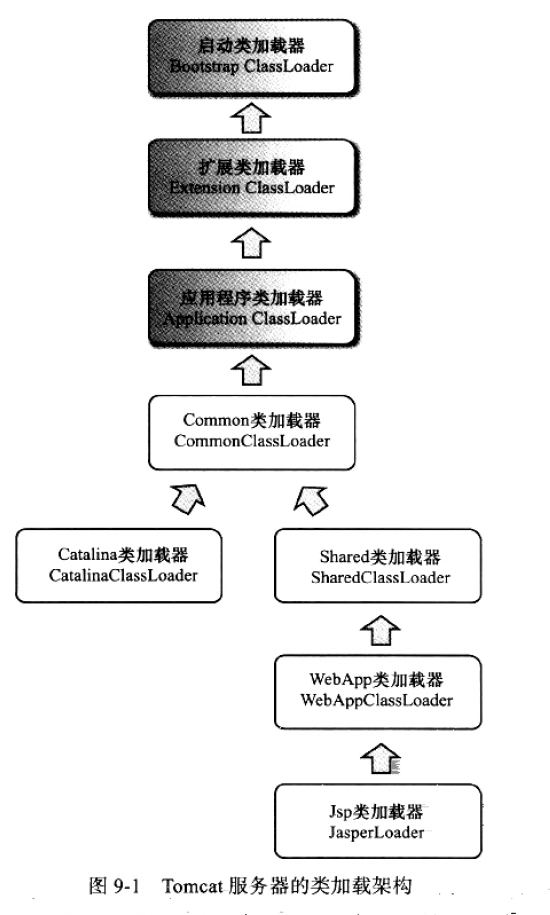

- CommonClassLoader：Tomcat最基本的类加载器，加载路径中的class可以被Tomcat容器本身以及各个Webapp访问。对应common目录。
-  CatalinaClassLoader：Tomcat容器私有的类加载器，加载路径中的class对于Webapp不可见。对应server目录。
-  SharedClassLoader：各个Webapp共享的类加载器，加载路径中的class对于所有Webapp可见，但是对于Tomcat容器不可见。对应shared目录。
-  WebappClassLoader：各个Webapp私有的类加载器，加载路径中的class只对当前Webapp可见。对应WEB-INF目录。

小结：CommonClassLoader 能加载的类都可以被 CatalinaClassLoader 和 SharedClassLoader 使用，而 CatalinaClassLoader 和 SharedClassLoader 自己能加载的类则与对方相互隔离。WebAppClassLoader 可以使用 SharedClassLoader 加载到的类，但各个 WebAppClassLoader 实例之间相互隔离。

##### Spring的类加载
&emsp; <font color="green"> 如果有10个web应用程序都用到了Spring的话，可以把Spring的jar包放到common或者shared目录下让这些程序共享。Spring 的作用是管理每个web应用程序的bean，getBean时自然要能访问到应用程序的类，而用户的程序显然是放在 /WebApp/WEB-INF 目录中的（由 WebAppClassLoader 加载），那么在 CommonClassLoader 或 SharedClassLoader 中的 Spring 容器如何去加载并不在其加载范围的用户程序（/WebApp/WEB-INF/）中的Class呢？</font>
&emsp; 事实上spring根本不会管自己被放在哪里，它统统使用TCCL来加载类，而TCCL默认设置为了WebAPPClassLoader，也就是说哪个WebApp应用调用了spring，spring就取应用自己的WebAPPClassLoader开加载Bean。
&emsp; web.xml中定义的listener为`org.springframework.web.context.ContextLoaderListener`，它最终调用了`org.springframework.web.context.ContextLoader`类来装载bean, 相关代码如下：

```java
private static final Map<ClassLoader, WebApplicationContext> currentContextPerThread =
            new ConcurrentHashMap<>(1);

public WebApplicationContext initWebApplicationContext(ServletContext servletContext) {
    try {
        // 创建WebApplicationContext
        if (this.context == null) {
            this.context = createWebApplicationContext(servletContext);
        }
        // 将其保存到该webapp的servletContext中     
        servletContext.setAttribute(WebApplicationContext.ROOT_WEB_APPLICATION_CONTEXT_ATTRIBUTE, this.context);
        // 获取线程上下文类加载器，默认为WebAppClassLoader
        ClassLoader ccl = Thread.currentThread().getContextClassLoader();
        // 如果spring的jar包放在每个webapp自己的目录中
        // 此时线程上下文类加载器会与本类的类加载器（加载spring的）相同，都是WebAppClassLoader
        if (ccl == ContextLoader.class.getClassLoader()) {
            currentContext = this.context;
        } else if (ccl != null) {
            // 如果不同，也就是上面说的那个问题的情况，那么用一个map把刚才创建的WebApplicationContext及对应的WebAppClassLoader存下来
            // 一个webapp对应一个记录，后续调用时直接根据WebAppClassLoader来取出
            currentContextPerThread.put(ccl, this.context);
        }

        return this.context;
    } catch (RuntimeException ex) {
        logger.error("Context initialization failed", ex);
        throw ex;
    } catch (Error err) {
        logger.error("Context initialization failed", err);
        throw err;
    }
}

public static WebApplicationContext getCurrentWebApplicationContext() {
    ClassLoader ccl = Thread.currentThread().getContextClassLoader();
    if (ccl != null) {
        WebApplicationContext ccpt = currentContextPerThread.get(ccl);
        if (ccpt != null) {
            return ccpt;
        }
    }
    return currentContext;
}
```

线程上下文类加载器的适用场景：
- **高层提供了统一接口让低层去实现，同时又要是在高层加载（或实例化）低层的类时，必须通过线程上下文类加载器来帮助高层的ClassLoader找到并加载该类。**
- **使用本类托管类加载，然而加载本类的ClassLoader未知时，为了隔离不同的调用者，可以取调用者各自的线程上下文类加载器代为托管。**

----
### MetaSpace元空间作用以及布局
&emsp; 垃圾回收器主要回收的是堆区中未使用的内存区域，并对相应的区域进行整理。在堆区中，又根据对象内存的存活时间或者对象大小，分为“年轻代”和“年老代”。“年轻代”中的对象是不稳定的易产生垃圾，而“年老代”中的对象比较稳定，不易产生垃圾。之所以将其分开，是分而治之，根据不同区域的内存块的特点，采取不同的内存回收算法，从而提高堆区的垃圾回收的效率。
&emsp; <font color="green"> 永久代存放JVM运行时使用的类。永久代同样包含了Java SE库的类和方法。永久代的对象在full GC时进行垃圾收集。</font>

#### 一、元空间替代持久代
##### 1.1 持久代
&emsp; PermGen space的全称是Permanent Generation space，是指内存的永久保存区域，持久代的内存溢出：这一部分用于存放CLass和Meta的信息，Class在被Load的时候放入PermGen space的区域，它和存放instance实例的Heap区域不同，所以如果你的APP当Load很多Class的时候，就很可能会出现PermGen Space错误。这种错误常见在web 服务器对JSP进行Pre compile预编译的时候。
&emsp; JVM 种类有很多，比如 Oralce-Sun Hotspot, Oralce JRockit, IBM J9, Taobao JVM等等。当然武林盟主是Hotspot了，这个毫无争议。需要注意的是，PermGen space是Oracle-Sun Hotspot才有，JRockit以及J9是没有这个区域。
&emsp; 持久代中包含了虚拟机中所有可以通过反射获取到的数据，比如Class和Method对象。不同的Java虚拟机之间可能会进行类共享，因此持久代又分为只读区和读写区。
&emsp;JVM用于描述应用程序中用到的类和方法的元数据也存储在持久代中。JVM运行时会用到多少持久代的空间取决于应用程序用到了多少类。除此之外，Java SE库中的类和方法也都存储在这里。如果JVM发现有的类已经不再需要了，它会去回收（卸载）这些类，将它们的空间释放出来给其它类使用。Full GC会进行持久代的回收。
- JVM中类的元数据在Java堆中的存储区域。
- Java类对应的HotSpot虚拟机中的内部表示也存储在这里。
- 类的层级信息，字段，名字。
- 方法的编译信息及字节码。
- 变量
- 常量池和符号解析

&emsp; 持久代的大小
- 它的上限是MaxPermSize，默认是64M。
- Java堆中的连续区域：如果存储在非连续的堆空间中的话，要定位出持久代到新对象的引用非常复杂且耗时。卡表（card table），是一种记忆集（Remembered Set），它用来记录某个内存中普通对象指针(oops)的修改。
- 持久代用完后，会抛出OutOfMemberyError "PermGen space"异常。解决方案：应用程序清理引用来触发类卸载；增加MaxPermSize的大小。
- 需要多大的持久代空间取决于类的数量、方法的大小，以及常量池的大小。

##### 1.2 为什么移除持久代
- 它的大小在启动时固定好的——很难进行调优。无法比较精准的确定-XX:MaxPermSize的大小。
- HotSpot的内部类型也是Java对象；它可能会在Full GC中移动，同时它对应用不透明，且是非强类型，难以跟踪调试，还需要存储元数据的元数据信息(meta-metadata)。
- 简化FullGC：每一个回收器有专门的元数据迭代器。
- 可以在GC不进行暂停的情况下并发的释放类数据。
- 使得原来受限于持久代的一些改进未来得以实现。

&emsp; 根据以上原因，永久代最终被移除，**方法区移至MetaSpace，字符串常量移至Java Heap**。

##### 1.3 移除持久代后，PermGen空间的状况
- 这部分内存空间将全部移除。
- JVM的参数：PermSize 和 MaxPermSize 会被忽略并给出警告（如果在启用时设置了这两个参数）。


#### 二、元空间
&emsp; 随着JDK8的到来，JVM不再有PermGen。但类的元数据信息（Metadata）还在，只不过不再是存储在连续的堆空间上，而是移动到叫做"MetaSpace"的本地内存(Native membery)中。


##### 2.1 MetaSpace的组成
- **Klass Metaspace**：Klass Metaspace就是用来存Klass的，Klass使我们熟知的class文件在JVM里运行时数据结构，不过需要注意的是类似A.class其实是存在heap里的，是java.lang.Class的一个对象实例。这块内存是紧接着Heap的，如第一张图中的Meta，和我们之前的perm一样，这块内存大小可通过-XX:CompressedClassSpaceSize参数来控制，这个参数前面提到了默认是1G，但是这块内存也可以没有，假如没有开启压缩指针就不会有这块内存，这种情况下klass都会存在NoKlass Metaspace里，另外如果我们把-Xmx设置大于32G的话，其实也是没有这块内存的，因为会这么大内存会关闭压缩指针开关。还有就是这块内存最多只会存在一块。
-  **NoKlass Metaspace**:NoKlass Metaspace专门来存klass相关的其他的内容，比如method，constantPool等，这块内存是由多块内存组合起来的，所以可以认为是不连续的内存块组成的。这块内存是必须的，虽然叫做NoKlass Metaspace，但是也其实可以存klass的内容，上面已经提到了对应场景。（当Klass MetaSpace没有开启或不够存储被压缩的内存时）

&emsp; Klass Metaspace和NoKlass Mestaspace都是所有classloader共享的，所以类加载器们要分配内存，但是每个类加载器都有一个SpaceManager，来管理属于这个类加载的内存小块。如果Klass Metaspace用完了，那就会OOM了，不过一般情况下不会，NoKlass Mestaspace是由一块块内存慢慢组合起来的，在没有达到限制条件的情况下，会不断加长这条链，让它可以持续工作。
&emsp; 元空间的本质和永久代类似，都是对JVM规范中方法区的实现。不过元空间与永久代之间最大的区别在于：元空间并不在虚拟机中，而是使用本地内存。因此，默认情况下，元空间的大小仅受本地内存限制，但可以通过以下参数来指定元空间的大小： 
- -XX:MetaspaceSize，初始空间大小，达到该值就会触发垃圾收集进行类型卸载，同时GC会对该值进行调整：如果释放了大量的空间，就适当降低该值；如果释放了很少的空间，那么在不超过MaxMetaspaceSize时，适当提高该值。 
- -XX:MaxMetaspaceSize，最大空间，默认是没有限制的。 
　　除了上面两个指定大小的选项以外，还有两个与 GC 相关的属性： 
- -XX:MinMetaspaceFreeRatio，在GC之后，最小的Metaspace剩余空间容量的百分比，减少为分配空间所导致的垃圾收集 
- -XX:MaxMetaspaceFreeRatio，在GC之后，最大的Metaspace剩余空间容量的百分比，减少为释放空间所导致的垃圾收集

##### 2.2 类指针压缩空间
&emsp; 类指针压缩空间 (Compressed Class Pointer Space). 只有是64位平台上启用了类指针压缩才会存在这个区域。对于64位平台，为了压缩JVM对象中_klass指针的大小，引用了类指针压缩空间。

CompressedClassSpace
- java8移除了permanent generation，然后class metadata存储在native memory中，其大小默认是不受限的，可以通过-XX:MaxMetaspaceSize来限制
- 如果开启了-XX:+UseCompressedOops及-XX:+UseCompressedClassesPointers(`默认是开启`)，则UseCompressedOops会使用32-bit的offset来代表java object的引用，而UseCompressedClassPointers则使用32-bit的offset来代表64-bit进程中的class pointer；可以使用CompressedClassSpaceSize来设置这块的空间大小
- 如果开启了指针压缩，则CompressedClassSpace分配在MaxMetaspaceSize里头，即MaxMetaspaceSize=Compressed Class Space Size + Metaspace area (excluding the Compressed Class Space) Size

元空间和类指针压缩空间的区别
-  类指针压缩空间只包含类的元数据，比如InstanceKlass, ArrayKlass 仅当打开了UseCompressedClassPointers选项才生效 为了提高性能，Java中的虚方法表也存放到这里.
- 元空间包含类的其它比较大的元数据，比如方法，字节码，常量池.

#### 三 Metaspace调优

使用-XX:MaxMetaspaceSize参数可以设置元空间的最大值，默认是没有上限的，也就是说你的系统内存上限是多少它就是多少。-XX:MetaspaceSize选项指定的是元空间的初始大小，如果没有指定的话，元空间会根据应用程序运行时的需要动态地调整大小。

##### MaxMetaspaceSize的调优
- -XX:MaxMetaspaceSize={unlimited}
- 元空间的大小受限于你机器的内存
- 限制类的元数据使用的内存大小，以免出现虚拟内存切换以及本地内存分配失败。如果怀疑有类加载器出现泄露，应当使用这个参数；32位机器上，如果地址空间可能会被耗尽，也应当设置这个参数。
- **元空间的初始大小是21M**——这是GC的初始的高水位线，超过这个大小会进行Full GC来进行类的回收。
- 如果启动后GC过于频繁，请将该值设置得大一些
- 可以设置成和持久代一样的大小，以便推迟GC的执行时间

##### CompressedClassSpaceSize的调优

- 只有当-XX:+UseCompressedClassPointers开启了才有效
- -XX:CompressedClassSpaceSize=1G
- 由于这个大小在启动的时候就固定了的，因此最好设置得大点。
- 没有使用到的话不要进行设置
- JVM后续可能会让这个区可以动态的增长。不需要是连续的区域，只要从基地址可达就行；可能会将更多的类元信息放回到元空间中；未来会基于PredictedLoadedClassCount的值来自动的设置该空间的大小

&emsp; 正如前面提到了，Metaspace VM管理Metaspace空间的增长。但有时你会想通过在命令行显示的设置参数-XX:MaxMetaspaceSize来限制Metaspace空间的增长。默认情况下，-XX:MaxMetaspaceSize并没有限制，因此，在技术上，Metaspace的尺寸可以增长到交换空间，而你的本地内存分配将会失败。
&emsp; 每次垃圾收集之后，Metaspace VM会自动的调整 high watermark，推迟下一次对Metaspace的垃圾收集。
&emsp; 这两个参数，-XX：MinMetaspaceFreeRatio和-XX：MaxMetaspaceFreeRatio,类似于GC的FreeRatio参数，可以放在命令行。


