# TCP相关知识点
**TCP基本认识**
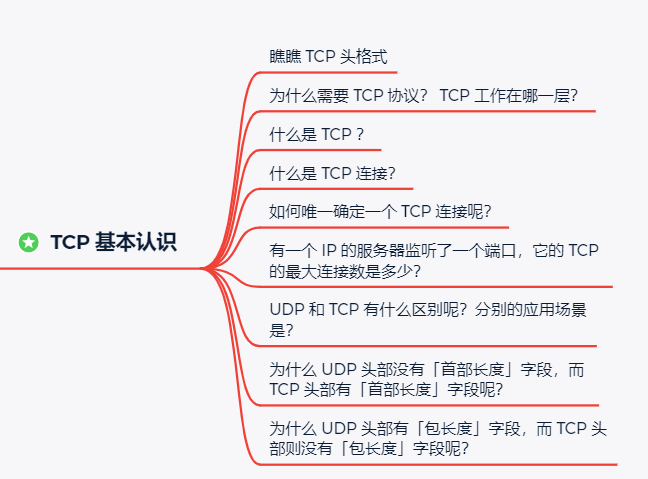

**TCP连接建立**


**TCP连接断开**
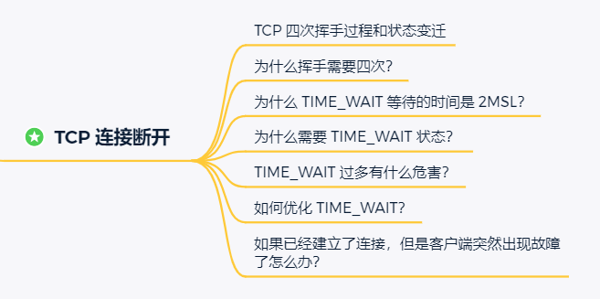

**Socket编程**


----

# OSI参考模型
1- 图示

以下是每个网络层的作用
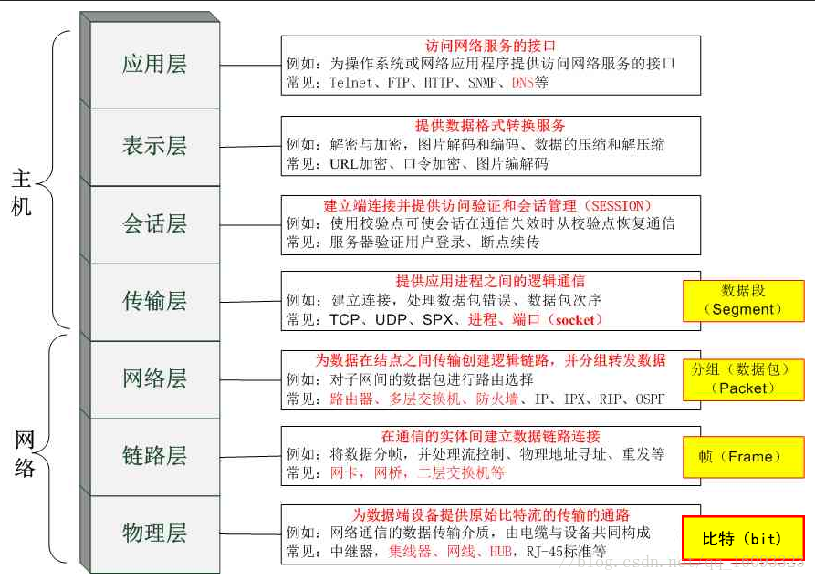

2- OSI七层模型的作用
- **应用层**：为应用程序提供服务并规定应用程序中通信的相关细节。包括文件传输、电子邮件、远程登录等协议。

- **表示层**：将应用处理的信息转换为适合网络传输的格式，或将来自下一层的数据转换为上层能够处理的格式。因此它主要负责数据格式的转换。

- **会话层**：负责建立和断开通信连接（数据流动的逻辑通路），以及数据的分割等数据传输相关的管理。

- **传输层**：起着可靠传输的作用。只在通信双方节点上进行处理，而无需在路由器上处理。会话层负责决定建立连接和断开连接的时机，而传输层进行实际的建立和断开处理
- **网络层**：将数据传输到目标地址。目标地址可以是多个网络通过路由器连接而成的某个地址。因此这一层主要负责寻址和路由选择
- **数据链路层**：负责物理层上的互联、节点之间的通信传输。例如与1个以太网相连的2个节点之间的通信。将0、1序列划分为具有意义的数据帧传送给对端（数据帧的生成与接收）。
- **物理层**：负责0、1比特流（0、1序列）与电压的高低、光的闪灭之间的互换

3- 七层通信过程
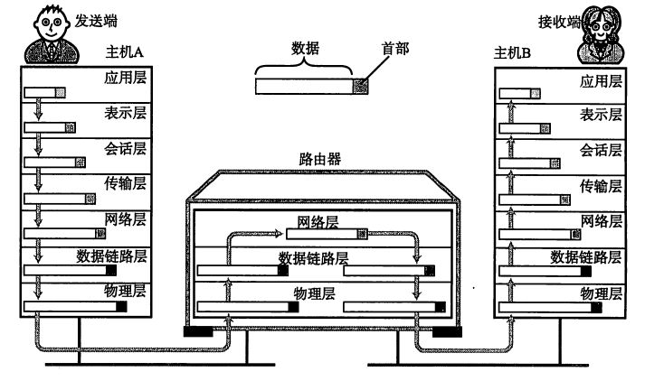

----

# 1. TCP基本认识
## 瞧瞧 TCP 头格式
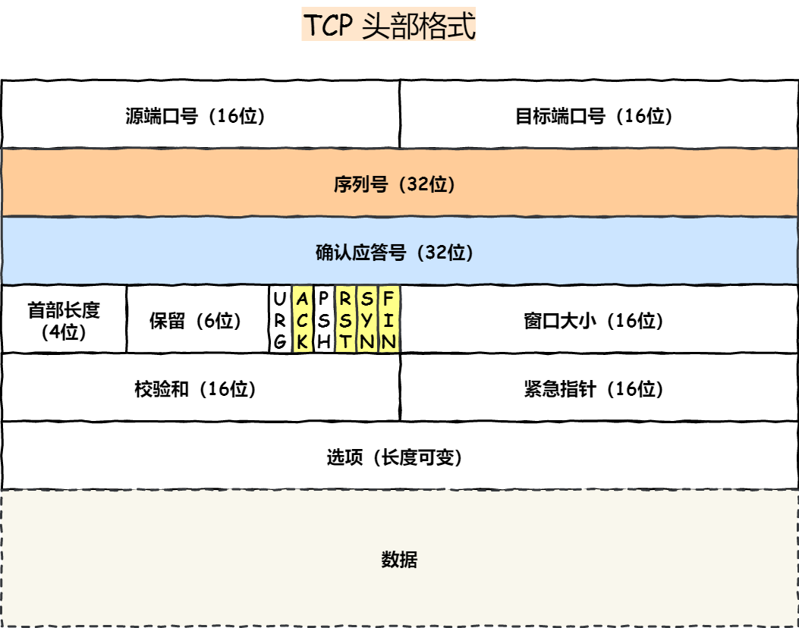
TCP头格式
- **序列号**：在建立连接时由计算机生成的随机数作为其初始值，通过SYN包传给接收端主机，每发送一次数据，就[累加]一次该[数据字节数]的大小。**用来解决网络包乱序问题**。
- **确认应答号**：指下一次[期望]收到的数据的序列号，发送端收到这个确认应答以后可以认为在这个序号以前的数据都已被正常接收。**用来解决不丢包的问题**。
- **控制位**：
    - **ACK**：该位为`1`时，[确认应答]的字段变为有效，TCP规定除了最初建立连接时的`SYN`包之外该位必须设置为`1`。
    - **RST**：该位为`1`时，表示TCP连接中出现异常必须强制断开连接。
    - **SYN**：该位为`1`时，表示希望建立连接，并在其[序列号]的字段进行序列号初始值的设定。
    - **FIN**：该位为`1`时，表示今后不会再有数据发送，希望断开连接。当通信结束希望断开连接时，通信双方的主机之间就可以相互交换`FIN`位置为1的TCP段。

## 为什么需要 TCP 协议？TCP 工作在哪一层？
因为`IP`层是[不可靠]的，它不保证网络包的交付、不保证网络包的按序交互、也不保证网络包中的数据完整性。

OSI参考模型与TCP/IP的关系
如果需要保障网络数据包的可靠性，那么就需要由上层[传输层]的`TCP`协议来负责。
因为TCP是一个工作在**传输层**的**可靠**数据传输的服务，它能确保接收端收到的网络包是**无损坏、无间隔、非冗余和按序的**。

## 什么是TCP ？
TCP是**面向连接的、可靠的、基于字节流**的传输层通信协议。

- **面向连接**：一定是**一对一**才能连接，不能像UDP协议可以一个主机同时向多个主机发送消息，也就是无法做到一对多的。
- **可靠的**：无论网络链路中出现了怎样的链路变化，TCP都可以保证一个报文一定能够到达接收端。
- **字节流**：消息是**没有边界**的，所以无论我们消息有多大都可以进行传输。并且消息是**有序的**，当前一个消息没有收到的时候，即使它先收到了后面已经到达的字节，那么也不会交给应用层去处理，同时对重复的报文会自动丢弃。

## 什么是TCP连接？
我们来看看 RFC 793 是如何定义「连接」的：
_Connections:
The reliability and flow control mechanisms described above require that TCPs initialize and maintain certain status information for each data stream.
The combination of this information, including sockets, sequence numbers, and window sizes, is called a connection._
简单的说就是，**用于保证可靠性和流量控制维护的某系状态信息，这些信息的组合，包括Socket、序列号和窗口大小称为连接**。

所以我们可以知道，建立一个TCP连接是需要客户端和服务端达成上述三个信息的标识：
- **Socket**：由IP地址和端口号组成。
- **序列号**：用来解决乱序问题。
- **窗口大小**：用来做流量控制。

## 如何唯一确定一个TCP连接呢？
TCP四元组可以唯一确定一个连接，四元组包括如下：
- 源地址
- 源端口
- 目标地址
- 目标端口


TCP四元组
- 源地址和目标地址的字段(32位)是在IP头部中，作用是通过IP协议发送报文发给对方主机。
- 源端口和目标端口的字段(16位)是在TCP头部，作用是高速TCP协议应该把报文发给哪个进程。

## 有一个 IP 的服务器监听了一个端口，它的 TCP 的最大连接数是多少？
服务器通常固定在某个本地端口上监听，等待客户端的连接请求。因此，客户端 IP 和 端口是可变的，其理论值计算公式如下:_最大TCP连接数=客户端IP数 &times;客户端端口数_ 。对于IPv4,客户端的 IP 数最多为 `2` 的 `32` 次方，客户端的端口数最多为 `2` 的 `16` 次方，也就是服务端单机最大 TCP 连接数，约为 `2` 的 `48` 次方。
&emsp;当然，服务端最大并发TCP远不能达到理论上限。
- 首先主要是**文件描述符限制**，Socket都是文件，所以首先要通过`ulimit`配置文件描述符的数目。
- 另一个是**内存限制**，每个TCP连接都要占用一定内存，操作系统内存是有限的。

## UDP 和 TCP 有什么区别呢？分别的应用场景是？
UDP不提供复杂的控制机制，利用IP提供面向[无连接]的通信服务。UDP协议非常简单，头部只有`8`个字节(64位)，UDP的头部格式如下：
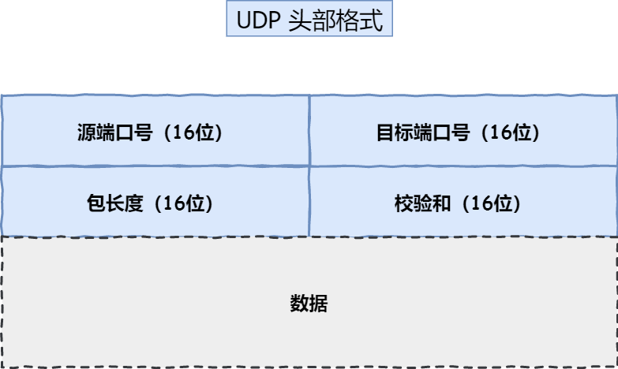
UDP头部格式：
- 目标和源端口号：主要是告诉UDP协议应该把报文发给哪个进程。
- 包长度：该字段保存了UDP首部长度和数据的长度之和。
- 校验和：校验和是为了提供可靠的UDP首部和数据而设计。

### TCP和UDP区别
- **连接**
    - TCP是面向连接的传输层协议，传输数据前首先要建立连接。
    - UDP不需要连接，即刻传输数据。
- **服务对象**
    - TCP是一对一两点服务，即一条连接只有两个端点。
    - UDP支持一对一、一对多、多对多的交互通信。
- **可靠性**
    - TCP是可靠交付数据的，数据可以无差错、不丢失、不重复、按需到达。
    - UDP尽最大努力交付，不保证可靠交付数据。
- **拥塞控制、流量控制**
    - TCP 有拥塞控制和流量控制机制，保证数据传输的安全性。
    - UDP 则没有，即使网络非常拥堵了，也不会影响 UDP 的发送速率。
- **首部开销**
    - TCP首部长度较长。会有一定的开销，首部在没有使用「选项」字段时是 `20` 个字节，如果使用了「选项」字段则会变长的。
    - UDP 首部只有 8 个字节，并且是固定不变的，开销较小。

### TCP和UDP的应用场景
由于TCP是面向连接，能保证数据的可靠性交付，因此经常用于：
- `FTP`文件传输
- `HTTP` / `HTTPS`

由于UDP面向无连接，能保证数据的可靠性交付，因此经常用于：
- 包总量较少的通信，如`DNS`、`SNMP`等。
- 视频、音频等多媒体通信。
- 广播通信。

## 为什么 UDP 头部没有「首部长度」字段，而 TCP 头部有「首部长度」字段呢？
原因是 TCP 有**可变长**的「选项」字段，而 UDP 头部长度则是**不会变化**的，无需多一个字段去记录 UDP 的首部长度。

## 为什么 UDP 头部有「包长度」字段，而 TCP 头部则没有「包长度」字段呢？
先说说 TCP 是如何计算负载数据长度：
`TCP数据的长度=IP总长度-IP首部长度-TCP首部长度`
其中IP总长度和IP首部长度，在IP首部格式是已知的，所以可以计算出TCP数据的长度。
UDP 也是基于 IP 层的，之所以还要有「包长度」，**因为为了网络设备硬件设计和处理方便，首部长度需要是 `4`字节的整数倍。**可能是为了补全 UDP 首部长度是 `4` 字节的整数倍，才补充了「包长度」字段。。

----

# 2. TCP连接建立
## TCP三次握手过程和状态变迁
TCP是面向连接的协议，所以使用TCP之前必须先建立连接，而**建立连接时通过三次握手而进行的**。
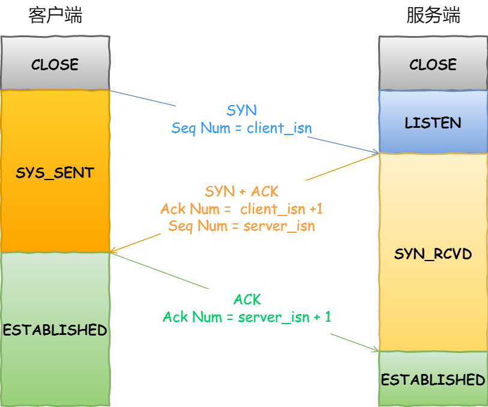
一开始，客户端和服务端都处于`CLOSED`状态。先是服务端主动监听某个端口，处于`LISTEN`状态。
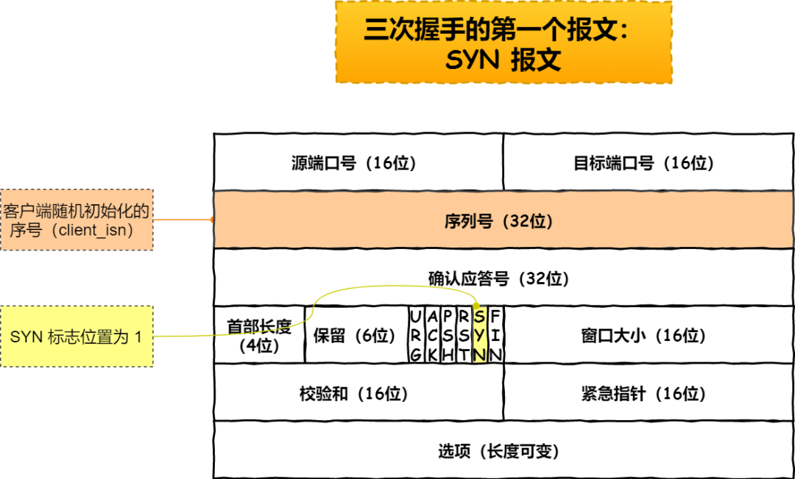
第一个报文——SYN报文
&emsp; 客户端会会随机初始化序号(`client_isn`)， 将此序号置于TCP首部的[序号]字段中，同时把`SYN`标志位置为`1`，表示SYN报文。接着把第一个SYN报文发送给服务端，表示向服务端发起连接，该报文不包含应用层数据，之后客户端处于`SYN-SENT`状态。

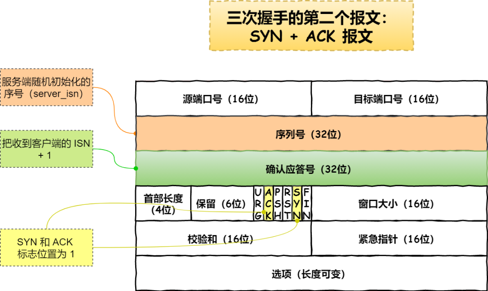
第二个报文—— SYN + ACK报文
&emsp; 服务端收到客户端的`SYN`报文后，首先服务端也随机初始化自己的序号(`server_isn`), 将此序号填入TCP首部的[序号]字段中，其次把TCP首部的[确认应答号]字段填入`client_isn+1`, 接着把`SYN`和`ACK`标志位置为`1`。最后把该报文发给服务端，该报文也不包含应用层数据，之后服务端处于`SYN-RECVD`状态。

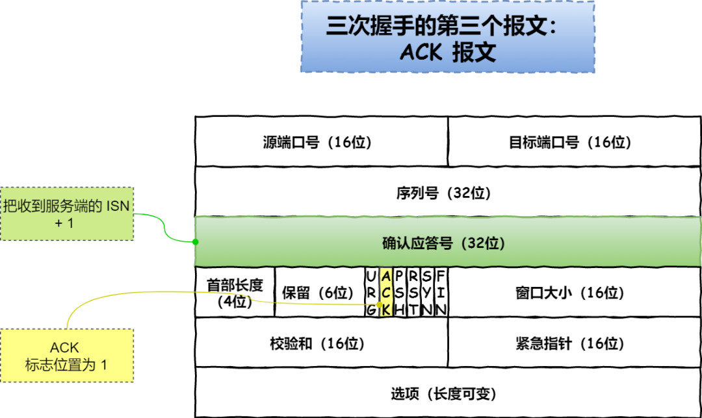
第三个报文——ACK报文
&emsp;客户端收到服务端报文后，还要向服务端回应一个应答报文，首先该应答报文TCP首部`ACK`标志位置为`1`，其次[确认应答号]字段填入`server_isn + 1`, 最后将报文发送给服务端，这次报文可以携带客户端数据到服务端，之后客户端处于`ESTABLISHED`状态。
&emsp; 服务端收到客户端的应答报文后也进入`ESTABLISHED`状态。

从上面的过程中可以发现**第三次握手是可以携带数据的，前两次握手是不可以携带数据的**，这也是面试常问的问题。一旦完成三次握手，双方都处于`ESTABLISHED`状态，此次连接就已经建立完成，客户端和服务端就可以相互发送数据了。发送数据的时候，[序号]值为上次的序号值 + 数据的长度。服务端接收完毕后响应ACK。

## 如何在Linux系统上查看TCP状态？
TCP的连接状态查看，在Linux上可以通过`netstat -napt`


## TCP为何是三次连接？而不是两次、四次？
在前面我们知道了什么是 **TCP 连接**：用于保证可靠性和流量控制维护的某些状态信息，这些信息的组合，包括**Socket、序列号和窗口大小**称为连接。
所以，重要的是**为什么三次握手才可以初始化Socket、序列号和窗口大小并建立 TCP 连接。**

接下来以三个方面分析三次握手的原因：
- 三次握手才可以组织历史重复连接的初始化（主要原因）
- 三次握手才可以同步双方的初始序号。
- 三次握手才可以避免资源浪费。

### 原因一：避免历史连接
我们来看看 RFC 793 指出的 TCP 连接使用三次握手的**首要原因**：
_The principle reason for the three-way handshake is to prevent old duplicate connection initiations from causing confusion._
&emsp; 简单来说，三次握手的**首要原因是为了防止旧的重复连接初始化造成混乱**。
网络环境是错综复杂的，往往并不是我们期望的那样，先发送的数据包，就先达到目标主机，反而会由于网络拥堵等各种原因会使得旧的数据包先达到主机，那么这种情况下TCP三次握手是如何避免的呢？
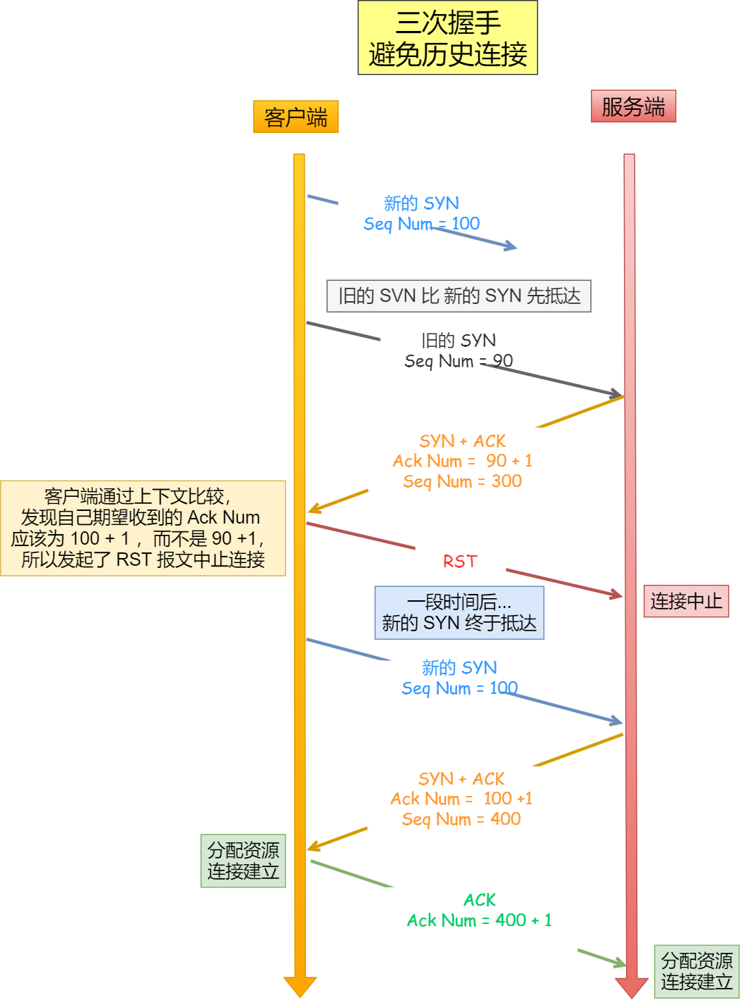
三次握手避免历史连接
客户端连续发送多次`SYN`建立连接的报文，在网络拥堵等情况下：
1. 一个[旧SYN报文] 比 [最新的SYN] 报文早到达了服务端。
2. 那么此时服务端就会返回一个`SYN+ACK`报文给客户端。
3. 客户端收到后可以根据自身的上下文，判断这是一个历史连接(序列号过期或超时)，那么客户端就会发送`RST`报文给服务端，表示终止这一次连接。

如果是两次握手连接，就不能判断当前连接是否是历史连接，三次握手则可以在客户端(发送方)准备发送第三次报文时，客户端因有足够的上下文判断当前连接是否是历史连接：
- 如果是历史连接(序列号过期或超时)，则第三次握手发送的报文时`RST`报文，以此中断历史连接。
- 如果不是历史连接，则第三次发送的报文是`ACK`报文，通信双方就会成功建立连接。

所以TCP使用三次握手建立连接的主要原因是**防止历史连接初始化了连接**。

### 原因二：同步双方序列号
TCP协议的通信双方都必须维护一个[序列号]，序列号是可靠传输的一个关键因素，它的主要作用：
- 接收方可以去除重复的数据；
- 接收方可以根据数据包的序号按序接收；
- 可以标识发送出去的数据包中，哪些是已经被对方收到的；

可见，序列号在TCP连接中占据着非常重要的作用，所以当客户端发送携带[初始序列号]的`SYN`报文的时候，需要服务端回一个`ACK`应答报文，表示客户端的SYN报文已被服务端成功接收，那当服务端发送[初始化序列号]给客户端的时候，依然也要得到客户端的应答回应，**这样一来一回，才能确保双方的初始化序列号能被可靠的同步**。
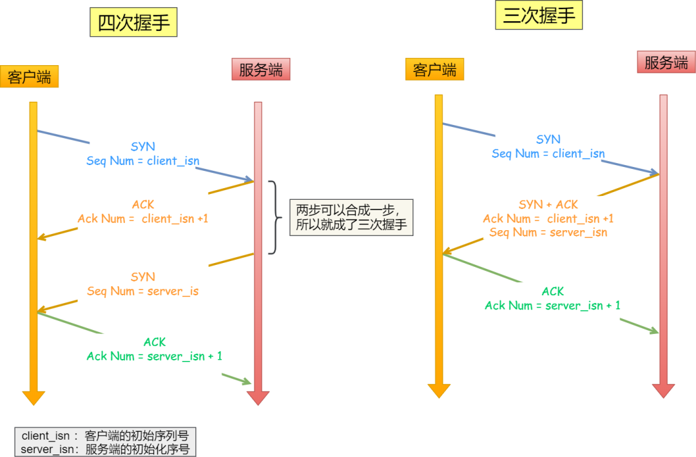
- 四次握手其实也能够可靠的同步双方的初始化序号，但由于**第二步和第三步可以优化成一步**，所以就成了「三次握手」。
- 而两次握手只保证了一方的初始序列号能被对方成功接收，没办法保证双方的初始序列号都能被确认接收。

### 原因三：避免资源浪费
如果只有「两次握手」，当客户端的 `SYN` 请求连接在网络中阻塞，客户端没有接收到 `ACK` 报文，就会重新发送 `SYN` ，由于没有第三次握手，服务器不清楚客户端是否收到了自己发送的建立连接的 `ACK` 确认信号，所以每收到一个 `SYN` 就只能先主动建立一个连接，这会造成什么情况呢？
&emsp; 如果客户端的`SYN`阻塞了，重复发送多次`SYN`报文，那么服务端在收到请求后就会**建立多个冗余的无效连接，造成不必要的资源浪费**。
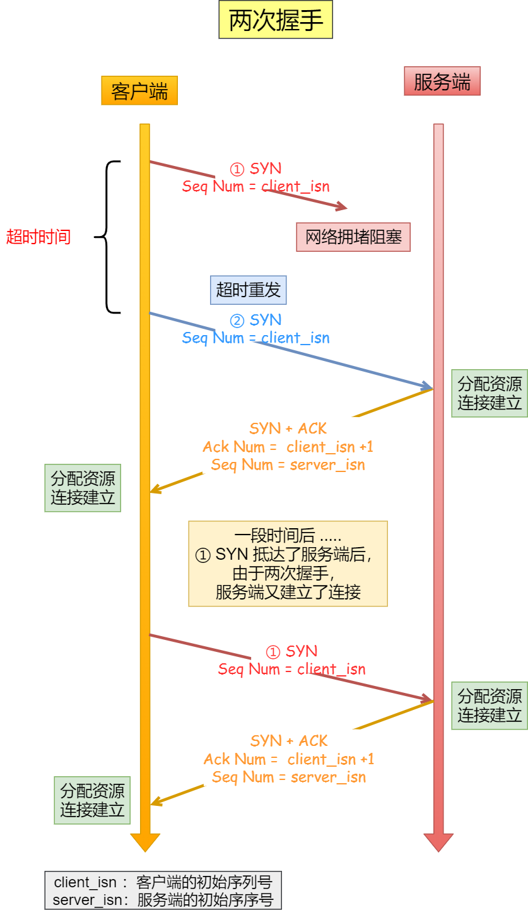
两次握手造成资源浪费：即两次握手在消息滞留的情况下，服务器重复接受无用的连接请求`SYN`报文，造成重复分配资源。

小结：
- TCP建立连接时，通过三次握手**能防止历史连接的建立，能减少双方不必要的资源开销，能帮助双方同步初始化序列号**。
- 序列号能保证数据包不重复、不丢弃和按序传输。

不使用「两次握手」和「四次握手」的原因：
- 「两次握手」：无法防止历史连接的建立，会造成双方资源的浪费，也无法可靠的同步双方序列号；
- 「四次握手」：三次握手就已经理论上最少可靠连接建立，所以不需要使用更多的通信次数。

## 为什么客户端和服务端的初始序列号 ISN 是不相同的？
&emsp; 因为网络中的报文**会延迟、会复制重发、也有可能丢失**，这样会造成的不同连接之间产生互相影响，所以为了避免互相影响，客户端和服务端的初始序列号是随机且不同的。

初始序列号ISN是如何随机产生的？
起始 `ISN` 是基于时钟的，每 4 毫秒 + 1，转一圈要 4.55 个小时。
RFC1948 中提出了一个较好的初始化序列号 ISN 随机生成算法。
_ISN = M + F (localhost, localport, remotehost, remoteport)_
*   `M` 是一个计时器，这个计时器每隔 4 毫秒加 1。
*   `F` 是一个 Hash 算法，根据源 IP、目的 IP、源端口、目的端口生成一个随机数值。要保证 Hash 算法不能被外部轻易推算得出，用 MD5 算法是一个比较好的选择。

## 既然 IP 层会分片，为什么 TCP 层还需要 MSS 呢？
我们先来认识下 MTU 和 MSS
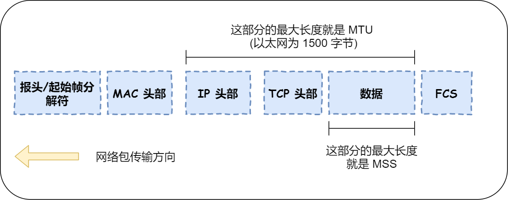
MTU与MSS：
-  `MTU`：一个网络包的最大长度，以太网中一般为 `1500` 字节；
-  `MSS`：除去 IP 和 TCP 头部之后，一个网络包所能容纳的 TCP 数据的最大长度；

如果TCP 的整个报文（头部 + 数据）交给 IP 层进行分片，会有什么异常呢？
&emsp; 当 IP 层有一个超过 `MTU` 大小的数据（TCP 头部 + TCP 数据）要发送，那么 IP 层就要进行分片，把数据分片成若干片，保证每一个分片都小于 MTU。把一份 IP 数据报进行分片以后，由目标主机的 IP 层来进行重新组装后，在交给上一层 TCP 传输层。这看起来井然有序，但这存在隐患的，**那么当如果一个 IP 分片丢失，整个 IP 报文的所有分片都得重传**。（因为 IP 层本身没有超时重传机制，它由传输层的 TCP 来负责超时和重传。）当接收方发现 TCP 报文（头部 + 数据）的某一片丢失后，则不会响应 ACK 给对方，那么发送方的 TCP 在超时后，就会重发「整个 TCP 报文（头部 + 数据）」。

&emsp; 因此，可以得知由 IP 层进行分片传输，是非常没有效率的。所以，为了达到最佳的传输效能 TCP 协议在**建立连接的时候通常要协商双方的 MSS 值**，当 TCP 层发现数据超过 MSS 时，则就先会进行分片，当然由它形成的 IP 包的长度也就不会大于 MTU ，自然也就不用 IP 分片了。经过 TCP 层分片后，如果一个 TCP 分片丢失后，**进行重发时也是以 MSS 为单位**，而不用重传所有的分片，大大增加了重传的效率。

## 什么是 SYN 攻击？如何避免 SYN 攻击？
SYN攻击：我们都知道TCP连接建立是需要三次握手，假设攻击者短时间伪造不同IP地址的`SYN`报文，服务端每收到一个`SYN`报文，就进入`SYN_RECVD`状态，但服务端发送出去的`ACK+SYN`报文，无法得知未知IP主机的`ACK`应答，久而久之就会**占满服务端SYN接收队列(未连接队列)** ，使得服务器不能为正常用户服务。


### 避免SYN攻击方式一: 修改Linux内核参数
避免SYN攻击方式一：其中一种解决方式是通过修改Linux内核参数，控制队列大小和当队列满时应做什么处理。当网卡接收数据包的速度大于内核处理的速度时，会有一个队列保存这些数据包。控制队列的最大值如下参数：
```c
net.core.netdev_max_backlog
// SYN_RCVD 状态连接的最大个数：
net.ipv4.tcp_max_syn_backlog
// 超出处理能时，对新的 SYN 直接回 RST，丢弃连接：
net.ipv4.tcp_abort_on_overflow
```

### 避免SYN攻击方式二: 启用syncookies
我们先来看下Linux 内核的 `SYN` （未完成连接建立）队列与 `Accpet` （已完成连接建立）队列是如何工作的？


正常流程：
- 当服务端收到客户端的SYN报文时，会将其加入到内核的[SYN队列]。
- 接着发送SYN+ACK给客户端，等待客户端回应ACK报文；
- 服务端接收到ACK报文后，从[SYN队列] 移除放入到 [Accept队列]；
- 应用程序通过调用`accept()` 接口，从[Accept队列] 取出连接。

应用程序过慢

如果应用程序过慢就会导致 [Accept队列] 被占满。

收到SYN攻击

*   如果不断受到 SYN 攻击，就会导致「 SYN 队列」被占满。

`tcp_syncookies` 的方式可以应对 SYN 攻击的方法：
```c
net.ipv4.tcp_syncookies = 1
```
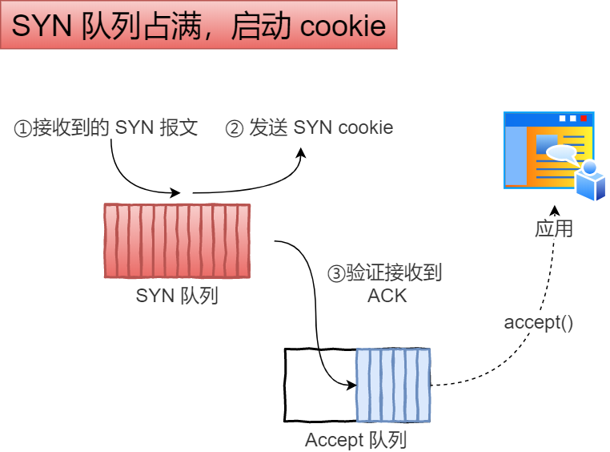
- 当 「 SYN 队列」满之后，后续服务器收到 SYN 包，不进入「 SYN 队列」；
- 计算出一个 `cookie` 值，再以 SYN + ACK 中的「序列号」返回客户端，
- 服务端接收到客户端的应答报文时，服务器会检查这个 ACK 包的合法性。如果合法，直接放入到「 Accept 队列」。
- 最后应用通过调用 `accpet()` socket 接口，从「 Accept 队列」取出的连接。

----

# 3. TCP连接断开
## TCP 四次挥手过程和状态变迁
TCP 断开连接是通过**四次挥手**方式。双方都可以主动断开连接，断开连接后主机中的「资源」将被释放。
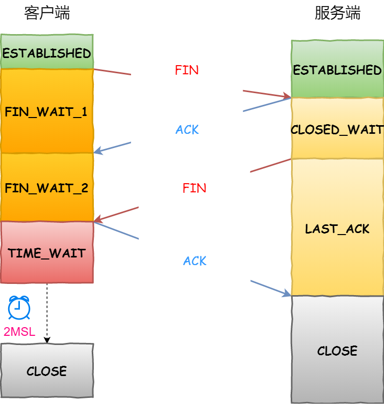

客户端主动关闭连接——TCP四次挥手
1. 客户端打算关闭连接，此时会发送一个TCP首部`FIN`标志位被置为`1`的报文，之后客户端进入`FIN_WAIT_1`状态。
2. 服务端收到该报文后，就向客户端发送`ACK`应答报文，接着服务端进入`CLOSED_WAIT`状态。
3. 客户端收到服务端的`ACK`应答报文后，之后进入`FIN_WAIT_2`状态。
4. 等待服务端处理完数据后，也想客户端发送`FIN`报文，之后服务端进入`LAST_ACK`状态。
5. 客户端收到服务端的`FIN`报文后，回应一个`ACK`应答报文，之后进入`TIME_WAIT`状态。
6. 服务端收到`ACK`报文后，就进入了`CLOSED`状态，至此服务端已经完成连接的关闭。
7. 客户端在经过`2MSL`一段时间后，自动进入`CLOSED`状态，至此客户端也完成连接的关闭。

可以看到，每个方向都需要**一个FIN和一个ACK**，因此通常被称为**四次挥手**。需要注意的是：**主动关闭连接的，才有TIME_WAIT状态**。

## 为什么挥手需要四次？
再来回顾下四次挥手双方发 `FIN` 包的过程，就能理解为什么需要四次了。
- 关闭连接时，客户端向服务端发送`FIN`时，仅仅表示客户端不再发送数据了但是还能接收数据。
- 服务端收到客户端的`FIN`报文时，向回一个`ACK`应答报文，而服务端可能还有数据需要处理和发送，等服务端不再发送数据时，才发送`FIN`报文给客户端来表示同一现在关闭连接。

从上面过程可以得知，服务端通常需要等待完成数据的处理和发送，所以服务端的`ACK`和`FIN`一般都会分开发送，从而导致比三次握手多了一次。

## 为什么TIME_WAIT等待的时间是2MSL？
MSL解释：
- `MSL` 是 Maximum Segment Lifetime，**报文最大生存时间**，它是任何报文在网络上存在的最长时间，超过这个时间报文将被丢弃。因为 TCP 报文基于是 IP 协议的，而 IP 头中有一个 `TTL` 字段，是 IP 数据报可以经过的最大路由数，每经过一个处理他的路由器此值就减 1，当此值为 0 则数据报将被丢弃，同时发送 ICMP 报文通知源主机。
- MSL 与 TTL 的区别：MSL 的单位是时间，而 TTL 是经过路由跳数。所以 **MSL 应该要大于等于 TTL 消耗为 0 的时间**，以确保报文已被自然消亡。

等待2MSL？
- TIME_WAIT 等待 2 倍的 MSL，比较合理的解释是：网络中可能存在来自发送方的数据包，当这些发送方的数据包被接收方处理后又会向对方发送响应，所以**一来一回需要等待 2 倍的时间**。比如，如果被动关闭方没有收到断开连接的最后的 ACK 报文，就会触发超时重发 Fin 报文，另一方接收到 FIN 后，会重发 ACK 给被动关闭方， 一来一去正好 2 个 MSL。
- `2MSL` 的时间是从**客户端接收到 FIN 后发送 ACK 开始计时的**。如果在 TIME-WAIT 时间内，因为客户端的 ACK 没有传输到服务端，客户端又接收到了服务端重发的 FIN 报文，那么 **2MSL 时间将重新计时**。
- 在 Linux 系统里 `2MSL` 默认是 `60` 秒，那么一个 `MSL` 也就是 `30` 秒。**Linux 系统停留在 TIME_WAIT 的时间为固定的 60 秒**。

其定义在 Linux 内核代码里的名称为 TCP_TIMEWAIT_LEN：

```C
#define TCP_TIMEWAIT_LEN (60*HZ) /* how long to wait to destroy TIME-WAIT state, about 60 seconds  */
```
TIME_WAIT 的时间长度，只能修改 Linux 内核代码里 TCP_TIMEWAIT_LEN 的值，并重新编译 Linux 内核。

## 为什么需要TIME_WAIT状态？
为什么需要 TIME_WAIT 状态？
主动发起关闭连接的一方，才会有 `TIME-WAIT` 状态。需要 TIME-WAIT 状态，主要是两个原因：
- 防止具有相同 [四元组] 的 [旧] 的数据包被收到；
- 保证[被动关闭连接] 的一方能正确被关闭，即保证最后的ACK能让被动关闭方接收，从而帮助其正常关闭。

### 原因一：防止旧连接的数据包
_原因一：防止旧连接的数据包_
假设 TIME-WAIT 没有等待时间或时间过短，被延迟的数据包抵达后会发生什么呢？
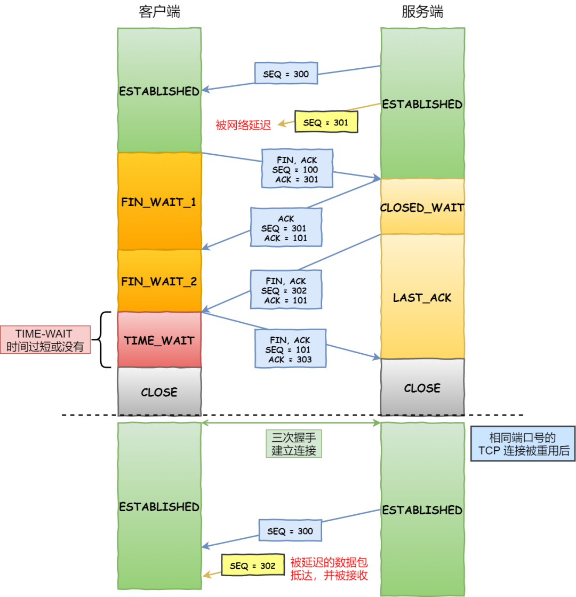
答案是：可能会出现接收到历史数据的异常。
- 如上图黄色框框服务端在关闭连接之前发送的 `SEQ = 301` 报文，被网络延迟了。
- 这时有**相同端口的TCP连接被复用**后，被延迟的 `SEQ = 301` 抵达了客户端，那么客户端是有可能正常接收这个过期的报文，这就会产生数据错乱等严重的问题。

所以，TCP 就设计出了这么一个机制，经过 `2MSL` 这个时间，**足以让两个方向上的数据包都被丢弃，使得原来连接的数据包在网络中都自然消失，再出现的数据包一定都是新建立连接所产生的。**

### 原因二：保证连接正确关闭
在 RFC 793 指出 TIME-WAIT 另一个重要的作用是：_TIME-WAIT - represents waiting for enough time to pass to be sure the remote TCP received the acknowledgment of its connection termination request._ 也就是说，TIME-WAIT 作用是**等待足够的时间以确保最后的 ACK 能让被动关闭方接收，从而帮助其正常关闭。**
假设 TIME-WAIT 没有等待时间或时间过短，断开连接会造成什么问题呢？
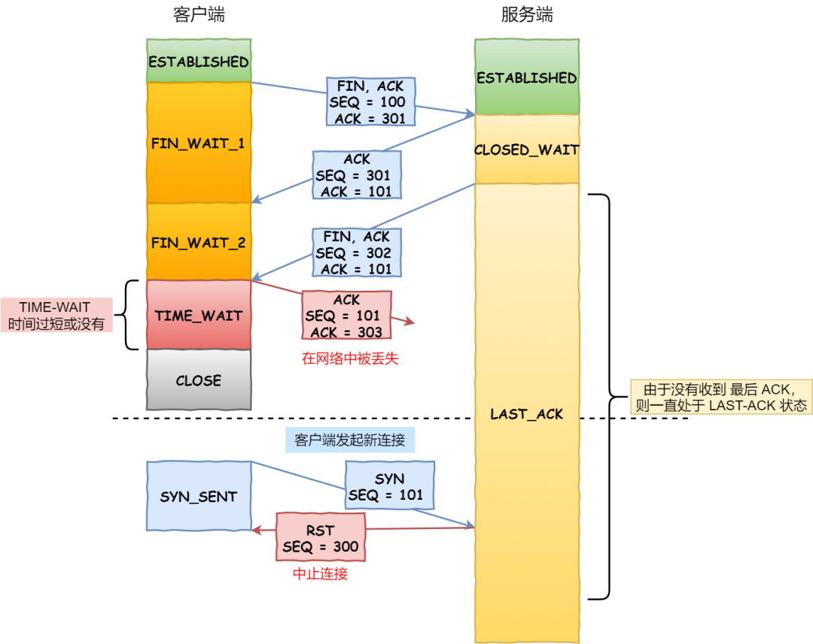
如上图会出现的异常：
- 如上图红色框框客户端四次挥手的最后一个 `ACK` 报文如果在网络中被丢失了，此时如果客户端 `TIME-WAIT` 过短或没有，则就直接进入了 `CLOSE` 状态了，那么服务端则会一直处在 `LASE-ACK` 状态。
- 当客户端发起建立连接的 `SYN` 请求报文后，服务端会发送 `RST` 报文给客户端，连接建立的过程就会被终止。

如果 TIME-WAIT 等待足够长的情况就会遇到两种情况：
- 服务端正常收到四次挥手的最后一个 `ACK` 报文，则服务端正常关闭连接。
- 服务端没有收到四次挥手的最后一个 `ACK` 报文时，则会重发 `FIN` 关闭连接报文并等待新的 `ACK` 报文。

所以客户端在 `TIME-WAIT` 状态等待 `2MSL` 时间后，就可以**保证双方的连接都可以正常的关闭。**

## TIME_WAIT 过多有什么危害？
如果服务器有处于 TIME-WAIT 状态的 TCP，则说明是由服务器方主动发起的断开请求。

过多的 TIME-WAIT 状态主要的危害有两种：
- 第一是内存资源占用；
- 第二是对端口资源的占用，一个 TCP 连接至少消耗一个本地端口；

第二个危害是会造成严重的后果的，要知道，端口资源也是有限的，一般可以开启的端口为 `32768～61000`，也可以通过如下参数设置指定`net.ipv4.ip_local_port_range`. **如果服务端 TIME_WAIT 状态过多，占满了所有端口资源，则会导致无法创建新连接。**

## 如何优化TIME_WAIT？
这里给出优化 TIME-WAIT 的几个方式，都是有利有弊：
- 打开 net.ipv4.tcp_tw_reuse 和 net.ipv4.tcp_timestamps 选项；
- net.ipv4.tcp_max_tw_buckets
- 程序中使用 SO_LINGER ，应用强制使用 RST 关闭。

### 方式一: net.ipv4.tcp_tw_reuse 和 tcp_timestamps
如下的 Linux 内核参数开启后，则可以**复用处于 TIME_WAIT 的 socket 为新的连接所用**。
```
net.ipv4.tcp_tw_reuse = 1
```
使用这个选项，还有一个前提，需要打开对 TCP 时间戳的支持，即
```
net.ipv4.tcp_timestamps=1（默认即为 1）
```
- 这个时间戳的字段是在 TCP 头部的「选项」里，用于记录 TCP 发送方的当前时间戳和从对端接收到的最新时间戳。由于引入了时间戳，我们在前面提到的 `2MSL` 问题就不复存在了，因为重复的数据包会因为时间戳过期被自然丢弃。
- 温馨提醒：`net.ipv4.tcp_tw_reuse`要慎用，因为使用了它就必然要打开时间戳的支持 `net.ipv4.tcp_timestamps`，**当客户端与服务端主机时间不同步时，客户端的发送的消息会被直接拒绝掉**。

### 方式二：net.ipv4.tcp_max_tw_buckets
- 这个值默认为 18000，当系统中处于 TIME_WAIT 的连接**一旦超过这个值时，系统就会将所有的 TIME_WAIT 连接状态重置。**
- 这个方法过于暴力，而且治标不治本，带来的问题远比解决的问题多，不推荐使用。

### 方式三：程序中使用 SO_LINGER
我们可以通过设置 socket 选项，来设置调用 close 关闭连接行为。
```c
struct linger so_linger;
so_linger.l_onoff = 1;
so_linger.l_linger = 0;
setsockopt(s, SOL_SOCKET, SO_LINGER, &so_linger,sizeof(so_linger));
```
如果`l_onoff`为非 0， 且`l_linger`值为 0，那么调用`close`后，会立该发送一个`RST`标志给对端，该 TCP 连接将跳过四次挥手，也就跳过了`TIME_WAIT`状态，直接关闭。但这为跨越`TIME_WAIT`状态提供了一个可能，不过是一个非常危险的行为，不值得提倡。

## 如果已经建立了连接，但是客户端突然出现故障了怎么办？
TCP 有一个机制是**保活机制**。这个机制的原理是这样的：
- 定义一个时间段，在这个时间段内，如果没有任何连接相关的活动，TCP 保活机制会开始作用，每隔一个时间间隔，发送一个探测报文，该探测报文包含的数据非常少，如果连续几个探测报文都没有得到响应，则认为当前的 TCP 连接已经死亡，系统内核将错误信息通知给上层应用程序。
- 在 Linux 内核可以有对应的参数可以设置保活时间、保活探测的次数、保活探测的时间间隔，以下都为默认值：
```
net.ipv4.tcp_keepalive_time=7200
net.ipv4.tcp_keepalive_intvl=75  
net.ipv4.tcp_keepalive_probes=9
```

参数说明：
- tcp_keepalive_time=7200：表示保活时间是 7200 秒（2小时），也就 2 小时内如果没有任何连接相关的活动，则会启动保活机制
- tcp_keepalive_intvl=75：表示每次检测间隔 75 秒；
- tcp_keepalive_probes=9：表示检测 9 次无响应，认为对方是不可达的，从而中断本次的连接。

也就是说在 Linux 系统中，最少需要经过 2 小时 11 分 15 秒才可以发现一个「死亡」连接。

这个时间是有点长的，我们也可以根据实际的需求，对以上的保活相关的参数进行设置。

如果开启了 TCP 保活，需要考虑以下几种情况：
- 第一种，对端程序是正常工作的。当 TCP 保活的探测报文发送给对端, 对端会正常响应，这样 **TCP 保活时间会被重置**，等待下一个 TCP 保活时间的到来。
- 第二种，对端程序崩溃并重启。当 TCP 保活的探测报文发送给对端后，对端是可以响应的，但由于没有该连接的有效信息，**会产生一个 RST 报文**，这样很快就会发现 TCP 连接已经被重置。
- 第三种，是对端程序崩溃，或对端由于其他原因导致报文不可达。当 TCP 保活的探测报文发送给对端后，石沉大海，没有响应，连续几次，达到保活探测次数后，**TCP 会报告该 TCP 连接已经死亡**。

----

# 4. Socket编程

## 针对TCP应该如何Socket编程？

基于TCP协议的客户端和服务器工作流程：
1. 服务端和初始化`Socket`，得到文件描述符；
2. 服务端调用`bind`，将绑定IP地址和端口；
3. 服务端调用`accept`，等待客户端连接；
4. 客户端调用`connect`，向，向服务端的地址和端口发起请求；
5. 服务端`accept`返回用于传输的`socket`的文件描述符；
6. 客户端调用`write`写入数据；服务端调用`read`读取数据；
7. 客户端断开连接时会调用`close`，那么服务端`read`读取数据的时候，就会读取到了`EOF`, 待处理完数据后，服务端调用`close`， 表示连接关闭。

这里需要注意的是，服务端调用`accept`时，连接成功了会返回一个已完成连接的socket，后续用来传输数据。所以，监听的socket和真正用来传送数据的socket，是两个socket，一个叫做**监听Socket**，一个叫做**已完成连接Socket**。成功建立连接之后，双方开始通过read和write函数来读写数据，就像 往一个文件流里面写东西一样。

## listen时候参数backlog的意义？
Linux内核中会维护两个队列：
- 未完成连接的队列 (SYN队列): 接收到一个SYN建立连接请求，处于SYN_RECVD状态；
- 已完成连接的队列 (Accept队列): 已完成TCP三次握手过程，处于ESTABLISHED状态；

SYN队列和Accept队列如下图所示：

```
int listen (int socketfd, int backlog)
```
参数一：socketfd为socket的文件描述符；
参数二：backlog，此参数在历史中有一定的变化，在早期Linux内核backlog是SYN队列大小，也就是未完成队列大小。在Linux内核2.2之后，backlog变成accept队列，也就是已完成连接建立的队列的长度，**所以现在通常认为backlog是accept队列**。

## accept发送在三次握手的哪一步？
我们看看客户端连接服务端时，发生了什么？


客户端连接服务端：
- 客户端的协议栈向服务端发送了SYN包，并告诉服务器端当前发送序列号client_isn，客户端进入了SYN_SENT状态。
- 服务器端的协议收到这个包后，和客户端进行ACK应答，应答的值为client_isn+1，表示对SYN包client_isn的确认，同时服务器也发送一个SYN包，并告诉客户端当前的我的发送序列号为server_isn，服务端进入SYN_RECVD状态；
- 客户端协议栈收到ACK之后，使得应用程序从`connect`调用返回，表示客户端到服务端端的单向连接建立成功，客户端的状态为ESTABLISHED状态，同时客户端协议栈也会对服务器端的SYN包进行应答，应答数据为server_isn+1；
- 应答包到达服务端后，服务器协议栈使得`accept`阻塞调用返回，这个时候服务端到客户端的单向连接也建立成功，服务器端也进入ESTABLISHED状态。

从上面的描述过程中，我们可以得知**客户端connect成功返回是在第二次握手，服务端accept成功返回是在三次握手之后**。

## 客户端调用close，连接断开流程是什么?
客户端主动调用了close，会发生什么？


客户端调用close的执行过程：
- 客户端调用`close`，表明客户端没有数据需要发送了，则此时会向服务端发送FIN报文，进入FIN_WAIT_1状态；
- 服务器端接收到了FIN报文，TCP协议栈会为FIN报文插入一个文件结束符`EOF`到接收缓冲区中，应用程序可以通过`read`调用来感知这个`FIN`包。这个`EOF`会被**放在已排队等候的其他已接收的数据之后**，这就意味着服务端需要处理这种异常情况，因为EOF表示在此连接上再无额外数据到达。此时服务端进入CLOSE_WAIT状态；
- 接着，当服务器端处理完数据后，自然就会读到`EOF`，于是也调用`CLOSE`关闭它的套接字，这会使得会发出一个FIN包，之后处于LAST_ACK状态；
- 当客户端接收到服务器端的FIN包，并发送ACK确认包给服务器端，此时客户端将进入TIME_WAIT状态；
- 服务器端收到ACK确认包后，就进入了最后的CLOSE状态；
- 客户端经过`2MSL`时间之后，也进入CLOSED状态；

----

# 4. DNS域名解析

互联网都是通过URL来发布和请求资源的，而URL中的域名需要解析成IP地址才能与远程主机建立连接，如何将域名解析成IP地址就属于DNS解析的工作范畴。

## DNS解析过程详解
&emsp; 如下图所示，当一个用户在浏览器输入`www.abc.com`时，DNS解析将会有将近10个步骤，过程大致如下：
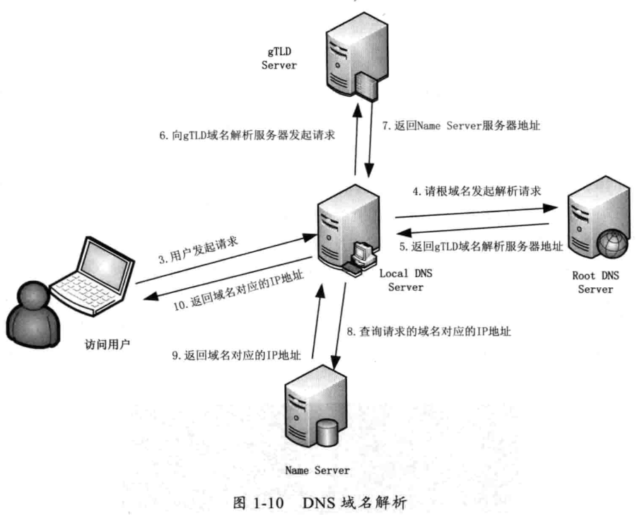
- 当用户在浏览器输入域名并按下回车键后，第1步，浏览器会检查缓存中有没有这个域名对应这个域名对应的解析过的IP地址，如果缓存中有，这个解析过程就将结束。浏览器缓存域名也是有限制的，不仅浏览器缓存大小有限制，而且缓存的时间也有限制，通常情况下为几分钟到几个小时不等，域名被缓存的时间限制可以通过TTL属性来设置。这个缓存时间太长和太短都不好，如果缓存时间太长，一旦域名被解析到的IP有变化，会导致被客户端缓存的域名无法解析到变化后的IP地址，以致该域名不能正常解析，这段时间内有可能会有一部分用户无法访问网站。如果时间设置太短，会导致用户每次访问网站都要重新解析一次域名。
- 第2步：如果用户的浏览器缓存中没有，浏览器会查找操作系统缓存中是否有这个域名对应的DNS解析结果。其实操作系统也会有一个域名解析的过程，在Windows中可以通过`C:\Windows\System32\drivers\etc\hosts` 文件来设置，你可以将任何域名解析到任何能够访问到的IP地址。如果你在这里指定了一个域名对应的IP地址，那么浏览器会首先使用这个IP地址。例如我们在测试时可以将一个域名解析到一台测试服务器上，这样不用修改任何代码就能测试到单独服务器上的代码业务逻辑是否正确。正是因为有这种本地DNS解析的规范，所以黑客就有可能通过修改你的域名解析来把特定的域名解析到它指定的IP地址上，导致这些域名被劫持。
    - 这导致在早期的Windows版本中出现过严重的问题，而且对于一般没有太多计算机知识的用户来说，出现问题后很难发现，即使发现也很难自己解决，所以Windows7中将hosts文件设置成了只读的，防止这个文件被轻易修改。
    - 在Linux中这个配置文件时`/etc/hosts`，修改这个文件可以达到同样的目的，当解析到这个配置文件中的某个域名时，操作系统会在缓存中缓存这个解析结果，缓存的时间同样是受这个域名的失效时间和缓存空间大小控制的。
    - 前面这两个步骤都是在本机完成的，所以在以上图中没有表示出来。到这里还没有涉及真正的域名解析服务器，如果在本地中仍然无法完成域名的解析，就会真正请求域名服务器来解析这个域名了。
- 第3步：如何、怎么知道域名服务器呢？在我们的网络配置中都会有"DNS服务器地址" 这一项，这个地址就用于解决前面所说的如果两个过程无法解析时要怎么办，操作系统会把这个域名提供给你本地互联网接入的一个DNS解析服务，如果你是学校接入互联网，那么你的DNS服务器肯定在你的学校，如果你是在一个小区接入互联网的，那么这个DNS就是提供给你接入互联网的应用提供商，即电信或联通，也就是常说的SPA，那么这个DNS通常也会在你所在的城市的某个角落，通常不会很远。在Windows下可以通过ipconfig查询这个地址。在Linux下可以通过`cat /etc/resolv.conf`。
    - 这个专门的域名解析服务器性能都会很好，它们一般都会缓存域名解析结果，当然缓存时间是受域名失效时间控制的，一般缓存空间不是影响域名失效的主要因素。大约80%的域名解析都到这里已经完成了，所以LDNS (Local DNS Server)主要承担了域名的解析工作。
- 第4步：如果LDNS仍然没有命中，就直接到Root Server根域名服务器请求解析。
- 第5步：根域名服务器返回给本地域名服务器一个所查询域的主域名服务器（gTLD Server ）。 gTLD Server 是国际顶级域名服务器，如.com、.cn、.org等，全球只有13台左右。
- 第6步：本地域名服务器（Local DNS Server）再向上一步返回的gTLD服务器发送请求。
- 第7步：接收请求的gTLD服务器查找并返回此域名对应的Name Server域名服务器的地址，这个Name Server通常就是你注册的域名服务器，例如你在某个域名服务提供商申请的域名，那么这个域名解析任务就由这个域名提供商的服务器来完成。
- 第8步：Name Server域名服务器会查询存储的域名和IP的映射关系，在正常情况下都根据域名得到目标IP记录，连同一个TTL值返回给DNS Server域名服务器。
- 第9步：返回域名对应的IP和TTL值，Local DNS Server会缓存这个域名和IP的对应关系，缓存的时间由TTL值控制。
- 第10步：把解析的结果返回给用户，用户根据TTL值缓存在本地系统缓存中，域名解析过程结束。

在实际的DNS 解析过程中，可能还不止这10个步骤，如Name Server也可能有很多级或者有一个GTM来负载均衡控制，这都有可能会影响域名解析的过程。

## 跟踪域名解析过程
在Linux和Windows下都可以使用`nslookup`命令来查询域名的解析结果，如下所示：
```
C:\Users\Administrator>nslookup
默认服务器:  c1-tucheng-recurse-ns1
Address:  202.106.195.68

> www.taobao.com
服务器:  c1-tucheng-recurse-ns1
Address:  202.106.195.68

DNS request timed out.
    timeout was 2 seconds.
DNS request timed out.
    timeout was 2 seconds.
非权威应答:
名称:    www.taobao.com.danuoyi.tbcache.com
Addresses:  2408:872b:500:3:3::3fa
          2408:872b:500:3:3::3f9
          61.168.100.99
          61.168.100.100
Aliases:  www.taobao.com

>
```
还可以通过dig命令来查询DNS的解析过程，如下所示：
```
C:\Users\Administrator>dig www.taobao.com

; <<>> DiG 9.16.20 <<>> www.taobao.com
;; global options: +cmd
;; Got answer:
;; ->>HEADER<<- opcode: QUERY, status: NOERROR, id: 33390
;; flags: qr rd ra; QUERY: 1, ANSWER: 3, AUTHORITY: 0, ADDITIONAL: 0

;; QUESTION SECTION:
;www.taobao.com.                        IN      A

;; ANSWER SECTION:
www.taobao.com.         528     IN      CNAME   www.taobao.com.danuoyi.tbcache.com.
www.taobao.com.danuoyi.tbcache.com. 26 IN A     61.168.100.100
www.taobao.com.danuoyi.tbcache.com. 26 IN A     61.168.100.99

;; Query time: 28 msec
;; SERVER: 202.106.195.68#53(202.106.195.68)
;; WHEN: Wed Sep 08 22:02:50 ;; MSG SIZE  rcvd: 109
```
结果的第1行输出了当前的系统版本号，第二行说明可以添加参数cmd, 如果加上cmd（`dig cmd www.taobao.com`），打印结果如下：
```
;; QUESTION SECTION:
;cmd.                           IN      A

;; AUTHORITY SECTION:
.                       3511    IN      SOA     a.root-servers.net. nstld.verisign-grs.com. 2021090800 1800 900 604800 86400

;; Query time: 6 msec
;; SERVER: 202.106.195.68#53(202.106.195.68)
;; WHEN: Wed Sep 08 22:09:24 ;; MSG SIZE  rcvd: 96

;; Got answer:
;; ->>HEADER<<- opcode: QUERY, status: NOERROR, id: 38768
;; flags: qr rd ra; QUERY: 1, ANSWER: 3, AUTHORITY: 0, ADDITIONAL: 0

;; QUESTION SECTION:
;www.taobao.com.                        IN      A

;; ANSWER SECTION:
www.taobao.com.         219     IN      CNAME   www.taobao.com.danuoyi.tbcache.com.
www.taobao.com.danuoyi.tbcache.com. 2 IN A      61.168.100.99
www.taobao.com.danuoyi.tbcache.com. 2 IN A      61.168.100.100

;; Query time: 4 msec
;; SERVER: 202.106.195.68#53(202.106.195.68)
;; WHEN: Wed Sep 08 22:09:24 ;; MSG SIZE  rcvd: 109
```
"QUESTION SECTION" 部分表示当前查询的域名是一个A记录。"ANSWER SECTION" 部分返回了这个域名由CNAME到`www.taobao.com.danuoyi.tbcache.com`，返回了这个域名对应的IP地址。

还可以通过添加`+trace`参数来跟踪这个域名的解析过程，如下所示：
```
C:\Users\Administrator>dig www.taobao.com +trace

; <<>> DiG 9.16.20 <<>> www.taobao.com +trace
;; global options: +cmd
.                       173320  IN      NS      f.root-servers.net.
.                       173320  IN      NS      m.root-servers.net.
.                       173320  IN      NS      a.root-servers.net.
.                       173320  IN      NS      j.root-servers.net.
.                       173320  IN      NS      h.root-servers.net.
.                       173320  IN      NS      k.root-servers.net.
.                       173320  IN      NS      d.root-servers.net.
.                       173320  IN      NS      g.root-servers.net.
.                       173320  IN      NS      i.root-servers.net.
.                       173320  IN      NS      c.root-servers.net.
.                       173320  IN      NS      b.root-servers.net.
.                       173320  IN      NS      l.root-servers.net.
.                       173320  IN      NS      e.root-servers.net.
;; Received 228 bytes from 202.106.195.68#53(202.106.195.68) in 6 ms

www.taobao.com.         599     IN      CNAME   www.taobao.com.danuoyi.tbcache.com.
www.taobao.com.danuoyi.tbcache.com. 59 IN A     61.168.100.99
www.taobao.com.danuoyi.tbcache.com. 59 IN A     61.168.100.100
;; Received 109 bytes from 202.12.27.33#53(m.root-servers.net) in 10 ms
```
可以详细看到整个域名时如何发起和解析的，从根域名（.）到root server的过程。主要是由于root server已经缓存了此域名和IP映射，否则一定会显示到gTLD Server(.com)再到Name Server (taobao.com)的过程。

## 清除缓存的域名
我们直到DNS域名解析后会缓存解析结果，其中主要有两个地方缓存结果，一个是Local DNS Server，另外一个是用户的本地机器。这两个缓存都是TTL值和本地缓存大小控制的，但是最大缓存时间是TTL值，基本上Local DNS Server的缓存时间就是TTL控制的，很难人工介入，但是我们的本机缓存可以通过如下方式清除。
- Windows下可以通过`ipconfig/flushdns`清除缓存；
- Linux下可以通过`/etc/init.d/nscd restart`来清除缓存；

## 几种域名解析方式
域名解析记录主要分为A记录、MX记录、CNAME记录、NS记录和TXT记录：
- **A记录**：A代表是是Address，用来指定域名对应的IP地址，例如将item.taobao.com解析到指定的115.238.23.xxx，将switch.taobao.com解析到指定的121.14.24.xxx。A记录可以将多个域名解析到一个IP地址，但是不能将一个域名解析到多个IP地址。
- **MX记录**：表示的是Mail Exchange，就是可以将某个域名下的邮件服务器指向自己的Mail Server，例如taobao.com域名的A记录IP地址是115.238.23.xxx，如果将MX记录设置为115.238.23.xxx，即xxx@taobao.com的邮件路由，DNS会将邮件发送到115.238.23.xxx对应的服务器，而正常通过web请求的话仍然解析到A记录的IP地址。
- **CNAME记录**：全称是Canonical Name (别名解析)。所谓的别名解析就是可以为一个域名设置一个或者多个别名。如将taobao.com解析到aaa.com, 也可以将bbb.com解析到aaa.com。其中aaa.com分别是taobao.com和bbb.com的别名。前面跟踪域名解析中的`www.taobao.com.         599     IN      CNAME   www.taobao.com.danuoyi.tbcache.com.` 就是CNAME解析。
- **NS记录**：为某个域名指定DNS解析服务器，也就是这个域名由指定的IP地址的DNS服务器去解析。` IN NS xxx`
- **TXT记录**：为某个主机名或域名设置说明，如可以为liuxun.net 设置TXT记录为 "liuxun的博客 | 一蓑烟雨任平生" 这样的说明。

