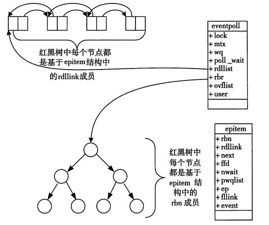
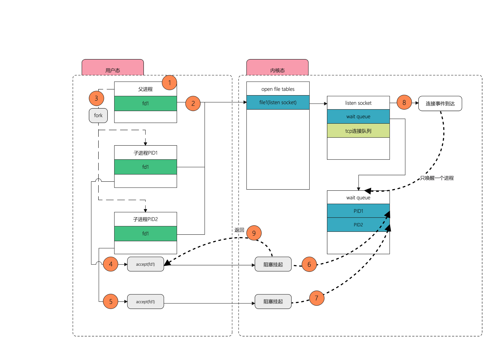
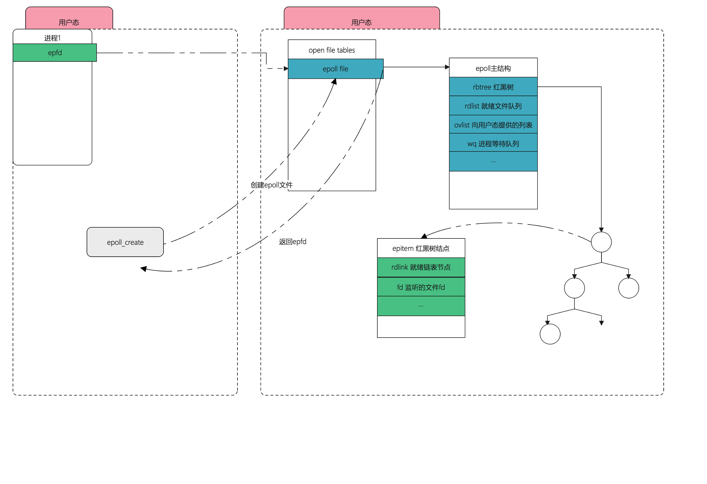

## 一、API 对比


### 1.1 select API

```
int select(int maxfdp, fd_set *readset, fd_set *writeset, fd_set *exceptset,struct timeval *timeout);
int FD_ZERO(int fd, fd_set *fdset);     // 一个 fd_set 类型变量的所有位都设为 0
int FD_CLR(int fd, fd_set *fdset);      // 清除某个位时可以使用
int FD_SET(int fd, fd_set *fd_set);     // 设置变量的某个位置位
int FD_ISSET(int fd, fd_set *fdset);    // 测试某个位是否被置位

```

select() 的机制中提供一种 **fd_set 的数据结构，实际上是一个 long 类型的数组**，每一个数组元素都能与一打开的文件句柄建立联系(这种联系需要自己完成)，当调用 select() 时，由内核根据IO 状态修改 fd_set 的内容，由此来通知执行了 select() 的进程哪一 Socket 或文件可读。

**select 机制的问题**

1.  每次调用 select，都需要把 fd_set 集合从用户态拷贝到内核态，如果 fd_set 集合很大时，那这个开销也很大
2.  同时每次调用 select 都需要在内核遍历传递进来的所有 fd_set，如果 fd_set 集合很大时，那这个开销也很大
3.  为了减少数据拷贝带来的性能损坏，内核对被监控的 fd_set 集合大小做了限制(默认为 1024)

### 1.2 poll API

```
int poll(struct pollfd *fds, nfds_t nfds, int timeout);
struct pollfd {
    int fd;         // 文件描述符
    short events;   // 感兴趣的事件
    short revents;  // 实际发生的事件
};

```

poll 的机制与 select 类似，与 select 在本质上没有多大差别，管理多个描述符也是进行轮询，根据描述符的状态进行处理，但是 poll 没有最大文件描述符数量的限制。也就是说，poll 只解决了上面的问题 3，并没有解决问题 1，2 的性能开销问题。

### 1.3 epoll API

```
// 函数创建一个 epoll 句柄，实际上是一棵红黑树
int epoll_create(int size);
// 函数注册要监听的事件类型，op 表示红黑树进行增删改
int epoll_ctl(int epfd, int op, int fd, struct epoll_event *event);
// 函数等待事件的就绪，成功时返回就绪的事件数目，调用失败时返回 -1，等待超时返回 0
int epoll_wait(int epfd, struct epoll_event * events, int maxevents, int timeout);

```

epoll 在 Linux2.6 内核正式提出，是**基于事件驱动的 I/O 方式**，相对于 select 来说，epoll 没有描述符个数限制，使用一个文件描述符管理多个描述符，将用户关心的文件描述符的事件存放到内核的一个事件表中，这样在用户空间和内核空间的copy只需一次。

----

## 二、文件描述符
I/O 多路复用技术在 I/O 编程过程中，当需要同时处理多个客户端接入请求时，可以利用多线程或者 I/O 多路复用技术进行处理。I/O 多路复用技术通过把多个 I/O 的阻塞复用到同一个 select 的阻塞上，从而使得系统在单线程的情况下可以同时处理多个客户端请求。与传统的多线程/多进程模型比，I/O 多路复用的最大优势是系统开销小，系统不需要创建新的额外进程或者线程，也不需要维护这些进程和线程的运行，降低了系统的维护工作量，节省了系统资源，I/O多路复用的主要应用场景如下：

*   服务器需要同时处理多个处于监听状态或者多个连接状态的套接字
*   服务器需要同时处理多种网络协议的套接字。

目前支持 I/O 多路复用的系统调用有 select、pselect、poll、epoll，在 Linux 网络编程过程中，很长一段时间都使用 select 做轮询和网络事件通知，然而 select 的一些固有缺陷导致了它的应用受到了很大的限制，最终 Linux 不得不在新的内核版本中寻找 select 的替代方案，最终选择了 epoll。epoll 与 select 的原理比较类似，为了克服 select 的缺点， epoll 作了很多重大改进，现总结如下。

### 2.1 支持一个进程打开的 socket 描述符(FD)不受限制(仅受限于操作系统的最大文件句柄数)

**select、poll 和 epoll 底层数据各不相同。select 使用数组；poll 采用链表，解决了 fd 数量的限制；epoll 底层使用的是红黑树，能够有效的提升效率。**

select 最大的缺陷就是单个进程所打开的 FD 是有一定限制的，它由 FD_SETSIZE 设置，默认值是 1024。对于那些需要支持上万个 TCP 连接的大型服务器来说显然太少了。可以选择修改这个宏然后重新编译内核，不过这会带来网络效率的下降。我们也可以通过选择多进程的方案(传统的 Apache 方案)解决这个问题，不过虽然在 Linux 上创建进程的代价比较小，但仍旧是不可忽视的。另外，进程间的数据交换非常麻烦，对于 Java 来说，由于没有共享内存，需要通过 Socket 通信或者其他方式进行数据同步，这带来了额外的性能损耗，増加了程序复杂度，所以也不是一种完美的解决方案。值得庆幸的是， epoll 并没有这个限制，它所支持的 FD 上限是操作系统的最大文件句柄数，这个数字远远大于 1024。例如，在 1GB 内存的机器上大约是 10 万个句柄左右，具体的值可以通过 cat proc/sys/fs/file-max 查看，通常情况下这个值跟系统的内存关系比较大。

```
# (所有进程)当前计算机所能打开的最大文件个数。受硬件影响，这个值可以改（通过limits.conf）
cat /proc/sys/fs/file-max

# (单个进程)查看一个进程可以打开的socket描述符上限。缺省为1024
ulimit -a 
# 修改为默认的最大文件个数。【注销用户，使其生效】
ulimit -n 2000

# soft软限制 hard硬限制。所谓软限制是可以用命令的方式修改该上限值，但不能大于硬限制
vi /etc/security/limits.conf
* soft nofile 3000      # 设置默认值。可直接使用命令修改
* hard nofile 20000     # 最大上限值

```

### 2.2 I/O 效率不会随着 FD 数目的増加而线性下降

传统 select/poll 的另一个致命弱点，就是当你拥有一个很大的 socket 集合时，由于网络延时或者链路空闲，任一时刻只有少部分的 socket 是“活跃”的，但是 select/poll 每次调用都会线性扫描全部的集合，导致效率呈现线性下降。 epoll 不存在这个问题，它只会对“活跃”的 socket 进行操作一一这是因为在内核实现中， epoll 是根据每个 fd 上面的 callback 函数实现的。那么，只有“活跃”的 socket オ会去主动调用 callback 函数，其他 idle 状态的 socket 则不会。在这点上， epoll 实现了一个伪 AIO。针对 epoll 和 select 性能对比的 benchmark 测试表明：如果所有的 socket 都处于活跃态 - 例如一个高速 LAN 环境， epoll 并不比 select/poll 效率高太多；相反，如果过多使用 epoll_ctl，效率相比还有稍微地降低但是一旦使用 idle connections 模拟 WAN 环境， epoll 的效率就远在 select/poll 之上了。

### 2.3 使用 mmap 加速内核与用户空间的消息传递

无论是 select、poll 还是 epoll 都需要内核把 FD 消息通知给用户空间，如何避免不必要的内存复制就显得非常重要，epoll 是通过内核和用户空间 mmap 同一块内存来实现的。

### 2.4 epoll API 更加简单

包括创建一个 epoll 描述符、添加监听事件、阻塞等待所监听的事件发生、关闭 epoll 描述符等。

值得说明的是，用来克服 select/poll 缺点的方法不只有 epoll， epoll 只是一种 Linux 的实现方案。在 freeBSD 下有 kqueue，而 dev/poll 是最古老的 Solaris 的方案，使用难度依次递增。 kqueue 是 freeBSD 宠儿，它实际上是一个功能相当丰富的 kernel 事件队列，它不仅仅是 select/poll 的升级，而且可以处理 signal、目录结构变化、进程等多种事件。 kqueue 是边缘触发的。 /dev/poll 是 Solaris 的产物，是这一系列高性能 API 中最早出现的。 Kernel 提供了一个特殊的设备文件 /dev/poll，应用程序打开这个文件得到操作 fd_set 的句柄，通过写入 polled 来修改它，一个特殊的 ioctl 调用用来替换 select。不过由于出现的年代比较早，所以 /dev/poll 的接口实现比较原始。

### 2.5 select/poll/epoll 区别

| 比较 | select | poll | epoll |
| --- | --- | --- | --- |
| 操作方式 | 遍历 | 遍历 | 回调 |
| 底层实现 | 数组 | 链表 | 红黑树 |
| IO效率 | 每次调用都进行线性遍历，时间复杂度为O(n) | 每次调用都进行线性遍历，时间复杂度为O(n) |事件通知方式，每当fd就绪，系统注册的回调函数就会被调用，将就绪fd放到readyList里面，时间复杂度O(1)|
|最大连接数 | 1024 | 无上限 | 无上限|
|fd拷贝 | 每次调用select，都需要把fd集合从用户态拷贝到内核态 | 每次调用poll，都需要把fd集合从用户态拷贝到内核态 | 调用epoll_ctl时拷贝进内核并保存，之后每次epoll_wait不拷贝|

**总结**：epoll 是 Linux 目前大规模网络并发程序开发的首选模型。在绝大多数情况下性能远超 select 和 poll。目前流行的高性能 web 服务器 Nginx 正式依赖于 epoll 提供的高效网络套接字轮询服务。但是，在并发连接不高的情况下，多线程+阻塞 I/O 方式可能性能更好。

----
## 三、epoll剖析

### 3.1 epoll 运行机制
epoll的实现机制与select/poll机制完全不同，相对于select和poll来说，epoll更加灵活，没有描述符限制。epoll**使用一个文件描述符管理多个描述符，将用户关系的文件描述符的事件存放到内核的一个事件表中**，这样在用户空间和内核空间的copy只需一次。

epoll在Linux内核中申请了一个简易的文件系统，通过三个函数**epoll_create**、**epoll_ctl**, **epoll_wait**实现调度：
```c
int epoll_create(int size)；
int epoll_ctl(int epfd, int op, int fd, struct epoll_event *event)；
int epoll_wait(int epfd, struct epoll_event * events, int maxevents, int timeout);
```

调用过程如下：
*   调用epoll_create()建立一个epoll对象(在epoll文件系统中为这个句柄对象分配资源
*   调用epoll_ctl向epoll对象中添加连接的套接字
*   调用epoll_wait收集发生的事件的连接.

当某一进程调用epoll_create方法时，Linux内核会创建一个eventpoll结构体.
```c
struct eventpoll
{
    spin_lock_t lock;            //对本数据结构的访问
    struct mutex mtx;            //防止使用时被删除
    wait_queue_head_t wq;        //sys_epoll_wait() 使用的等待队列
    wait_queue_head_t poll_wait; //file->poll()使用的等待队列
    struct list_head rdllist;    //事件满足条件的链表
    struct rb_root rbr;          //用于管理所有fd的红黑树
    struct epitem *ovflist;      //将事件到达的fd进行链接起来发送至用户空间
}
```
每一个epoll对象都有一个独立的eventpoll结构体，用于存放通过epoll_ctl方法向epoll对象中添加进来的事件。这些事件都会挂载在红黑树中，如此，重复添加的事件就可以通过红黑树而高效的识别出来(红黑树的插入时间效率是lgn，其中n为树的高度)。

而所有添加到epoll中的事件都会与设备(网卡)驱动程序建立回调关系，也就是说，当相应的事件发生时会调用这个回调方法。这个回调方法在内核中叫ep_poll_callback，它会将发生的事件添加到rdlist双链表中。

在epoll中，对于每一个事件，都会建立一个epitem结构体，如下所示:
```c
struct epitem
{
    struct rb_node rbn;            //用于主结构管理的红黑树
    struct list_head rdllink;       //事件就绪队列
    struct epitem *next;           //用于主结构体中的链表
    struct epoll_filefd ffd;         //每个fd生成的一个结构
    int nwait;
    struct list_head pwqlist;     //poll等待队列
    struct eventpoll *ep;          //该项属于哪个主结构体
    struct list_head fllink;         //链接fd对应的file链表
    struct epoll_event event;  //注册的感兴趣的事件,也就是用户空间的epoll_event
 }
```
当调用epoll_wait检查是否有事件发生时，只需要检查eventpoll对象中的rdlist双链表中是否有epitem元素即可。如果rdlist不为空，则把发生的事件复制到用户态，同时将事件数量返回给用户。

通过红黑树和双链表数据结构，并结合回调机制，造就了epoll的高效。

epoll_wait的具体工作流程：
1.  epoll_wait调用ep_poll，当rdlist为空（无就绪fd）时挂起当前进程，直到rdlist不空时进程才被唤醒。
2.  文件fd状态改变（buffer由不可读变为可读或由不可写变为可写），导致相应fd上的回调函数ep_poll_callback()被调用。
3.  ep_poll_callback将相应fd对应epitem加入rdlist，导致rdlist不空，进程被唤醒，epoll_wait得以继续执行。
4.  ep_events_transfer函数将rdlist中的epitem拷贝到txlist中，并将rdlist清空。
5.  ep_send_events函数（很关键），它扫描txlist中的每个epitem，调用其关联fd对用的poll方法。此时对poll的调用仅仅是取得fd上较新的events（防止之前events被更新），之后将取得的events和相应的fd发送到用户空间（封装在struct epoll_event，从epoll_wait返回）。

如此一来，只需要在进程启动时建立一个epoll对象，然后在需要的时候向这个epoll对象中添加或者删除连接。同时，epoll_wait的效率也非常高，因为调用epoll_wait时，并没有一股脑的向操作系统复制所有连接的句柄数据，内核也不需要去遍历全部的连接。

### 3.2 epoll高效的原因
主要原因是mmap内存映射、红黑树 、链表+callback。
- **MMAP**：内存映射，epoll是通过内核与用户空间mmap同一块内存实现的。mmap将用户空间的一块地址和内核空间的一块地址同时映射到相同的一块物理内存地址（不管是用户空间还是内核空间都是虚拟地址，最终要通过地址映射映射到物理地址），使得这块物理内存对内核和对用户均可见，减少用户态和内核态之间的数据交换。内核可以直接看到epoll监听的句柄，效率高。
- **红黑树**：红黑树将存储epoll所监听的套接字。上面mmap出来的内存如何保存epoll所监听的套接字，必然也得有一套数据结构，epoll在实现上采用红黑树去存储所有套接字，当添加或者删除一个套接字时（epoll_ctl），都在红黑树上去处理，红黑树本身插入和删除性能比较好，时间复杂度O(logN)
- **callback+链表**：发生事件时通过socket的回调触发，将事件拷贝到列表。只会返回已就绪的事件，而不是遍历所有的socketFd句柄。

----

# 五、惊群效应
每个普通被监听的socket都有一个等待队列存放被阻塞的PID进程。如果**多个子进程监听同一个socketFd**，当这个socketFd对应的socket发送了被关注的事件，可能唤醒等待队列中的所有进程从用户态被调用到内核态，但最终只有一个能获取到，其他的有会被继续阻塞。导致大量子进程被唤醒又被阻塞等待导致性能损耗非常严重的情况就是**惊群效应**。

## 不使用epoll/select的情况下多进程是如何共享端口监听的？
不使用多路复用的情况下，进程要接受tcp连接必然要调用accept并且被阻塞，直到有一条连接到达，在这之前无法做别的事情，也即是说单个进程一次只能处理一条连接，业务处理完成之后调用close关闭连接，然后继续等待accept，循环往复，这种情况下是无法实现高并发的，所以一般会使用多进程再来同时处理更多的连接，多进程一般情况下有两种模式
第一种是由一个主进程进行accept监听，接受一个连接之后再fork出一个子进程，把连接丢给子进程去进行业务处理，然后主进程继续监听，这个是最简单的模式，由于只有一个进程在使用accept进行监听，不涉及多进程争抢的问题，当tcp连接事件到达后也只会唤醒这个监听进程，自然也不存在惊群效应

第二种形式是由主进程fork出一批子进程，子进程继承了父进程的这个监听端口，大家共享，然后一起监听。这里面就涉及到当多个进程在阻塞状态中等待同一个端口事件时内核的行为，接下来重点分析一下这个场景：

可直接看以上流程图，父进程创建的监听socket fd1由fork出来的两个子进程共享，这时候子进程的两个fd在内核中是属于同一个文件，被记录在open files table这个表中，接下来第4、5步，两个子进程同时调用accept进行阻塞监听，两个进程都会被挂起来，内核会在这个socket的等待队列wait queue链表中将两个PID记录下来以便唤醒；在第8步中一个连接事件到达，内核将对应socket下的等待队列取出来，对于tcp连接事件而言，**内核对一个连接事件只会唤醒一个进程，取出wait queue链表的第一个节点，将对应的进程唤醒**，此时PID1进程的accept成功取到连接并返回用户态，PID2没有被唤醒
**其实在linux 2.6之前的版本中，accept也会全量唤醒wait queue中的所有进程，同样造成了惊群效应，在2.6中增加了互斥标志，修复了这个问题**。

## 2. epoll下共享监听端口的行为
接下来看看在使用epoll的情况下，也存在多个进程一起监听端口的情况，最经典的例如nginx，多个worker会一起监听同一个端口，而在它1.11版本之前，使用的是上述第一节讲的方式，master进程创建一个监听端口之后，通过fork的方式，让woker进程继承这个端口，然后放到epoll里面去进行监听，现在我们重点来看一下在这个场景下（epoll+accept）内核的行为是怎样的
与直接accept不同，epoll需要先调用epoll_create在内核中创建一个epoll文件，如下图：

epoll会创建一个匿名的inode节点，这个节点指向的是一个epoll主结构，这个结构中有两个核心字段，一个是红黑树，用户态需要监听的文件都会挂在这个红黑树下面，实现lgn的查找、插入、更新的复杂度；另外一个是rdlist，即文件事件的就绪队列，指向的是一个链表，事件产生的时候，epoll会把对应的epitem（即红黑树上的节点）插入到这个链表中，当向用户态返回的时候，只需要遍历这个就绪链表即可，而不需要像select那样遍历所有文件，不过本文的重点是分析epoll的阻塞及唤醒过程，epoll本身的主结构简单带过，实际上这个结构是比较复杂的。

接下来看如何把要监听的socket fd挂在epoll上，这个过程调用的是epoll_ctl，将fd向内核传递，内核实际上会做两个事情
1.  将fd挂在红黑树中
2.  调用文件设备驱动的poll回调指针（这是重点）
epoll/select等这些模型要实现多路复用，实际上主要就是依赖于：将进程挂在对应的fd的等待队列上，这样当这个fd的事情产生的时候，设备驱动就会将这个队列上的进程唤醒，如果进程不依赖epoll，毫无疑问他无法将自己同时挂在多个fd的队列上，epoll帮他干了这个事情，而干这个事情的一个核心步骤，是调用对应fd驱动设备提供的poll方法

linux中，对设备模型进行了一个规范的标准化，比如设备分为字符设备、块设备、网络设备等，对于开发者而言，要给一个设备实现一个驱动程序就必须按照linux提供的规范来实现，其中对于跟用户层交互这块，内核要求开发者实现一个叫file_operations的结构，这个结构定义了一系列操作的回调指针，比如read、write等用户熟知的操作，当用户调用read、write等方法时，最终内核会回调到这个设备的file_operations.read、file_operations.write方法，这个方法的具体逻辑需由驱动开发者实现，比如本文的accept调用，实际上最终是调用了socket下面的file_operations.accept方法

综上所述，如果一个设备要支持epoll/select的调用，他必须实现file_operations.poll方法，epoll在处理用户层传入的fd时，实际上最终是调用了这个方法，而这个方法linux同样做了一系列规范，他要求开发者实现以下逻辑：
1.  要求poll方法返回用户感兴趣的事情的标志，比如当前fd是否可读、是否可写等
2.  如果poll传入一个poll专用的等待队列结构体，那他将会调用这个结构体，这个结构体中会有一个叫poll_table的东西，里面有一个回调函数，poll方法最终会调用这个回调，这个回调是由epoll来设定的，epoll在这个方法中实现的逻辑是：将当前进程挂在这个fd的等待队列上面

简单来说，如果是进程自己调用accept，则协议栈驱动会亲自把这个进程挂在等待队列上，如果是epoll来调用，则会回调poll方法，最终epoll亲自将进程挂在这个等待队列上面，记住这个结论，这是引发accept惊群效应的最根本原因。

我们来看一下epoll是如何跟file_opreations->poll方法进行交互的，我画了一个简单的时序图：

如上图，当用户调用epoll_ctl的添加事件的时候，在第6步中，epoll会把当前进程挂在fd的等待队列下，但是默认情况下这种挂载不会设置互斥标志，意思着当设备有事情产生进行等待队列唤醒的时候，如果当前队列有多个进程在等待，则会全部唤醒
可想而知，在下面的epoll_wait调用中，如果多个进程将同一个fd添加到epoll中进行监听，当事件到达的时候，这些进程将被一起唤醒
但是唤醒并不一定会向用户态返回，因为唤醒之后epoll还要遍历一次就绪列表，确认有至少一个事件发生才会向用户态返回。

到此，我们可以想象出epoll是如何造成accept惊群的：

1.  当多个进程共享同一个监听端口并且都使用epoll进行多路复用的监听时，epoll将这些进程都挂在同一个等待队列下。
2.  当事件产生时，socket的设备驱动都会尝试将等待队列的进行唤醒，但是由于挂载队列的时候使用的是epoll的挂载方式，没有设置互斥标志（取代了accept自己挂载队列的方式，如第一节所述），所以这个队列下的所有进程将全部被唤醒。
3.  唤醒之后此时这些进程还处于内核态，他们都会立刻检查事件就绪列表，确认是否有事件发生，对accept而言，accept->poll方法将会检查在当前的socket的tcp全连接列表中是否有可用连接，如果是则返回可用事件标志。
4.  当所有进程都被唤醒，但是还没有进行去真正做accept动作的时候，所有进行的事件检查都认为accept事件可用，所以这些进行都向用户态返回。
5.  用户态检查到有accept事件可用，这时他们将会真正调用accept函数进行连接的获取。
6.  此时只会有一个进行能真正获取连接，其他进行都会返回EAGAIN错误，使用strace -p PID命令可以跟踪到这种错误。
7.  并不是所有进行都会返回用户态，关键点在于这些被唤醒的进行在检查事件的过程中，如果已经有进程成功accept到连接了，这时别的事情将不会检查到这个事情，从而他们会继续休眠，不会返回用户态。
8.  虽然不一定会返回用户态，但也造成了内核上下文切换的发生，其实也是惊群效应的表现。

## 3. 内核解决了惊群效应了吗

根本原因在于epoll的默认行为是对于多进程监听同一文件不会设置互斥，进而将所有进程唤醒，后续的内核版本主要提供了两种解决方案
1.  既然默认不会设置互斥，那就加一个互斥功能好了:-)，linux4.5内核之后给epoll添加了一个EPOLLEXCLUSIVE的标志位，如果设置了这个标志位，那epoll将进程挂到等待队列时将会设置一下互斥标志位，这时实现跟内核原生accept一样的特性，只会唤醒队列中的一个进程
2.  第二种方法：linux 3.9内核之后给socket提供SO_REUSEPORT标志，这种方式解决得更彻底，他允许不同进程的socket绑定到同一个端口，取代以往需要子进程共享socket监听的方式，这时候，每个进程的监听socket将指向open_file_tables下的不同节点，也就是说不同进程是在自己的设备等待队列下被挂起的，不存在共享fd的问题，也就不存在被同时唤醒的可能时，而内核则在驱动中将设置了SO_REUSEPORT并且绑定同一端口的这些socket分到同一个group中，当有tcp连接事件到达的时候，内核将会对源IP+源端口取hash然后指定这个group中其中一个进程来接受连接，相当于在内核级别中实现了一个负载均衡

基于以上两种方法，其实epoll生态在目前来说不存在所谓的惊群效应了，除非：你溢用epoll，比如多进程之间共享了同一个epfd（父进程创建epoll由多个子进程来调用），那就不能怪epoll了，因为这时候多个进程都被挂到这个epoll下，这种情况下，已经不是仅仅是惊群效应的问题了，比如说，A进程在epoll挂了socket1的连接事件，B进程调用了epoll_wait，由于属于同一个epfd，当socket1产生事件的时候，进程B也会被唤醒，而更严重的事情在于，在B的空间下并不存在socket1这个fd，从而把问题搞得很复杂。总结：千万不要在多线程/多进程之间共享epfd。

## 4. Nginx是如何解决惊群效应的

nginx在1.11版本以上，已经默认打开了SO_REUSEPORT选项，解决了这个问题，应用层不需要做特别的事情，而在这之前，nginx解决惊群的方式是加锁，多个进程之间共享一个文件锁，只有在抢到这个锁的时候，这个进程才会将要监听的端口放到epoll中，当epoll_wait返回之后，nginx会调用accept把连接取出来，然后释放文件锁，让别的进程去监听。这是一种折衷的办法，并没有很完美，首先进程间争抢锁会有性能开耗（即使是非阻塞的锁），中间可能会有小段时间没有进程去获取锁，比如A进程拿到锁，其他进程将会过一小段时间尝试再去获取锁，而这小段时间里面如果请求量很大，A仅接受一小部分请求就让出锁，则中间过程会有一些连接事件被hang住，总而言之，升级nginx版本吧，不要再依靠这种模式了！