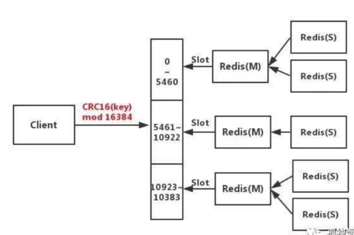
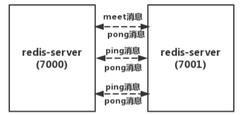
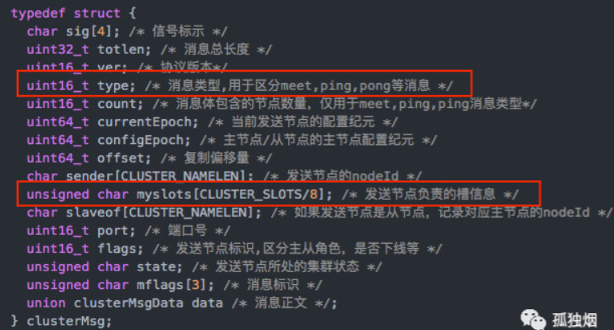
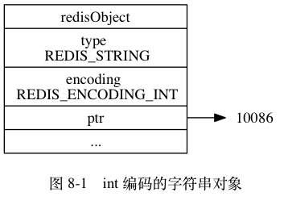
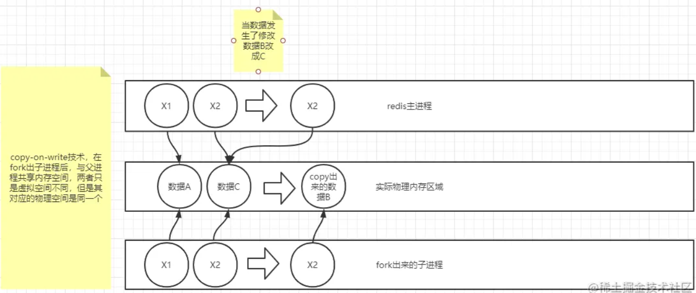
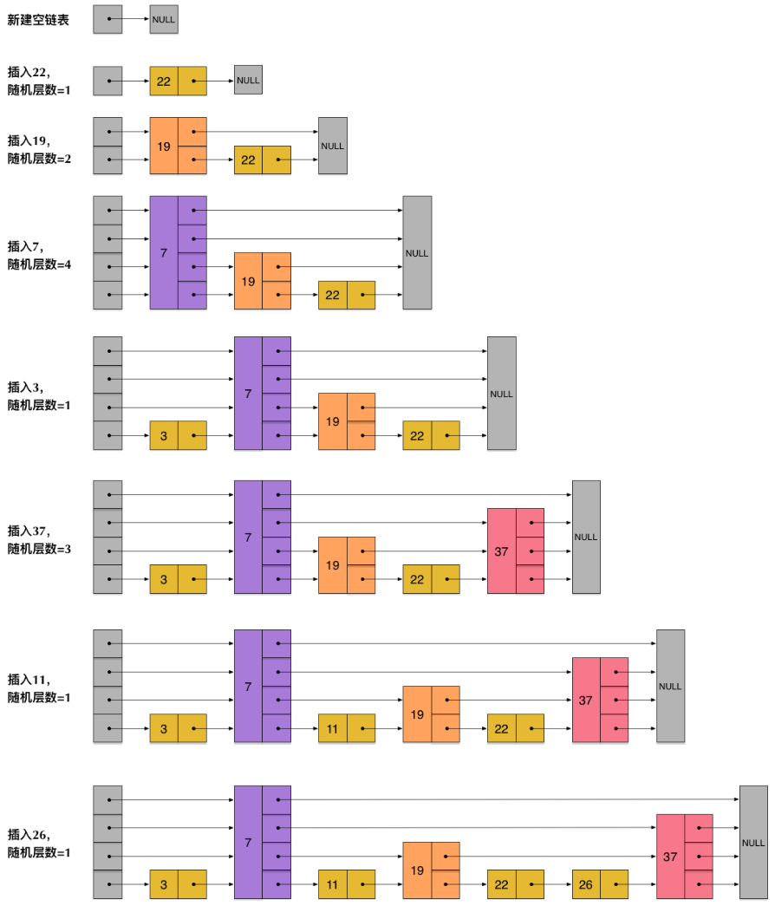
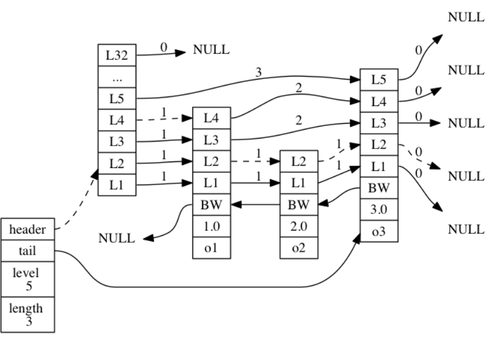
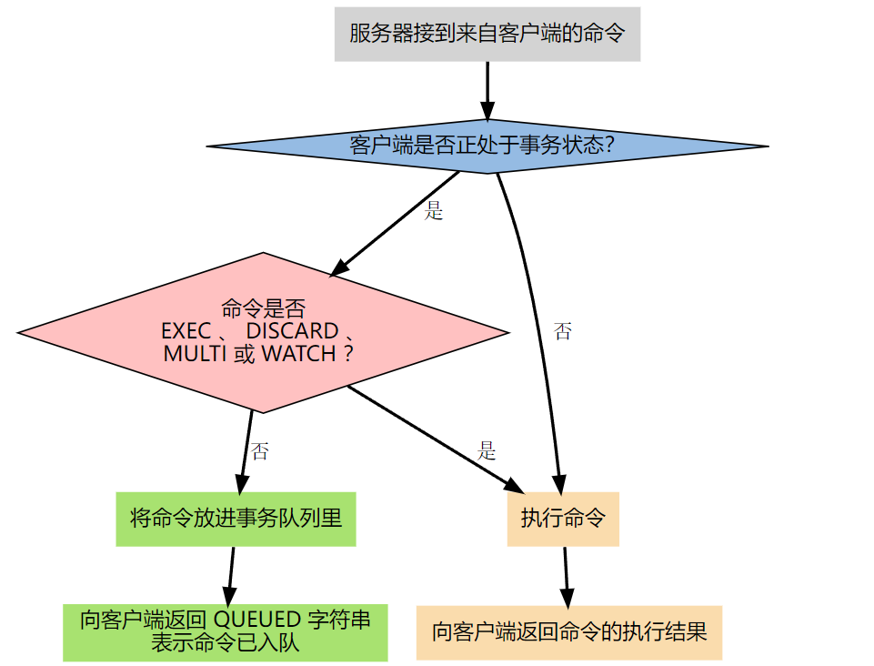
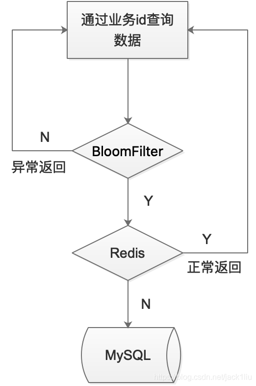
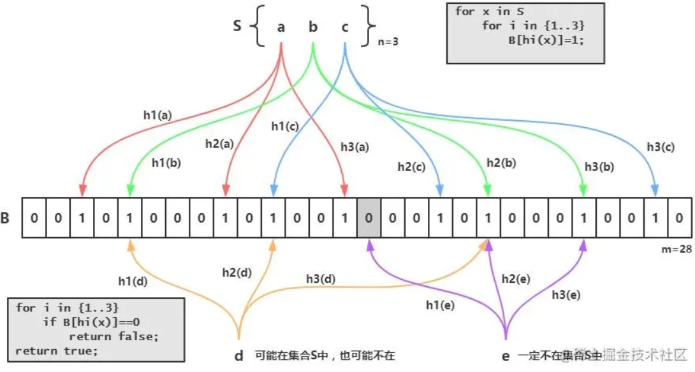

## 为什么Redis集群有16384个槽

对于客户端请求的key，根据公式`HASH_SLOT=CRC16(key) mod 16384`，计算出映射到哪个分片上，然后Redis会去相应的节点进行操作！

_那为什么有16384个槽么?_
`ps`:`CRC16`算法产生的hash值有16bit，该算法可以产生2^16-=65536个值。换句话说，值是分布在0~65535之间。那作者在做`mod`运算的时候，为什么不`mod`65536，而选择`mod`16384？

### 回顾Redis Cluster原理
让两个redis节点之间进行通信的时候，需要在客户端执行下面一个命令
```
127.0.0.1:7000>cluster meet 127.0.0.1:7001
```
如下图所示

意思很简单，让7000节点和7001节点知道彼此存在！
在握手成功后，连个节点之间会**定期**发送ping/pong消息，交换**数据信息**，如下图所示。

在这里，我们需要关注三个重点。
- (1)交换什么数据信息
- (2)数据信息究竟多大
- (3)定期的频率什么样

#### 交换数据信息内容
交换的数据信息，由消息体和消息头组成。
消息体无外乎是一些节点标识，IP，端口号，发送时间等。这与本文关系不是太大，消息头结构如下：

注意看红框的内容，type表示消息类型。
另外，**消息头里面有个myslots的char数组，长度为16383/8，这其实是一个bitmap,每一个位代表一个槽，如果该位为1，表示这个槽是属于这个节点的**。

#### 交换数据的大小
在消息头中，最占空间的是`myslots[CLUSTER_SLOTS/8]`。这块的大小是:
`16384÷8÷1024=2KB`
那在消息体中，会携带一定数量的其他节点信息用于交换。约为集群总节点数量的1/10，至少携带3个节点的信息。**节点数量越多，消息体内容越大**。消息体大小是10个节点的状态信息约1kb。

#### 定期通信频率
redis集群内节点，每秒都在发ping消息。规律如下
- (1)每秒会随机选取5个节点，找出最久没有通信的节点发送ping消息
- (2)每100毫秒(1秒10次)都会扫描本地节点列表，如果发现节点最近一次接受pong消息的时间大于cluster-node-timeout/2 则立刻发送ping消息

### 选择16384的原因
(1) **如果槽位为65536，发送心跳信息的消息头达8k，发送的心跳包过于庞大**。
如上所述，在消息头中，最占空间的是`myslots[CLUSTER_SLOTS/8]`。
当槽位为65536时，这块的大小是:`65536÷8÷1024=8kb`
因为每秒钟，redis节点需要发送一定数量的ping消息作为心跳包，如果槽位为65536，这个ping消息的消息头太大了，浪费带宽。
(2) **redis的集群主节点数量基本不可能超过1000个**。
如上所述，集群节点越多，心跳包的消息体内携带的数据越多。如果节点过1000个，也会导致网络拥堵。因此redis作者，不建议redis cluster节点数量超过1000个。那么，对于节点数在1000以内的redis cluster集群，16384个槽位够用了。没有必要拓展到65536个。
(3) **槽位越小，节点少的情况下，压缩比高**
Redis主节点的配置信息中，它所负责的哈希槽是通过一张bitmap的形式来保存的，在传输过程中，会对bitmap进行压缩，但是如果bitmap的填充率slots/N很高的话(N表示节点数)，bitmap的压缩率就很低。如果节点数很少，而哈希槽数量很多的话，bitmap的压缩率就很低。
`ps`：文件压缩率指的是，文件压缩前后的大小比。

----

## Redis 动态字符串SDS
### SDS的结构
Redis是使用C写的，而C中根本不存在string,list,hash，set和zset这些数据类型，那么C是如何将这些数据类型实现出来的呢?

字符串对象的编码可以是 `int` 、 `raw` 或者 `embstr` 。

如果一个字符串对象保存的是整数值， 并且这个整数值可以用 `long` 类型来表示， 那么字符串对象会将整数值保存在字符串对象结构的 `ptr` 属性里面（将 `void*` 转换成 `long` ）， 并将字符串对象的编码设置为 `int` 。

举个例子， 如果我们执行以下 SET 命令， 那么服务器将创建一个如图 所示的 `int` 编码的字符串对象作为 `number` 键的值：
```
redis> SET number 10086
OK
redis> OBJECT ENCODING number
"int"
```

如果字符串对象保存的是一个字符串值， 并且这个字符串值的长度大于 `39` 字节， 那么字符串对象将使用一个简单动态字符串（SDS）来保存这个字符串值， 并将对象的编码设置为 `raw` 。

举个例子， 如果我们执行以下命令， 那么服务器将创建一个如图 8-2 所示的 `raw` 编码的字符串对象作为 `story` 键的值：
```
redis> SET story "Long, long, long ago there lived a king ..."
OK
redis> STRLEN story
(integer) 43
redis> OBJECT ENCODING story
"raw"
```

如果字符串对象保存的是一个字符串值， 并且这个字符串值的长度小于等于 `39` 字节即43个字符， 那么字符串对象将使用 `embstr` 编码的方式来保存这个字符串值。

`embstr` 编码是专门用于保存短字符串的一种优化编码方式， 这种编码和 `raw` 编码一样， 都使用 `redisObject` 结构和 `sdshdr` 结构来表示字符串对象， **但 `raw` 编码会调用两次内存分配函数来分别创建 `redisObject` 结构和 `sdshdr` 结构， 而 `embstr` 编码则通过调用一次内存分配函数来分配一块连续的空间， 空间中依次包含 `redisObject` 和 `sdshdr` 两个结构**， 如图 8-3 所示

`embstr` 编码的字符串对象在执行命令时， 产生的效果和 `raw` 编码的字符串对象执行命令时产生的效果是相同的， 但使用 `embstr` 编码的字符串对象来保存短字符串值有以下好处：
1.  `embstr` 编码将创建字符串对象所需的内存分配次数从 `raw` 编码的两次降低为一次。
2.  释放 `embstr` 编码的字符串对象只需要调用一次内存释放函数， 而释放 `raw` 编码的字符串对象需要调用两次内存释放函数。
3.  因为 `embstr` 编码的字符串对象的所有数据都保存在一块连续的内存里面， 所以这种编码的字符串对象比起 `raw` 编码的字符串对象能够更好地利用缓存带来的优势。

最后要说的是， 可以用 `long double` 类型表示的浮点数在 Redis 中也是作为字符串值来保存的： 如果我们要保存一个浮点数到字符串对象里面， 那么程序会先将这个浮点数转换成字符串值， 然后再保存起转换所得的字符串值。

字符串对象保存各类型值的编码方式

| 值 | 编码 |
| --- | --- |
| 可以用 `long` 类型保存的整数。 | `int` |
| 可以用 `long double` 类型保存的浮点数。 | `embstr` 或者 `raw` |
| 字符串值， 或者因为长度太大而没办法用 `long` 类型表示的整数， 又或者因为长度太大而没办法用 `long double` 类型表示的浮点数。 | `embstr` 或者 `raw` |

### SDSHDR 与SDS扩容
sdshdr分为五种，分别是sdshdr5，sdshdr8，sdshdr16，sdshdr32，sdshdr64。大部分标识char数据的长度。
添加字符串，sdscat输入参数为sds和字符串t，首先调用sdsMakeRoomFor扩容方法，再追加新的字符串，最后添加上结尾符'\0'。我们来看下扩容方法里面是如何实现的?
- 第一步先调用常见方法中的sdsavail方法，获取还剩多少空闲空间。如果空闲空间大于要添加的字符串t的长度，则直接返回，不想要扩容。如果空闲空间不够，则想要扩容。
- 第二步判断想要扩容多大，这边有分情况，如果目前要添加的字符串小于1M，则直接扩容双倍，如果目前的字符串大于1M，则直接添加1M。
- 第三个判断添加字符串之后的数据类型还是否和原来的一致，如果一致，则没啥事。如果不一致，则想要新建一个sdshdr，把现有的数据都挪过去。

例如：现在str的字符串为hello，目前是sdshdr8，总长度50，已用6，空闲44。现在想要添加长度为50的字符t，第一步想要看下是否要扩容，50明显大于44，需要扩容。第二步扩容多少，str的长度小于1M，所以扩容双倍，新的长度为50*2=100。第三步50+50所对应sdshdr类型还是sdshdr8吗?明显还是sdshdr8，所以不要数据迁移，还在原来的基础上添加t即可。

### SDS的优势
我们可以看到是对字符数组的再封装，但是为什么呢，直接使用字符数组不是更简单吗?这要从C和Java语言的根本区别说起。
- **更快速的获取字符串长度**：我们都知道Java的字符串有提供length方法，列表有提供size方法，我们可以直接获取大小。但是C却不一样，更偏向底层实现，所以没有直接的方法使用。这样就带来一个问题，如果我们想要获取某个数组的长度，就只能从头开始遍历，当遇到第一个'\0'则表示该数组结束。这样的速度太慢了，不能每次因为要获取长度就变量数组。所以设计了SDS数据结构，在原来的字符数组外面增加总长度，和已用长度，这样每次直接获取已用长度即可。复杂度为O(1)。
- **数据安全，不会截断**：如果传统字符串保存图片，视频等二进制文件，中间可能出现'\0'，如果按照原来的逻辑，会造成数据丢失。所以可以用已用长度来表示是否字符数组已结束。

----

## AOF和RDB原理剖析
Redis作为键值对内存数据库，在一般情况下出来用户的操作数据都是存在内存中，有点常识的都知道，掉电了，内存数据就没了，所以需要有持久化机制，存你的数据，在你再成功的启动Redis服务的时候恢复你之前的数据。
Redis提供了两种持久化机制：RDB和AOF

### RDB
RDB简单理解就是快照，执行RDB的时候，就咔嚓一下把**执行那个时刻**，Redis内的所有数据全都存下来，生成一个RDB文件，在Redis服务启动时会到相应的目录中找到RDB文件，读取并恢复数据。
**在Redis的配置中，RDB是默认开启的，生成的配置文件名为dump.rdb（这些都是Redis配置文件中的默认配置）**

#### 时效性
看了RDB的描述，容易产生一个问题：持久化是要有时间的，比如有10g的数据，不可能一微秒就存下来，假设可能需要10分钟。那问题来了，这中间10分钟的数据发生了修改怎么办？

答：RDB是时效性的，只存指令执行那个时刻的数据，后面更新的不存。所以在存的过程中，就是上面那十分钟的那个数据，会丢失，这是RDB的机制，也是RDB的一个缺点。

#### 触发RDB
Redis提供了两种方式用来触发RDB，用户指令下发与配置条件触发

##### save
直接通过在Redis client输出save指令就可以执行RDB持久化 但是**save命令是阻塞的，Redis是单线程服务，一旦阻塞，其他的请求就没办法执行** 所以最好不要用这个save，至少在生产环境别用

##### bgsave
还有个**指令bgsave，这是一个不阻塞的，在后台执行RDB持久化** bgsave会创建一个子进程，子进程负责持久化，主进程继续处理服务 创建子进程的过程也是会阻塞的，但是一般很快

##### shutdown
当收到客户端的shutdown指令时，Redis会执行一个save指令。执行完成后关闭服务器。

##### 配置条件触发
```
# Redis配置文件中关于RDB条件的配置
# 默认情况下
# 900s内至少达到一条写命令
save 900 1
# 900s内至少达到一条写命令
save 300 10
# 900s内至少达到一条写命令
save 60 10000
```
配置save 900 1的大意是：当900秒内如果发生了1次写指令，就会触发RDB持久化，需要注意的是虽然此处配置文件写的是save，但是真正执行的其实是bgsave

#### 其他配置
```
# Redis配置文件中关于RDB的相关的其他配置
# 当bgsave快照操作出错时停止写数据到磁盘，这样后面写错做均会失败
stop-writes-on-bgsave-error yes
# 是否压缩rdb文件
rdbcompression yes
# rdb文件的名称
dbfilename redis-6379.rdb
# rdb文件保存目录
dir ~/redis/
```
#### 原理：fork和cow
前面说到，进行RDB的时候，由于Redis是单线程，为了保证进程能够进行在持久化的同时继续处理其他服务，Redis会创建出一个子进程，由子进程来完成持久化的任务，父进程则继续提供服务。**如果此时父进程对数据进行操作，是不会影响子进程的持久化的**

这个过程就可以理解成是fork，相当于影分身一个自己出来
那么问题来了：
- 为什么父进程的操作不会影响copy出来的子进程？难道数据也是一模一样拷贝一份吗？
- 如果是这样，要是父进程占10G内存，复制一个子进程出来不就总共20G内存了吗？

答案当然是否定的，如果是这种方式，虽然却是能做到父进程修改数据，不影响子进程，但是这样做的代价太大了，空间消耗大且时间久

所以就有了COW（copy on write）
**当子进程使用父进程已经创建好的数据时发生copy on write即先将相同的地址空间数据拷贝到另外一个地址中，然后再对此变量赋值，这样子进程可以看到父进程的数据，但是在应用程序中修改数据时确无法改变父进程的数据**

翻译下就是：数据在机器上有个实际的内存地址和空间，然后进程内部有自己的逻辑空间，指针的形式将逻辑空间与内存空间关联起来，那么fork出来之后其实复制的是指针，这样数据其实都是同一份。如果父进程中改了数据，那么会先把原地址的数据copy出来然后创建一个新的区域去存这个数据，然后子进程指针指向这个新地址，然后直接改原地址的那个数据的值，这样就做到了父子进程数据隔离了。
这样操作，既达到了数据隔离，速度还很快，占用的空间也很小。
图解：


cow的缺点：
- 在fork的时候，linux内核会把父进程用的那些内存也设置为只读的（readonly），这样子进程和父进程要是都去读取这些数据是没啥问题的。
- 但是如果有人要改数据，那就要触发内核的一个页异常中断，要让cpu知道有人要改这个数据了，然后进行cow，那如果有很多很多要修改，疯狂触发cpu中断，对整体的性能会有很大影响。
- 不过好在Redis读操作还是较多的，如果出现了很多的写，那么还是会对性能有点影响的。

### AOF
RDB的好处是：速度快，但是坏处很明显：RDB时，fork出来的子进程只会存那个时刻前的数据，RDB过程中的增量数据会丢了。
Redis还有另一种持久化方式：AOF（Append Only File）相对于RDB，AOF更侧重数据的实时性，丢的数据少
AOF是以类似日志文件的形式，不停的记录用户的操作，恢复的时候直接读取文件中的操作记录，达到数据恢复的效果，类似于MySQL的binlog

#### 开启与配置
默认情况下，Redis不开启AOF，在配置文件中可以手动开启
```
# Redis配置文件中关于AOF的启动配置
#开启AOF持久化，默认关闭
appendonly yes
复制代码
```
其他配置
```
# Redis配置文件中关于AOF的其他基础配置
#AOF文件名称（默认）
appendfilename "appendonly.AOF"

#AOF文件存放目录
dir "/data/dbs/Redis/abcd"
复制代码
```

#### 重写
对于日志形式的记录普遍都有一个问题，就是面对日益增长的读写量，日志文件的大小也会随着不断地增长。
举个例子：Redis服务开了10年，如果没有特殊的处理，AOF文件的大小会一直涨，10T、20T...即便这样存下来了数据，对于数据的恢复也是非常痛苦的，如此大的数据恢复，也需要花费很长时间。
所以需要有个机制，既要能保证AOF的优点，且能解决上面说的问题，这就是Redis的重写机制Rewrite。
对于Rewrite，Redis随着版本的迭代已经演化出了不同的形式

##### 4.0前
**之前的Redis重写是通过删除抵消与合并命令来达到重写的。**
举个例子：Redis执行了10年，假设一直都在执行incr命令
```
incr num 1
incr num 2
incr num 3
incr num 4
incr num 5
incr num 6
...
incr num 100000000000000000000000000000000000000000000000000000000000000
```

像这种情况，Redis可以直接重写为:

```
set num 100000000000000000000000000000000000000000000000000000000000000
```

**在进行AOF 重写期间，也会fork一个子进程去进行，而主进程继续接收命令。子进程根据当前的内存快照，对原AOF文件进行扫描，并把新的结果写入一个新的AOF文件（与RDB一样，保证任意时刻文件的完整性）。最后用新的AOF文件替换旧的AOF文件。**
那么问题又来了：
- 上面说了，AOF重写时也是fork出一个子进程，**根据当前内存快照进行持久化**，那不是和RDB一样了吗
- 持久化过程中的数据一样会丢失啊？

当然这个问题是有解决方法的，针对这个情况，Redis专门提供了重写缓冲区（aof_rewrite_buff）**在AOF重写期间，主进程接收到新的写命令后，不仅会添加到旧的AOF文件，还会添加到重写缓存区**。在子进程完成了重写后，会先把重写缓存区的数据添加到新的AOF中，再去替换掉旧的AOF文件。
**重写期间还将读写记到老AOF文件中的目的是如果重写过程出现问题，老的AOF文件还能用**

重写流程如图：


#### 触发AOF
和RDB一样，AOF也有触发方式
##### bgrewriteaof
和bgsave类似，在后台执行AOF操作，也会fork子进程进行操作，不阻塞主进程
##### 配置条件触发
```
# Redis配置文件中关于AOF的重写配置

# 当前AOF文件大小和最后一次重写后的大小之间的比率。如默认100代表当前AOF文件是上次重写的两倍时候才重写。
# 这里的数字是比例，超出了原大小比例的100%，也就是两倍就重写
auto-aof-rewrite-percentage 100

# 只有当AOF文件大小大于该值时候才可能重写，默认是64MB
auto-aof-rewrite-min-size 64mb
```

#### 追加策略
涉及到IO的操作，也会有一个非常普遍的问题需要考虑：什么时候我们向文件中写数据？上面已经描述了AOF的原理，Redis的读写操作会追加到AOF文件中，难道每条命令一执行马上就直接写入文件？访问量小的时候还可以，当访问量巨大时，这种方式的文件写入，存在很大的性能问题。
所以Redis的AOF实际写入流程是：**当开启AOF后，服务端每执行一次写操作就会把该条命令追加到一个单独的AOF缓冲区的末尾，然后把AOF缓冲区的内容写入AOF文件里**
这里需要注意的是此处的AOF缓冲区要和重写时的重写缓存区区分，并非一个概念。
```
#AOF持久化策略，默认为no
appendfsync no
```
**appendfsync有三个配置项**：
1. **always**：这种最极端，每执行一个事件就把AOF缓冲区的内容强制性的写入硬盘上的AOF文件里。
2. **everysec**：每隔一秒才会进行一次文件同步把内存缓冲区里的AOF缓存数据真正写入AOF文件里。
3. **no**：默认系统的缓存区写入磁盘的机制，不做程序强制，数据安全性和完整性差一些。

所以AOF即使丢失了数据，也是可以接受的范围内

#### 修复文件
既然是IO操作，数据在写入文件必然是有一个过程的，假设在写入set num 1，这条指令的过程中，出现了问题，只写入了set num，这样就会导致AOF文件中出现异常的恢复语句，AOF在恢复读取文件时会出错。
针对此情况，Redis提供了一个工具redis-check-aof用于自动检查修复AOF文件中的异常
```
# 使用很简单
redis-check-aof --fix appendonly.aof
```
同理，也可用redis-check-rdb工具来修复dump.rdb

#### 数据恢复
Redis中，AOF恢复的优先级最高，如果同时配置了RDB和AOF，会只进行AOF的恢复。
如果只配置 RDB，Redis会去配置的dir下面找文件并恢复数据。

----
## Redis跳跃表
### 回顾Redis跳表
跳跃表简单插入流程如下图：

查找如下：

之所以不严格按照跳表的二分法建立索引，是为了降低数据在增删过程中为维持索引的结构造成的复杂度开销。


### Redis跳表剖析
#### 跳表数据结构
源码如下：
```c
// 跳表节点
typedef struct zskiplistNode {
    // member 对象
    robj *obj;
    // 分值
    double score;
    // 后退指针
    struct zskiplistNode *backward;
    // 层
    struct zskiplistLevel {
        // 前进指针
        struct zskiplistNode *forward;
        // 这个层跨越的节点数量
        unsigned int span;
    } level[];
} zskiplistNode;

// 跳表的结构
typedef struct zskiplist {
    // 跳跃表头指针
    struct zskiplistNode *header, *tail;
    // 表中节点的数量
    unsigned long length;
    // 表中层数最大的节点的层数
    int level;
} zskiplist;
```
节点成员的含义如下：
- **score**：分值。Redis跳跃表是用来实现有序集合（zset）的，zset就是集合里每一个成员都有一个对应的评分，成员是按评分从低到高存储的。因此，在redis跳跃表里，节点也是按分值从低到高排列的，而不是按对象本身的大小。
- **backward**：后退指针，一个节点的后退指针会指向它的上一个节点，因为zset支持分数以从高到低的顺序返回集合元素，这个时候就会用到后退指针。
- **level**：结构类型的层级数组，结构体有两个成员，forward和span。
    - **forward**：是指节点在这一层对应的下一个节点对应的指针。
    - **span**：是指节点在这一层距离下一个节点的跨度距离。可以在查找节点过程中进行排名的累加计算。

#### 跳表的创建
源码如下：
```c
zskiplist *zslCreate(void) {
    int j;
    zskiplist *zsl;
 
    zsl = zmalloc(sizeof(*zsl));
 
    zsl->level = 1;
    zsl->length = 0;
 
    // 初始化头节点， O(1)
    zsl->header = zslCreateNode(ZSKIPLIST_MAXLEVEL,0,NULL);
    // 初始化层指针，O(1)
    for (j = 0; j < ZSKIPLIST_MAXLEVEL; j++) {
        zsl->header->level[j].forward = NULL;
        zsl->header->level[j].span = 0;
    }
    zsl->header->backward = NULL;
 
    zsl->tail = NULL;
 
    return zsl;
}
```
创建函数并不复杂，但还是说明几点。
- ZSKIPLIST_MAXLEVEL，这个是跳跃表的最大层数，源码里通过宏定义设置为了32，也就是说，节点再多，也不会超过32层。
- 初始化头节点，这里我们先看看初始化了头节点之后的初始跳跃表是什么样的：

也就是说，因为节点最多有32层，所以这里先把32层链表对应的头节点建立好。

#### 跳表的插入
源码如下：
```c
zskiplistNode *zslInsert(zskiplist *zsl, double score, robj *obj) {
 
    // 记录寻找元素过程中，每层能到达的最右节点
    zskiplistNode *update[ZSKIPLIST_MAXLEVEL], *x;
 
    // 记录寻找元素过程中，每层所跨越的节点数
    unsigned int rank[ZSKIPLIST_MAXLEVEL];
 
    int i, level;
 
    redisAssert(!isnan(score));
    x = zsl->header;
    // 记录沿途访问的节点，并计数 span 等属性
    // 平均 O(log N) ，最坏 O(N)
    for (i = zsl->level-1; i >= 0; i--) {
        /* store rank that is crossed to reach the insert position */
        rank[i] = i == (zsl->level-1) ? 0 : rank[i+1];
 
        // 右节点不为空
        while (x->level[i].forward &&                   
            // 右节点的 score 比给定 score 小
            (x->level[i].forward->score < score ||      
                // 右节点的 score 相同，但节点的 member 比输入 member 要小
                (x->level[i].forward->score == score && 
                compareStringObjects(x->level[i].forward->obj,obj) < 0))) {
            // 记录跨越了多少个元素
            rank[i] += x->level[i].span;
            // 继续向右前进
            x = x->level[i].forward;
        }
        // 保存访问节点
        update[i] = x;
    }
 
    /* we assume the key is not already inside, since we allow duplicated
     * scores, and the re-insertion of score and redis object should never
     * happpen since the caller of zslInsert() should test in the hash table
     * if the element is already inside or not. */
    // 因为这个函数不可能处理两个元素的 member 和 score 都相同的情况，
    // 所以直接创建新节点，不用检查存在性
 
    // 计算新的随机层数
    level = zslRandomLevel();
    // 如果 level 比当前 skiplist 的最大层数还要大
    // 那么更新 zsl->level 参数
    // 并且初始化 update 和 rank 参数在相应的层的数据
    if (level > zsl->level) {
        for (i = zsl->level; i < level; i++) {
            rank[i] = 0;
            update[i] = zsl->header;
            update[i]->level[i].span = zsl->length;
        }
        zsl->level = level;
    }
 
    // 创建新节点
    x = zslCreateNode(level,score,obj);
    // 根据 update 和 rank 两个数组的资料，初始化新节点
    // 并设置相应的指针
    // O(N)
    for (i = 0; i < level; i++) {
        // 设置指针
        x->level[i].forward = update[i]->level[i].forward;
        update[i]->level[i].forward = x;
 
        /* update span covered by update[i] as x is inserted here */
        // 设置 span
        x->level[i].span = update[i]->level[i].span - (rank[0] - rank[i]);
        update[i]->level[i].span = (rank[0] - rank[i]) + 1;
    }
 
    /* increment span for untouched levels */
    // 更新沿途访问节点的 span 值
    for (i = level; i < zsl->level; i++) {
        update[i]->level[i].span++;
    }
 
    // 设置后退指针
    x->backward = (update[0] == zsl->header) ? NULL : update[0];
    // 设置 x 的前进指针
    if (x->level[0].forward)
        x->level[0].forward->backward = x;
    else
        // 这个是新的表尾节点
        zsl->tail = x;
 
    // 更新跳跃表节点数量
    zsl->length++;
 
    return x;
}
```
插入步骤如下：
1. 声明update数组和rank数组。保存每层最右满足条件的节点和对应的排名。
2. 遍历,记录update和rank。
3. 生成随机层数。
4. 生成层级数过大。
5. 新建并插入节点。
6. 更新未涉及到的层。
7. 设置插入节点的后继指针。
8. 更新跳表的长度。

##### 1. 声明update和rank数组
- **update数组**用来记录新节点在**每一层的上一个节点，也就是新节点要插到哪个节点后面**；
- **rank数组**用来记录update节点的排名，也就是在这一层，update节点到头节点的距离，是为了**用来计算span**。
- ZSKIPLIST_MAXLEVEL ： 长度为层级的最大限制，32。最大不会超过32层。

##### 2. 遍历,记录update和rank
- 逐层由上而下遍历，for循环从头结点目前的最高层向下进行遍历。
- 层内由左向右进行遍历。遍历前rank[i]初始值为上一层的最右节点的排名。如果层内当前节点的后续指针(forword)不为空且满足后续节点的score小于插入节点的score或者score相等但后续节点的值小于插入节点的值，则将rank[i]加上当前节点的span跨度。一直向右循环。直到不满足条件。则跳出层内while循环。
- 层内得到最右节点赋值给update[i]。即为当前层内对应插入节点的上一个节点。

##### 3. 生成随机层数
redis的跳跃表在插入节点时，会随机生成节点的层数，通过控制每一层的概率，控制每一层的节点个数，也就是保证第一层的节点个数，之后逐层增加，下面给出随机层数的生成代码：
```c
int zslRandomLevel(void) {
    int level = 1;
    while ((random()&0xFFFF) < (ZSKIPLIST_P * 0xFFFF))
        level += 1;
    return (level<ZSKIPLIST_MAXLEVEL) ? level : ZSKIPLIST_MAXLEVEL;
}
```
这里面有一个宏定义ZSKIPLIST_P ，在源码中定义为了0.25，所以，上面这段代码，生成n+1层的概率是生成n的概率的1/4。即P(n+1)=P(n) /4。层级越高，概率越小。所以越高层级关联的节点越少。最大层级为32。

##### 4. 生成的层级数过大
所以如果生成了一个比当前最大层数大的数，那么多出来的那些层也需要插入新的节点，而上面的那次遍历是从当前跳跃表最大层数开始的，也就是多出来这些层的update节点和rank还没有获取，因此需要通过下面这段程序，给多出来的这些层写入对应的rank和update节点。这部分很简单，因为这些层还没有节点，所以这些层的update节点只能是头节点，rank也都是0（头节点到头节点），而span则是节点个数（本身该层的头节点此时还没有forward节点，也不该有span，但插入节点后新节点需要用这个span计算新节点的span，因此这里需要把span设置为当前跳跃表中的节点个数）。
```c
if (level > zsl->level) {
    for (i = zsl->level; i < level; i++) {
        rank[i] = 0;
        update[i] = zsl->header;
        update[i]->level[i].span = zsl->length;
    }
    zsl->level = level;
}
```

##### 5. 插入新节点
```c
x = zslCreateNode(level,score,obj);
for (i = 0; i < level; i++) {
    // 设置指针
    x->level[i].forward = update[i]->level[i].forward;
    update[i]->level[i].forward = x;

    /* update span covered by update[i] as x is inserted here */
    // 设置 span
    x->level[i].span = update[i]->level[i].span - (rank[0] - rank[i]);
    update[i]->level[i].span = (rank[0] - rank[i]) + 1;
}
```
 前面已经找到插入位置（update数组）了，接下来的插入其实就是单链表插入。相当于由低到高直至插入节点的层数逐层链表插入。
 对于span的更新如下：
当前层级插入节点的span= 当前层前一节点的span - 当前层前一节点到底层前一个节点的距离。= update[i]->level[i].span - (rank[0] - rank[i]);

##### 6.更新未涉及到的层
如果随机生成的层数小于之前跳跃表中的层数，那么大于随机生成的层数的那些层在创建新节点的过程中就没有被操作到（创建新节点的时候是从0遍历到随机生成的层数），对于这些没有操作到的层，里面的update节点对应的span应当+1（因为后面插入了一个节点）。
```c
for (i = level; i < zsl->level; i++) {
    update[i]->level[i].span++;
}
```

##### 7.设置后继指针
针对每一层的调整到这里已经全部完成了，也就是level数组已经搞定，接下来，处理一下backward指针，首先新节点的backward要指向前一个节点，然后，新节点的下一个节点要将backward指向新节点。
```c
x->backward = (update[0] == zsl->header) ? NULL : update[0];
// 设置 x 的前进指针
if (x->level[0].forward)
    x->level[0].forward->backward = x;
else
    // 这个是新的表尾节点
    zsl->tail = x;
```

##### 8.更新跳表长度
最后，全部搞定，把跳跃表个数加一就大功告成了！
```c
zsl->length++;
```

----

## RedLock
### RedLock算法介绍
一个Client想要获得一个锁需要以下几个操作：
1.  得到本地时间
2.  Client使用相同的key和随机数,按照顺序在每个Master实例中尝试获得锁。在获得锁的过程中，为每一个锁操作设置一个**快速失败时间**(如果想要获得一个10秒的锁， 那么每一个锁操作的失败时间设为5-50ms)。这样可以避免客户端与一个已经故障的Master通信占用太长时间，通过快速失败的方式尽快的与集群中的其他节点完成锁操作。
3.  客户端计算出与master获得锁操作过程中消耗的时间，当且仅当Client获得锁消耗的时间小于锁的存活时间，并且在一半以上的master节点中获得锁。才认为client成功的获得了锁。
4.  如果已经获得了锁，Client执行任务的时间窗口是锁的存活时间减去获得锁消耗的时间。
5.  如果Client获得锁的数量不足一半以上，或获得锁的时间超时，那么认为获得锁失败。客户端需要尝试在所有的master节点中释放锁， 即使在第二步中没有成功获得该Master节点中的锁，仍要进行释放操作。

### RedLock能保证锁同步吗？
这个算法成立的一个条件是：即使集群中没有同步时钟，各个进程的时间流逝速度也要大体一致，并且误差与锁存活时间相比是比较小的。实际应用中的计算机也能满足这个条件：各个计算机中间有几毫秒的时钟漂移(clock drift)。

### 锁续约
- 如果Client进行的工作耗时较短，那么可以默认使用一个较小的锁有效期，然后实现一个锁续约机制。
- 当一个Client在工作计算到一半时发现锁的剩余有效期不足。可以向Redis实例发送续约锁的Lua脚本。如果Client在一定的期限内(耗间与申请锁的耗时接近)成功的续约了半数以上的实例，那么续约锁成功。
- 为了提高系统的可用性，每个Client申请锁续约的次数需要有一个最大限制，避免其不断续约造成该key长时间不可用。

----
## Redis多条件排序
假设我们需要一个三个维度的排序，第一维度是具体的数值，第二个维度是一个是否标志位，第三个维度是时间戳。其中氪金的（0否1是）和时间早的排序靠前。
以下是原始数据：
```
玩家  成就  是否氪金  时间戳
A    100  1        1571819021259
B    200  0        1571819021259
C    200  1        1571819021259
D    400  0        1571819021259
E    200  1        1571810001259
```

### 利用 key 排序
如果后两个维度初始化后就不再变化的话，可以利用 Redis 的排序特性，将不变的维度写到 key 里，这样 score 相同时会用 key 来进行排序。
```
# 这里反转时间戳(9999999999999 - 1571810001259)，让时间早的排在前面
>zadd r 100 A-1-8428180978740
"1"
>zadd r 200 B-0-8428180978740
"1"
>zadd r 200 C-1-8428180978740
"1"
>zadd r 400 D-0-8428180978740
"1"
>zadd r 200 E-1-8428189998740
"1"
>zrange r 0 -1 withscores
 1)  "A-1-8428180978740"
 2)  "100"
 3)  "B-0-8428180978740"
 4)  "200"
 5)  "C-1-8428180978740"
 6)  "200"
 7)  "E-1-8428189998740"
 8)  "200"
 9)  "D-0-8428180978740"
 10)  "400"

```
## Redis事务
一个事务从开始到执行会经历以下三个阶段：
1.  开始事务。
2.  命令入队。
3.  执行事务。

### 开始事务
MULTI命令的执行标记着事务的开始：
```
redis> MULTI
OK
```
这个命令唯一做的就是， 将客户端的 `REDIS_MULTI` 选项打开， 让客户端从非事务状态切换到事务状态。


### 命令入队
当客户端处于非事务状态下时， 所有发送给服务器端的命令都会立即被服务器执行：
```
redis> SET msg "hello moto"
OK

redis> GET msg
"hello moto"
```
但是， 当客户端进入事务状态之后， 服务器在收到来自客户端的命令时， 不会立即执行命令， 而是将这些命令全部放进一个事务队列里， 然后返回 `QUEUED` ， 表示命令已入队：
```
redis> MULTI
OK

redis> SET msg "hello moto"
QUEUED

redis> GET msg
QUEUED
```
以下流程图展示了这一行为：

事务队列是一个数组， 每个数组项是都包含三个属性：
1.  要执行的命令（cmd）。
2.  命令的参数（argv）。
3.  参数的个数（argc）。

举个例子， 如果客户端执行以下命令：
```
redis> MULTI
OK

redis> SET book-name "Mastering C++ in 21 days"
QUEUED

redis> GET book-name
QUEUED

redis> SADD tag "C++" "Programming" "Mastering Series"
QUEUED

redis> SMEMBERS tag
QUEUED
```
那么程序将为客户端创建以下事务队列：

| 数组索引 | cmd | argv | argc |
| --- | --- | --- | --- |
| `0` | `SET` | `["book-name", "Mastering C++ in 21 days"]` | `2` |
| `1` | `GET` | `["book-name"]` | `1` |
| `2` | `SADD` | `["tag", "C++", "Programming", "Mastering Series"]` | `4` |
| `3` | `SMEMBERS` | `["tag"]` | `1` |

### 执行事务
前面说到， 当客户端进入事务状态之后， 客户端发送的命令就会被放进事务队列里。
但其实并不是所有的命令都会被放进事务队列， 其中的例外就是 EXEC 、 DISCARD 、 MULTI 和 WATCH 这四个命令 —— 当这四个命令从客户端发送到服务器时， 它们会像客户端处于非事务状态一样， 直接被服务器执行：

如果客户端正处于事务状态， 那么当 EXEC 命令执行时， 服务器根据客户端所保存的事务队列， 以先进先出（FIFO）的方式执行事务队列中的命令： 最先入队的命令最先执行， 而最后入队的命令最后执行。

比如说，对于以下事务队列：

| 数组索引 | cmd | argv | argc |
| --- | --- | --- | --- |
| `0` | `SET` | `["book-name", "Mastering C++ in 21 days"]` | `2` |
| `1` | `GET` | `["book-name"]` | `1` |
| `2` | `SADD` | `["tag", "C++", "Programming", "Mastering Series"]` | `4` |
| `3` | `SMEMBERS` | `["tag"]` | `1` |

程序会首先执行 SET 命令， 然后执行 GET 命令， 再然后执行 SADD 命令， 最后执行 SMEMBERS 命令。
执行事务中的命令所得的结果会以 FIFO 的顺序保存到一个回复队列中。
比如说，对于上面给出的事务队列，程序将为队列中的命令创建如下回复队列：

| 数组索引 | 回复类型 | 回复内容 |
| --- | --- | --- |
| `0` | status code reply | `OK` |
| `1` | bulk reply | `"Mastering C++ in 21 days"` |
| `2` | integer reply | `3` |
| `3` | multi-bulk reply | `["Mastering Series", "C++", "Programming"]` |

当事务队列里的所有命令被执行完之后， EXEC 命令会将回复队列作为自己的执行结果返回给客户端， 客户端从事务状态返回到非事务状态， 至此， 事务执行完毕。
伪代码如下：
```
def execute_transaction():
    # 创建空白的回复队列
    reply_queue = []
    # 取出事务队列里的所有命令、参数和参数数量
    for cmd, argv, argc in client.transaction_queue:
        # 执行命令，并取得命令的返回值
        reply = execute_redis_command(cmd, argv, argc)
        # 将返回值追加到回复队列末尾
        reply_queue.append(reply)
    # 清除客户端的事务状态
    clear_transaction_state(client)
    # 清空事务队列
    clear_transaction_queue(client)
    # 将事务的执行结果返回给客户端
    send_reply_to_client(client, reply_queue)
```
### 事务和非事务执行
无论在事务状态下， 还是在非事务状态下， Redis 命令都由同一个函数执行， 所以它们共享很多服务器的一般设置， 比如 AOF 的配置、RDB 的配置，以及内存限制，等等。
不过事务中的命令和普通命令在执行上还是有一点区别的，其中最重要的两点是：
1.  非事务状态下的命令以单个命令为单位执行，前一个命令和后一个命令的客户端不一定是同一个；而事务状态则是以一个事务为单位，执行事务队列中的所有命令：除非当前事务执行完毕，否则服务器不会中断事务，也不会执行其他客户端的其他命令。
2.  在非事务状态下，执行命令所得的结果会立即被返回给客户端；而事务则是将所有命令的结果集合到回复队列，再作为EXEC 命令的结果返回给客户端。

### 事务状态下的 DISCARD 、 MULTI 和 WATCH 命令
除了 EXEC 之外， 服务器在客户端处于事务状态时， 不加入到事务队列而直接执行的另外三个命令是 DISCARD 、 MULTI 和 WATCH 。

- DISCARD 命令用于取消一个事务， 它清空客户端的整个事务队列， 然后将客户端从事务状态调整回非事务状态， 最后返回字符串 OK 给客户端， 说明事务已被取消。
- Redis 的事务是不可嵌套的， 当客户端已经处于事务状态， 而客户端又再向服务器发送 MULTI 时， 服务器只是简单地向客户端发送一个错误， 然后继续等待其他命令的入队。 MULTI 命令的发送不会造成整个事务失败， 也不会修改事务队列中已有的数据。
- WATCH 只能在客户端进入事务状态之前执行， 在事务状态下发送 WATCH 命令会引发一个错误， 但它不会造成整个事务失败， 也不会修改事务队列中已有的数据（和前面处理 MULTI 的情况一样）。
- 带 WATCH 的事务，WATCH 命令用于在事务开始之前监视任意数量的键： 当调用 EXEC 命令执行事务时， 如果任意一个被监视的键已经被其他客户端修改了， 那么整个事务不再执行， 直接返回失败。

### 带watch的事务
以下示例展示了一个执行失败的事务例子：
```
redis> WATCH name
OK
redis> MULTI
OK
redis> SET name peter
QUEUED
redis> EXEC
(nil)
```
以下执行序列展示了上面的例子是如何失败的：

| 时间 | 客户端 A | 客户端 B |
| --- | --- | --- |
| T1 | `WATCH name` ||
| T2 | `MULTI` ||
| T3 | `SET name peter` ||
| T4 | |`SET name john` |
| T5 | `EXEC` ||

在时间 T4 ，客户端 B 修改了 name 键的值， 当客户端 A 在 T5 执行 EXEC 时，Redis 会发现 name 这个被监视的键已经被修改， 因此客户端 A 的事务不会被执行，而是直接返回失败。

### watch命令的实现
在每个代表数据库的 `redis.h/redisDb` 结构类型中， 都保存了一个 `watched_keys` 字典， 字典的键是这个数据库被监视的键， 而字典的值则是一个链表， 链表中保存了所有监视这个键的客户端。

比如说，以下字典就展示了一个 `watched_keys` 字典的例子：

其中， 键 `key1` 正在被 `client2` 、 `client5` 和 `client1` 三个客户端监视， 其他一些键也分别被其他别的客户端监视着。
watch命令的作用， 就是将当前客户端和要监视的键在 `watched_keys` 中进行关联。举个例子， 如果当前客户端为 `client10086` ， 那么当客户端执行 `WATCH key1 key2` 时， 前面展示的 `watched_keys` 将被修改成这个样子：

通过 `watched_keys` 字典， 如果程序想检查某个键是否被监视， 那么它只要检查字典中是否存在这个键即可； 如果程序要获取监视某个键的所有客户端， 那么只要取出键的值（一个链表）， 然后对链表进行遍历即可。

### watch的触发
在任何对数据库键空间（key space）进行修改的命令成功执行之后（比如 FLUSHDB 、 SET 、 DEL 、 LPUSH 、 SADD 、 ZREM ，诸如此类）， `multi.c/touchWatchedKey` 函数都会被调用 —— 它检查数据库的 `watched_keys` 字典， 看是否有客户端在监视已经被命令修改的键， 如果有的话， 程序将所有监视这个/这些被修改键的客户端的 `REDIS_DIRTY_CAS` 选项打开：

当客户端发送EXEC命令、触发事务执行时， 服务器会对客户端的状态进行检查：
- 如果客户端的 `REDIS_DIRTY_CAS` 选项已经被打开，那么说明被客户端监视的键至少有一个已经被修改了，事务的安全性已经被破坏。服务器会放弃执行这个事务，直接向客户端返回空回复，表示事务执行失败。
- 如果 `REDIS_DIRTY_CAS` 选项没有被打开，那么说明所有监视键都安全，服务器正式执行事务。
可以用一段伪代码来表示这个检查：
```
def check_safety_before_execute_trasaction():
    if client.state & REDIS_DIRTY_CAS:
        # 安全性已破坏，清除事务状态
        clear_transaction_state(client)
        # 清空事务队列
        clear_transaction_queue(client)
        # 返回空回复给客户端
        send_empty_reply(client)
    else:
        # 安全性完好，执行事务
        execute_transaction()
```
举个例子，假设数据库的 `watched_keys` 字典如下图所示：


如果某个客户端对 `key1` 进行了修改（比如执行 `DEL key1` ）， 那么所有监视 `key1` 的客户端， 包括 `client2` 、 `client5` 和 `client1` 的 `REDIS_DIRTY_CAS` 选项都会被打开， 当客户端 `client2` 、`client5` 和 `client1` 执行 EXEC的时候， 它们的事务都会以失败告终。
最后，当一个客户端结束它的事务时，无论事务是成功执行，还是失败， `watched_keys` 字典中和这个客户端相关的资料都会被清除。

Redis 事务保证了其中的一致性（C）和隔离性（I），但并不保证原子性（A）和持久性（D）。

----

## Redis几个重要健康指标

### 1.存活情况
所有指标中最重要的当然是检查redis是否还活着，可以通过命令PING的响应是否是PONG来判断。

### 2. 连接数
- **连接的客户端数量**，可通过命令`src/redis-cli info Clients | grep connected_clients`得到，这个值跟使用redis的服务的连接池配置关系比较大，所以在监控这个字段的值时需要注意。另外这个值也不能太大，建议不要超过5000，如果太大可能是redis处理太慢，那么需要排除问题找出原因。
- **拒绝连接数**（rejected_connections）也需要关注，这个值理想状态是0。如果大于0，说明创建的连接数超过了maxclients，需要排查原因。是redis连接池配置不合理还是连接这个redis实例的服务过多等。
- **阻塞客户端数量**, blocked_clients，一般是执行了list数据类型的BLPOP或者BRPOP命令引起的，可通过命令src/redis-cli info Clients | grep blocked_clients得到，很明显，这个值最好应该为0。

### 3. 缓存命中率
keyspace_misses/keyspace_hits这两个指标用来统计缓存的命令率，keyspace_misses指未命中次数，keyspace_hits表示命中次数。keyspace_hits/(keyspace_hits+keyspace_misses)就是缓存命中率。视情况而定，建议0.9以上，即缓存命中率要超过90%。如果缓存命中率过低，那么要排查对缓存的用法是否有问题！

### 4. OPS
instantaneous_ops_per_sec这个指标表示缓存的OPS（每秒操作次数），如果业务比较平稳，那么这个值也不会波动很大，不过国内的业务比较特性，如果不是全球化的产品，夜间是基本上没有什么访问量的，所以这个字段的监控要结合自己的具体业务，不同时间段波动范围可能有所不同。

### 5. 内存碎片率
mem_fragmentation_ratio=used_memory_rss/used_memory，这也是一个非常需要关心的指标。如果是redis4.0之前的版本，这个问题除了重启也没什么很好的优化办法。而redis4.0有一个主要特性就是优化内存碎片率问题（Memory de-fragmentation）。在redis.conf配置文件中有介绍即ACTIVE DEFRAGMENTATION：碎片整理允许Redis压缩内存空间，从而回收内存。这个特性默认是关闭的，可以通过命令`CONFIG SET activedefrag yes`热启动这个特性。
1.  当这个值大于1时，表示分配的内存超过实际使用的内存，数值越大，碎片率越严重。
2.  当这个值小于1时，表示发生了swap，即可用内存不够。

另外需要注意的是，当内存使用量（used_memory）很小的时候，这个值参考价值不大。所以，建议used_memory至少1G以上才考虑对内存碎片率进行监控。

### 6.持久化
- rdb_last_bgsave_status/aof_last_bgrewrite_status，即最近一次或者说最后一次RDB/AOF持久化是否有问题，这两个值都应该是"ok"。
- 另外，由于redis持久化时会fork子进程，且fork是一个完全阻塞的过程，所以可以监控fork耗时即latest_fork_usec，单位是微妙，如果这个值比较大会影响业务，甚至出现timeout。

### 7.慢日志
通过命令`slowlog get`得到Redis执行的slowlog集合，理想情况下，slowlog集合应该为空，即没有任何慢日志，不过，有时候由于网络波动等原因造成`set key value`这种命令执行也需要几毫秒，在监控的时候我们需要注意，而不能看到slowlog就想着去优化，简单的set/get可能也会出现在slowlog中。

----

## Redis缓存命中率
通常来讲，缓存的命中率越高则表示使用缓存的收益越高，应用的性能越好（响应时间越短、吞吐量越高），抗并发的能力越强。由此可见，在高并发的互联网系统中，缓存的命中率是至关重要的指标。

### 如何监控缓存命中率
redis提供了INFO这个命令，能够随时监控服务器的状态，只用telnet到对应服务器的端口，执行命令info即可：
```
telnet localhost 6379
info
```
在输出的信息里面有这几项和缓存的状态比较有关系：
```
keyspace_hits:14414110
keyspace_misses:3228654
used_memory:433264648
expired_keys:1333536
evicted_keys:1547380
```
通过计算hits和miss，我们可以得到缓存的命中率：14414110 / (14414110 + 3228654) = 81% ，一个缓存失效机制，和过期时间设计良好的系统，命中率可以做到95%以上
有个ruby gem叫redis-stat，它利用INFO命令展现出更直观的信息报表，推荐：[https://github.com/junegunn/redis-stat](https://github.com/junegunn/redis-stat)
同时，zabbix也提供了相关的插件对redis服务进行监控。

### 影响缓存命中率的几个因素
下面分析下影响缓存命中率的几个因素。

#### 1.业务场景和业务需求
- 缓存适合“读多写少”的业务场景，反之，使用缓存的意义其实并不大，命中率会很低。
- 业务需求决定了对时效性的要求，直接影响到缓存的过期时间和更新策略。时效性要求越低，就越适合缓存。在相同key和相同请求数的情况下，**缓存时间越长，命中率会越高**。
- 互联网应用的大多数业务场景下都是很适合使用缓存的。

#### 2.缓存的设计（粒度和策略）
- 通常情况下，**缓存的粒度越小，命中率会越高**。举个实际的例子说明：
- 当缓存单个对象的时候（例如：单个用户信息），只有当该对象对应的数据发生变化时，我们才需要更新缓存或者让移除缓存。而当缓存一个集合的时候（例如：所有用户数据），其中任何一个对象对应的数据发生变化时，都需要更新或移除缓存。
- 还有另一种情况，假设其他地方也需要获取该对象对应的数据时（比如其他地方也需要获取单个用户信息），如果缓存的是单个对象，则可以直接命中缓存，反之，则无法直接命中。这样更加灵活，缓存命中率会更高。
- 此外，缓存的更新/过期策略也直接影响到缓存的命中率。当数据发生变化时，直接更新缓存的值会比移除缓存（或者让缓存过期）的命中率更高，当然，系统复杂度也会更高。

#### 3.缓存容量和基础设施
缓存的容量有限，则容易引起缓存失效和被淘汰（目前多数的缓存框架或中间件都采用了LRU算法）。同时，缓存的技术选型也是至关重要的，比如采用应用内置的本地缓存就比较容易出现单机瓶颈，而采用**分布式缓存则毕竟容易扩展**。所以需要做好系统容量规划，并考虑是否可扩展。此外，不同的缓存框架或中间件，其效率和稳定性也是存在差异的。

#### 4.其他因素
- 当缓存节点发生故障时，需要避免缓存失效并最大程度降低影响，这种特殊情况也是架构师需要考虑的。业内比较典型的做法就是通过一致性Hash算法，或者通过节点冗余的方式。
- 有些朋友可能会有这样的理解误区：既然业务需求对数据时效性要求很高，而缓存时间又会影响到缓存命中率，那么系统就别使用缓存了。其实这忽略了一个重要因素--并发。通常来讲，在相同缓存时间和key的情况下，并发越高，缓存的收益会越高，即便缓存时间很短。

### 提高缓存命中率的方法
- 从架构师的角度，需要应用尽可能的通过缓存直接获取数据，并避免缓存失效。这也是比较考验架构师能力的，需要在业务需求，缓存粒度，缓存策略，技术选型等各个方面去通盘考虑并做权衡。尽可能的聚焦在高频访问且时效性要求不高的热点业务上（如字典数据、session、token），通过**缓存预加载（预热）、增加存储容量、调整缓存粒度、更新缓存**等手段来提高命中率。
- 对于时效性很高（或缓存空间有限），内容跨度很大（或访问很随机），并且访问量不高的应用来说缓存命中率可能长期很低，可能预热后的缓存还没来得被访问就已经过期了。

----

## Redis性能测试

### redis-benchmark 参数
Redis包含一个名为`redis-benchmark`的性能测试工具，它可以模拟N个客户端同时向Redis发送M条查询命令的应用场景（这个工具类似于Apache的`ab`工具）。在下文中，我们会在Linux主机中运行一次基准测试，然后你可以查看完整的测试输出结果。

`redis-benchmark`工具的使用方法如下所示：
```
 `redis-benchmark [-h <host>] [-p <port>] [-c <clients>] [-n <requests]> [-k <boolean>]`
```
`redis-benchmark`工具支持以下选项：

- **-h <hostname>** ： 服务器的主机名（默认值为127.0.0.1）。
- **-p <port>**：服务器的端口号（默认值为6379）。
- **-s <socket>**：服务器的套接字（会覆盖主机名和端口号）。
- **-a <password>**：登录Redis时进行身份验证的密码。
- **-c <clients>**：并发的连接数量（默认值为50）。
- **-n <requests>** 
- 发出的请求总数（默认值为100000）。
- **-d <size>**：SET/GET命令所操作的值的数据大小，以字节为单位（默认值为2）。
- **–dbnum <db>**：选择用于性能测试的数据库的编号（默认值为0）。
- **-k <boolean>**：1=保持连接；0=重新连接（默认值为1）。
- **-r <keyspacelen>**：SET/GET/INCR命令使用随机键，SADD命令使用随机值。通过这个选项，基准测试会将参数中的__rand_int__字符串替换为一个12位的整数，这个整数的取值范围从0到keyspacelen-1。每次执行一条命令的时候，用于替换的整数值都会改变。通过这个参数，默认的测试方案会在指定范围之内尝试命中随机键。
- **-P <numreq>**：使用管道机制处理<numreq>条Redis请求。默认值为1（不使用管道机制）。
- **-q**： 静默测试，只显示QPS的值。
- **–csv**：将测试结果输出为CSV格式的文件。
- **-l**：循环测试。基准测试会永远运行下去。
- **-t <tests>**：基准测试只会运行列表中用逗号分隔的命令。测试命令的名称和结果输出产生的名称相同。
- **-I**： 空闲模式。只会打开N个空闲的连接，然后等待。

### 1.选择子集测试
当你使用`redis-benchmark`工具时，你不需要每次都运行所有的默认测试项。最简单的方式就是只选择一个测试项的子集，你可以使用`-t`选项指定子集，如下：
```
D:\redis>redis-benchmark -t set,lpush -n 100000 -q
SET: 9543.81 requests per second
LPUSH: 9899.03 requests per second
```

### 2.选择键空间
在默认情况下，基准测试会偶然命中单个键。在使用Redis时，由于它是一种内存系统，因此这种假想的基准测试和真实的工作负载之间的差别其实并不大。然而，如果使用一个较大的键空间，那么基准测试可能会偏重于缓存命中率，通常能够模拟一个更加真实的工作负载。

你可以使用`-r`开关指定基准测试的键空间的大小。例如，如果你的基准测试需要运行100W次SET操作，每次操作都会在容量为10W的键空间中随机选取一个键，那么你可以使用以下命令示例：
```
redis-cli flushall
redis-benchmark -t set -r 100000 -n 1000000
redis-cli dbsize
```
运行结果如下：
```
D:\redis>redis-cli flushall
OK

D:\redis>redis-benchmark -t set -r 100000 -n 1000000
====== SET ======
  1000000 requests completed in 102.13 seconds
  50 parallel clients
  3 bytes payload
  keep alive: 1

0.00% <= 1 milliseconds
0.01% <= 2 milliseconds
0.05% <= 3 milliseconds
1.92% <= 4 milliseconds
62.68% <= 5 milliseconds
...
100.00% <= 588 milliseconds
9791.73 requests per second
```

### 3.使用管道机制
在默认情况下，每个客户端（如果没有使用`-c`选项指定客户端的数量，那么基准测试会模拟50个客户端）只会在收到前一个命令的响应信息之后，才会发送下一个命令。这就意味着，服务器将需要处理每个读取调用，这样才能读取每个客户端发来的操作命令。除此之外，还要付出网络往返时间（RTT）的代价。
Redis支持管道机制。Redis可以一次性发送多条命令，实际的应用程序经常会利用这项功能特性。Redis的管道机制能够极大地提高单台服务器每秒钟收发和处理的操作总量。

使用管道机制一次性收发16条命令：
```
redis-benchmark -n 1000000 -t set,get -P 16 -q
```

### 4.影响Redis的性能因素
- **网络带宽和延迟**时间通常会对Redis性能造成直接影响，在很多真实的应用场景中，Redis的吞吐量首先会受限于网络性能，然后才会受限于CPU性能。如果要将若干个高吞吐量的Redis实例合并部署在一台服务器上，那么可以考虑使用一块10 Gbit/s的网卡，或者通过TCP/IP聚合（bonding），将多块1 Gbit/s的网卡并联起来。
- **CPU性能**是另一个非常重要的因素。因为Redis是单线程的，所以它能够受益于具有较大缓存（cache）的高频CPU，而不会受益于多核CPU。当客户端和服务端在相同的主机中运行时，CPU性能是影响`redis-benchmark`测试成绩的重要因素之一。
- **客户端的连接数量**， 因为Redis基于epoll/kqueue事件机制，所以它的事件循环的可扩展性很高。根据经验，具有30000个连接的Redis实例的吞吐量只能达到具有100个连接的Redis实例的吞吐量的一半。
- 内存对全局性能没有太大影响，特别是对于小对象来说。对于大对象来说（>10 KB），性能影响可能会变得比较明显。通常，为了优化Redis性能而特意购买昂贵的高速内存模组是非常不划算的。

----

## 常见的缓存问题

### 缓存穿透
那么请求去查询一条数据库中根本就不存在的数据，也就是缓存和数据库都查询不到这条数据，但是请求每次都会打到数据库上面去。这种查询不存在数据的现象我们称为**缓存穿透**。

#### 造成问题
容易造成数据库压力过大而宕掉。

#### 解决穿透
- 缓存空值。如果数据库查询不到, 设置null值缓存并设置过期时间。
- BloomFilter。先把数据库的数据id都加载到我们的 BloomFilter 中，业务 id 如果不存在 BloomFilter 直接异常返回，如下图所示：


### 缓存击穿
在平常高并发的系统中，大量的请求同时查询一个 key 时，此时这个key正好失效了，就会导致大量的请求都打到数据库上面去。这种现象我们称为**缓存击穿**。

#### 击穿带来的问题
会造成某一时刻数据库请求量过大，压力剧增。

#### 解决击穿
分布式锁。
- 现象是多个线程同时去查询数据库的这条数据，那么我们可以在第一个查询数据的请求上使用一个 互斥锁来锁住它。
- 其他的线程走到这一步拿不到锁就等着，等第一个线程查询到了数据，然后做缓存。后面的线程进来发现已经有缓存了，就直接走缓存。

### 缓存雪崩
缓存雪崩的情况是说，当某一时刻发生大规模的缓存失效的情况，比如你的缓存服务宕机了，会有大量的请求进来直接打到DB上面。结果就是DB 称不住，挂掉。

#### 雪崩方案
- 发生前：**使用集群缓存，保证缓存服务的高可用**。
- 发生时：**ehcache本地缓存 + Hystrix限流&降级,避免MySQL被打死**。
- 发生后：**开启Redis持久化机制，尽快恢复缓存集群**。


### 热点数据集中失效问题
我们在设置缓存的时候，一般会给缓存设置一个失效时间，过了这个时间，缓存就失效了。
对于一些热点的数据来说，当缓存失效以后会存在大量的请求过来，然后打到数据库去，从而可能导致数据库崩溃的情况。

#### 解决方案
**设置不同的失效时间**。为了避免这些热点的数据集中失效，那么我们在设置缓存过期时间的时候，我们让他们失效的时间错开。比如在一个基础的时间上加上或者减去一个范围内的随机值。

----
## Bloom过滤器
## Bloom Filter 概念
布隆过滤器（英语：Bloom Filter）是1970年由一个叫布隆的小伙子提出的。它实际上是一个很长的二进制向量和一系列随机映射函数。布隆过滤器可以用于检索一个元素是否在一个集合中。它的优点是空间效率和查询时间都远远超过一般的算法，缺点是有一定的误识别率和删除困难。

# Bloom Filter 原理
- 布隆过滤器的原理是，当一个元素被加入集合时，通过K个散列函数将这个元素映射成一个位数组中的K个点，把它们置为1。检索时，我们只要看看这些点是不是都是1就（大约）知道集合中有没有它了：如果这些点有任何一个0，则被检元素一定不在；如果都是1，则被检元素很可能在。这就是布隆过滤器的基本思想。
- Bloom Filter跟单哈希函数Bit-Map不同之处在于：Bloom Filter使用了k个哈希函数，每个字符串跟k个bit对应。从而降低了冲突的概率。


# Bloom Filter的实现
guava提供了布隆过滤器的实现。
要使用BloomFilter，需要引入guava包：

```
 <dependency>
            <groupId>com.google.guava</groupId>
            <artifactId>guava</artifactId>
            <version>23.0</version>
 </dependency>
```

测试分两步：
1、往过滤器中放一百万个数，然后去验证这一百万个数是否能通过过滤器
2、另外找一万个数，去检验漏网之鱼的数量

```
/**
 * 测试布隆过滤器(可用于redis缓存穿透)
 */
public class TestBloomFilter {

    private static int total = 1000000;
    private static BloomFilter<Integer> bf = BloomFilter.create(Funnels.integerFunnel(), total);
//    private static BloomFilter<Integer> bf = BloomFilter.create(Funnels.integerFunnel(), total, 0.001);

    public static void main(String[] args) {
        // 初始化1000000条数据到过滤器中
        for (int i = 0; i < total; i++) {
            bf.put(i);
        }

        // 匹配已在过滤器中的值，是否有匹配不上的
        for (int i = 0; i < total; i++) {
            if (!bf.mightContain(i)) {
                System.out.println("有坏人逃脱了~~~");
            }
        }

        // 匹配不在过滤器中的10000个值，有多少匹配出来
        int count = 0;
        for (int i = total; i < total + 10000; i++) {
            if (bf.mightContain(i)) {
                count++;
            }
        }
        System.out.println("误伤的数量：" + count);
    }

}
```
运行结果表示，遍历这一百万个在过滤器中的数时，都被识别出来了。一万个不在过滤器中的数，误伤了320个，错误率是0.03左右。

看下BloomFilter的源码：

```
public static <T> BloomFilter<T> create(Funnel<? super T> funnel, int expectedInsertions) {
        return create(funnel, (long) expectedInsertions);
    }  

    public static <T> BloomFilter<T> create(Funnel<? super T> funnel, long expectedInsertions) {
        return create(funnel, expectedInsertions, 0.03); // FYI, for 3%, we always get 5 hash functions
    }

    public static <T> BloomFilter<T> create(
          Funnel<? super T> funnel, long expectedInsertions, double fpp) {
        return create(funnel, expectedInsertions, fpp, BloomFilterStrategies.MURMUR128_MITZ_64);
    }

    static <T> BloomFilter<T> create(
      Funnel<? super T> funnel, long expectedInsertions, double fpp, Strategy strategy) {
     ......
    }
```

BloomFilter一共四个create方法，不过最终都是走向第四个。看一下每个参数的含义：
- funnel：数据类型(一般是调用Funnels工具类中的)
- expectedInsertions：期望插入的值的个数
- fpp 错误率(默认值为0.03)
- strategy 哈希算法

会自动根据期望插入的数量和误伤率来调整函数的个数。

