&emsp;  **JVM底层剖析**
-  [深入剖析MetaSpace](#深入剖析MetaSpace)
-  [了解MMAP](#了解MMAP)
-  [深度剖析指针压缩](#深度剖析指针压缩)
-  [Klass源码剖析](#Klass源码剖析)
-  [OOP源码剖析](#OOP源码剖析)
-  [JVM多态实现原理](#JVM多态实现原理)

----

#  深入剖析MetaSpace

##  Metaspace概述
&emsp;Metaspace区域位于堆外，所以它的最大内存取决于系统内存，而不是堆大小，我们可以指定MaxMetaspaceSize参数来限定它的最大内存。
&emsp;  Metaspace  是用来存放  class  metadata  的，class  metadata  用于记录一个  Java  类在  JVM  中的信息，包括但不限于  [JVM  class  file  format](https://docs.oracle.com/javase/specs/jvms/se8/html/jvms-4.html)  的运行时数据：
1.  Klass结构，这个非常重要，把它理解为一个Java类在虚拟机内部的表示。
2.  method  metadata，包括方法的字节码、局部变量表、异常表、参数信息等；
3.  常量池
4.  注解
5.  方法计数器，记录方法被执行的次数，用来辅助JIT决策
&emsp;  虽然每个  Java  类都关联了一个  `java.lang.Class`  的实例，而且它是一个贮存在堆中的  Java  对象。但是类的  class  metadata  不是一个  Java  对象，它不在堆中，而是在  Metaspace  中。

###  什么时候分配Metaspace空间
&emsp;  当一个类被加载时，它的类加载器会负责在  Metaspace  中分配空间用于存放这个类的元数据。
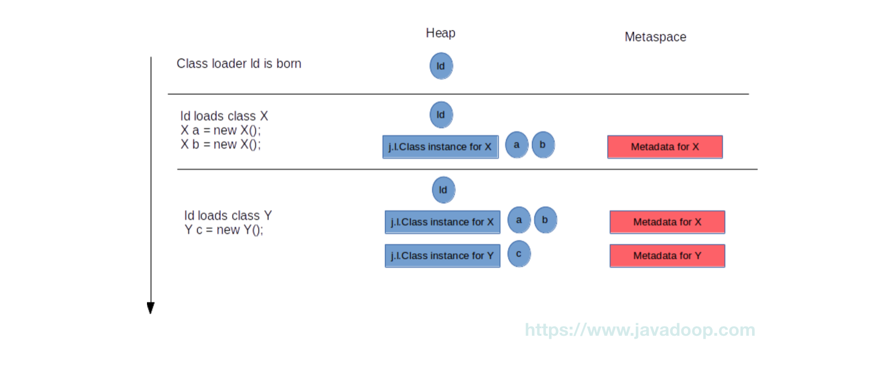
&emsp;    上面这个示意图非常简单，可以看到在  `Id`  这个类加载器第一次加载类  `X`  和  `Y`  的时候，在  Metaspace  中为它们开辟空间存放元信息。

###  什么时候回收  Metaspace  空间
&emsp;  分配给一个类空间，是归属于这个类的类加载器，只有当这个类加载器卸载的时候，这个空间才会释放。
&emsp;  所以当这个类加载器加载的所有类都没有存活对象，并且没有到达这些类和类加载器的引用时，相应的Metaspace空间才会被GC释放。如下图:
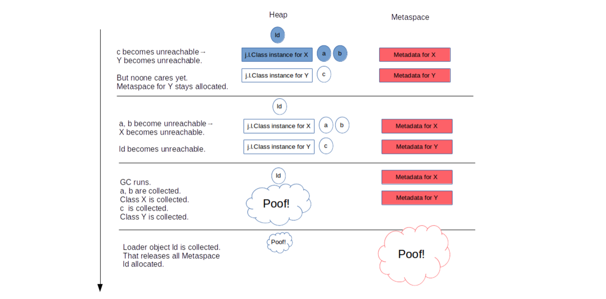
所以，一个类在Metaspace中占用的空间是否被释放，取决于这个类的类加载器是否被卸载。

###  内存通常被保留
&emsp;  释放Metaspace的空间，并不意味着将这部分空间还给系统内存，这部分空间通常被JVM保留下来。
&emsp;  这部分被保留的空间有多大，取决于Metaspace的碎片化程度。另外，Metaspace中有一部分区域Compressed  Class  Space是一定不会返给系统内存的。

###  配置  Metaspace  空间
我们只需要关心两个配置参数：
-  `-XX:MaxMetaspaceSize`：Metaspace  总空间的最大允许使用内存，默认是不限制。
-  `-XX:CompressedClassSpaceSize`：Metaspace  中的  Compressed  Class  Space  的最大允许内存，默认值是  1G，这部分会在  JVM  启动的时候向操作系统申请  1G  的虚拟地址映射，但不是真的就用了操作系统的  1G  内存。

###  Metaspace  和  GC
Metaspace  只在  GC  运行并且卸载类加载器的时候才会释放空间。当然，在某些时候，需要主动触发  GC  来回收一些没用的  class  metadata，即使这个时候对于堆空间来说，还达不到  GC  的条件。
Metaspace  可能在两种情况下触发  GC：
1.  分配空间时：虚拟机维护了一个阈值，如果  Metaspace  的空间大小超过了这个阈值，那么在新的空间分配申请时，虚拟机首先会通过收集可以卸载的类加载器来达到复用空间的目的，而不是扩大  Metaspace  的空间，这个时候会触发  GC。这个阈值会上下调整，和  Metaspace  已经占用的操作系统内存保持一个距离。
2.  碰到  Metaspace  OOM：Metaspace  的总使用空间达到了  MaxMetaspaceSize  设置的阈值，或者  Compressed  Class  Space  被使用光了，如果这次  GC  真的通过卸载类加载器腾出了很多的空间，这很好，否则的话，我们会进入一个糟糕的  GC  周期，即使我们有足够的堆内存。
&emsp;  <font  coilor="green">  所以千万不要将MaxMetaspaceSize设置的太小  </font>

##  Metaspace架构
&emsp;  Metaspace在实现上分为多层。最底层，负责向操作系统申请大块的内存；中间的一层，负责分出一小块一小块给每个类加载器；最顶层，类加载器负责将这些申请到的内存块用来存放class  metadata。

###  最底层：the  space  list
&emsp;  在底层，JVM通过`mmap(3)`  接口向操作系统申请内存映射，在64位平台上，每次申请**2MB**空间。
&emsp;  <font  color="green">这里的2MB并不是真正的消耗了2MB。只有之后在使用的时候才会消耗内存。这里是虚拟映射。</font>
每次申请过来的内存区域，放到一个链表中  [_VirtualSpaceList_](http://hg.openjdk.java.net/jdk/jdk11/file/1ddf9a99e4ad/src/hotspot/share/memory/metaspace/virtualSpaceList.hpp#l39)，作为其中的一个  Node。看下图。
&emsp;  一个Node是2MB的空间，前面说了在使用的时候再向操作系统申请实际的内存，但是频繁的系统调用会降低性能，所以Node内部需要维护一个水位线，当Node内已使用内存块达到水位线的时候，向操作系统要新的内存页。并且相应的提高水位线。
&emsp;    直到一个Node被完全用完，会分配一个新的Node，并且将其加入链表中，老的Node就  "退休"  了，下图中，前面三个Node就是退休状态了。
&emsp;  从一个Node中分配内存，每一块成为MetaChunk，chunk有三种规格分别为1k、4k、64k.
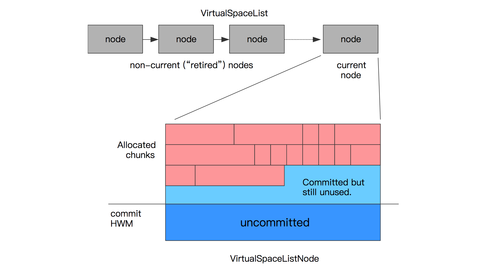
链表VirtualSpaceList和每个节点Node是全局的，而Node内部的一个个MetaChunk是分配给每个类加载器的。所以一个Node通常由分配给多个类加载器的chunks组成。

当一个类加载器和它加载的所有的类都卸载的时候，它占用的chunks就会加入到一个全局的空闲列表中：[_ChunkManager_](http://hg.openjdk.java.net/jdk/jdk11/file/1ddf9a99e4ad/src/hotspot/share/memory/metaspace/chunkManager.hpp#l44)，看下图：
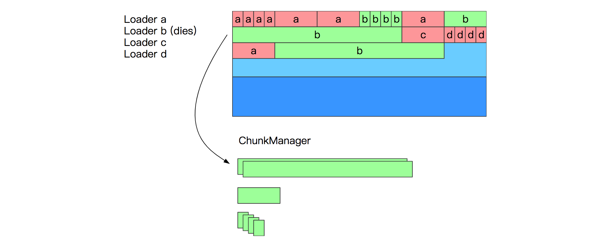
这些chunks会被复用：如果其他的类加载器加载新的类，它可能就会得到一个空闲链表中的chunk，而不是去Node中申请一个新的chunk。
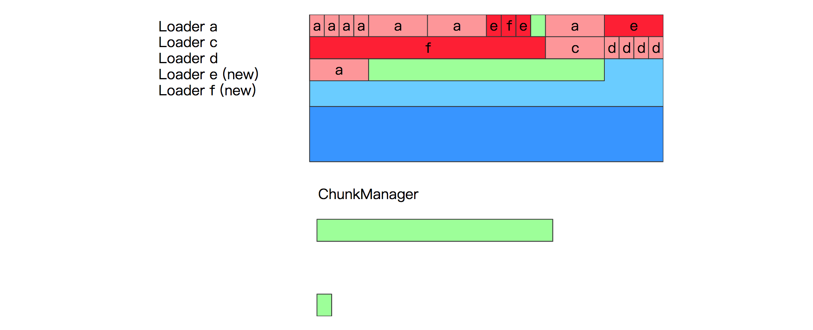
<font  color="green">后面会说到，如果刚好将整个Node都清空了，那么整个Node的内存会直接还给操作系统。当然，由这个Node进入到空闲链表的节点也要删除。</font>
###  中间层:  Metachunk
&emsp;  通常一个类加载器在申请Metaspace空间来存放metadata的时候，也就需要几十到几百字节，但是它会得到一个Metachunk，一个比要求大得多的内存块。
&emsp;  为什么？因为之前说了，要从全局的`VirtualSpaceList`  链表的Node中分配内存是昂贵的操作，需要加锁。我们不希望这个操作太频繁，所以一次性给一个大的Metachunk，以便于这个类加载器之后加载其他的类，这样可以做到多个类加载器并发分配了。只有当这个chunk使用完了，类加载器才需要又去`VirtualSpaceList`申请新的chunk。
&emsp;  前面说了，chunk有三种规格，那Metaspace的分配器怎么知道一个类加载器每次要多大的chunk呢？当然是基于猜测的。
-  通常，一个标准的类加载器在第一次申请空间时，会得到一个4k的chunk，直到它达到了一个随意设置的阈值(4),  此时分配器失去了耐心，之后会一次性给它一个64k的大chunk。
-  Bootstrap  ClassLoader  是一个公认的会加载大量的类的加载器，所以分配器会分配给它一个巨大的chunk，一开始就会给它4M。可以通过InitBootClassLoaderMetaspaceSize  参数进行调优。
-  反射类加载器(`jdk.internal.reflect.DelegatingClassLoader`)和匿名类加载器只会加载一个类，所以一开始只会给它们一个非常小的chunk（1k），因为给太多是一种浪费。

&emsp;类加载器在申请空间的时候，每次都给类加载器一个chunk，这种优化，是建立在假设它们立马就会需要新的空间基础上的。这种假设可能正确也可能错误，可能在拿到一个很大的chunk后，这个类加载器恰巧就不需要加载新的类了。(有可能会造成空间浪费)。

###  最顶层Metablock
在Metachunk上，有一个二级分配器（class-loader-local  allocator）,它将Metachunk分割成一个个小的单元，这些小的单元称为Metablock。它们实际是分配给每个调用者的。
&emsp;  这个二级分配器非常原始，它的速度也很快。
钱，  说过，class  metadata的生命周期和类加载器绑定的，所以类加载器卸载的时候，JVM可以大块大块的释放空间。
下面展示一个Metachunk的结构：
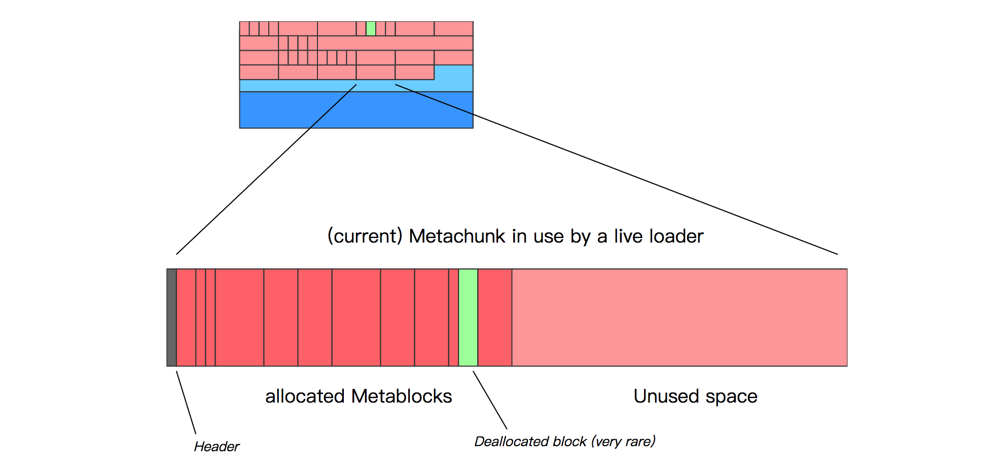
在chunk诞生的时候，它只有一个header，之后的分配都只要在顶部进行分配就行。
由于这个chunk是归属于一个类加载器的，所以如果它不再加载新的类，那么unused空间就真的浪费掉。

###  ClassLoaderData  和  ClassLoaderMetaspace
在JVM内部，一个类加载器以一个[_ClassLoaderData_](http://hg.openjdk.java.net/jdk/jdk11/file/1ddf9a99e4ad/src/hotspot/share/classfile/classLoaderData.hpp#l176)  结构标识，这个结构引用了一个  [_ClassLoaderMetaspace_](http://hg.openjdk.java.net/jdk/jdk11/file/1ddf9a99e4ad/src/hotspot/share/memory/metaspace.hpp#l230)  结构，它维护了该加载器使用的所有的  Metachunk。
&emsp;  当这个类加载器被卸载的时候，这个`ClassLoaderData`和`ClassLoaderMetaspace`会被删除。并且会将所有的这个加载器用到的chunks归还空闲列表中。这部分内存是否可以直接归还操作系统取决于是否满足其它条件，后面会介绍。
<font  color="green">**如果恰好把整个Node都清空了，那么这个Node的内存直接还给操作系统**</font>

###  匿名类
`ClassloaderData  !=  ClassLoaderMetaspace`
注意，我们前面说，“Metaspace  内存是属于类加载器的”，但是，这里其实撒了一个小谎，如果将匿名类考虑进去，那就更加复杂了：
&emsp;  当类加载器加载一个匿名类时，这个类有自己独立的`ClassLoaderData`，  它的生命周期是跟随着这个匿名类的，而不是这个类加载器(所以和它相关的空间可以在类加载器卸载前得到释放)。所以，一个类加载器有一个主要的ClassLoaderData结构用来服务所有正常的类，对于一个匿名类，还有一个二级的ClassLoaderData结构来维护。
&emsp;这样做得目的之一，其实就是没有必要扩大大量的Lambdas和method  handlers在Metaspace中空间的生命周期。
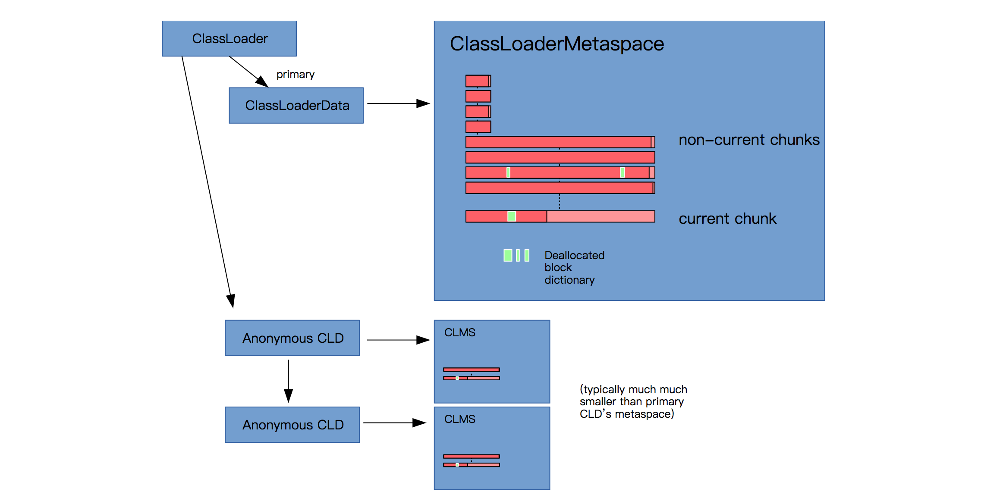

###  内存什么时候会还给操作系统
&emsp;  当一个  VirtualSpaceListNode  中的所有  chunk  都是空闲的时候，这个  Node  就会从链表  VirtualSpaceList  中移除，它的  chunks  也会从空闲列表中移除，这个  Node  就没有被使用了，会将其内存归还给操作系统。
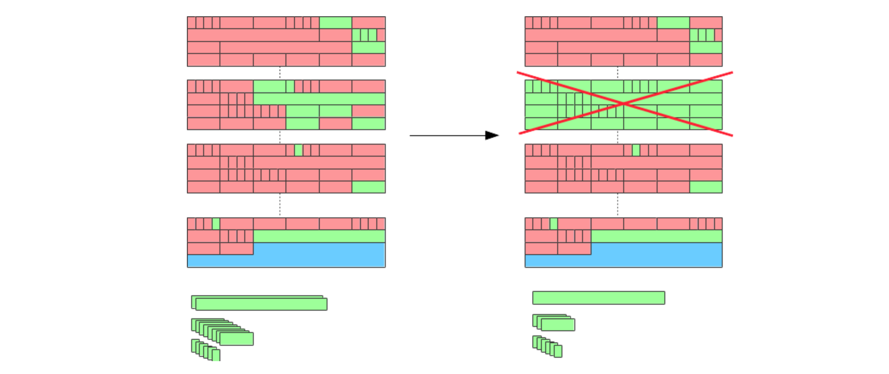
对于一个空闲的  Node  来说，拥有其上面的  chunks  的所有的类加载器必然都是被卸载了的。
至于这个情况是否可能发生，主要就是取决于碎片化：
&emsp;  一个  Node  是  2M，chunks  的大小为  1K,  4K  或  64K，所以通常一个  Node  上有约  150-200  个  chunks，如果这些  chunks  全部由同一个类加载器拥有，回收这个类加载器就可以一次性回收这个  Node，并且把它的空间还给操作系统。
&emsp;  但是，如果这些  chunks  分配给不同的类加载器，每个类加载器都有不同的生命周期，那么什么都不会被释放。这也许就是在告诉我们，要小心对待大量的小的类加载器，如那些负责加载匿名类或反射类的加载器。
&emsp;  同时也要清楚，Metaspace  中的  _Compressed  Class  Space_  是永远不会将内存还给操作系统的。我们马上就要介绍这部分内容了。
####  本节小结
-  每次向操作系统申请  2M  的虚拟空间映射，放置到全局链表中，待需要使用的时候申请内存。
-  一个  Node  会分割为一个个的  chunks，分配给类加载器，一个  chunk  属于一个类加载器。
-  chunk  再细分为一个个  Metablock，这是分配给调用者的最小单元。
-  当一个类加载器被卸载，它占有的  chunks  会进入到空闲列表，以便复用，如果运气好的话，有可能会直接把内存归还给操作系统。

##  Compressed  Class  Space
&emsp;  在  64  位平台上，HotSpot  使用了两个压缩优化技术，**Compressed  Object  Pointers**  (_“CompressedOops”_)  和  **Compressed  Class  Pointers**。
&emsp;  压缩指针，指的是在  64  位的机器上，使用  32  位的指针来访问数据（堆中的对象或  Metaspace  中的元数据）的一种方式。
&emsp;类指针压缩技术对  Klass  的分配带来的问题是：由于  32  位地址只能访问到  4G  的空间，所以**最大只允许  4G**  的  Klass  地址。这项限制也意味着，JVM  需要向  Metaspace  分配一个**连续的地址空间**。
&emsp;  当从系统申请内存时，通过调用系统接口  malloc(3)  或  mmap(3)，操作系统可能返回任意一个地址值，所以在  64位系统中，它并不能保证在  4G  的范围内。
&emsp;  所以，我们只能用一个  mmap()  来申请一个区域单独用来存放  Klass  对象。我们需要提前知道这个区域的大小，而且不能超过  4G。显然，这种方式是不能扩展的，因为这个地址后面的内存可能是被占用的。
&emsp;  只有  Klass  结构有这个限制，对于其他的  class  metadata  没有这个必要:  因为只有  Klass  实例是通过  Java  对象  header  中的压缩指针访问的。其他的  metadata  都是通过  64  位的地址进行访问的，所以它们可以被放到任意的地址上。
&emsp;  所以，我们决定将  Metaspace  分为两个区域：non-class  part  和  class  part。
-  class  part：存放  Klass  对象，需要一个连续的不超过  4G  的内存
-  non-class  part：包含其他的所有  metadata
>  class  part  被称作  **Compressed  Class  Space**，这个名字会有点怪，因为  Klass  本身其实没有使用压缩技术，而是引用它们的指针被压缩了。

&emsp;  compressed  class  space  空间的大小，是通过  -XX:CompressedClassSpaceSize  指定的。
我们需要提前知道自己需要多少内存，它的**默认值是  1G**。当然这个  1G  并不是真的使用了操作系统的  1G，而是虚拟地址映射。

###  实现
&emsp;  为了复用已有的Metaspace空间，使用了一个小技巧：
在Class  Space和Non-Class  Space中分别都有VirtualSpaceList(虚拟链表)和ChunkManager(空闲链表)两个结构。但是对于Class  Space，既然我们需要一个连续的空间我们不能使用一个链表来存放所有的Node，所以这个链表退化为一个节点，并且不能扩展。这个Node就是compressed  class  space,  和Non-Class  Space中的Node相比，它是非常大的。

ClassLoaderMetaspace（记录当前类加载器持有哪些  chunks）需要两个链表，一个用于记录  Class  Space  中的  chunks，一个用于记录  Non-Class  Space  中的  chunks。
>  到这里应该也很好理解，就是对于一个类加载器来说，它需要知道自己使用了  non-class  part  中的哪些  chunks  和  class  part  中的哪些  chunks。

----
#  了解MMAP
##  概述
&emsp;虽然随着现在硬件技术的不断进步，计算机各方面的速度也越来越快。但是磁盘IO速度的增长还远远不能满足当今读写需求，和内存读写速度还有有着指数级的差别。当今互联网的普及，用户不断增加，动则日活亿级，PB数据，过度堆内存也不能解决问题，系统性能一直是很多技术人员不断追求的方向。
&emsp;  CPU，内存，IO三者之间速度差异很大。对于高并发，低延迟的系统来说，磁盘IO往往最先成为系统的瓶颈；为了减少其影响，往往会引入缓存来提升性能。但是由于内存空间有限，往往只能保存部分数据；并且数据需要持久化，所以磁盘IO仍然不可避免。
&emsp;  无论是从HDD（机械硬盘）到SSD（固态硬盘）的硬件提升；还是从BIO（阻塞IO）到  NIO（非阻塞IO）的软件上的提升；都使得磁盘IO效率得到了很大的提升，但是相比内存读取速度仍然有着接近巨大的差距。今天笔者将从Linux内核调优以及Java代码层面介绍一种更加高效的IO解决方案Mmap（内存映射文件，memory  mapped  file）。

##  用户态和内核态
为了安全，操作系统将虚拟内存划分为两个模块，即用户态和内核态。它们之间是相互隔离的，即使用户程序崩溃了也不会影响系统的运行。

&emsp;    简单来说，用户态是用户程序代码运行的地方，而内核态是所有进程共享的空间。所以，当进行数据读写操作时，往往需要进行用户空间和内核空间的交互。
&emsp;  传统的IO模型进行磁盘数据读写时，一般需要两个步骤，就拿写数据为例：1.  从用户空间拷贝到内核空间；2.从内核空间写入磁盘。
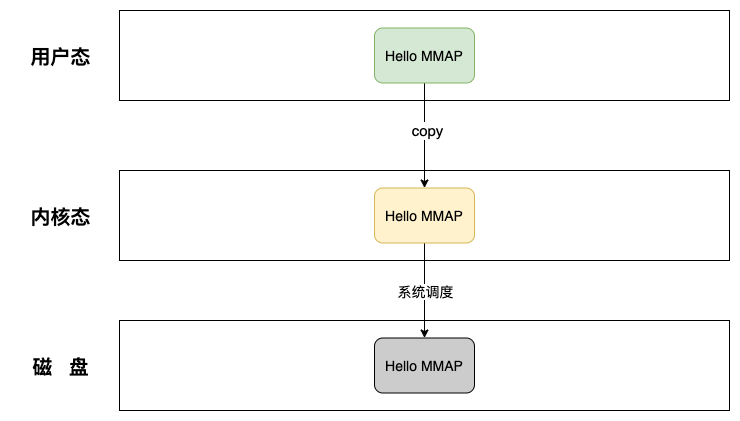

##  MMAP的定义
&emsp;  Mmap是一种内存映射文件的方法，即将一个文件或者其它对象映射到进程的地址空间，实现文件磁盘地址和进程虚拟地址空间中一段虚拟地址的一一对映关系.
&emsp;  对文件进行Mmap后，会在进程的虚拟内存分配地址空间，创建与磁盘的映射关系。  实现这样的映射后，就可以以指针的方式读写操作映射的虚拟内存，系统则会自动回写磁盘；相反，内核空间对这段区域的修改也直接反映到用户空间，从而可以实现不同进程间的数据共享。与传统IO模式相比，**减少了一次用户态copy到内核态的操作**。
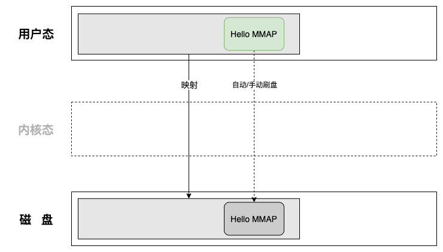

----
#  深度剖析指针压缩

##  为什么32位是4G内存
计算机规定8bit=1byte  就是1字节=8位。下面图片就表示一个8byte大小的内存。

例如一个4GB的内存到底有多少格子呢？
那就将4GB转换为bit就可以了
4GB  =  2^2  GB  =  2^12  MB  =  2^22  KB  =  2^32  byte  =  2^35  bit
也就是4GB的内存有  2^35  个格子。如果每一个格子一个地址的话？那么要想全部都访问4GB的内存就需要  35位，32位是不够的。那么32位操作系统是怎么做到可以访问4GB内存的呢？
**实际上内存是把8个bit排成1组，  每1组成为1个单位，  大小是1byte(字节），  cpu每一次只能访问1个byte，  而不能单独去访问具体的1个小格子(bit).  1个byte字节就是内存的最小的IO单位.**

##  Java指针压缩
&emsp;在32位到64位的转变中，程序最大的获益是内存容量。在一个32位系统中，内存地址的宽度就是32位，这就意味着，程序最大能获取的内存空间是`2^32`（`4G`）字节。这个容量明显不够用了。在一个64位的机器中，理论上程序能获得的内存容量是`2^64`字节，这是一个十分庞大的数字。虽然现实中，因为一系列硬件与软件的因素限制，能获得的内存要少得多，但是和`4G`比起来还是要大得多。
不过，这个转变还是有代价的:
1.  运行在64位中的程序会花费更多的内存。通常64位JVM消耗的内存会比32位的大`1.5`倍，这是因为对象指针在64位架构下，长度会翻倍(更宽的寻址)。对于那些将要从32位平台移植到64位的应用来说，平白无故多了1/2的内存占用，这是开发者不愿意看到的。
2.  增加了GC开销。64位对象引用需要占用更多的空间，留给其他数据的空间将会减少，从而加快了GC的发生。
3.  降低了CPU缓存的命中率。64位对象引用(指针)增加了，CPU缓存的指针将会减少，从而降低了CPU缓存的效率。

为了解决上述的问题，HotSpot引入了两个压缩优化的技术，`Compressed  Ordinary  Object  Pointers`和`Compressed  Class  Pointers`。(即对象指针压缩和类指针压缩)

###  对象指针压缩
`Ordinary  Object  Pointers`,  `oops`即普通对象指针。启用`CompressOops`后，以下对象的指针会被压缩:
-  每个Class的属性指针  (静态成员变量)
-  每个对象的属性指针
-  普通对象数组的元素指针

&emsp;  启动压缩后，JVM保存32位的指针，但在64位机器中，最终还是需要一个64位的地址来访问数据。这里JVM需要做一个对指针数据编码、解码的工作。在机器码中植入压缩与解压指令来实现以下过程：
-  首先，每个对象的大小一定是8字节的倍数，因为JVM会在对象的末尾加上数据进行对齐填充(padding).
-  假设对象`x`中有3个引用，`a`在地址`0`，`b`在地址`8`，`c`在地址`16`。那么在`x`中记录引用信息的时候，可以不记录`0`,  `8`,  `16`…这些数值，而是可以使用`0`,  `1`,  `2`…（即地址右移3位，相当于除8），这一步称为`encode`。在访问`x.c`的时候，拿到的地址信息是`2`，这里做一次`decode`（即地址左移3位，相当于乘8）得到地址`16`，然后就可以访问到`c`了。
-  这样，虽然我们使用32位来存储指针，但是我们多出了8倍的可寻址空间。所以压缩指针的方式可以访问的内存是`4G  *  8  =  32G`。
&emsp;  也就解释了为什么当内存大于32GB时，开启指针压缩的参数会失效！所以也网上建议在64位系统系下，JAVA的堆内存设置最好不要超过32G，一旦超过32G后，指针压缩就会失效，然后带来GC的触发频次变高，而且造成空间浪费.

###  类指针压缩
`Compressed  Class  Pointers`  类指针压缩。
&emsp;  在HotSpot虚拟机中，对象在内存中存储的布局可以分为3块区域：对象头（Header）、实例数据（Instance  Data）和对齐填充（Padding）。
&emsp;  HotSpot虚拟机的对象头包括两部分信息，第一部分用于存储对象自身的运行时数据，如哈希码、GC分代年龄、锁状态标志、线程持有的锁、偏向线程ID、偏向时间戳等，这部分数据的长度在32位和64位的虚拟机中分别为32bit和64bit，官方称它为`Mark  Word`。

&emsp;  另外一部分是一个指向`Metaspace`中`Klass`结构（这个结构可以理解为一个Java类在虚拟机内部的表示）的指针，虚拟机通过这个指针来确定这个对象是哪个类的实例：

在64位JVM中，这个指针是64位的。当开启`Compressed  Class  Pointers`之后，这个指针是32位的，为了找到真正的64位地址，需要加上一个base值：

&emsp;  这项技术对`Klass`的分配带来的问题是：由于32位地址只能访问到`4G`的空间，所以最大只允许`4G`的`Klass`地址。这项限制也意味着，JVM需要向`Metaspace`分配一个连续的地址空间。
&emsp;  当从系统申请内存时，通过调用系统接口`malloc(3)`或`mmap(3)`，操作系统可能返回任意一个地址值，所以在64位系统中，它并不能保证在`4G`的范围内。
&emsp;  所以，我们只能用一个`mmap()`来申请一个区域单独用来存放`Klass`对象。我们需要提前知道这个区域的大小，而且不能超过`4G`。显然，这种方式是不能扩展的，因为这个地址后面的内存可能是被占用的。
&emsp;  只有`Klass`结构有这个限制，对于其他的`class  metadata`没有这个必要：因为只有`Klass`实例是通过Java对象header中的压缩指针访问的。其他的`metadata`都是通过64位的地址进行访问的，所以它们可以被放到任意的地址上。
&emsp;  因此`Metaspace`分为两个区域：
-  `class  part`：存放`Klass`对象，需要一个连续的不超过`4G`的内存。
-  `non-class  part`：包含其他的所有`metadata`。

&emsp;  `class  part`被称为`Compressed  Class  Space`，其大小默认为`1G`。可以通过`-XX:CompressedClassSpaceSize`指定。

##  指针压缩参数
指针压缩相关的JVM参数位：
-  -XX:+UseCompressedOops:  允许普通对象指针压缩。
-  -XX:+UseCompressedClassPointers:  允许类指针压缩。

当堆小于`32G`时，这两个参数默认开启：

压缩存在以下几种情况:
-  参数`-XX:-UseCompressedOops`可以搭配`-XX:-UseCompressedClassPointers`，即可以同时关闭普通对象指针、类指针。
-  参数`-XX:-UseCompressedOops`不可以搭配`-XX:+UseCompressedClassPointers`，即关闭普通对象指针压缩的情况下，不能开启类指针压缩。
-  参数`-XX:+UseCompressedOops`可以搭配`-XX:-UseCompressedClassPointers`，即可以压缩普通对象指针，不压缩类指针。

当Java堆大于等于`32G`时，这两个参数都会被关闭：

当`UseCompressedClassPointers`选项被关闭时，那么将没有`Compressed  Class  Space`这个空间，并且`-XX:CompressedClassSpaceSize`这个参数无效。

----

#  Klass源码剖析
&emsp;  为了实现JAVA方法调用的动态绑定，Hotspot使用了与C++虚函数类似的机制，同时为了避免每个对象都维护一个虚函数表，于是就设计了Klass类。
&emsp;  Klass主要提供两个功能：
-  **用于表示Java类**。Klass中保存了一个Java对象的类型信息，包括类名、限定符、常量池、方法字典等。一个`class文件`  被JVM加载之后，就会被解析成一个`klass`数据结构对象存储在内存中。
-  **实现对象的虚分派**（virtual  dispatch）。所谓的虚分派，是JVM用来实现多态的一种机制。

Klass类的继承关系如下：

```cpp
MetaspaceObj  #类是作为存放在Metaspace元空间的中类的基类
└───Metadata    #内部表示类相关元数据的一个基类
│      └───Klass  #普通类模板
│      │      └───ArrayKlass    #数组类模板
│      │      │      └───TypeArrayKlass    #基本类型数组
│      │      │      └───ObjArrayKlass    #类数组或者多维数组
│      │      └───InstanceKlass    #类实例
│      │      │      └───InstanceClassLoaderKlass    #加载器类实例
│      │      │      └───InstanceMirrorKlass    #监控类实例
│      │      │      └───InstanceRefKlass    #引用类实例

```
Klass结构如下：
```cpp
/**---------------Klass------------------**/
    //如果不是InstanceKlass或者ArrayKlass，则该值为0
    //对InstanceKclass而言，该值表示对象的以字节为单位的内存占用空间
    //对ArrayKlass而言，该值是一个组合起来的假数字，包含4部分，具体怎么组合和解析由子类实现：
    //                        tag：如果数组元素是对象实例则是0x80,否则是0xC0
    //                        hsz:  数组头元素的字节数
    //                        ebt：数组元素的类型，枚举值BasicType
    //                        esz：数组元素大小，以字节为单位
    //该值因为被频繁查询，所以放在虚函数表指针的后面。
    jint                _layout_helper;

    //用于快速定位的父类
    //如果此klass表示的是接口，则定位到&_secondary_super_cache
    //如果此klass表示的是类，则定位到&_primary_supers[depth()],就是_primary_supers的最后一位
    juint              _super_check_offset;

    //类名.    
    //Instance  classes:  java/lang/String,  
    //Array  classes:  [I,[Ljava/lang/String;
    //Set  to  zero  for  all  other  kinds  of  classes.
    Symbol*          _name;

    //  Klass指针，上一次查找过的接口
    Klass*            _secondary_super_cache;
    //所有接口的接口
    Array<Klass*>*  _secondary_supers;
    //默认继承的类列表，如Object
    Klass*            _primary_supers[_primary_super_limit];
    //  java/lang/Class  的实例  mirroring  this  class
    oop              _java_mirror;
    //  父类
    Klass*            _super;
    //  First  subclass  (NULL  if  none);  _subklass->next_sibling()  is  next  one
    //子类头节点
    Klass*            _subklass;
    //  Sibling  link  (or  NULL);  links  all  subklasses  of  a  klass
    //串连所有子类，形成链表
    Klass*            _next_sibling;

    //  All  klasses  loaded  by  a  class  loader  are  chained  through  these  links
    //ClassLoader加载的下一个Klass
    Klass*            _next_link;

    //此类对应的ClassLoader
    ClassLoaderData*  _class_loader_data;

    //修改标识，Class.getModifiers使用
    jint                _modifier_flags;    

    //获取类的修饰符，如private类访问控制，final，static，abstract  ，native等
    AccessFlags  _access_flags;
/**---------------Klass------------------**/


/**---------------InstanceKlass------------------**/
    //该类使用的所有注解
    Annotations*        _annotations;
    //该类的数组Klass
    Klass*                    _array_klasses;
    //  类的常量池
    ConstantPool*  _constants;
      
    //内部类    
    //The  InnerClasses  attribute  and  EnclosingMethod  attribute.  
    //If  the  class  has  InnerClasses  attribute
    //1.inner_class_info_index
    //2.outer_class_info_index
    //3.inner_name_index
    //4.inner_class_access_flags
    //If  the  EnclosingMethod  attribute  exists,  
    //1.class_index
    //2.method_index
    //If  only  the  InnerClasses  attribute  exists
    //  the  _inner_classes  array  length  is  number_of_inner_classes  *  4.
    //  If  the  class  has  both  InnerClasses  and  EnclosingMethod  attributes  
    //the  _inner_classes  array  length  is  number_of_inner_classes  *  4  +  enclosing_method_attribute_size.
    Array<jushort>*  _inner_classes;

    //  the  source  debug  extension  for  this  klass,  NULL  if  not  specified.
    //  Specified  as  UTF-8  string  without  terminating  zero  byte  in  the  classfile,
    //  it  is  stored  in  the  instanceklass  as  a  NULL-terminated  UTF-8  string
    char*                      _source_debug_extension;
    
    //根据类名计算的以该类的数组的名字
    Symbol*                  _array_name;

    //非静态字段的内存大小，以heapOopSize为单位，默认使用压缩指针时heapOopSize是int的大小
    //  Number  of  heapOopSize  words  used  by  non-static  fields  in  this  klass
    //  (including  inherited  fields  but  after  header_size()).
    int                          _nonstatic_field_size;
    
    //静态字段的内存大小，以字宽（HeapWordSize，实际是一个指针变量的内存大小）为单位
    //  number  words  used  by  static  fields  (oop  and  non-oop)  in  this  klass
    int                          _static_field_size;

    //Generic  signature在常量池中的索引        
    //  Constant  pool  index  to  the  utf8  entry  of  the  Generic  signature,  or  0  if  none.
    u2                            _generic_signature_index;

    //包含此类的源文件名在常量池中索引
    //  Constant  pool  index  to  the  utf8  entry  for  the  name  of  source  file
    //  containing  this  klass,  0  if  not  specified.
    u2                            _source_file_name_index;

    //此类的包含的静态引用类型字段的数量
    //  number  of  static  oop  fields  in  this  klass
    u2                            _static_oop_field_count;
    
    //总的字段数量
    //  The  number  of  declared  Java  fields
    u2                            _java_fields_count;    

    //非静态的oop  map  block的内存大小，以字宽为单位  (oop根据这个来申请内存)
    //size  in  words  of  nonstatic  oop  map  blocks
    int                          _nonstatic_oop_map_size;

    //minor  version  number  of  class  file
    u2                            _minor_version;
    //major  version  number  of  class  file              
    u2                            _major_version;  

    //初始化的此类Thread指针            
    //  Pointer  to  current  thread  doing  initialization  (to  handle  recusive  initialization)
    Thread*                  _init_thread;
    
    //  Java  虚函数表(vtable)的内存大小，以字宽为单位              
    int                          _vtable_len;
    //  Java  接口函数表（itable）的内存大小，以字宽为单位              
    int                          _itable_len;

    //  OopMapCache  for  all  methods  in  the  klass  (allocated  lazily)                    
    OopMapCache*        volatile  _oop_map_cache;      
    
    //MemberNameTable指针，保存了成员名
    MemberNameTable*  _member_names;
    
    //NIid指针，该类的第一个静态字段的JNIid，可以根据其_next属性获取下一个字段的JNIid
    JNIid*                    _jni_ids;
    
    //jmethodID指针，java方法的ID列表                          
    jmethodID*            _methods_jmethod_ids;    

    //依赖的本地方法，以根据其_next属性获取下一个nmethod
    nmethodBucket*    _dependencies;                  

    //栈上替换的本地方法链表的头元素
    nmethod*                _osr_nmethods_head;        
    
    //bpt  lists,  managed  by  Method*
    BreakpointInfo*  _breakpoints;      
                
    //class文件的内容，JVMTI  retransform时使用
    //  JVMTI  fields  can  be  moved  to  their  own  structure  -  see  6315920
    //  JVMTI:  cached  class  file,  before  retransformable  agent  modified  it  in  CFLH
    JvmtiCachedClassFileData*  _cached_class_file;
    
    //JVMTI:  used  during  heap  iteration  
    JvmtiCachedClassFieldMap*  _jvmti_cached_class_field_map;  

    //已经分配的方法的idnum的个数，可以根据该ID找到对应的方法，如果JVMTI有新增的方法，已分配的ID不会变
    //  JNI/JVMTI:  increments  with  the  addition  of  methods,  old  ids  don't  change
    volatile  u2          _idnum_allocated_count;                  

    //类的状态，是一个枚举值ClassState，
    //allocated（已分配内存），
    //loaded（从class文件读取加载到内存中），
    //linked（已经成功链接和校验），
    //being_initialized（正在初始化），
    //fully_initialized（已经完成初始化），
    //initialization_error（初始化异常）
    u1                            _init_state;

    //引用类型                                        
    u1                            _reference_type;

    //  方法指针数组，类方法
    Array<Method*>*  _methods;
    
    //  从接口继承的默认方法
    Array<Method*>*  _default_methods;
    
    //  直接实现的接口Klass
    Array<Klass*>*  _local_interfaces;
    
    //  所有实现的接口Klass，包含_local_interfaces和通过继承间接实现的接口
    Array<Klass*>*  _transitive_interfaces;
    
    //  保存类中方法声明时的顺序，JVMTI使用
    Array<int>*          _method_ordering;

    //默认方法在虚函数表中的索引
    //  Int  array  containing  the  vtable_indices  for  default_methods
    //  offset  matches  _default_methods  offset
    Array<int>*          _default_vtable_indices;

    //  Instance  and  static  variable  information,  starts  with  6-tuples  of  shorts
    //  [access,  name  index,  sig  index,  initval  index,  low_offset,  high_offset]
    //  for  all  fields,  followed  by  the  generic  signature  data  at  the  end  of
    //  the  array.  Only  fields  with  generic  signature  attributes  have  the  generic
    //  signature  data  set  in  the  array.  The  fields  array  looks  like  following:
    //
    //  f1:  [access,  name  index,  sig  index,  initial  value  index,  low_offset,  high_offset]
    //  f2:  [access,  name  index,  sig  index,  initial  value  index,  low_offset,  high_offset]
    //            ...
    //  fn:  [access,  name  index,  sig  index,  initial  value  index,  low_offset,  high_offset]
    //          [generic  signature  index]
    //          [generic  signature  index]
    //      offset  =  int(high_offset,low_offset)  >>  2
    //      |---------high---------|---------low---------|
    //        ..........................................00    -  blank
    //        [------------------offset----------------]01    -  real  field  offset
    //        ......................[-------type-------]10    -  plain  field  with  type
    //        [--contention_group--][-------type-------]11    -  contended  field  with  type  and  contention  group
    Array<u2>*            _fields;

    //接下来几个属性是内嵌的在类中的，没有对应的属性名，只能通过指针和偏移量的方式访问：
    //  embedded  Java  vtable  follows  here,Java虚函数表，大小等于_vtable_len
    //  embedded  Java  itables  follows  here,Java接口函数表，大小等于  _itable_len
    //  embedded  static  fields  follows  here
    //  embedded  nonstatic  oop-map  blocks  follows  here,非静态oop-map  blocks  ，大小等于_nonstatic_oop_map_size
    //  embedded  implementor  of  this  interface  follows  here
    //(接口的实现类，仅当前类表示一个接口时存在，如果接口没有任何实现类则为NULL，如果只有一个实现类则为该实现类的Klass指针，如果有多个实现类，为当前类本身)
    //    The  embedded  implementor  only  exists  if  the  current  klass  is  an
    //      iterface.  The  possible  values  of  the  implementor  fall  into  following
    //      three  cases:
    //          NULL:  no  implementor.
    //          A  Klass*  that's  not  itself:  one  implementor.
    //          Itself:  more  than  one  implementors.
    //  embedded  host  klass  follows  here
    //(只在匿名类中存在，为了支持JSR  292中的动态语言特性，会给匿名类生成一个host  klass)
    //      The  embedded  host  klass  only  exists  in  an  anonymous  class  for
    //      dynamic  language  support  (JSR  292  enabled).  The  host  class  grants
    //      its  access  privileges  to  this  class  also.  The  host  class  is  either
    //      named,  or  a  previously  loaded  anonymous  class.  A  non-anonymous  class
    //      or  an  anonymous  class  loaded  through  normal  classloading  does  not
    //      have  this  embedded  field.
    
/**---------------InstanceKlass------------------**/

```
##  Klass中的`oop  _java_mirror;`
&emsp;  这个属性代表的就是本class的Class对象。举例来说，如果JVM加载了Main这个类，那么除了为Main创建了一个名为"Main"的Klass，还默默地背后创建一个object，并且把这个object  挂到了  Klass  的  `_java_mirror`  属性上了。
&emsp;  注意：Klass  是C++对象，而`oop`字段表示的是`Class`对象。通过Java代码能直接访问的是Class对象，而不是Klass。如下所示：
```java
Class  m  =  Main.class;
Class  m  =  Class.forName("Main");
```
&emsp;  两种方法都能访问到Main的Class  object，也就是`Klass`上的那个`_java_mirror`。那么这个_java_mirror上定义的  newInstance  方法，其实最终也是通过JVM中的方法来创建真正的对象，如下所示：
```cpp
JVM_ENTRY(jobject,  JVM_NewInstanceFromConstructor(JNIEnv  *env,  jobject  c,  jobjectArray  args0))
    JVMWrapper("JVM_NewInstanceFromConstructor");
    oop  constructor_mirror  =  JNIHandles::resolve(c);
    objArrayHandle  args(THREAD,  objArrayOop(JNIHandles::resolve(args0)));
    oop  result  =  Reflection::invoke_constructor(constructor_mirror,  args,  CHECK_NULL);
    jobject  res  =  JNIHandles::make_local(env,  result);
    if  (JvmtiExport::should_post_vm_object_alloc())  {
        JvmtiExport::post_vm_object_alloc(JavaThread::current(),  result);
    }
    return  res;  
JVM_END

```

----

#  OOP源码剖析

##  OOP概述
&emsp;    JVM内部基于oop-klass模型描述一个java类以及其实例（对象）,java类元信息用klass描述，对象用oop来描述。OOP:  Ordinary  object  pointer，也即普通对象指针。

##  OOP的继承关系及描述
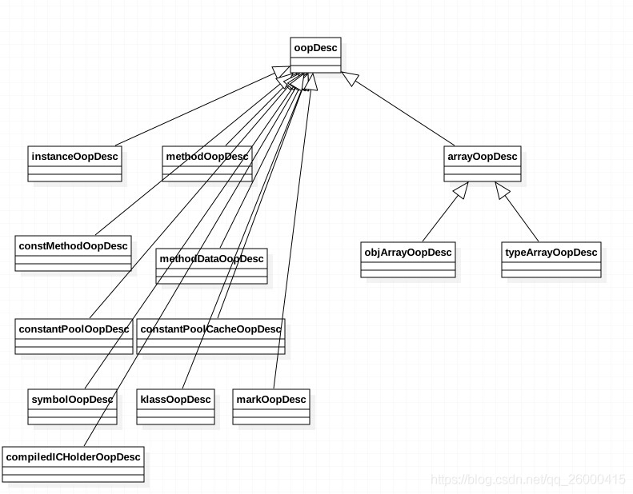
核心的继承关系如下:
```cpp
oopDesc  #内部实例基类
└───arrayOopDesc    #内部表示类相关元数据的一个基类
│      └───objArrayOopDesc  #普通类模板
│      └───typeArrayOopDesc    #基本类型数组
└───instanceOopDesc    #加载器类实例
└───markOopDesc    #用于描述对象头

```

解惑：为什么OOP变成了oopDesc  ?
原因：因为C++描述OOP层级关系的时候在`oopsHierarchy.hpp`  中进行了如下定义：
```cpp
typedef  class    oopDesc*                                                        oop;  
typedef  class      instanceOopDesc*                        instanceOop;  
typedef  class      methodOopDesc*                                        methodOop;  
typedef  class      constMethodOopDesc*                        constMethodOop;  
typedef  class      methodDataOopDesc*                        methodDataOop;  
typedef  class      arrayOopDesc*                                        arrayOop;  
typedef  class          objArrayOopDesc*                        objArrayOop;  
typedef  class          typeArrayOopDesc*                        typeArrayOop;  
typedef  class      constantPoolOopDesc*                        constantPoolOop;  
typedef  class      constantPoolCacheOopDesc*      constantPoolCacheOop;  
typedef  class      symbolOopDesc*                                        symbolOop;
typedef  class      klassOopDesc*                                        klassOop;  
typedef  class      markOopDesc*                                        markOop;  
typedef  class      compiledICHolderOopDesc*        compiledICHolderOop;
```
其中各类的说明如下:

|  类名  |  说明  |
|  :------------  |  :------------  |
|  oop  |  oop的顶级父类  |
|  instanceOop  |  表示java类实例  |
|  methodOop  |  表示java方法  |
|  constMethodOop  |  表示java方法中的只读信息(其实就是字节码指令)  |
|  methodDataOop  |  表示性能统计的相关数据  |
|  arrayOop  |  数组对象,定义了数组oops的抽象基类  |
|  objArrayOop  |  表示引用类型数组对象  |
|  typeArrayOop  |  表示基本类型数组对象  |
|  constantPoolOop  |  表示java字节码文件中的常量池  |
|  constantPoolCacheOop  |  与constantPoolOop  相伴生,是后者的缓存对象,缓存了字段和方法的访问信息,为允许时环境快速访问字段和方法提供重要作用  |
|  symbolOop  |  symbolOop是规范化字符串。所有symbolOop都位于全局符号表中。  |
|  klassOop  |  指向jvm内部的klass实例的对象  |
|  markOop  |  oop  的标记对象,表示对象头  |
|  compiledICHolderOop  |  内联缓存实现的帮助器对象。它包含从编译到解释调用转换时使用的中间值（method+klass对）,总是分配在永久区（以避免在清除期间遍历codecache）  |

&emsp;  我们平常创建的Java实例：**instanceOopDesc**，对象在内存中的布局就是通过它来表示的。

##  OOP源码解析
```cpp
/**---------------oopDesc------------------**/
//markOopDesc是oopDesc的子类，用于描述对象头，因为保证对象状态变更在各CPU种同步，所以加volatile修饰
volatile  markOop    _mark;
//是一个union结构，用于表示该oopDesc关联的Klass，使用压缩指针时，就设置其中的_compressed_klass属性
union  _metadata  {
        Klass*            _klass;
        narrowKlass  _compressed_klass;
}  _metadata;

//  BarrierSet提供了屏障实现和系统其它部分之间的接口，是静态属性，必须初始化
static  BarrierSet*  _bs;
/**---------------oopDesc------------------**/

/**---------------markOopDesc------------------**/
//markOopDesc继承自oopDesc，用于描述对象头，
//oopDesc中的_mark属性引用的并不是一个真实存在的markOopDesc实例,它是一个32位的数组（启用指针压缩）或者64位数组（禁止指针压缩）
//注意指针压缩包含两种，Java对象类型字段的oop指针和oopDesc引用Klass的指针，分别对应两个参数UseCompressedOops和UseCompressedClassPointers
//
//    32  bits:
//    --------
//                          hash:25  ------------>|  age:4        biased_lock:1  lock:2  (normal  object)
//                          JavaThread*:23  epoch:2  age:4        biased_lock:1  lock:2  (biased  object)
//                          size:32  ------------------------------------------>|  (CMS  free  block)
//                          PromotedObject*:29  ---------->|  promo_bits:3  ----->|  (CMS  promoted  object)
//
//    64  bits:
//    --------
//    unused:25  hash:31  -->|  unused:1      age:4        biased_lock:1  lock:2  (normal  object)
//    JavaThread*:54  epoch:2  unused:1      age:4        biased_lock:1  lock:2  (biased  object)
//    PromotedObject*:61  --------------------->|  promo_bits:3  ----->|  (CMS  promoted  object)
//    size:64  ----------------------------------------------------->|  (CMS  free  block)
//
//    unused:25  hash:31  -->|  cms_free:1  age:4        biased_lock:1  lock:2  (COOPs  &&  normal  object)
//    JavaThread*:54  epoch:2  cms_free:1  age:4        biased_lock:1  lock:2  (COOPs  &&  biased  object)
//    narrowOop:32  unused:24  cms_free:1  unused:4  promo_bits:3  ----->|  (COOPs  &&  CMS  promoted  object)
//    unused:21  size:35  -->|  cms_free:1  unused:7  ------------------>|  (COOPs  &&  CMS  free  block)
/**---------------markOopDesc------------------**/

/**---------------instanceOopDesc------------------**/
//instanceOopDesc继承自oopDesc，用于表示普通的Java对象，每次new一个Java对象就会创建一个新的instanceOopDesc实例。
//该类没有添加新的属性，只是新增了两个方法.
//用于返回包含OopDesc自身属性的内存的偏移量，即该偏移量之后的内存用于保存Java对象实例属性
base_offset_in_bytes()
//用于判断是否包含指定偏移量的非静态属性。
contains_field_offset(int  offset,  int  nonstatic_field_size)

//instanceOopDesc是如何保存Java对象实例的属性了？
//基本类型字段的实现都是在oopDesc的地址的基础上加上一个偏移量算出该字段的地址，偏移量的单位是字节，各字段的偏移量和初始值等属性都保存在InstanceKlass的_fields属性中，根据该地址可以直接获取或者设置字段值
/**---------------instanceOopDesc------------------**/

/**---------------arrayOopDesc------------------**/
//  arrayOopDesc继承自oopDesc，该类是所有数组OopDesc的基类，arrayOopDesc同InstanceOopDesc的内存布局是不一样的，除OopDesc定义的属性外还需保存数组的长度，数组元素的取值。
//该类添加了几个跟数组相关的方法，如下：

//获取首元素的偏移量
int  base_offset_in_bytes(BasicType  type)
//获取首元素的地址
void*  base(BasicType  type)
//index是否数组越界
bool  is_within_bounds(int  index)
//获取数组的长度
int  length()
//设置数组长度
void  set_length(int  length)
//获取数组的最大长度  
int32_t  max_array_length(BasicType  type):  

//从代码可知数组长度保存在_metadata属性的后面，类型为int，占4字节，这也决定了数组的最大长度不能超过int的最大值。  
/**---------------arrayOopDesc------------------**/

/**---------------typeArrayOopDesc------------------**/
  //typeArrayOopDesc继承自arrayOopDesc，用于表示数组元素是基本类型如int，long等的数组。跟InstanceOopDesc类似
/**---------------typeArrayOopDesc------------------**/

/**---------------objArrayOopDesc------------------**/
//objArrayOopDesc继承自arrayOopDesc，用于表示元素是对象的数组，包括多维数组。同typeArrayOopDesc，该类增加了根据索引获取和设置数组的方法，同样需要根据配置对指针做压缩解压缩处理
/**---------------objArrayOopDesc------------------**/

```

##  OOP-KLASS之间的联系
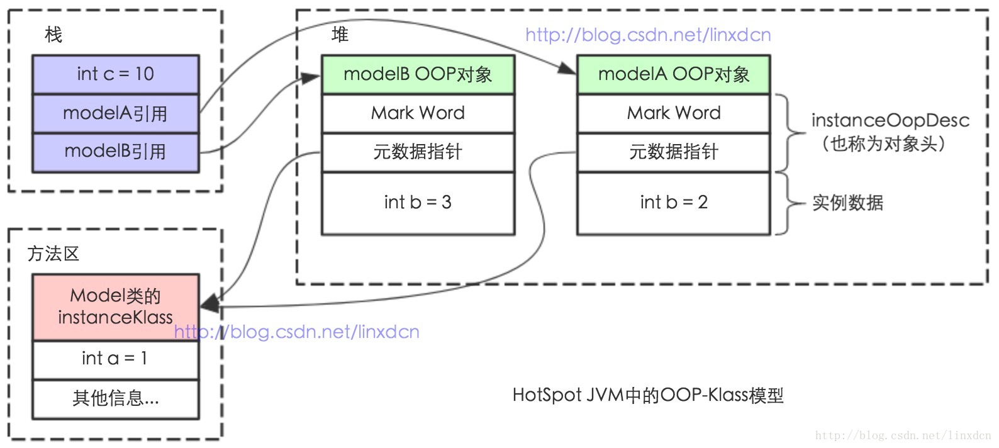

----

#  JVM多态实现原理

##  C++  多态与vftable分析
1.  在分析JVM多态的实现原理之前，我们先一起看看  C++中虚方法表的实现机制，这两者有很紧密的联系，有助于我们理解JVM中的多态机制。=
2.  示例代码:
```cpp
class  Cpuls{
        public:  
                int  x;
        public:
                  void  func(){
                        this->x  =  2;
                }
};
int  main(){
        Cpuls  cplus;
        return  0;
}
```
&emsp;  这个  C＋＋示例很简单，类中包含一个  int  类型的变量和一个  run（）方法，在  main函数中定义一个Cpuls对象。通过vs  调试时看内存情况，没有虚函数时对象的内存表现如下图：
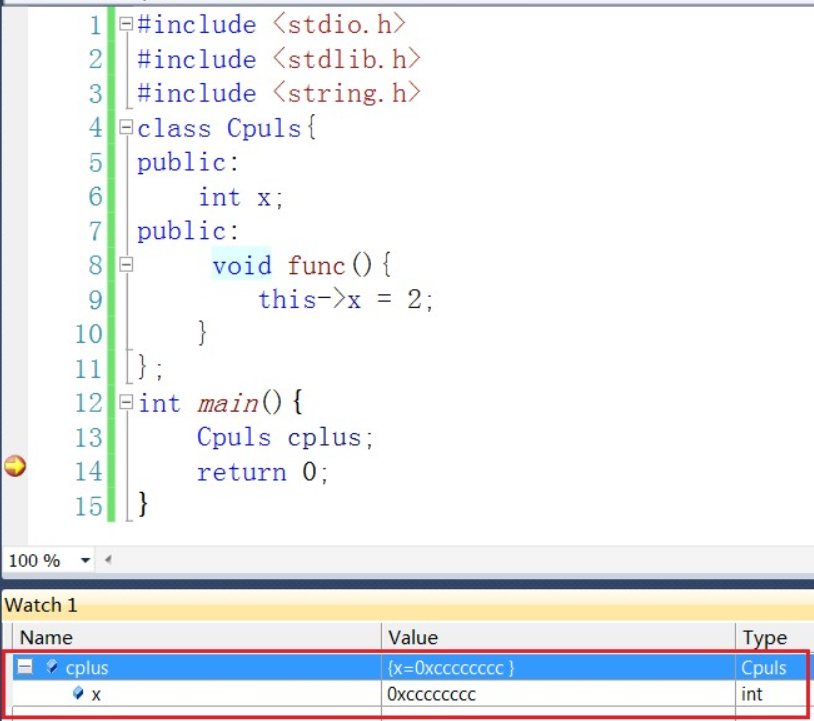
由于  CPLUS  类中仅包含  l  个  int  类型的变量  ，因此观察结果中的  cplus  实例内存地址，只有变量  x  。
现在将  C＋＋类中的  run方法修改一下，变成虚方法，在观察对象的内存表现：

&emsp;  注意看，现在值变了，cplus实例首地址不是其变量x了，而是一个vftable,  这就是虚表，并在vftable中存放加了virtual关键字的虚函数func函数的地址，这是因为当C++类中出现虚方法时，表示该方法拥有多态性，此时会根据类型指针所指向的实际对象而在运行期调用不同的方法。
<font  color="green">**C++为了实现多态，就在C++类实例对象中嵌入虚函数表vftable，通过虚函数表来实现运行期的方法分派。C++中所谓虚函数表，其实就是一个普通的表，表中存储的但是方法指针，方法指针会指向目标方法的内存地址，所以虚函数表就是一堆指针的集合而已**</font>

##  JVM中函数重写实现机制

1.  Java中的多态语义与上面分析C++的原理是相同的，Java在JVM中的多态机制也是采用了vftable来实现动态绑定。**JVM放入vftable机制与C++放入vftable机制之间的不同点在于，C++的vftable在编译期间由编译器完成分析和模型构建，而JVM的vftable则在JVM运行期被加载时进行动态构建。**  下面通过Hotspot源码来分析JVM中函数重写机制。

2.  当我们通过Java执行class文件时，JVM会在第一次加载类时调用`classFileParser.cpp::parseClassFile()`  函数时对Java  Class文件字节码进行解析，在`parseClassFile()`函数中会调用`parse_methods()`函数解析class文件类中的方法，`parse_methods()`函数执行完毕后，会继续调用`klassVtable::compute_vtable_size_and_num_mirandas()`函数。

###  ①  计算Vftable大小
`klassVtable::compute_vtable_size_and_num_mirandas()`  

####  Miranda  米兰达
&emsp;  这个其实是一个法律术语，即米兰达原则，简单来说米兰达原则(Miranda  Rule)它要求警察告诉被拘捕的犯罪嫌疑人，他可以对警察保持缄默，他有权要求有律师在场。
&emsp;  在JVM中miranda方法是为了解决早期HotSpot虚拟机的一个Bug，因为早期虚拟机在遍历Java类的方法时，只会遍历类及所有父类的方法，不会遍历Java类所实现的接口里的方法，这会导致一个问题，即如果Java类没有实现接口里的方法，那么接口中的方法将不会被遍历到。为了解决这个问题，Javac等前端编译器会向Java类中添加方法，这些方法就是miranda方法。举个例子如下：
```java
public  interface  IA{
      void  test();
}

public  abstract  class  CA  implements  IA{
        public  CA(){
              test();
      }
}
```
CA类实现了IA接口，但是并没有实现接口中定义的test()方法，源代码并没有任何问题，如果只遍历类及父类，那么是无法查找到test()方法的，所以早期的HotSpot需要Javac等编译器会为CA类合成一个miranda方法，如下：  
```java
public  interface  IA{
      void  test();
}

public  abstract  class  CA  implements  IA{
        public  CA(){
              test();
      }

      //  miranda
      public  abstract  void  test();
}
```
这样就解决了HotSpot不搜索接口的Bug。不过现在的虚拟机版本并不需要合成miranda方法（Class文件中不存在miranda方法），但是在填充类的vtable时，如果这个类实现的接口中有没有被实现的方法，那么仍然需要在vtable中新增vtable  entry，其实也是起到了和之前一样的效果。

####  计算过程
`klassVtable::compute_vtable_size_and_num_mirandas()`  函数主要用于计算当前类的vtable大小。该方法的主要实现逻辑如下：判断是否有虚函数，如果有就将个数增加，src\share\vm\oops\KlassVtable.cpp  相关代码如下：

```cpp
void  klassVtable::compute_vtable_size_and_num_mirandas(
        int*  vtable_length_ret,  int*  num_new_mirandas,
        GrowableArray<Method*>*  all_mirandas,  Klass*  super,
        Array<Method*>*  methods,  AccessFlags  class_flags,
        Handle  classloader,  Symbol*  classname,  Array<Klass*>*  local_interfaces,
        TRAPS)  {
    No_Safepoint_Verifier  nsv;
  
    //  set  up  default  result  values
    int  vtable_length  =  0;
  
    //  start  off  with  super's  vtable  length
    InstanceKlass*  sk  =  (InstanceKlass*)super;
    //获取父类  vtable  的大小，并将当前类的  vtable  的大小设置为父类  vtable  的大小。
    vtable_length  =  super  ==  NULL  ?  0  :  sk->vtable_length();
  
    //  go  thru  each  method  in  the  methods  table  to  see  if  it  needs  a  new  entry
    int  len  =  methods->length();//方法个数
    for  (int  i  =  0;  i  <  len;  i++)  {
        assert(methods->at(i)->is_method(),  "must  be  a  Method*");
        methodHandle  mh(THREAD,  methods->at(i));
  
        /*循环遍历当前  Java  类的每一个方法  ，调用  needs_new_vtable_entry()函数进行判断，
        如果判断的结果是  true  ，则将  vtable  的大小增  1  */
        if  (needs_new_vtable_entry(mh,  super,  classloader,  classname,  class_flags,  THREAD))  {
            vtable_length  +=  vtableEntry::size();  //  we  need  a  new  entry
        }
    }
  
    GrowableArray<Method*>  new_mirandas(20);
    //  compute  the  number  of  mirandas  methods  that  must  be  added  to  the  end
    get_mirandas(&new_mirandas,  all_mirandas,  super,  methods,  NULL,  local_interfaces);
    *num_new_mirandas  =  new_mirandas.length();
  
    //  Interfaces  do  not  need  interface  methods  in  their  vtables
    //  This  includes  miranda  methods  and  during  later  processing,  default  methods
    if  (!class_flags.is_interface())  {  //  只有类才需要处理miranda方法，接口不需要处理
      //  类的vtable大小要加上miranda方法的大小
        vtable_length  +=  *num_new_mirandas  *  vtableEntry::size();
    }
  
      //  处理数组类时，其vtable_length应该等于Object的vtable_length，通常为5,因为Object中有5个方法需要动态绑定
    if  (Universe::is_bootstrapping()  &&  vtable_length  ==  0)  {
        //  array  classes  don't  have  their  superclass  set  correctly  during
        //  bootstrapping
        vtable_length  =  Universe::base_vtable_size();
    }
  
    if  (super  ==  NULL  &&  !Universe::is_bootstrapping()  &&
            vtable_length  !=  Universe::base_vtable_size())  {
        //  Someone  is  attempting  to  redefine  java.lang.Object  incorrectly.    The
        //  only  way  this  should  happen  is  from
        //  SystemDictionary::resolve_from_stream(),  which  will  detect  this  later
        //  and  throw  a  security  exception.    So  don't  assert  here  to  let
        //  the  exception  occur.
        vtable_length  =  Universe::base_vtable_size();
    }
    assert(super  !=  NULL  ||  vtable_length  ==  Universe::base_vtable_size(),
                  "bad  vtable  size  for  class  Object");
    assert(vtable_length  %  vtableEntry::size()  ==  0,  "bad  vtable  length");
    assert(vtable_length  >=  Universe::base_vtable_size(),  "vtable  too  small");
  
    *vtable_length_ret  =  vtable_length;//返回虚方法个数
}

```

&emsp;  以上这段代码的核心处理流程如下：
1.  获取父类Vtable的大小，并将当前类的Vtable大小设置位父类的Vtable大小。
2.  遍历循环当前Java类的每一个方法，调用`needs_new_vtable_entry()`  函数进行判断。如果是true则将Vtable的大小增加。
3.  通过`get_mirandas()`函数获取所有的米兰多方法，接着判断当前类是否是接口，如果是接口则不处理。否则是类则将类的Vtable大小加上miranda方法的大小。`vtable_length  +=  *num_new_mirandas  *  vtableEntry::size();`

&emsp;  vtable的大小通常由3部分计算得出：**父类Vtable的大小  +  当前类的方法需要的Vtable大小  +  mirandas需要的大小**

#####  needs_new_vtable_entry()
&emsp;  循环处理当前类中定义的方法，调用needs_new_vtable_entry()方法判断此方法是否需要新的vtable  entry，因为有些方法可能不需要新的vtable  entry，如重写父类方法时，当前类中的方法只需要更新拷贝自父类vtable中对应的vtable  entry即可。调用的needs_new_entry()方法的实现如下：
```cpp
bool  klassVtable::needs_new_vtable_entry(methodHandle  target_method,
                                                                                  Klass*  super,
                                                                                  Handle  classloader,
                                                                                  Symbol*  classname,
                                                                                  AccessFlags  class_flags,
                                                                                  TRAPS)  {
  
/*如果  Java  方法被  final、static修饰，或者  Java  类被  final  修饰，或者  Java  方法是构造
  函数<init>，则返回  false  */
    if  (class_flags.is_interface())  {
        //  Interfaces  do  not  use  vtables,  except  for  java.lang.Object  methods,
        //  so  there  is  no  point  to  assigning
        //  a  vtable  index  to  any  of  their  local  methods.    If  we  refrain  from  doing  this,
        //  we  can  use  Method::_vtable_index  to  hold  the  itable  index
        return  false;
    }
  
    if  (target_method->is_final_method(class_flags)  ||
            //  a  final  method  never  needs  a  new  entry;  final  methods  can  be  statically
            //  resolved  and  they  have  to  be  present  in  the  vtable  only  if  they  override
            //  a  super's  method,  in  which  case  they  re-use  its  entry
            (target_method()->is_static())  ||
            //  static  methods  don't  need  to  be  in  vtable
            (target_method()->name()  ==    vmSymbols::object_initializer_name())
            //  <init>  is  never  called  dynamically-bound
            )  {
        return  false;
    }
  
    //  Concrete  interface  methods  do  not  need  new  entries,  they  override
    //  abstract  method  entries  using  default  inheritance  rules
    if  (target_method()->method_holder()  !=  NULL  &&
            target_method()->method_holder()->is_interface()    &&
            !target_method()->is_abstract()  )  {
        return  false;
    }
  
    //  we  need  a  new  entry  if  there  is  no  superclass
    if  (super  ==  NULL)  {
        return  true;
    }
  
    //  private  methods  in  classes  always  have  a  new  entry  in  the  vtable
    //  specification  interpretation  since  classic  has
    //  private  methods  not  overriding
    //  JDK8  adds  private    methods  in  interfaces  which  require  invokespecial
    if  (target_method()->is_private())  {
        return  true;
    }
  
    //  Package  private  methods  always  need  a  new  entry  to  root  their  own
    //  overriding.  This  allows  transitive  overriding  to  work.
    if  (target_method()->is_package_private())  {
        return  true;
    }
  
    //  search  through  the  super  class  hierarchy  to  see  if  we  need
    //  a  new  entry
    /*遍历父类中同名  、签名也完全相同的方法，如果父类方法的访问权限是  public  或者  protected,
    并且没有  static  或  private  修饰，则说明子类重写了父类的方法，此时返回  false*/
    ResourceMark  rm;
    Symbol*  name  =  target_method()->name();//当前方法名
    Symbol*  signature  =  target_method()->signature();
    Klass*  k  =  super;
    Method*  super_method  =  NULL;
    InstanceKlass  *holder  =  NULL;
    Method*  recheck_method  =    NULL;
    while  (k  !=  NULL)  {
  
            //test
            //printf("class  name  =  %s\n",classname->base());
        //  lookup  through  the  hierarchy  for  a  method  with  matching  name  and  sign.
        super_method  =  InstanceKlass::cast(k)->lookup_method(name,  signature);//判断当前方法名与签名在父类中是否吸同名同签名的方法
        if  (super_method  ==  NULL)  {
            break;  //  we  still  have  to  search  for  a  matching  miranda  method
        }
        //  get  the  class  holding  the  matching  method
        //  make  sure  you  use  that  class  for  is_override
        InstanceKlass*  superk  =  super_method->method_holder();
        //  we  want  only  instance  method  matches
        //  pretend  private  methods  are  not  in  the  super  vtable
        //  since  we  do  override  around  them:  e.g.  a.m  pub/b.m  private/c.m  pub,
        //  ignore  private,  c.m  pub  does  override  a.m  pub
        //  For  classes  that  were  not  javac'd  together,  we  also  do  transitive  overriding  around
        //  methods  that  have  less  accessibility
        if  ((!super_method->is_static())  &&
              (!super_method->is_private()))  {
            if  (superk->is_override(super_method,  classloader,  classname,  THREAD))  {//如果父类方法的访问权限是public或者protected,并且没有static或private修饰，则说明子类重写了父类的方法，此时返回false
                return  false;
            //  else  keep  looking  for  transitive  overrides
            }
        }
  
        //  Start  with  lookup  result  and  continue  to  search  up
        k  =  superk->super();  //  haven't  found  an  override  match  yet;  continue  to  look
    }
  
    //  if  the  target  method  is  public  or  protected  it  may  have  a  matching
    //  miranda  method  in  the  super,  whose  entry  it  should  re-use.
    //  Actually,  to  handle  cases  that  javac  would  not  generate,  we  need
    //  this  check  for  all  access  permissions.
    InstanceKlass  *sk  =  InstanceKlass::cast(super);
    if  (sk->has_miranda_methods())  {
        if  (sk->lookup_method_in_all_interfaces(name,  signature,  Klass::normal)  !=  NULL)  {
            return  false;    //  found  a  matching  miranda;  we  do  not  need  a  new  entry
        }
    }
    return  true;  //  found  no  match;  we  need  a  new  entry
}
```
以上代码的处理流程如下:
1.  如果是`class_flag`是接口则返回false，因为接口不需要虚函数表。
2.  如果当前方法是构造方法或被final以及static修饰，则返回false。因为不能被重写。
3.  如果父类为NULL  或者该方法为私有方法，返回true。为了支持JDK1.8中的`invokespecial`指令。(此指令用于调用私有或构造方法的)
4.  如果是接口方法返回false。
5.  遍历父类中同名  、签名也完全相同的方法，如果父类方法的访问权限是  public  或者  protected,并且没有  static  或  private  修饰。且找到了同名同签名的方法，说明子类重写了父类方法。直接返回false。因为直接对拷贝自父类虚函数表中的VtableEntry进行修改即可，无需新增。
6.  **走到这一步说明以上几步都未匹配**。接着判断如果判断父类中含有Miranda方法，通过`lookup_method_in_all_interfaces()`  函数在实现的所有接口中匹配到了当前方法。说明当前方法是Miranda方法，返回false(因为在步骤5的父类方法中没匹配到，在接口中匹配到了，说明是父类的Miranda方法，又因为拷贝的父类Vtable表中含有关于Miranda方法的VtableEntry，所以不需要新增)。
7.  如果都没有匹配，则返回true。

难点剖析：调用lookup_method()方法搜索父类中是否有匹配name和signature的方法。如果搜索到方法，那可能是重写的情况，在重写情况下不需要新为此方法增加vtableEntry，只需要更新即可；如果搜索不到也不一定说明需要一个新的vtableEntry，因为还有miranda方法的情况，当调用lookup_method_in_all_interfaces()方法搜索到相关方法时，表示不需要新的vtableEntry，举个例子如下：
```java
interface  IA  {
    void  test();
}

abstract  class  CA  implements  IA{  }

public  abstract  class  MirandaTest    extends  CA  {
    public  abstract  void  test();    
}
```
在处理MirandaTest类的test()方法时，从CA和Object父类中无法搜索到test()类，但是在处理CA时，由于CA类没有实现IA接口中的test()方法，所以CA类的vtable中含有代表test()方法的vtableEntry，那么MirandaTest类中的test()方法此时就不需要一个新的vtableEntry了，只需要更新即可，所以方法最终返回false。　

#####  get_mirandas()
调用的get_mirandas()方法的实现如下：
```cpp
void  klassVtable::get_mirandas(GrowableArray<Method*>*  new_mirandas,
                                                              GrowableArray<Method*>*  all_mirandas,
                                                              Klass*  super,  Array<Method*>*  class_methods,
                                                              Array<Method*>*  default_methods,
                                                              Array<Klass*>*  local_interfaces)  {
    assert((new_mirandas->length()  ==  0)  ,  "current  mirandas  must  be  0");

    //  iterate  thru  the  local  interfaces  looking  for  a  miranda
    int  num_local_ifs  =  local_interfaces->length();
    for  (int  i  =  0;  i  <  num_local_ifs;  i++)  {
        InstanceKlass  *ik  =  InstanceKlass::cast(local_interfaces->at(i));
        add_new_mirandas_to_lists(new_mirandas,  all_mirandas,
                                                            ik->methods(),  class_methods,
                                                            default_methods,  super);
        //  iterate  thru  each  local's  super  interfaces
        Array<Klass*>*  super_ifs  =  ik->transitive_interfaces();
        int  num_super_ifs  =  super_ifs->length();
        for  (int  j  =  0;  j  <  num_super_ifs;  j++)  {
            InstanceKlass  *sik  =  InstanceKlass::cast(super_ifs->at(j));
            add_new_mirandas_to_lists(new_mirandas,  all_mirandas,
                                                                sik->methods(),  class_methods,
                                                                default_methods,  super);
        }
    }
}
```
如上方法遍历当前类实现的接口以及接口所继承的所有接口，然后调用add_new_mirandas_to_lists()方法进行处理。

#####  is_miranda()
调用的is_miranda()方法的实现如下：
```cpp
bool  klassVtable::is_miranda(Method*  m,  Array<Method*>*  class_methods,
                                                          Array<Method*>*  default_methods,  Klass*  super)  {
    if  (m->is_static()  ||  m->is_private()  ||  m->is_overpass())  {
        return  false;
    }
    Symbol*  name  =  m->name();
    Symbol*  signature  =  m->signature();

    if  (InstanceKlass::find_instance_method(class_methods,  name,  signature)  ==  NULL)  {
        //  did  not  find  it  in  the  method  table  of  the  current  class
        if  ((default_methods  ==  NULL)  ||
                InstanceKlass::find_method(default_methods,  name,  signature)  ==  NULL)  {
            //  当前类没有父类，那么接口中定义的方法肯定没有对应的实现，此接口中的方法是miranda方法
            if  (super  ==  NULL)  {
                //  super  doesn't  exist
                return  true;
            }

            //  需要从父类中找一个非静态的、名称为name、签名为signauture的方法，如果是静态方法，则
            //  需要继续查找，因为静态方法不参与动态绑定，也就不需要判断是否重写与实现等特性
            Method*  mo  =  InstanceKlass::cast(super)->lookup_method(name,  signature);
            while  (
                                mo  !=  NULL  &&  
                                mo->access_flags().is_static()  &&
                                mo->method_holder()  !=  NULL  &&
                                mo->method_holder()->super()  !=  NULL
            ){
                  mo  =  mo->method_holder()->super()->uncached_lookup_method(name,  signature);
            }
            //  如果找不到或找到的是私有方法实现，那么说明接口中定义的方法没有对应的实现，此接口中的方法是miranda方法
            if  (mo  ==  NULL  ||  mo->access_flags().is_private()  )  {
                //  super  class  hierarchy  does  not  implement  it  or  protection  is  different
                return  true;
            }
        }
    }

    return  false;
}
```
接口中的静态、私有等方法一定是非miranda方法，直接返回false。从class_methods数组中查找名称为name、签名为signature的方法，其中的class_methods就是当前分析的类中定义的所有方法，找不到说明没有实现对应的接口中定义的方法，有可能是miranda方法，需要继续进行判断。在判断miranda方法时传入的default_methods为NULL，所以需要继续从父类中判断。如果没有父类或父类中找不到对应的方法实现，那么方法会返回true，表示是miranda方法。

###  ②  初始化Vtable表。
&emsp;  当class文件被分析完成后就要创建一个内存中的instanceKlass对象来存放class信息，这时就要用到上面分析的虚表个数了vtable_size。该变量值将在创建类所对应的instanceKlass对象时被保存到该对象中的一vtable_Ien  字段中。当class分析并将相关的信息存放在instanceKlass实例对像中后就准备要执行函数了.
&emsp;方法重写的逻辑主要在  `klassVtable::initialize_vtable`函数中，要是调用update_inherited_vtable函数判断子类中是否有与父类中方法名签名完全相同的方法，若该方法是对父类方法的重写,就调用`klassVtable::put_method_at(Method*  m,  int  index)`函数进行重写操作，更新拷贝的父类vtable表中指向父类被重写的方法的指针，使其指向子类中该方法的内存地址。  若该方法并不是对父类方法的重写，则会调用`klassVtable::put_method_at(Method*  m,  int  index)`函数向该  Java  类的  vtable  中插入一个新的指针元素，使其指向该方法的内存地址,增加一个新的虚函数地址。

###  ③  案例
```java
public  class  Animal{
        public  void  say(){
                System.out.println("is  animal");
        }
        public  static  void  main(String[]  args){
                Animal  animal  =  new  Dog();
                run(animal);
                animal  =  new  Cat();
                run(animal);
        }
        public  static  void  run(Animal  animal){
                animal.say();
        }
}
class  Dog  extends  Animal{
        public  void  say(){
                System.out.println("is  Dog");
        }
}
class  Cat  extends  Animal{
        public  void  say(){
                System.out.println("is  Cat");
        }
}
```
用上面的Animal文件调试分析，看看vtable内存情况。
```
Animal    父类
say  0x14890250  index  5
table()  0x14890520    vtableEntry  *
table()[index]    {_method=0x14890250  }    vtableEntry
  
Dog
say  0x148906e0  index  5
table()  0x14890920  vtableEntry  *
table()[index]    {_method=0x14890250  }    vtableEntry  //没有替换前与Animal中say函数地址相同
table()[index]    {_method=0x148906e0  }    vtableEntry  //替换后为Dog的say函数地址

```


&emsp;  当Hotspot在运行期加载类Animal时，其  vtable  中将会有一个指针元素指向其say方法在Hotspot内部的内存首地址,当  Hotspot  加载类  Dog  时，  首先类  Dog  完全继承其父类  Animal  的  vtable,因此类  Dog  便也有一个  vtable  ，并且  vtable  里有一个指针指向类  Animal  的  say方法的内存地址  。
&emsp;  Hotspot  遍历类  Dog  的所有方法，并发现say方法是  public  的，并且没有被  static  、  final  修饰，于是  HotSpot  去搜索其父类中名称相同、签名也相同的方法,结果发现父类中存在一个完全一样的方法，于是  HotSpot就会将类  Dog  的  vtable  中原本指向类  Animal  的  say方法的内存地址的指针值修改成指向类Dog  自己的say方法所在的内存地址  。

##  类继承的多态原理
虚拟机栈中会存放当前方法调用的栈帧，在栈帧中，存储着局部变量表、操作栈、动态连接  、返回地址和其他附加信息。多态的实现过程，就是方法调用动态分派的过程，通过栈帧的信息去找到被调用方法的具体实现，然后使用这个具体实现的直接引用完成方法调用。
以  invokevirtual  指令为例，在执行时，大致可以分为以下几步：
1.    先从操作栈中找到对象的实际类型  class；
2.    找到  class  中与被调用方法签名相同的方法，从而查找虚函数表中对应的地址。

##  实现接口的多态原理
&emsp;  接口方法的指针是放在Itable中的，之所以这样做是因为：一个类可以实现多个接口，而每个接口的函数编号是个自己相关的，vtable  无法解决多个对应接口的函数编号问题。而对继承一个类只能继承一个父亲，子类只要包含父类vtable，并且和父类的函数包含部分编号是一致的，就可以直接使用父类的函数编号找到对应的子类实现函数。
&emsp;  接口的多态需要搜索类实现的所有接口对应的方法表Itable，因此比继承多态慢。(Itable中数量远大于Vtable)
&emsp;  接口调用,  多态调用，直接调用的性能也就可以显而易见了，invokeinterface  最慢，invokevitual中，invokespeical最快.

##  总结
1.  vtable  分配在  instanceKlass对象实例的内存末尾  。
2.  其实vtable可以看作是一个数组，数组中的每一项成员元素都是一个指针，指针指向  Java  方法在  JVM  内部所对应的  method  实例对象的内存首地址  。
3.  vtable是  Java  实现面向对象的多态性的机制，如果一个  Java  方法可以被继承和重写，  则最终通过  put_method_at函数将方法地址替换,完成  Java  方法的动态绑定。
4.  Java  子类会继承父类的  vtable，Java  中所有类都继承自  java.lang.Object,  java  .lang.Object  中有  5  个虚方法（可被继承和重写）：
```java
void  finalize()
boolean  equals(Object)
String  toString()
int  hashCode()
Object  clone()
```
因此，如果一个  Java  类中不声明任何方法，则其  vtalbe  的长度默认为  5  。
5.  Java  类中不是每一个  Java  方法的内存地址都会保存到  vtable  表中，只有当  Java子类中声明的  Java  方法是  public  或者  protected  的，且没有  final  、  static  修饰，并且  Java  子类中的方法并非对父类方法的重写时，  JVM  才会在  vtable  表中为该方法增加一个引用  。
6.  如果  Java  子类某个方法重写了父类方法，则子类的vtable  中原本对父类方法的指针会被替换成子类对应的方法指针，调用put_method_at函数替换vtable中对应的方法指针。