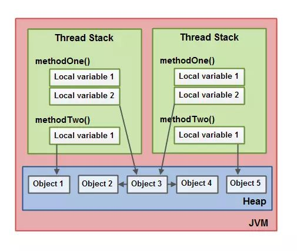
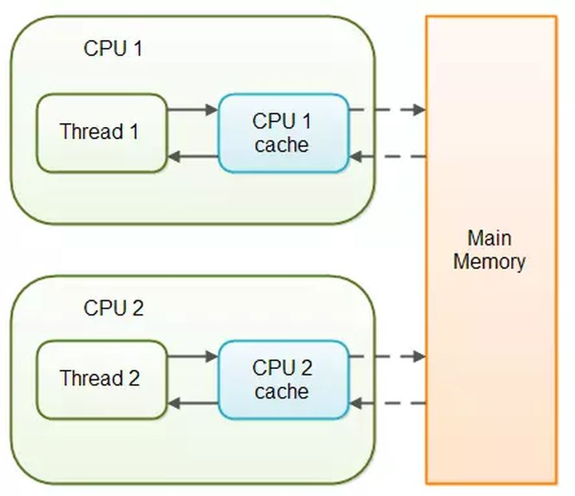
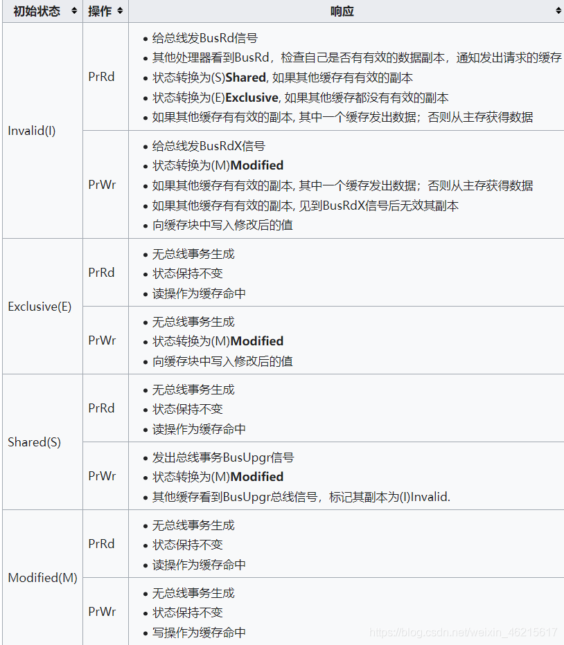
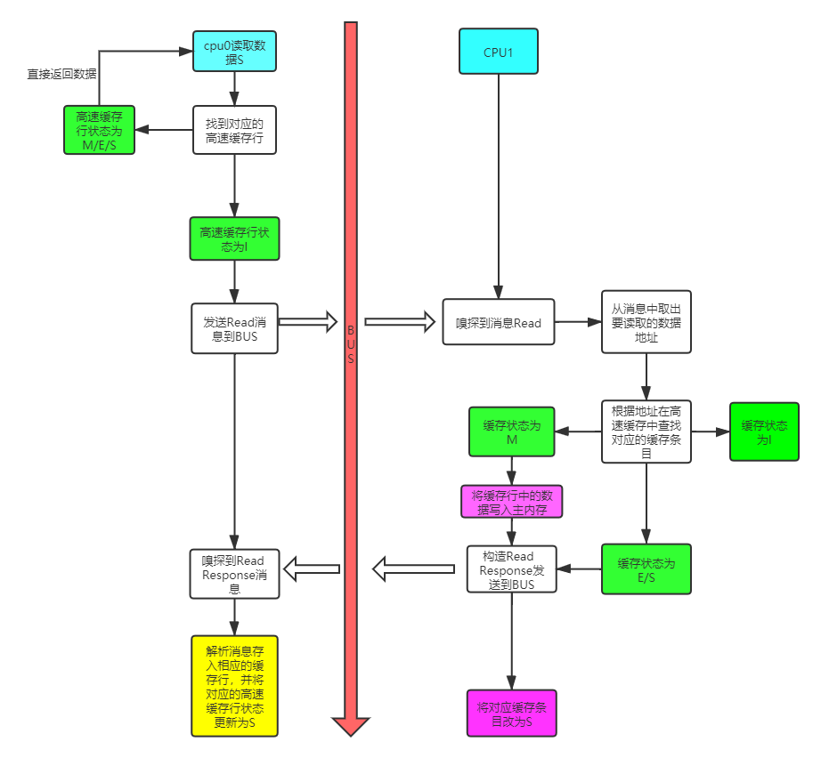
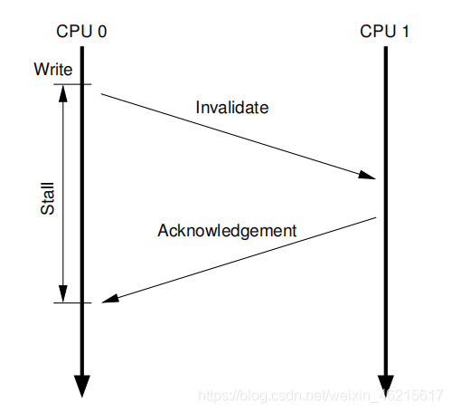
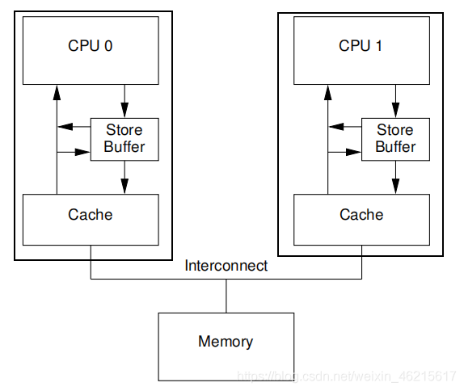
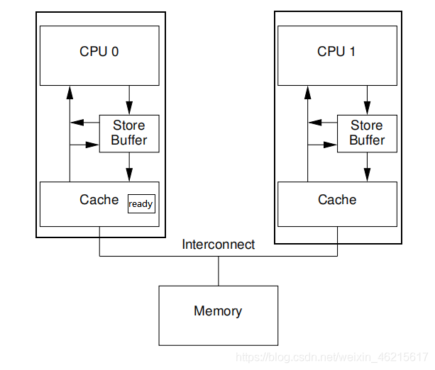
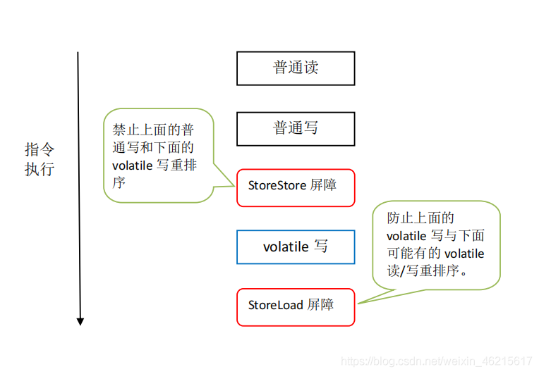
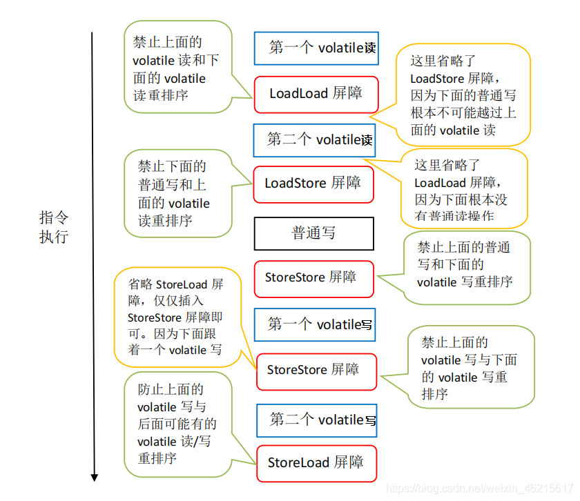
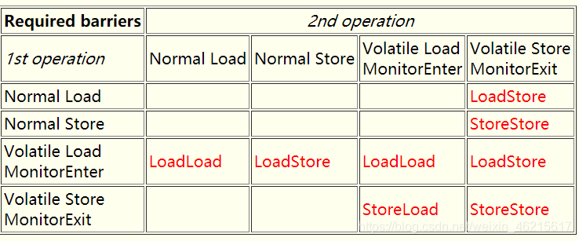

# JMM java内存模型
## 内存模型简介
&emsp; 我们常说的JVM内存模式指的是JVM的内存分区；而Java内存模式是一种虚拟机规范。
&emsp; Java虚拟机规范中定义了Java内存模型（Java Memory Model，JMM），用于屏蔽掉各种硬件和操作系统的内存访问差异，以实现让Java程序在各种平台下都能达到一致的并发效果，JMM规范了Java虚拟机与计算机内存是如何协同工作的：规定了一个线程如何和何时可以看到由其他线程修改过后的共享变量的值，以及如何同步访问的共享变量。
&emsp; Java内存模型（不仅仅是JVM内存分区）：调用栈和本地变量存放在线程栈上，对象存放在堆上。


- 一个本地变量如果是基本类型，在这种情况下，它总是存放在线程栈上。
- 一个本地变量可能是指向一个对象的引用。在这种情况下，引用(这个本地变量)存放在线程栈上，但是对象本身存放在堆上。
- 一个对象可能包含方法，这些方法可能包含本地变量。这些变量仍然存放在线程栈上，即使这些方法所属的对象存放在堆上。
- 一个方法的成员变量可能随着这个对象自身存放在堆上。~~不管这个成员变量是原始类型还是引用类型。~~
- 静态成员变量跟随着类定义一起也存放在堆上。
- 存放在堆上的对象可以被所有持有这个对象引用的线程访问。当一个线程可以访问一个对象时，它也可以访问这个对象的成员变量。如果两个线程同时调用同一个对象上的同一个方法，它们将会都访问这个对象的成员变量，但是每一个线程都拥有这个成员变量的私有拷贝。

## JMM与硬件直接的桥接
&emsp; Java内存模型与硬件内存架构之间存在差异。硬件内存架构没有区分线程栈和堆。对于硬件，所有的线程栈和堆都分布在主内存中。部分线程栈和堆可能有时候会出现在CPU缓存中和CPU内部的寄存器中。如下图所示：

从抽象的角度来看，JMM定义了线程和主内存之间的抽象关系：
* 线程之间的共享变量存储在主内存（Main Memory）中
* 每个线程都有一个私有的本地内存（Local Memory），本地内存是JMM的一个抽象概念，并不真实存在，它涵盖了缓存、写缓冲区、寄存器以及其他的硬件和编译器优化。本地内存中存储了该线程以读/写共享变量的拷贝副本。
* 从更低的层次来说，主内存就是硬件的内存，而为了获取更好的运行速度，虚拟机及硬件系统可能会让工作内存优先存储于寄存器和高速缓存中。
* Java内存模型中的线程的工作内存（working memory）是cpu的寄存器和高速缓存的抽象描述。而JVM的静态内存储模型（JVM内存模型）只是一种对内存的物理划分而已，它只局限在内存，而且只局限在JVM的内存。

## JMM模型层面的线程间通信
关于主内存与工作内存之间的具体交互协议，即一个变量如何从主内存拷贝到工作内存、如何从工作内存同步到主内存之间的实现细节，Java内存模型定义了以下八种操作来完成：

*   **lock（锁定）**：作用于主内存的变量，把一个变量标识为一条线程独占状态。
*   **unlock（解锁）**：作用于主内存变量，把一个处于锁定状态的变量释放出来，释放后的变量才可以被其他线程锁定。
*   **read（读取）**：作用于主内存变量，把一个变量值从主内存传输到线程的工作内存中，以便随后的load动作使用
*   **load（载入）**：作用于工作内存的变量，它把read操作从主内存中得到的变量值放入工作内存的变量副本中。
*   **use（使用）**：作用于工作内存的变量，把工作内存中的一个变量值传递给执行引擎，每当虚拟机遇到一个需要使用变量的值的字节码指令时将会执行这个操作。
*   **assign（赋值）**：作用于工作内存的变量，它把一个从执行引擎接收到的值赋值给工作内存的变量，每当虚拟机遇到一个给变量赋值的字节码指令时执行这个操作。
*   **store（存储）**：作用于工作内存的变量，把工作内存中的一个变量的值传送到主内存中，以便随后的write的操作。
*   **write（写入）**：作用于主内存的变量，它把store操作从工作内存中一个变量的值传送到主内存的变量中。

Java内存模型还规定了在执行上述八种基本操作时，必须满足如下规则：

*   如果要把一个变量从主内存中复制到工作内存，就需要按顺寻地执行read和load操作， 如果把变量从工作内存中同步回主内存中，就要按顺序地执行store和write操作。但Java内存模型只要求上述操作必须按顺序执行，而没有保证必须是连续执行。
*   不允许read和load、store和write操作之一单独出现
*   不允许一个线程丢弃它的最近assign的操作，即变量在工作内存中改变了之后必须同步到主内存中。
*   不允许一个线程无原因地（没有发生过任何assign操作）把数据从工作内存同步回主内存中。
*   一个新的变量只能在主内存中诞生，不允许在工作内存中直接使用一个未被初始化（load或assign）的变量。即就是对一个变量实施use和store操作之前，必须先执行过了assign和load操作。
*   一个变量在同一时刻只允许一条线程对其进行lock操作，但lock操作可以被同一条线程重复执行多次，多次执行lock后，只有执行相同次数的unlock操作，变量才会被解锁。lock和unlock必须成对出现
*   如果对一个变量执行lock操作，将会清空工作内存中此变量的值，在执行引擎使用这个变量前需要重新执行load或assign操作初始化变量的值
*   如果一个变量事先没有被lock操作锁定，则不允许对它执行unlock操作；也不允许去unlock一个被其他线程锁定的变量。
*   对一个变量执行unlock操作之前，必须先把此变量同步到主内存中（执行store和write操作）。

## JMM对有序性的支持
&emsp; 在Java内存模型中，允许编译器和处理器对指令进行重排序，但是重排序过程不会影响到单线程程序的执行，却会影响到多线程并发执行的正确性。
&emsp; 在Java里面，可以通过volatile关键字来保证一定的“有序性”。另外可以通过synchronized和Lock来保证有序性，很显然，synchronized和Lock保证每个时刻是有一个线程执行同步代码，相当于是让线程顺序执行同步代码，自然就保证了有序性。
&emsp; Java内存模型具备一些先天的“有序性”，即不需要通过任何手段就能够得到保证的有序性，这个通常也称为 happens-before 原则。如果两个操作的执行次序无法从happens-before原则推导出来，那么它们就不能保证它们的有序性，虚拟机可以随意地对它们进行重排序。即重排序是在遵循happens-before规则下进行的。
&emsp; happens-before原则（先行发生原则）：
*   程序次序规则：一个线程内，按照代码顺序，书写在前面的操作先行发生于书写在后面的操作
*   锁定规则：一个unLock操作先行发生于后面对同一个锁的lock操作
*   volatile变量规则：对一个变量的写操作先行发生于后面对这个变量的读操作
*   传递规则：如果操作A先行发生于操作B，而操作B又先行发生于操作C，则可以得出操作A先行发生于操作C
*   线程启动规则：Thread对象的start()方法先行发生于此线程的每个一个动作
*   线程中断规则：对线程interrupt()方法的调用先行发生于被中断线程的代码检测到中断事件的发生
*   线程终结规则：线程中所有的操作都先行发生于线程的终止检测，我们可以通过Thread.join()方法结束、Thread.isAlive()的返回值手段检测到线程已经终止执行
*   对象终结规则：一个对象的初始化完成先行发生于他的finalize()方法的开始

&emsp; 这8条原则摘自《深入理解Java虚拟机》,这8条规则中，前4条规则是比较重要的.
剖析前4条规则：
1. 对于程序次序规则来说，我的理解就是一段程序代码的执行在单个线程中看起来是有序的。注意，虽然这条规则中提到“书写在前面的操作先行发生于书写在后面的操作”，这个应该是程序看起来执行的顺序是按照代码顺序执行的，因为虚拟机可能会对程序代码进行指令重排序。虽然进行重排序，但是最终执行的结果是与程序顺序执行的结果一致的，它只会对不存在数据依赖性的指令进行重排序。因此，在单个线程中，程序执行看起来是有序执行的，这一点要注意理解。事实上，这个规则是用来保证程序在单线程中执行结果的正确性，但无法保证程序在多线程中执行的正确性。
2. 第二条规则也比较容易理解，也就是说无论在单线程中还是多线程中，同一个锁如果出于被锁定的状态，那么必须先对锁进行了释放操作，后面才能继续进行lock操作。
3. 第三条规则是一条比较重要的规则，也是后文将要重点讲述的内容。直观地解释就是，如果一个线程先去写一个变量，然后一个线程去进行读取，那么写入操作肯定会先行发生于读操作。
4. 第四条规则实际上就是体现happens-before原则具备传递性。

----

# 底层MESI协议
## 缓存一致性
&emsp; 由于在多 CPU 中，每个线程可能会运行在不同的 CPU 内，并且每个线程拥有自己的高速缓存。同一份数据可能会被缓存到多个 CPU 中，如果在不同 CPU 中运行的不同线程看到同一份内存的缓存值不一样就会存在缓存不一致的问题(不一致会导致脏读和丢失更新)，那么怎么解决缓存一致性问题呢？CPU层面提供了两种解决方法：**总线锁**和**缓存锁**
### 总线锁
&emsp; 总线锁，简单来说就是，在多CPU下，当其中一个处理器要对共享内存进行操作的时候，在总线上发出一个 LOCK#信号，这个信号使得其他处理器无法通过总线来访问到共享内存中的数据，总线锁定把 CPU 和内存之间的通信锁住了(CPU和内存之间通过总线进行通讯)，这使得锁定期间，其他处理器不能操作其他内存地址的数据。然而这种做法的代价显然太大，那么如何优化呢？优化的办法就是降低锁的粒度，所以CPU就引入了缓存锁。

### 缓存锁
&emsp; 缓存锁的核心机制是基于缓存一致性协议来实现的，一个处理器的缓存回写到内存会导致其他处理器的缓存无效，IA-32处理器和Intel 64处理器使用MESI实现缓存一致性协议(注意，**缓存一致性协议不仅仅是通过MESI实现的，不同处理器实现了不同的缓存一致性协议**)

&emsp; 所谓的总线：贯穿整个系统的是一组电子管道，称作总线，他携带信息字节并负责在各个部件间传递，可以理解为计算机中的高速公路，各种需要走这个高速的硬件互相在上面交流信息。
&emsp; 系统总线分为 **数据总线(Data BUS)** 、**地址总线(Address BUS)**和**控制总线(Control BUS)**。
- 数据总线：传送CPU与内存或其他器件之间的数据。
- 地址总线：CPU用来访问（读取/写入)计算机内存的物理地址
- 控制总线：CPU对外界器件进行控制

## MESI
&emsp; MESI 是一种广为使用的缓存一致性协议，x86处理器所使用的的缓存一致性协议就是基于MESI协议的。
&emsp; "MESI" 该名称来自4个状态首字母的缩写分别是以下四种：
- **Modified(更改过的，记为M)** ：代表**该缓存行中的内容被修改了**，并且该缓存行只被缓存在该CPU中。这个状态的缓存行中的数据和内存中的不一样，在未来的某个时刻它会被写入到内存中（当其他CPU要读取该缓存行的内容时。或者其他CPU要修改该缓存对应的内存中的内容时。同时，由于MESI协议中的任意一个时刻只能够有一个处理器对同一内存地址对应的数据进行更新。**因此在多个处理器上的高速缓存中，Tag值相同的缓存条目，任意时刻只能够有一个缓存条目处于该状态**。 其缓存行中包含的**数据与主内存中包含的数据不一致**。
- **Exclusive(独占的，记为E)** ：和 Shared 状态一样，表明该cache line是内存中某一段数据的拷贝。区别在于，该cache line独占该内存地址的副本数据，其它处理器的cache line不能同时持有它。其缓存行中包含的**数据与主内存中包含的数据一**致。
- **Shared(共享的，记为S)** :该状态表示相应缓存行包含相应内存地址所对应的副本数据，并且其他处理器上的高速缓存中也可能包含相同内存地址对应的副本数据。当前 CPU 不能对其进行修改。要修改的话需要转为 Exclusive 状态后再进行；
- **Invalid(无效的，记为I)** :表示**相应缓存行中不包含任何内存地址对应的有效副本数据**。该状态是缓存条目的初始状态。

### 协议状态迁移
&emsp;**Snoopy** 协议。这种协议更像是一种数据通知的总线型的技术。CPU Cache通过这个协议可以识别其它Cache上的数据状态。如果有数据共享的话，可以通过广播机制将共享数据的状态通知给其它CPU Cache。这个协议要求每个CPU Cache 都可以“**嗅探**”数据事件的通知并做出相应的反应。


处理器对缓存的请求:
- `PrRd`: 处理器请求读一个缓存块
- `PrWr`: 处理器请求写一个缓存块

总线对缓存的请求:
- `BusRd`: 嗅探器请求指出其他处理器请求读一个缓存块
- `BusRdX`: 嗅探器请求指出其他处理器请求写一个该处理器不拥有的缓存块
- `BusUpgr`: 嗅探器请求指出其他处理器请求写一个该处理器拥有的缓存块
- `Flush`: 嗅探器请求指出请求回写整个缓存到主存
- `FlushOpt`: 嗅探器请求指出整个缓存块被发到总线以发送给另外一个处理器（缓存到缓存的复制）

处理器操作带来的状态转化:



不同总线操作带来的状态转化：


### MESI消息协议
&emsp; 为了后续操作的描述，对上述消息进行简化，定义下面的消息协调各个处理器的读写操作

| 消息名  | 消息类型  |  描述 |
| :------------ | :------------ | :------------ |
|Read|请求|通知其他处理器和内存，当前处理器准备读取某个数据。该消息内包含待读取数据的内存地址|
|Read Response|响应|该消息内包含被请求读取的数据。该消息可能是主内存提供的，也可能是嗅探Read消息的其他高速缓存提供的|
|Invalidate|请求|通知其他处理器将其高速缓存中指定内存地址对应的缓存条目状态置为I，即通知这些处理器删除指定内存地址的副本数据(删除指逻辑删除，实际上是更新相应缓存条目的Flag值)|
|Invalidate Acknowledge|响应|接收到Invalidate消息的处理器必须回复此消息，表示已经删除了其高速缓存内对应的数据副本|
|Read Invalidate|请求|此消息为Read 和 Invalidate消息组成的复合消息，其作用在于通知其他处理器当前处理器准备更新一个数据，并请求其他处理器删除其高速缓存内对应的副本数据。接收到该消息的处理器必须回复Read Response 和 Invalidate Acknowledge消息|
|Writeback|响应|消息包含了需要写入主内存的数据和其对应的内存地址|

#### MESI读取数据


假设cpu0要读取数据S。首先cpu0会根据地址找到对应的高速缓存行。
- 如果该高速缓存行的状态为M,E或者S，那么该处理器可以直接从相应的缓存行中读取数据，而无需往总线发送任何消息。
- 如果找到的高速缓存行的状态为I，则说明该处理器的高速缓存行中并不存在该有效数据副本，此时cpu0会向总线发送Read消息。cpu1嗅探到Read消息后，会从该消息中取出待读取的内存地址，并根据该地址在其高速缓存器中查找对应的高速缓存行。
    - 如果cpu1找到的高速缓存行的状态为I，则说明该处理器也没有该缓存数据，那么cpu0所接收到的Read Response消息就来自主内存。
    - 如果cpu1找到的高速缓存行的状态为S/E，那么cpu1会构造相应的Read Response消息并将相应缓存行中的数据塞入该信息；
    - 如果cpu1找到的高速缓存行的状态为M，那么cpu1可能在往总线发送Read Response消息前将相应的数据写入主内存，之后，该高速缓存行的状态也会被更新为S。

#### MESI写入数据

&emsp; 下面看一下cpu0往地址A写数据的实现。任何一个数据执行内存写操作时必须拥有相应数据的所有权。在执行内存写操作的时候，cpu0会根据内存地址A找到相应的高速缓存行。
- cpu0找的高速缓存行的状态为E/M。则说明该处理器已经拥有相应数据的使用权，此时该处理器可以直接将数据写入相应的缓存行并将相应缓存行的状态更新为M。
- cpu0找到的高速缓存行的状态如果为S，则说明cpu1上的高速缓存也可能保留了地址A对应的数据副本，此时cpu0需要往总线发送Invalidate消息，cpu0在接收到其他处理器所回复的Invalidate Acknowledge消息之后会将相应的缓存条目的状态更新为E，此时cpu0获得了地址A上数据的所有权，接着，cpu0便可以将数据写入相应的缓存行，并将相应高速缓存行的状态更新为M。
- cpu0找到的高速缓存行的状态如果为I，则表示该处理器不包含地址A对应的有效副本数据，此时cpu0会向总线发送Read Invalidate消息。**其他处理器接收到Invalidate消息或者Read Invalidate消息后，必须根据消息中包含的内存地址在该处理器的高速缓存中找到相应的高速缓存行，如果cpu1找到的高速缓存行的状态不为I，那么cpu1必须将相应高速缓存行的状态更新为I，以删除相应的副本数据并给总线回复Invalidate Acknowledge消息**。 cpu0在接收到Read Response消息以及其它处理器所回复的Invalidate Acknowledge消息之后，会将相应高速缓存行中的状态更新为E，接着cpu0便可以往相应的缓存行中写入数据并将状态更新为M。

### Store Buffer / Invalidate Queue
&emsp; MESI解决了缓存一致性问题，但是它有一个性能弱点：处理器执行写操作时，必须等待其他处理器将其高速缓存中的相应副本数据删除并接收到这些处理器所回复的Invalidate Acknowledge/Read Response消息之后才能将数据写入高速缓存。

为了规避和减少这种等待造成的写操作的延迟(Latency),硬件设计者引入了Store Buffer和Invalidate Queue。(注意: **读操作是同步的**)

#### Store Buffer
&emsp; Store Buffer是处理器内部的一个容量比高速缓存器还小的私有高速存储部件，每个处理器都有其写存储器，并且一个处理器无法读取另外一个处理器上Store Buffer中的内容。

引入Store Buffer后，处理器在执行写操作时:

|缓存状态|操作|
| :------------ | :------------ |
|E/M|处理器可能会直接将数据写入相应的缓存行而无需发送任何消息(取决于具体处理器的实现)|
|S|处理器会先将写操作的相关数据存入Store Buffer中，并发送Read Invalidate消息。|
|I|I状态表示此处理器的高速缓存不含有待操作的数据，遇到了写未命中(Write Miss),处理器会先将写操作的相关数据写入Store Buffer，并发送Read Invalidate消息。|

&emsp; 在执行完上面的某一个状态的操作后，处理器可以并不等待其他处理器返回Invalidate Acknowledge/Read Response消息而是继续执行其他指令。当一个处理器接收到其他处理器所回复的针对同一个缓存行的所有Invalidate Acknowledge消息的时候，该处理器会将Store Buffer中针对相应地址的写操作的结果写入相应的缓存行，此时写操作对于其他处理器来说才算完成。

#### 存储转发
&emsp; 有了Store Buffer后，一个处理器在更新了一个变量之后，马上又读取了该变量的值，但是由于该处理器先前对该变量的更新结果可能仍然还停留在Store Buffer中，因此该变量相应的内存地址所对应的缓存行中仍存储着该变量的旧值。
&emsp;因此处理器在执行读操作的时候会根据内存地址查询Store Buffer。
- 如果Store Buffer存在该数据，那么会直接将该数据作为结果返回。
- 如果不存在，处理器会从高速缓存中读取数据。

&emsp; 这种处理器直接从Store Buffer中读取数据来实现内存读操作的技术被称为存储转发(Store Buffer)。

#### Store Buffer导致的问题
##### StoreLoad重排序
假设处理器cpu0和cpu1上的两个线程未使用任何同步措施而各自按照下表的顺序交错执行，其中X,Y为共享变量，其初始值为0，r1，r2为局部变量。

| cpu0 | cpu1 |
| :-------- | :--------- |
| X=1；//S1 | Y=1;//S3 |
| r1=Y；//L2 ||
|| r2=X;//L4 |

&emsp; 当cpu0执行到L2时，虽然在此之前S3已经被cpu1执行了，但是由于S3的执行结果可能仍然停留在cpu1的Store Buffer中，而一个处理器无法读取另外一个处理器的Store Buffer中的内容，所以cpu0此时读取到的Y值仍然是其高速缓存中存在的该变量的初始值0。同理，cpu1执行到L4时所读取到变量X的值也可能是该变量的初始值0。
&emsp; 因此，从cpu1的角度来看，cpu1执行L4的那一刻cpu0已经执行了L2而S1却像是尚未被执行，即cpu1对cpu0执行的两个操作的感知顺序是L2—>S1，也就是此时Store Buffer导致了S1(写操作)被重排序到了L2(读操作)之后，这个即StoreLoad重排序。

##### StoreStore重排序
&emsp; 同样假设处理器cpu0和cpu1上的两个线程未使用任何同步措施而各自按照下表的顺序交错执行,其中data,ready为共享变量，其初始值分别为0、false。同时cpu0的Cache中包含变量ready(状态为E/M)的副本，但不包含变量data的副本，那么S1的执行结果会被存入Store Buffer而S2的执行结果会直接存入Cache。


| cpu0 | cpu1 |
| :--------- | :--------- |
| data=1;//S1 ||
| ready=true;//S2 ||
|| while(!ready) continue;//L3 |
||print(data);//L4 |

&emsp; L3被执行时S2对变量ready的更新通过缓存一致性协议可以被cpu1读取到，于是，由于变量ready变为true，cpu1继续执行L4。L4被执行时，由于S1对data的更新结果仍然放在cpu0的Store Buffer中，因此cpu1此时读取到的变量data的值可能仍是其初始值0。
从cpu1的角度来看，S2像是先于S1被执行，即S1(写操作)被重排序到了S2(写操作)之后。这个即StoreStore重排序。

#### Invalidate Queue以及导致的问题
&emsp; 引入Invalidate Queue之后，处理器在接收到Invalidate消息之后并不删除消息中指定地址的副本数据，而是将消息存入 Invalidate Queue之后就回复Invalidate Acknowledge消息，从而减少了执行写操作的处理器所需的等待问题。
&emsp; 导致的问题：


&emsp; 假设还是按照上表执行，但此时cpu0的Cache中存有变量data和ready的副本，cpu1含有变量data的副本而不含有变量ready的副本。
1. cpu0执行S1，此时由于cpu1上存有变量data的副本，因此cpu0会发出Invalidate消息并将S1的结果存入StoreBuffer。
2. cpu1接收到cpu0发出的Invalidate消息时将该消息存入其Invalidate Queue并立马回复Invalidate Acknowledge消息。
3. cpu0接收到Invalidate Acknowledge消息，随即将S1的操作结果写入高速缓存。然后，cpu0执行S2，此时只有cpu0上存有变量ready的副本，因此cpu0无需发送任何消息，直接将S2的操作结果存入高速缓存即可。
4. cpu1执行L3，由于cpu1的高速缓存并没有存储变量ready的副本，因此cpu1发出一个Read消息。
5. cpu0接收到cpu1发出的Read消息并回复Read Response消息，其中该Read Response消息包含的ready变量值为true。
6. cpu1接收到Read Response消息并从中取出ready变量的值(true)，此时L3的循环语句可以结束。
7. cpu1执行L4，此时cpu0为了更新变量data而发出的Invalidate消息可能仍停留在cpu1的Invalidate Queue中，因此cpu1从其高速缓存中读取的变量data的值仍然是其初始值0。

&emsp; 由上可知，由于Invalidate Queue的作用cpu1像是在变量ready不为true的情况下提前读取了变量data的值，也就是说，从cpu0的角度看，L4(读操作)被重排序到了L3(读操作)之前，即LoadLoad重排序。

### 可见性
&emsp; **可见性即一个线程对共享变量值的修改，能够及时被其他线程看到**。 但是由于Store Buffer和Invalidate Queue的存在，使得数据可能不被其他线程及时看到。
1. 现代处理器在一些特定条件下(比如Store Buffer满，I/O指令被执行)会将Store Buffer中的内容写入高速缓存，但是这种写入并不一定是及时的，也就是说Store Buffer中的数据可能并没有刷新到高速缓存。
2. 处理器在执行内存读取操作的时候如果没有根据Invalidate Queue中的内容将该处理器上的高速缓存中的相关副本数据删除，那么也可能导致该处理器读到的数据是过时的数据。

&emsp; 为了解决上面的两个问题，**首先要使写线程对共享变量所做的更新能够及时到达高速缓存，从而使该更新对其他处理器是同步的；其次，读线程所在的处理器要将其Invalidate Queue中的内容进行处理，保证读线程读到的数据是新的**。而底层系统会借助一类被称为内存屏障的特殊指令。
- Store Barrier:可以使执行该指令的处理器冲刷其Store Buffer中的数据到CPU缓存，从而保证某线程对共享变量所做的更新对读线程是可见的。
- Load Barrier：会根据Invalidate Queue中内容所指定的内存地址，将处理器上高速缓存中的状态标记为I，从而使该处理器后续执行这些地址的读操作时必须发送Read消息，从而保证了处理器读到的数据是新的。

<font color="red">&emsp; **注意: 存储转发只能保证当前线程对共享变量所做的更新对当前线程是可见的。Store Barrier是刷新Store Buffer中的数据到当前的CPU缓存，只能保证当前线程对共享变量所做的更新对当前CPU上执行的其他线程是可见的。LoadBarrier立即失效Invalidate Queue中的数据，保证了当前线程对共享变量所做的更新对其他CPU是可见的。** </font>

### x86架构的内存屏障
&emsp; 目前的PC架构绝大多数都是Intel的x86架构，而x86处理器没有使用Invalidate Queue，同时不管高速缓存行的状态是什么，它都会直接将一个写操作的结果存入Store Buffer。因而x86处理器只允许StoreLoad重排序的发生。
x86指令集提供了三个内存屏障指令：
- lfence :x86处理器并没有Invalidate Queue，这个指令的作用只是强制在Ifence指令之前的操作一定在该指令之前完成。
- sfence :实现了Store Barrier,强制所有在sfence指令之前的store指令，都在该sfence指令执行之前被执行，并**把store buffer中的数据冲刷到CPU的Cache中**；所有在sfence指令之后的store指令，都在该sfence指令执行之后被执行。
- mfence :综合了sfence指令与lfence指令的作用，强制所有在mfence指令之前的store/load指令，都在该mfence指令执行之前被执行；所有在mfence指令之后的store/load指令，都在该mfence指令执行之后被执行。

----

# volatile剖析

## 重排序
在执行程序时，为了提高性能，在不影响程序(单线程程序)正确性的情况下，编译器和处理器常常会对指令做重排序。重排序分3 种类型。
*   编译器优化的重排序。编译器在不改变单线程程序语义的前提下，可以重新安排语句的执行顺序。
*   指令级并行的重排序。现代处理器采用了指令级并行技术（Instruction-Level Parallelism，ILP）来将多条指令重叠执行。如果不存在数据依赖性，处理器可以改变语句 对应机器指令的执行顺序。
*   内存系统的重排序。由于处理器使用缓存和读/写缓冲区，这使得加载和存储操作看上去可能是在乱序执行。 从Java源代码到最终实际执行的指令序列，会分别经历下面3种重排序。


## JMM内存屏障
JVM 一共提供了四种 Barrier。比如 `LoadLoad Barrier` 就是放在两次 Load 操作中间的 Barrier，LoadStore 就是放在 Load 和 Store 中间的 Barrier。具体如下：

| 屏障类型 | 指令示例 | 说明 |
| --- | --- | --- |
| LoadLoad Barriers | Load1;LoadLoad;Load2 | 用于保证访问 Load2 的读取操作一定不能重排到 Load1 之前。类似于前面说的 Read Barrier，需要先处理 Invalidate Queue 后再读 Load2； |
| StoreStore Barriers | Store1;StoreStore;Store2 | 用于保证 Store1 及其之后写出的数据一定先于 Store2 写出，即别的 CPU 一定先看到 Store1 的数据，再看到 Store2 的数据。可能会有一次 Store Buffer 的刷写，也可能通过所有写操作都放入 Store Buffer 排序来保证； |
| LoadStore Barriers | Load1;LoadStore;Store2 | 用于保证 Store2 及其之后写出的数据被其它 CPU 看到之前，Load1 读取的数据一定先读入缓存。甚至可能 Store2 的操作依赖于 Load1 的当前值。 |
| StoreLoad Barriers | Store1;StoreLoad;Load2 | 用于保证 Store1 写出的数据被其它 CPU 看到后才能读取 Load2 的数据到缓存。如果 Store1 和 Load2 操作的是同一个地址，StoreLoad Barrier 需要保证 Load2 不能读 Store Buffer 内的数据，得是从内存上拉取到的某个别的 CPU 修改过的值。StoreLoad 一般会认为是最重的 Barrier ，它会清空Invalidate Queue并将Store Buffer中的内容写入高速缓存，即StoreLoad屏障能够实现其他三个基本内存屏障的效果 |

这四个 Barrier 只是 Java 为了跨平台而设计出来的，实际上根据 CPU 的不同，对应 CPU 平台上的 JVM 可能会优化掉一些 Barrier。比如在 x86 平台的`JVM`上只剩下一个 StoreLoad Barrier被使用。

## volatile关键字
&emsp; volatile有不稳定的意思，在Java中。volatile关键字用于修饰**没有final关键字修饰的实例变量或静态变量**，这些变量一般是共享可变的，即一个变量可能被多个线程访问(读/写)，值容易发生变化，因而不稳定。

### 作用
&emsp; volatile关键字的作用包括:保证可见性，保证有序性和保证long/double型变量读写操作的原子性
*   可见性：每次读 volatile 变量总能读到它的最新值，即最后一个线程对它的写入操作，不管这个写入是不是当前线程完成的。
*   有序性: 对一个volatile变量的写操作，先发生于后面任何地方对这个变量的读操作。编译器会放弃对volatile变量做任何冒进的优化，从而禁止了编译器层面的指令重排序，同时在生成汇编指令时在相应的位置插入内存屏障，也禁止了cpu层面和内存层面的指令重排序。_禁止指令重排不是禁止所有的重排_，只是 volatile 写入不能向前排，读取不能向后排。别的重排还是会允许。
*   原子性:在Java语言中，long/double型的变量为8个字节，即64位。对long/double型以外的任何类型变量的写操作都是原子操作，在JMM中，允许虚拟机将没有被volatile修饰的64位数据的读写划分为两次32位的操作，如果有多个线程共享一个并未声明为volatile的long/double类型的变量，并同时对它们进行修改与读取，那么某些线程可能读到异常的值，但这非常罕见，主流的64位商用虚拟机并不会出现这种情况，32位的虚拟机出现这种情况的概率也不大。

### 原理
&emsp; JMM针对编译器制定的volatile重排序规则表如下:

&emsp; 举例来说，第三行最后一个单元格的意思是：在程序中，当第一个操作为普通变量的读或写时，如果第二个操作为volatile写，则编译器不能重排序这两个操作。
*   当第二个操作是volatile写时，不管第一个操作是什么，都不能重排序。这个规则确保volatile写之前的操作不会被编译器重排序到volatile写之后。
*   当第一个操作是volatile读时，不管第二个操作是什么，都不能重排序。这个规则确保volatile读之后的操作不会被编译器重排序到volatile读之前。
*   当第一个操作是volatile写，第二个操作是volatile读时，不能重排序。

&emsp; 在 `JSR-133 Cookbook`中提出几乎无法找到一个“最理想”位置，将内存屏障个数降到最小。因此JMM采取了保守策略，以保证在任意处理器平台，任意的程序都能得到正确的volatile语义。
*   在每个volatile写操作的前面插入一个StoreStore屏障。
*   在每个volatile写操作的后面插入一个StoreLoad屏障，虽然也可以在每条volatile load指令之前插入一个StoreLoad屏障，但对于使用volatile的典型程序来说则会更慢，因为读操作会大大超过写操作。
*   当volatile store后面是一个return时， 此时编译器可能无法准确断定后面是否会有volatile读或写，为了安全起见，编译器通常会在这里插入一个StoreLoad屏障.

*   在每个volatile读操作的后面插入一个LoadLoad屏障和一个LoadStore屏障。


&emsp; 上述volatile写和volatile读的内存屏障插入策略非常保守。在实际执行时，只要不改变 volatile写-读的内存语义，编译器可以根据具体情况省略不必要的屏障。


&emsp; 大部分时候可以简化为下面的表:



&emsp; 由于x86处理器仅支持StoreLoad重排序，因此在x86处理器上Java虚拟机会将LoadLoad内存屏障，LoadStore内存屏障以及StoreStore内存屏障映射为空指令，也就是说只需要在volatile写操作后插入一个StoreLoad内存屏障，其它的都不用管。

----

# volatile实例应用

“观察加入volatile关键字和没有加入volatile关键字时所生成的汇编代码发现，加入volatile关键字时，会多出一个lock前缀指令”
&emsp; lock前缀指令实际上相当于一个内存屏障（也成内存栅栏），内存屏障会提供3个功能：
1）它确保指令重排序时不会把其后面的指令排到内存屏障之前的位置，也不会把前面的指令排到内存屏障的后面；即在执行到内存屏障这句指令时，在它前面的操作已经全部完成；
2）它会强制将对缓存的修改操作立即写入主存；
3）如果是写操作，它会导致其他CPU中对应的缓存行无效。
### 状态标志位
一般为不依赖当前值且具有独立性的true或false。
### Double check 防止重排序
大家应该都很熟悉单例模式的实现，而在并发环境下的单例实现方式，我们通常可以采用双重检查加锁(DCL)的方式来实现。其源码如下：
```java
public class Singleton {
    public static volatile Singleton singleton;
    /**
     * 构造函数私有，禁止外部实例化
     */
    private Singleton() {};
    public static Singleton getInstance() {
        if (singleton == null) {
            synchronized (singleton.class) {
                if (singleton == null) {
                    singleton = new Singleton();
                }
            }
        }
        return singleton;
    }
}

```
&emsp; 现在我们分析一下为什么要在变量singleton之间加上volatile关键字。要理解这个问题，先要了解对象的构造过程，实例化一个对象其实可以分为三个步骤：
*   分配内存空间。
*   初始化对象。
*   将内存空间的地址赋值给对应的引用。

&emsp; 但是由于操作系统可以`对指令进行重排序`，所以上面的过程也可能会变成如下过程：
*   分配内存空间。
*   将内存空间的地址赋值给对应的引用。
*   初始化对象

如果是这个流程，多线程环境下就可能将一个未初始化的对象引用暴露出来，从而导致不可预料的结果。因此，为了防止这个过程的重排序，我们需要将变量设置为volatile类型的变量。