# 1.基本使用


Synchronized是Java中解决并发问题的一种最常用的方法，也是最简单的一种方法。**Synchronized的作用主要有三个**：
1. **原子性**：确保线程互斥的访问同步代码；
2. **可见性**：保证共享变量的修改能够及时可见，其实是通过Java内存模型中的 **“对一个变量unlock操作之前，必须要同步到主内存中；如果对一个变量进行lock操作，则将会清空工作内存中此变量的值，在执行引擎使用此变量前，需要重新从主内存中load操作或assign操作初始化变量值”** 来保证的；
3. **有序性**：有效解决重排序问题，即 **“一个unlock操作先行发生(happen-before)于后面对同一个锁的lock操作”**；

从语法上讲，**Synchronized可以把任何一个非null对象作为"锁"**，在HotSpot JVM实现中，锁有个专门的名字：**对象监视器（Object Monitor）**。

**Synchronized总共有三种用法**：
1. 当synchronized作用在实例方法时，**监视器锁（monitor）便是对象实例（this）**；
2. 当synchronized作用在静态方法时，**监视器锁（monitor）便是对象的Class实例**，因为Class数据存在于永久代，**因此静态方法锁相当于该类的一个全局锁**；
3. 当synchronized作用在某一个对象实例时，**监视器锁（monitor）便是括号括起来的对象实例**；

注意，synchronized 内置锁 是一种 **对象锁（锁的是对象而非引用变量）**，**作用粒度是对象** ，可以用来实现对 **临界资源的同步互斥访问** ，是 可重入 的。**其可重入最大的作用是避免死锁**，如：
> 子类同步方法调用了父类同步方法，如没有可重入的特性，则会发生死锁

**synchronized可见性描述**
&emsp; 加锁（synchronized 同步）的功能不仅仅局限于互斥行为，同时还存在另外一个重要的方面：内存可见性。我们不仅希望防止某个线程正在使用对象状态而另一个线程在同时修改该状态，而且还希望确保当一个线程修改了对象状态后，其他线程能够看到该变化。而线程的同步恰恰也能够实现这一点。
&emsp; 内置锁可以用于确保某个线程以一种可预测的方式来查看另一个线程的执行结果。为了确保所有的线程都能看到共享变量的最新值，可以在所有执行读操作或写操作的线程上加上同一把锁。下图示例了同步的可见性保证。
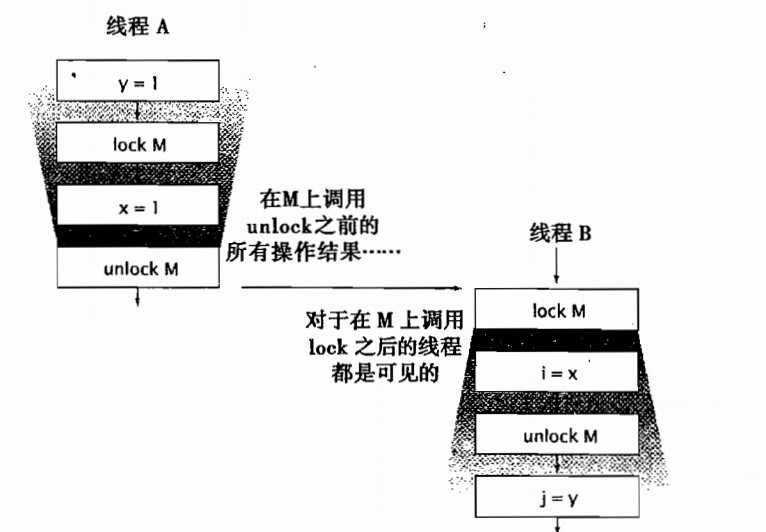
&emsp; 当线程 A 执行某个同步代码块时，线程 B 随后进入由同一个锁保护的同步代码块，这种情况下可以保证，当锁被释放前，A 看到的所有变量值（锁释放前，A 看到的变量包括 y 和 x）在 B 获得同一个锁后同样可以由 B 看到。换句话说，当线程 B 执行由锁保护的同步代码块时，可以看到线程 A 之前在同一个锁保护的同步代码块中的所有操作结果。如果在线程 A unlock M 之后，线程 B 才进入 lock M，那么线程 B 都可以看到线程 A unlock M 之前的操作，可以得到 i=1，j=1。如果在线程 B unlock M 之后，线程 A 才进入 lock M，那么线程 B 就不一定能看到线程 A 中的操作，因此 j 的值就不一定是 1。
&emsp; <font color="green">unlock操作相当于volatile写，lock相当于volatile读。又由于synchronized的执行是互斥的，即同一把锁的执行的读写操作一定是unlock同步主存后，另一线程lock从主存读取</font>

**synchronized 和 Volatile 可见性的比较**
* volatile 变量是一种稍弱的同步机制在访问 volatile 变量时不会执行加锁操作，因此也就不会使执行线程阻塞，因此 volatile 变量是一种比 synchronized 关键字更轻量级的同步机制。
* 从内存可见性的角度看，写入 volatile 变量相当于退出同步代码块，而读取 volatile 变量相当于进入同步代码块。
* 在代码中如果过度依赖 volatile 变量来控制状态的可见性，通常会比使用锁的代码更脆弱，也更难以理解。仅当 volatile 变量能简化代码的实现以及对同步策略的验证时，才应该使用它。一般来说，用同步机制会更安全些。
* 加锁机制（即同步机制）既可以确保可见性又可以确保原子性，而 volatile 变量只能确保可见性，原因是声明为 volatile 的简单变量如果当前值与该变量以前的值相关，那么 volatile 关键字不起作用，也就是说如下的表达式都不是原子操作：`count++`、`count = count+1`。

当且仅当满足以下所有条件时，才应该使用 volatile 变量：
* 对变量的写入操作不依赖变量的当前值，或者你能确保只有单个线程更新变量的值。
* 该变量没有包含在具有其他变量的不变式中。

----

# 2.同步原理
&emsp; 数据同步依赖锁，那么锁的同步依赖什么？答案： **synchronized给出的答案是在软件层面依赖JVM，而j.u.c.Lock给出的答案是在硬件层面依赖特殊的CPU指令。**

当一个线程访问同步代码块时，**首先是需要得到锁才能执行同步代码，当退出或者抛出异常时必须要释放锁**，那么它是如何来实现这个机制的呢？我们先看一段简单的代码：
```java
package com.paddx.test.concurrent;

public class SynchronizedDemo {
    public void method() {
        synchronized (this) {
            System.out.println("Method 1 start");
        }
    }
}
```
查看反编译后结果：

- **monitorenter**：每个对象都是一个监视器锁(monitor)。当monitor被占用时就会处于锁定状态，线程执行`monitorenter`指令时会尝试获取monitor的所有权，过程如下：
    - **如果monitor的进入数为0**，则线程进入monitor，然后将进入数设置为1，该线程即为monitor的所有者；
    - **如果线程已占有该monitor**，只是重新进入，则进入monitor的进入数加1；
    - **如果其他线程已经占用了monitor**，则该线程进入阻塞状态，直到monitor的进入数为0，再重新尝试获取monitor的所有权。
- **monitorexit**：执行monitorexit的线程必须是objectref所对应的monitor的所有者(必须是获取当前对象锁的线程). **指令执行时，monitor的进入数减1，如果减1后进入数为0，那线程退出monitor，不再是这个monitor的所有者**。其他被这个monitor阻塞的线程可以尝试去获取这个monitor的所有权。
     > **monitorexit指令出现了两次，第1次为同步正常退出释放锁；第2次为发生异步退出释放锁**；

&emsp; 通过上面两段描述，我们应该能很清楚的看出Synchronized的实现原理，**Synchronized的语义底层是通过一个monitor的对象来完成，其实wait/notify等方法也依赖于monitor对象**，这就是为什么只有在同步的块或者方法中才能调用wait/notify等方法，**否则会抛出java.lang.IllegalMonitorStateException的异常的原因**。

**再来看一下同步方法：**
```java
package com.paddx.test.concurrent;

public class SynchronizedMethod {
    public synchronized void method() {
        System.out.println("Hello World!");
    }
}
```
**查看反编译后结果：**
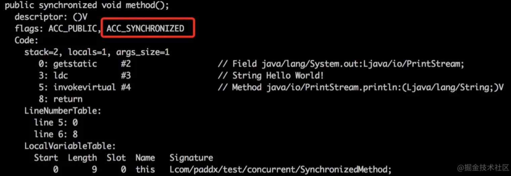
&emsp; 从编译的结果来看，方法的同步并没有通过指令 **`monitorenter`** 和 **`monitorexit`** 来完成（理论上其实也可以通过这两条指令来实现），不过相对于普通方法，其常量池中多了 **`ACC_SYNCHRONIZED`** 标示符。**JVM就是根据该标示符来实现方法的同步的**：
> 当方法调用时，**调用指令将会检查方法的 ACC_SYNCHRONIZED 访问标志是否被设置**，如果设置了，**执行线程将先获取monitor**，获取成功之后才能执行方法体，**方法执行完后再释放monitor**。在方法执行期间，其他任何线程都无法再获得同一个monitor对象。

&emsp; 两种同步方式本质上没有区别，只是方法的同步是一种隐式的方式来实现，无需通过字节码来完成。**两个指令的执行是JVM通过调用操作系统的互斥原语mutex来实现，被阻塞的线程会被挂起、等待重新调度**，会导致“用户态和内核态”两个态之间来回切换，对性能有较大影响。

----

# 3.同步概念
## 3.1 Java对象头
&emsp; 在JVM中，对象在内存中的布局分为三块区域：**对象头、实例数据和对齐填充**。如下图所示：
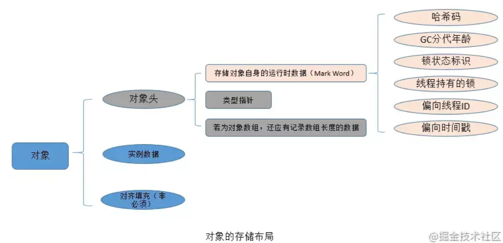
> 1.  **实例数据**：存放类的属性数据信息，包括父类的属性信息；
> 2.  **对齐填充**：由于虚拟机要求 **对象起始地址必须是8字节的整数倍**。填充数据不是必须存在的，仅仅是为了字节对齐；
> 3.  **对象头**：**Java对象头一般占有2个机器码**（在32位虚拟机中，1个机器码等于4字节，也就是32bit，在64位虚拟机中，1个机器码是8个字节，也就是64bit），但是 **如果对象是数组类型，则需要3个机器码，因为JVM虚拟机可以通过Java对象的元数据信息确定Java对象的大小**，但是无法从数组的元数据来确认数组的大小，所以用一块来记录数组长度。

&emsp; **Synchronized用的锁就是存在Java对象头里的**，那么什么是Java对象头呢？Hotspot虚拟机的对象头主要包括两部分数据：**Mark Word（标记字段）、Class Pointer（类型指针）**。其中 **Class Pointer是对象指向它的类元数据的指针**，虚拟机通过这个指针来确定这个对象是哪个类的实例，**Mark Word用于存储对象自身的运行时数据，它是实现轻量级锁和偏向锁的关键**。 Java对象头具体结构描述如下：

&emsp; **Mark Word用于存储对象自身的运行时数据，如：哈希码（HashCode）、GC分代年龄、锁状态标志、线程持有的锁、偏向线程 ID、偏向时间戳等**。下图是Java对象头 **无锁状态下Mark Word部分的存储结构**（32位虚拟机）：

&emsp; 对象头信息是与对象自身定义的数据无关的额外存储成本，但是考虑到虚拟机的空间效率，**Mark Word被设计成一个非固定的数据结构以便在极小的空间内存存储尽量多的数据，它会根据对象的状态复用自己的存储空间**，也就是说，**Mark Word会随着程序的运行发生变化，可能变化为存储以下4种数据**：
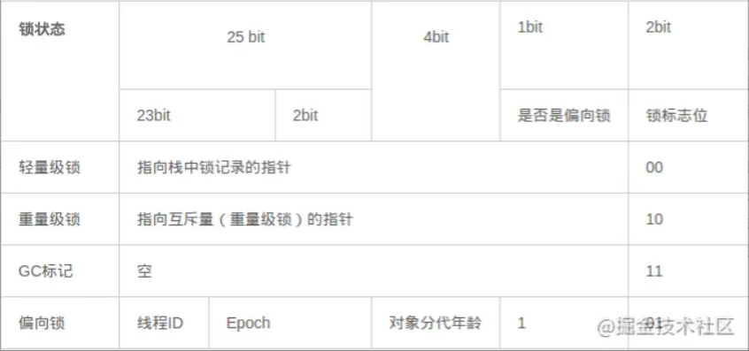
&emsp; 在64位虚拟机下，**Mark Word是64bit大小的**，其存储结构如下：
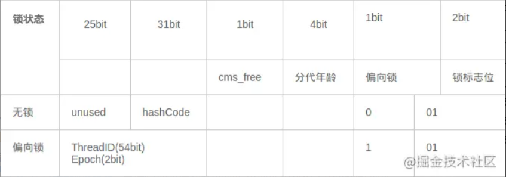
&emsp; 对象头的最后两位存储了锁的标志位，**01是初始状态，未加锁**，其对象头里存储的是对象本身的哈希码，随着锁级别的不同，对象头里会存储不同的内容。**偏向锁存储的是当前占用此对象的线程ID**；**而轻量级则存储指向线程栈中锁记录的指针**。从这里我们可以看到，“锁”这个东西，**可能是个锁记录+对象头里的引用指针**（判断线程是否拥有锁时将线程的锁记录地址和对象头里的指针地址比较)，**也可能是对象头里的线程ID**（判断线程是否拥有锁时将线程的ID和对象头里存储的线程ID比较）。


## 3.2 对象头中的Mark Word与线程中Lock Record
&emsp; 在线程进入同步代码块的时候，**如果此同步对象没有被锁定，即它的锁标志位是01，则虚拟机首先在当前线程的栈中创建我们称之为“锁记录（Lock Record）”的空间，用于存储锁对象的Mark Word的拷贝**，官方把这个拷贝称为Displaced Mark Word。**整个Mark Word及其拷贝至关重要**。注意: 只要执行到monitorenter指令，不管获没获取到锁都会新建Lock record。
&emsp; **Lock Record是线程私有的数据结构**， 每一个线程都有一个Lock Record列表，同时还有一个全局的可用列表。**每一个被锁住的对象Mark Word都会和一个Lock Record关联（对象头的MarkWord中的Lock Word指向Lock Record的起始地址），同时Lock Record中有一个Owner字段存放拥有该锁的线程的唯一标识（或者`object mark word`），表示该锁被这个线程占用**。如下图所示为Lock Record的内部结构：

| Lock Record  | 描述 |
| --- | --- |
| Owner | 初始时为NULL表示当前没有任何线程拥有该monitor record，**当线程成功拥有该锁后保存线程唯一标识**，当锁被释放时又设置为NULL； |
| EntryQ | 关联一个系统互斥锁（semaphore），**阻塞所有试图锁住monitor record失败的线程**； |
| RcThis | **表示blocked或waiting在该monitor record上的所有线程的个数**； |
| Nest | 用来实现 **重入锁的计数**； |
| HashCode | 保存从对象头拷贝过来的HashCode值（可能还包含GC age）。 |
| Candidate | 用来避免不必要的阻塞或等待线程唤醒，因为每次只有一个线程能够成功拥有锁，如果每次前一个释放锁的线程唤醒所有正在阻塞或等待的线程，会引起不必要的上下文切换（从阻塞到就绪然后因为竞争锁失败后又阻塞）从而导致性能严重下降。**Candidate只有两种可能的值0表示没有需要唤醒的线程1表示要唤醒一个继任线程来竞争锁**。|

## 3.3 监视器(Monitor)
&emsp;那什么是Monitor？可以把它理解为 **一个同步工具**，也可以描述为 **一种同步机制**，它通常被 **描述为一个对象**。
&emsp;与一切皆对象一样，所有的Java对象是天生的Monitor，每一个Java对象都有成为Monitor的潜质，**因为在Java的设计中 ，每一个Java对象自打娘胎里出来就带了一把看不见的锁，它叫做内部锁或者Monitor锁**。
&emsp;**也就是通常说Synchronized的对象锁，MarkWord锁标识位为10，其中指针指向的是Monitor对象的起始地址**。在Java虚拟机（HotSpot）中，**Monitor是由ObjectMonitor实现的**，其主要数据结构如下（位于HotSpot虚拟机源码ObjectMonitor.hpp文件，C++实现的）：

```cpp
ObjectMonitor() {
    _header       = NULL;
    _count        = 0; // 记录个数
    _waiters      = 0,
    _recursions   = 0;
    _object       = NULL;
    _owner        = NULL; // 拥有该monitor的线程
    _WaitSet      = NULL; // 处于wait状态的线程，会被加入到_WaitSet
    _WaitSetLock  = 0 ;
    _Responsible  = NULL ;
    _succ         = NULL ;
    _cxq          = NULL ;
    FreeNext      = NULL ;
    _EntryList    = NULL ; // 处于等待锁block状态的线程，会被加入到该列表
    _SpinFreq     = 0 ;
    _SpinClock    = 0 ;
    OwnerIsThread = 0 ;
  }
```
ObjectMonitor中有两个队列，**_WaitSet 和 _EntryList**，用来保存ObjectWaiter对象列表（ **每个等待锁的线程都会被封装成ObjectWaiter对象** ），**_owner指向持有ObjectMonitor对象的线程**，当多个线程同时访问一段同步代码时：
1. 首先会进入`_EntryList`集合，**当线程获取到对象的Monitor后，进入`_Owner`区域并把monitor变量设置为当前线程，同时monitor中的计数器count加1**；
2. 若线程调用`wait()`方法，**将释放当前持有的monitor，`_Owner`变量恢复为null，count自减1，同时该线程进入WaitSet集合中等待被唤醒**；
3. 若当线程执行完毕，**也将释放monitor(锁)并复位count的值，以便其他线程进入获取monitor锁。

> - _WaitSet: 用于管理等待队列线程的，即被wait方法阻塞的线程。
> - _EntryList: 用于管理被阻塞线程(等待持有锁)
> - _Owner：记录当前持有锁的线程，指向了持有该对象的线程。

&emsp; 同时，**Monitor对象存在于每个Java对象的对象头Mark Word中（存储的指针的指向），Synchronized锁便是通过这种方式获取锁的**，也是为什么Java中任意对象可以作为锁的原因，**同时notify/notifyAll/wait等方法会使用到Monitor锁对象，所以必须在同步代码块中使用**。
- 每个对象都存在着一个 monitor 与之关联，一一对应的关系，对象与其 monitor 之间的关系有存在多种实现方式，①monitor可以与对象一起创建销毁②当线程试图获取对象锁时自动生成。当一个 monitor 被某个线程持有后，它便处于锁定状态。
- notify/notifyAll/wait等方法会使用到Monitor锁对象，必须在synchronized同步代码中使用。
- 同步块内遇到wait/notifyAll/wait方法后，锁会直接升级为重量级锁。
- 在线程状态图中如下：
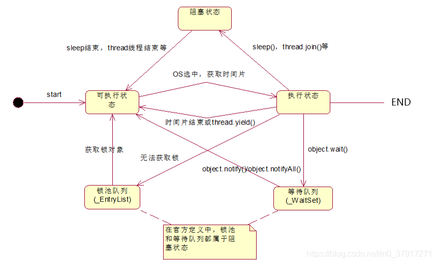
&emsp; 监视器Monitor有两种同步方式：**互斥与协作**。多线程环境下线程之间如果需要共享数据，需要解决互斥访问数据的问题，**监视器可以确保监视器上的数据在同一时刻只会有一个线程在访问**。

**什么时候需要协作？** 比如：
> 一个线程向缓冲区写数据，另一个线程从缓冲区读数据，如果读线程发现缓冲区为空就会等待，当写线程向缓冲区写入数据，就会唤醒读线程，**这里读线程和写线程就是一个合作关系**。JVM通过Object类的wait方法来使自己等待，在调用wait方法后，该线程会释放它持有的监视器，直到其他线程通知它才有执行的机会。一个线程调用notify方法通知在等待的线程，这个等待的线程并不会马上执行，而是要通知线程释放监视器后，它重新获取监视器才有执行的机会。如果刚好唤醒的这个线程需要的监视器被其他线程抢占，那么这个线程会继续等待。Object类中的notifyAll方法可以解决这个问题，它可以唤醒所有等待的线程，总有一个线程执行。


----

# 4.锁的优化
&emsp; 从JDK5引入了现代操作系统新增的CAS院子操作（**JDK5中并没有对synchronized关键字做优化，而是体现在J.U.C中，所以在该版本中concurrent包有更好的性能**), 从JDK6开始，就对synchronized的实现机制进行了较大的调整，**包括使用JDK5引进的CAS自旋外，还增加了自适应的CAS自旋、锁消除、锁粗化、偏向锁、轻量级锁这些优化策略**。由于此关键字的优化使得性能极大提高，同时语义清晰、操作简单、无需手动关闭，所以推荐在允许的情况下尽量使用此关键字，同时在性能上此关键字还有优化的空间。
&emsp; 锁主要存在四种状态，依次是: **无锁状态、偏向锁状态、轻量级锁状态、重量级锁状态**，锁可以从偏向锁升级到轻量级锁。再升级的是重量级锁。**但锁的升级是单向的，也就是说只能从低到高升级，不会出现锁的降级。**
> 在 **JDK 1.6 中默认是开启偏向锁和轻量级锁的**，可以通过-XX:-UseBiasedLocking来禁用偏向锁。

## 4.1 自旋锁
**线程的阻塞和唤醒需要CPU从用户态转为核心态**，频繁的阻塞和唤醒对CPU来说是一件负担很重的工作，势必会给系统的并发性能带来很大的压力。同时我们发现在许多应用上面，**对象锁的锁状态只会持续很短一段时间，为了这一段很短的时间频繁地阻塞和唤醒线程是非常不值得的**。(解决上下文切换带来的损耗)

所以引入自旋锁，何谓自旋锁？

> 所谓自旋锁，就是指当一个线程尝试获取某个锁时，**如果该锁已被其他线程占用，就一直循环检测锁是否被释放**，而不是进入线程挂起或睡眠状态。

&emsp; **自旋锁适用于锁保护的临界区很小的情况，临界区很小的话，锁占用的时间就很短**。自旋等待不能替代阻塞，虽然它可以避免线程切换带来的开销，但是它占用了CPU处理器的时间。**如果持有锁的线程很快就释放了锁，那么自旋的效率就非常好，反之，自旋的线程就会白白消耗掉处理的资源**，它不会做任何有意义的工作，典型的占着茅坑不拉屎，这样反而会带来性能上的浪费。所以说，**自旋等待的时间（自旋的次数）必须要有一个限度，如果自旋超过了定义的时间仍然没有获取到锁，则应该被挂起**。
&emsp; **自旋锁在JDK 1.4.2中引入，默认关闭**，但是可以使用-XX:+UseSpinning开开启，**在JDK1.6中默认开启**。同时自旋的默认次数为10次，**可以通过参数-XX:PreBlockSpin来调整**。
&emsp; 如果通过参数-XX:PreBlockSpin来调整自旋锁的自旋次数，会带来诸多不便。假如将参数调整为10，但是系统很多线程都是等你刚刚退出的时候就释放了锁（假如多自旋一两次就可以获取锁），是不是很尴尬。**于是JDK1.6引入自适应的自旋锁，让虚拟机会变得越来越聪明**。

## 4.2 适应性自旋锁

JDK 1.6引入了更加聪明的自旋锁，即自适应自旋锁。**所谓自适应就意味着自旋的次数不再是固定的，它是由前一次在同一个锁上的自旋时间及锁的拥有者的状态来决定**。那它如何进行适应性自旋呢？

> **线程如果自旋成功了，那么下次自旋的次数会更加多**，因为虚拟机认为既然上次成功了，那么此次自旋也很有可能会再次成功，那么它就会允许自旋等待持续的次数更多。反之，**如果对于某个锁，很少有自旋能够成功**，那么在以后要或者这个锁的时候自旋的次数会减少甚至省略掉自旋过程，以免浪费处理器资源。

有了自适应自旋锁，随着程序运行和性能监控信息的不断完善，虚拟机对程序锁的状况预测会越来越准确，虚拟机会变得越来越聪明。

## 4.3 锁消除
&emsp;为了保证数据的完整性，在进行操作时需要对这部分操作进行同步控制，**但是在有些情况下，JVM检测到不可能存在共享数据竞争，这是JVM会对这些同步锁进行锁消除**。

> **锁消除的依据是逃逸分析的数据支持**
&emsp;如果不存在竞争，为什么还需要加锁呢？所以锁消除可以节省毫无意义的请求锁的时间。变量是否逃逸，对于虚拟机来说需要使用数据流分析来确定，但是对于程序员来说这还不清楚么？在明明知道不存在数据竞争的代码块前加上同步吗？但是有时候程序并不是我们所想的那样？虽然没有显示使用锁，但是在使用一些JDK的内置API时，如StringBuffer、Vector、HashTable等，这个时候会存在隐形的加锁操作。比如StringBuffer的append()方法，Vector的add()方法：

```java
public void vectorTest(){
    Vector<String> vector = new Vector<String>();
    for(int i = 0 ; i < 10 ; i++){
        vector.add(i + "");
    }

    System.out.println(vector);
}
```

## 4.4 锁粗化

在使用同步锁的时候，需要让同步块的作用范围尽可能小—仅在共享数据的实际作用域中才进行同步，这样做的目的是 **为了使需要同步的操作数量尽可能缩小，如果存在锁竞争，那么等待锁的线程也能尽快拿到锁**。

在大多数的情况下，上述观点是正确的。**但是如果一系列的连续加锁解锁操作，可能会导致不必要的性能损耗，所以引入锁粗话的概念**。

> **锁粗话概念比较好理解，就是将多个连续的加锁、解锁操作连接在一起，扩展成一个范围更大的锁**

如上面实例：

> vector每次add的时候都需要加锁操作，JVM检测到对同一个对象（vector）连续加锁、解锁操作，会合并一个更大范围的加锁、解锁操作，即加锁解锁操作会移到for循环之外。

## 4.5 偏向锁
&emsp; 偏向锁是JDK6中的重要引进，因为HotSpot作者经过研究实践发现，**在大多数情况下，锁不仅不存在多线程竞争，而且总是由同一线程多次获得**，为了让获得锁的代价更低，引进了偏向锁。
**偏向锁是在单线程执行代码块时使用的机制**，如果在多线程并发的环境下（即线程A尚未执行完同步代码块，线程B发起了申请锁的申请），则一定会转化为轻量级锁或者重量级锁。

**在JDK5中偏向锁默认是关闭的，而到了JDK6中偏向锁已经默认开启**。如果并发数较大同时同步代码块执行时间较长，则被多个线程同时访问的概率就很大，就可以使用参数-XX:-UseBiasedLocking来禁止偏向锁(但这是个JVM参数，不能针对某个对象锁来单独设置)。

引入偏向锁主要目的是：**为了在没有多线程竞争的情况下尽量减少不必要的轻量级锁执行路径**。因为轻量级锁的加锁解锁操作是需要依赖多次CAS原子指令的，**而偏向锁只需要在置换ThreadID的时候依赖一次CAS原子指令**（由于一旦出现多线程竞争的情况就必须撤销偏向锁，所以偏向锁的撤销操作的性能损耗也必须小于节省下来的CAS原子指令的性能消耗）。

> **轻量级锁是为了在线程交替执行同步块时提高性能，而偏向锁则是在只有一个线程执行同步块时进一步提高性能。**

那么偏向锁是如何来减少不必要的CAS操作呢？首先我们看下无竞争下锁存在什么问题：

> **现在几乎所有的锁都是可重入的，即已经获得锁的线程可以多次锁住/解锁监视对象**，按照之前的HotSpot设计，每次加锁/解锁都会涉及到一些CAS操作（比如对等待队列的CAS操作），**CAS操作会延迟本地调用**，因此偏向锁的想法是 **一旦线程第一次获得了监视对象，之后让监视对象“偏向”这个线程，之后的多次调用则可以避免CAS操作**，说白了就是置个变量，如果发现为true则无需再走各种加锁/解锁流程。

**CAS为什么会引入本地延迟？这要从SMP（对称多处理器）架构说起，下图大概表明了SMP的结构：**

&emsp; 其含义是**所有CPU会共享一条系统总线(BUS)，靠此总线连接主存。每个核都有自己的一级缓存，各核相对于BUS对称分布，因此称这种结构为"对称多处理器"**。

&emsp;而CAS的全称是Compare-And-Swap，是一条CPU的原子指令，其作用是让CPU比较原子的更新某个位置的值。经过调查发现，**其实现方式是基于硬件平台的汇编指令，就是说CAS是靠硬件实现的，JVM只是封装了汇编调用**，那些AtomicInteger类便是使用了这些封装后的接口。
例如：Core1和Core2可能会同时将主存中某个位置的值Load到自己的L1 Cache中，**当Core1在自己的L1 Cache中修改这个位置的值时，会通过总线，使Core2中L1 Cache对应的值"失效", 而Core2一旦发现自己L1 Cache中的值失效(称为Cache命中缺失)则会通过总线从内存中加载该地址最新的值，所有的CPU通过总线的来回通信称之为"Cache一致性流量"，** 因为总线被设计为固定的"通信能力", **如果Cache一致性流量过大，总线将成为瓶颈。** 而当Core和Core2的值再次一致时称之为"Cache一致性", **从这个层面说，锁设计的终极目标是减少Cache的一致性流量。**
而CAS恰好会导致Cache一致性流量，如果有很多线程都共享同一个对象，当某个Core CAS成功时必然会引起总线风暴，**这就是所谓的本地延迟，本质上偏向锁就是为了消除CAS，降低Cache一致性流量**。

**Cache一致性**：上面提到Cache一致性，其实是有协议支持的，现在通用的协议是MESI（最早由Intel开始支持）

### 偏向锁的执行
&emsp;所以当一个线程访问同步块并获得锁时，会在对象头和栈帧中的锁记录中存储锁偏向线程的ID，以后该线程进入和退出同步块时不需要花费CAS操作来争夺锁资源，**只需要检查是否为偏向锁、锁标识为以及ThreadID即可，处理流程如下：**
1. **检测Mark Word是否是可偏向状态**，即是否为偏向锁1，锁标识状态为01；(初始化状态是可偏向但未偏向状态`线程ID=0 可偏向标识=1，锁标志位=01 `)
2. **若为可偏向状态，则测试线程ID是否为当前线程ID**，如果是，则执行步骤5（则无需使用加锁解锁），否则执行步骤3。
3. **如测试线程ID不为当前线程ID**，由于偏向锁不会主动释放因此存储的还是旧线程的ID，需要查看Mark Word中记录的旧线程是否存活。
    - 如果没有存活，那么锁对象会被重置为初始化状态(可偏向但未偏向状态)，当前线程与其他线程可以CAS竞争将其设置为偏向锁；
    - 如果旧线程存活，会立刻查找该线程的栈帧信息,看是否需要继续持有这个锁对象？
        - 旧线程需要继续持有锁，那么暂停旧线程的执行，撤销偏向锁，升级为轻量级锁。
        - 如果旧线程不再使用该锁对象，那么将锁对象设置为初始化状态，当前线程与其他线程可以CAS竞争将其设置为偏向锁。
4. 如上步骤所述，如果遇到**旧线程未释放锁或释放后当前线程CAS竞争失败**，说明存在多线程竞争，**当到达全局安全点时，获得偏向锁的线程被挂起，偏向锁升级为轻量级锁，** 然后被阻塞在安全点的线程继续往下执行同步代码块；被称为**偏向锁的撤销。**
5. 执行同步代码块。

### 偏向锁的撤销
&emsp; 偏向锁的释放采用了 **一种只有竞争才会释放锁的机制，线程是不会主动去释放偏向锁，需要等待其他线程来竞争**。偏向锁的撤销需要 **等待全局安全点**（这个时间点是上没有正在执行的代码）。其步骤如下：
1. **暂停拥有偏向锁的线程；**
2. **判断对象是否还处于被锁定状态**，否，则恢复到初始化状态(可偏向但未偏向状态)以允许其他线程竞争。是，**则挂起持有锁的当前线程，并将指向当前线程的锁记录地址的指针放入对象头Mark Word，升级为轻量级锁状态（00），然后恢复持有锁的当前线程，进入轻量级锁的竞争模式**；

注意：此处将 **当前线程挂起再恢复的过程中并没有发生锁的转移**，仍然在当前线程手中，只是穿插了个 **“将对象头中的线程ID变更为指向锁记录地址的指针”** 这么个事。另外**偏向锁的一次CAS就是将Mark Word中的线程ID以及Lock Record中的owner替换为当前的线程ID**。
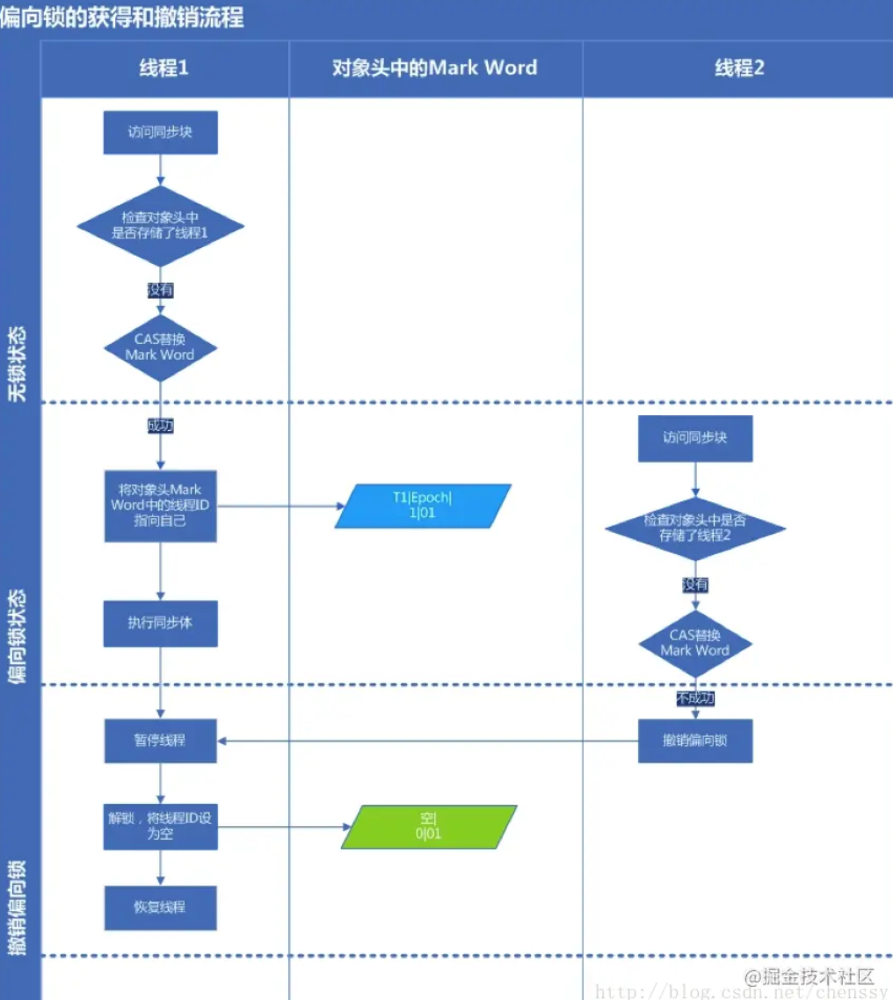

## 4.6 轻量级锁
### 轻量级锁的执行
&emsp; 引入轻量级锁的目的是**在没有多线程竞争的前提下，减少传统的重量级锁使用操作系统互斥量产生的性能消耗。** 当关闭偏向锁功能或者多个线程竞争偏向锁导致锁升级为轻量级锁，则会尝试获取轻量级锁，其步骤如下：
1. 已知在线程进入同步块时，**虚拟机首先将在当前线程的栈帧中建立一个名为锁记录（Lock Record）的空间，用于存储锁对象目前的Mark Word的拷贝**，官方称之为 Displaced Mark Word。此时线程堆栈与对象头的状态如下图所示：
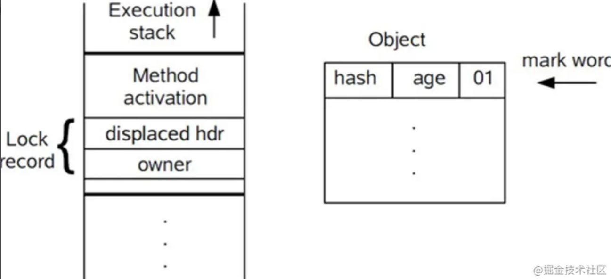
2. 拷贝对象头中的Mark Word复制到锁记录（Lock Record）中；
3. 拷贝成功后，会涉及两层CAS操作：
    - 最外层是判断锁的标识并进行操作：如果锁的状态是不可偏向且未锁定状态(可偏向标志位:0 锁标志位:01)，则进行内层的CAS操作。否则(即状态是不可偏向锁定状态0和00)进行自旋等待。
    - 内层的CAS是更新操作：**虚拟机将使用CAS操作尝试将对象Mark Word 中的Lock Word更新为指向当前线程Lock Record的指针，并且将Lock Record里的owner指针指向Object Mark Word**。如果更新成功则进行步骤4，否则执行步骤5.
4. **如果这个更新操作成功了，那么当前线程就拥有了该对象的锁，并且对象Mark Word的锁标志位设置为"00", 即表示该对象处于轻量级锁定状态**， 此时线程堆栈与对象头的状态如下图:
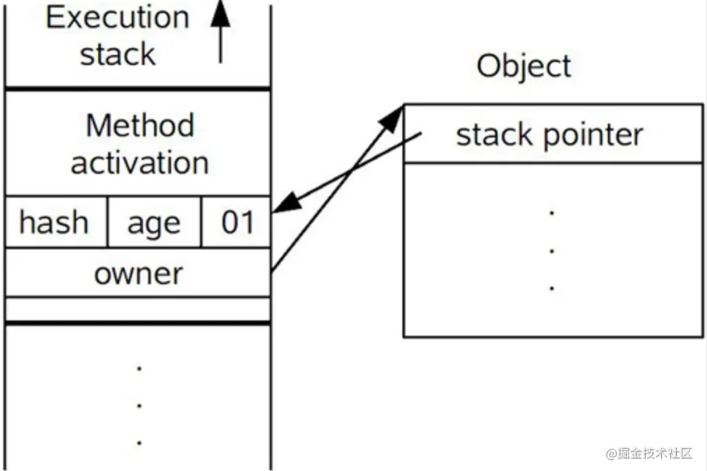
5. **如果这个更新操作失败了，虚拟机首先会检查对象Mark Word中的Lock Word是否指向当前线程的栈帧**，如果是，就说明当前线程已经拥有了这个对象的锁，那就可以直接进入同步块继续执行。**否则说明多个线程竞争锁，进入自旋执行（3），若自旋结束时仍未获得锁，轻量级锁就要膨胀为重量级锁，锁标志的状态值变为“10”，Mark Word中存储的就是指向重量级锁（互斥量）的指针，当前线程以及后面等待锁的线程也要进入阻塞状态**。

### 轻量级锁的释放
&emsp; 轻量级锁的释放也是通过CAS操作来进行的，主要步骤如下：
1. **通过CAS操作尝试把线程中复制的Displaced Mark Word对象替换对象头中当前的Mark Word**；
2. 如果替换成功，**整个同步过程就完成了，恢复到不可偏向无锁定状态(0 01)**;
3. 如果替换失败，**说明其他线程尝试获取过锁(此时锁已膨胀)，那就要在释放锁的同时，唤醒被挂起的线程**。

&emsp; 对于轻量级锁，其性能提升的依据是"**对于绝大部分的锁，在整个生命周期内都不会存在竞争的**"，如果打破这个依据则除了互斥的开销外，还有额外的CAS操作，**因此在有多线程竞争的情况下，轻量级锁比重量级锁更慢**。
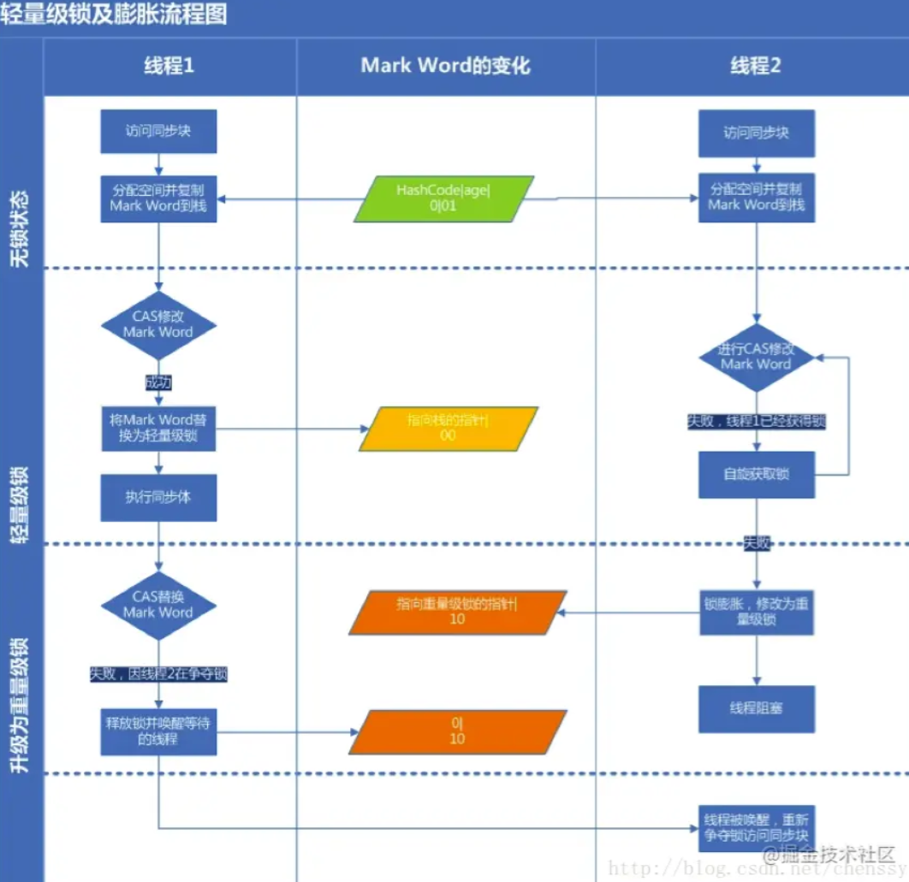

1.  **为什么升级为轻量锁时要把对象头里的Mark Word复制到线程栈的锁记录中呢**？
> 因为在申请对象锁时 **需要以该值作为CAS的比较条件**，同时在升级到重量级锁的时候，**能通过这个比较判定是否在持有锁的过程中此锁被其他线程申请过**，如果被其他线程申请了，则在释放锁的时候要唤醒被挂起的线程。

2.  **为什么会尝试CAS不成功以及什么情况下会不成功**？
> CAS本身是不带锁机制的，其是通过比较而来。假设如下场景：线程A和线程B都在对象头里的锁标识为无锁状态进入，那么如线程A先更新对象头为其锁记录指针成功之后，线程B再用CAS去更新，就会发现此时的对象头已经不是其操作前的对象HashCode了，所以CAS会失败。也就是说，只有两个线程并发申请锁的时候会发生CAS失败。 
> &emsp; 然后线程B进行CAS自旋，等待对象头的锁标识重新变回无锁状态或对象头内容等于对象HashCode（因为这是线程B做CAS操作前的值），这也就意味着线程A执行结束（参见后面轻量级锁的撤销，只有线程A执行完毕撤销锁了才会重置对象头），此时线程B的CAS操作终于成功了，于是线程B获得了锁以及执行同步代码的权限。如果线程A的执行时间较长，线程B经过若干次CAS时钟没有成功，则锁膨胀为重量级锁，即线程B被挂起阻塞、等待重新调度。

此处，如何理解“轻量级”？**“轻量级”是相对于使用操作系统互斥量来实现的传统锁而言的**。但是，首先需要强调一点的是，**轻量级锁并不是用来代替重量级锁的，它的本意是在没有多线程竞争的前提下，减少传统的重量级锁使用产生的性能消耗**。

> **轻量级锁所适应的场景是线程交替执行同步块的情况，如果存在同一时间访问同一锁的情况，必然就会导致轻量级锁膨胀为重量级锁**。

## 4.7 重量级锁
Synchronized是通过对象内部的一个叫做 **监视器锁（Monitor）来实现的**。**但是监视器锁本质又是依赖于底层的操作系统的Mutex Lock来实现的。而操作系统实现线程之间的切换这就需要从用户态转换到核心态，这个成本非常高，状态之间的转换需要相对比较长的时间**，这就是为什么Synchronized效率低的原因。因此，这种依赖于操作系统Mutex Lock所实现的锁我们称之为 **“重量级锁”**。

## 4.8 重量级锁、轻量级锁和偏向锁之间转换
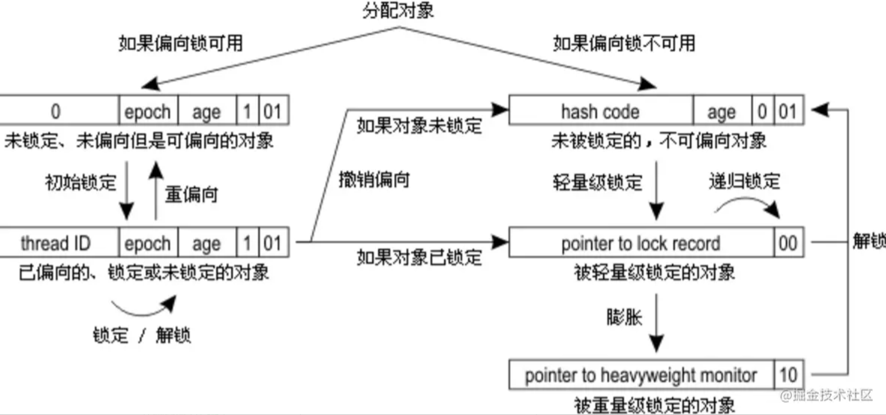
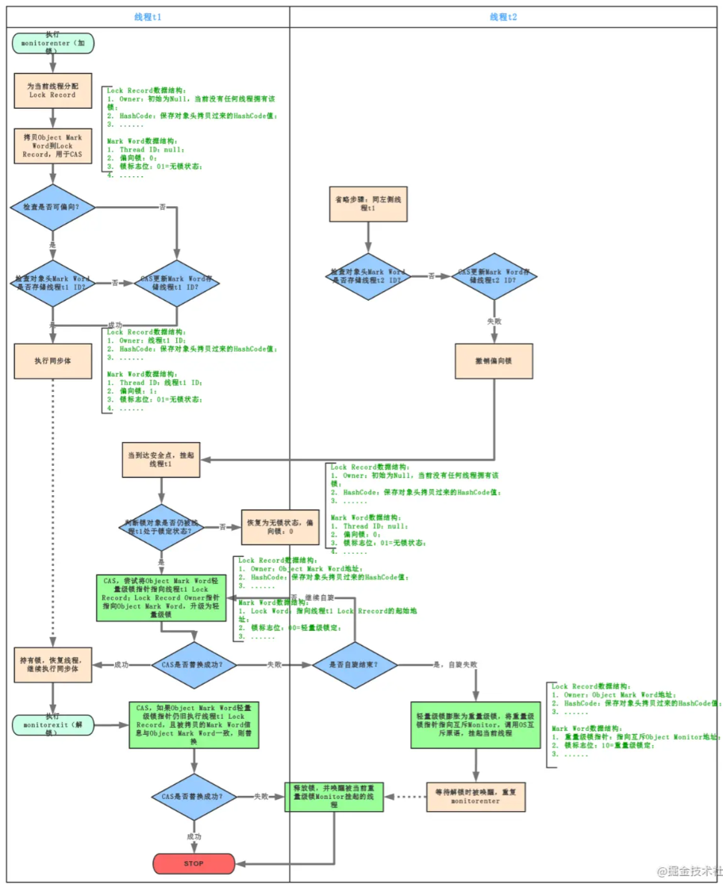

----

# 5 锁的优劣

各种锁并不是相互代替的，**而是在不同场景下的不同选择**，绝对不是说重量级锁就是不合适的。**每种锁是只能升级，不能降级，即由偏向锁->轻量级锁->重量级锁**，而这个过程就是开销逐渐加大的过程。
1. **如果是单线程使用，那偏向锁毫无疑问代价最小**，并且它就能解决问题，连CAS都不用做，仅仅在内存中比较下对象头就可以了；
2. **如果出现了其他线程竞争**，则偏向锁就会升级为轻量级锁；
3. **如果其他线程通过一定次数的CAS尝试没有成功**，则进入重量级锁；

&emsp; 在第3种情况下进入同步代码块就 **要做偏向锁建立、偏向锁撤销、轻量级锁建立、升级到重量级锁，最终还是得靠重量级锁来解决问题，那这样的代价就比直接用重量级锁要大不少了**。所以使用哪种技术，一定要看其所处的环境及场景，**在绝大多数的情况下，偏向锁是有效的，这是基于HotSpot作者发现的“大多数锁只会由同一线程并发申请”的经验规律**。


----

# 偏向锁的深化


## 批量重偏向
### 批量重偏向的作用
&emsp; 当只有一个线程反复进入同步块时，偏向锁带来的性能开销基本可以忽略，但是当有其他线程尝试获得锁时，就需要等到safe point时将偏向锁撤销为无锁状态或升级为轻量级/重量级锁。这个过程是要消耗一定的成本的，所以如果说运行时的场景本身存在多线程竞争的，那偏向锁的存在不仅不能提高性能，而且会导致性能下降。因此，JVM中增加了一种批量重偏向进行优化。
### 批量重偏向的过程
1. 首先引入一个概念epoch，其本质是一个时间段内的计数器，代表了偏向锁的有效性，epoch存储在可偏向对象的MarkWord中。除了对象中的epoch,对象所属的类class信息中，也会保存一个epoch值。
2. 每当遇到一个全局安全点时(这里的意思是说批量重偏向没有完全替代了全局安全点，全局安全点是一直存在的)，比如要对class C 进行批量再偏向，则首先对 class C中保存的epoch进行增加操作，得到一个新的epoch_new
3. 然后扫描持有class C 实例的所有线程栈，根据线程栈的信息判断出该线程是否锁定了该对象，仅将epoch_new的值赋给被锁定的对象中，也就是现在偏向锁还在被使用的对象才会被赋值epoch_new。
4. 退出安全点后，当有线程需要尝试获取偏向锁时，直接检查 class C 中存储的 epoch 值是否与目标对象中存储的 epoch 值相等， 如果不相等，则说明该对象的偏向锁已经无效了（因为（3）步骤里面已经说了只有偏向锁还在被使用的对象才会有epoch_new，这里不相等的原因是class C里面的epoch值是epoch_new,而当前对象的epoch里面的值还是epoch），此时竞争线程可以尝试对此对象重新进行偏向操作。

## 批量撤销
在时间阈值内，当epoch的值(撤销次数)达到了批量撤销(bulk revoke)阈值，在此后对应Class生成的新实例会禁用偏向锁。

----

# Bulk rebias & Bulk revoke
**批量回到可偏向状态还是撤销可偏向？**
经验发现为特定的数据结构选择性的禁用偏向锁(Store-fremm biased lock SFBL)来避免不合适的情况是合理的。为此需要考虑每个数据结构到底是执行撤销偏向的消耗小还是重新回到可偏向的状态消耗下。一种启发式的方式来决定到底是执行那种方式，在每个类的元数据里面都会包含一个counter和时间戳，每次偏向锁的实例执行一次偏向撤销，都会自增，时间戳用于记录上次执行bulk rebias的时间。

> 撤销计数并统计那些处于可偏向但是未偏向状态的撤销，这些操作的撤销只需要一次CAS就可以

counter本身有两个阈值，一个是bulk rebias阈值，一个是bulk revocation。刚开始的时候，这种启发式的算法可以单独的决定执行rebias还是revoke,一单bulk rebias的阈值达到，就会执行bulk rebias，转移到 rebiasable状态
time阈值用来重置撤销的计数counter,如果自从上次执行bulk bias已经超过了这个阈值时间，就会发生counter的重置。

> 这意味着从上次执行bulk rebias到现在并没有执行多次的撤销操作，也就是说执行bias仍然是个不错的选择

但是如果在执行了bulk rebias之后，在时间阈值之内，仍然一直有撤销数量增长，一旦达到了bulk revocation的阈值，就会执行bulk revocation,此时这个类的对象不会再被允许使用偏向锁。

> Hotspot中的阈值如下 Bulk rebias threshold 20 Bulk revoke threshold 40 Decay time 25s
> 
> 撤销偏向本身是一个消耗很大的事情，因为它必须挂起线程，遍历栈找到并修改lock records（锁记录）

最明显的查找某个数据结构的所有对象实例的方式就是遍历堆，这种方式在堆比较小的时候还可以，但是堆变大就显得性能不好。为类解决这个为题，使用 `epoch`。
epoch是一个时间戳，用来表明偏向的合法性，只要这个数据接口是可偏向的，那么就会在mark word上有一个对应的epoch bit位

> 这个时候，一个对象被认为已经偏向了线程T必须满足两个条件，1： mark word中偏向所有这的标记必须是这个线程，2：实例的epoch必须是和数据结构的epoch相等
> epoch本身的大小是限制的，也就是有可能出现循环，但这并不影响方案的正确性

通过这种方式，类C的bulk rebiasing操作会少去很多的花销。具体操作如下

1.  增大类C的epoch，它本身是一个固定长度的integer,和对象头中的epoch拥有一样的bit位数
2.  扫描所有的线程栈来定位当前类C的实例中已经锁住的，更新他们的epoch为类C的新的epoch或者是，根据启发式策略撤销偏向

这样就不用扫描堆了，`对于那些没有被改变epoch的实例（和类的epoch不同），会被自动当做可偏向但是还没有偏向的状态`

> 这种状态可看做 rebiaseable

----

# Mark完整转换状态
64位Mark结构：


32位Mark结构：


mark完整的状态转换关系如下：
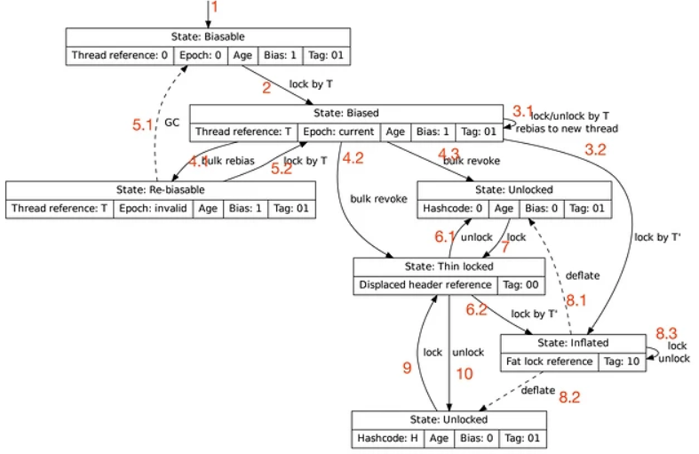
1.  刚分配对象，此时对象是可偏向并且未偏向的
2.  对象偏向于线程T，并记下epoch
3.  此时有新线程来竞争
    *   3.1一种策略是T执行对应的unlock，并重新分配给新的线程,以便不需要执行撤销操作
    *   3.2 如果已经偏向的对象被其它线程通过wait或者notify操作了，里面进入膨胀状态，使用重量锁
4.  此时有新的线程来竞争，一种策略是使用启发式的方式来统计撤销的次数
    *   4.1 当撤销达到bulk rebias的阈值时，执行bulk rebias
    *   4.2 当撤销达到bulk revoke，并且此时所仍然被持有(原偏向锁持有者)，转向轻量锁(hashcode的计算依赖于膨胀来支持修改displaced mark word)
    *   4.3 当撤销达到bulk revoke，并且此时所没有被持有(原偏向锁持有者)，转向未被锁定不可偏向的状态，此时没有进行hashcode计算
5.  对于经过bulk rebias的对象，检查期间没有锁定的实例，它的epoch会和class的不一样，变成过期，但是可以偏向
    *   5.1 如果 发生垃圾回收，lock会被初始化成可偏向但未偏向的状态(这也可以降低epoch循环使用的影响)
    *   5.2 如果重新被线程获取偏向锁，回到偏向锁获取状态
6.  处于轻量锁状态，它可能没有hashcode计算，可能有，这依赖于inflat
    *   6.1 没有hashcode，此时解锁回到没有hashcode计算的不可偏向的状态
    *   6.2 又被其它线程占有，转移到重量锁(比如使用POXIS操作系统的mutex和condition)
7.  未被锁定不可偏向的状态同时没有hashcode计算加锁后转移到轻量锁
8.  处于重量锁状态
    *   8.1 8.2 如果在Stop-The-Word期间没有竞争了，就可以去膨胀(STW期间没有其它线程获取和释放锁，是安全的)，根据是否有hashcode,退到对应的状态（就是就退回使用偏向锁 ）
    *   8.3 重量锁期间的lock/unlock仍然处于重量锁
9.  计算过hashcode，再加锁和解锁对应状态转换(9.10)