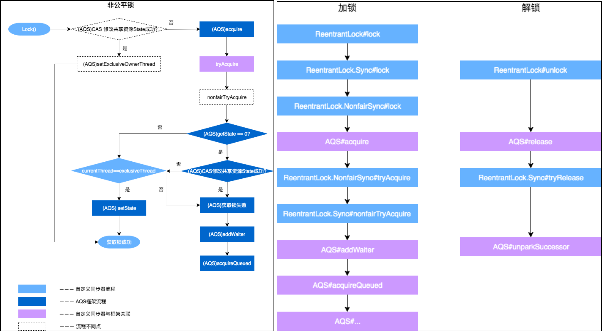
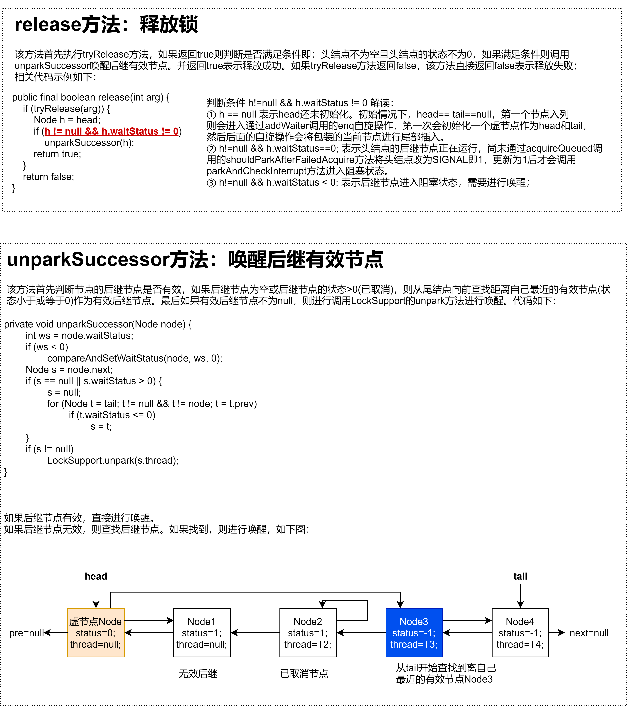

# AQS概述
## AQS简介
&emsp; Java中的大部分同步类（Lock、Semaphore、ReentrantLock等）都是基于AbstractQueuedSynchronizer（简称为AQS）实现的。AQS是一种提供了原子式管理同步状态、阻塞和唤醒线程功能以及队列模型的简单框架。
&emsp; CLH队列是一个先进先出队列，本质是通过队列与节点的状态控制节点的阻塞与唤醒。其中每一个线程代表队列中的一个节点，它不断自旋监听前驱节点的状态（前驱节点是否释放了锁）。前驱节点释放锁之后，后继结束自旋，改变自己的状态进行锁的获取
&emsp; AbstractQueuedSynchronizer，它是一个抽象类，相比于CLH队列，它不是通过一直自旋监听前驱的状态，而是通过前驱状态选择自己是否进行阻塞，前驱节点状态改变时选择是否唤醒后继节点。而且实现了很多CLH不具备的功能。它基于CLH实现了共享锁、独占锁的基本功能（节点插入，节点阻塞、节点唤醒逻辑），没有实现的只是尝试获取锁的操作，因为尝试获取锁能不能成功、以什么样的逻辑成功决定了锁的特性，AQS只是个架子，比如ReentranLock、ReentrantReadWriteLock、CountDownLatch等都是通过实现了不同的尝试获取锁方法来实现自己的不同的特性的。
&emsp; 公平锁与非公平锁也只是尝试获取锁时的逻辑不同，非公平锁可以尝试获取锁，而公平锁就需要同步队列中排队而已。

## AQS重要属性
```java
private transient volatile Node head;   //队头节点
private transient volatile Node tail;   //队尾节点
private volatile int state;             //0锁没占用/大于0锁被占用，并且代表锁的状态。
private transient Thread exclusiveOwnerThread;  //当前占有独占锁的线程
```
&emsp; 其中state是一个非常重要的属性，它代表了锁是否被占用的状态，同时还代表锁的占用次数，比如重入锁的重入次数。当然也可以基于state字段实现其他的功能，比如CountDownLatch就是通过state计数表示还有多少线程没有调用countDown方法，从而让使用await方法的线程阻塞。

队列节点类Node的重要属性。
```java
//队列节点类
static final class Node {
    //这两个属性是节点的模式，同来表示是共享还是独占
    static final Node SHARED = new Node();    //共享模式
    static final Node EXCLUSIVE = null;       //独占模式
    
    //下面的四个属性是节点的状态。
    static final int CANCELLED =  1;      //节点被取消
    static final int SIGNAL    = -1;      //代表后续节点需要被阻塞
    static final int CONDITION = -2;      //在条件队列中
    static final int PROPAGATE = -3;      //用于共享模式，表示无条件传播
    
    
    volatile int waitStatus;      //节点状态，用的就是上面四个字段。
    volatile Node prev;           //节点的前驱节点
    volatile Node next;           //后续节点
    volatile Thread thread;       //节点代表的线程
    Node nextWaiter;              // 仅用于Condition相关的单向链表
}
```
## AQS中state变量的作用
&emsp; 在了解数据结构后，接下来了解一下AQS的同步状态——State。AQS中维护了一个名为state的字段，意为同步状态，是由Volatile修饰的，用于展示当前临界资源的获锁情况.

| 方法名 | 描述 |
| --- | --- |
| protected final int getState() | 获取State的值 |
| protected final void setState(int newState) | 设置State的值 |
| protected final boolean compareAndSetState(int expect, int update) | 使用CAS方式更新State |

&emsp; 这几个方法都是Final修饰的，说明子类中无法重写它们。我们可以通过修改State字段表示的同步状态来实现多线程的独占模式和共享模式（加锁过程）。


## AQS与ReentrantLock的关联
看一张AQS的类关系图如下：


&emsp; AQS提供了大量用于自定义同步器实现的Protected方法。自定义同步器实现的相关方法也只是为了通过修改State字段来实现多线程的独占模式或者共享模式。自定义同步器需要实现以下方法（ReentrantLock需要实现的方法如下，并不是全部）：

| 方法名 | 描述 |
| --- | --- |
| protected boolean isHeldExclusively() | 该线程是否正在独占资源。只有用到Condition才需要去实现它。 |
| protected boolean tryAcquire(int arg) | 独占方式。arg为获取锁的次数，尝试获取资源，成功则返回True，失败则返回False。 |
| protected boolean tryRelease(int arg) | 独占方式。arg为释放锁的次数，尝试释放资源，成功则返回True，失败则返回False。 |
| protected int tryAcquireShared(int arg) | 共享方式。arg为获取锁的次数，尝试获取资源。负数表示失败；0表示成功，但没有剩余可用资源；正数表示成功，且有剩余资源。 |
| protected boolean tryReleaseShared(int arg) | 共享方式。arg为释放锁的次数，尝试释放资源，如果释放后允许唤醒后续等待结点返回True，否则返回False。 |
&emsp; 一般来说，自定义同步器要么是独占方式，要么是共享方式，它们也只需实现tryAcquire-tryRelease、tryAcquireShared-tryReleaseShared中的一种即可。AQS也支持自定义同步器同时实现独占和共享两种方式，如ReentrantReadWriteLock。ReentrantLock是独占锁，所以实现了tryAcquire-tryRelease。

### AQS与ReentrantLock非公平锁的关联

加锁：
*   通过ReentrantLock的加锁方法Lock进行加锁操作。
*   会调用到内部类Sync的Lock方法，由于Sync#lock是抽象方法，根据ReentrantLock初始化选择的公平锁和非公平锁，执行相关内部类的Lock方法，本质上都会执行AQS的Acquire方法。
*   AQS的Acquire方法会执行tryAcquire方法，但是由于tryAcquire需要自定义同步器实现，因此执行了ReentrantLock中的tryAcquire方法，由于ReentrantLock是通过公平锁和非公平锁内部类实现的tryAcquire方法，因此会根据锁类型不同，执行不同的tryAcquire。
*   tryAcquire是获取锁逻辑，获取失败后，会执行框架AQS的后续逻辑，跟ReentrantLock自定义同步器无关。

解锁：
*   通过ReentrantLock的解锁方法Unlock进行解锁。
*   Unlock会调用内部类Sync的Release方法，该方法继承于AQS。
*   Release中会调用tryRelease方法，tryRelease需要自定义同步器实现，tryRelease只在ReentrantLock中的Sync实现，因此可以看出，释放锁的过程，并不区分是否为公平锁。
*   释放成功后，所有处理由AQS框架完成，与自定义同步器无关。

通过上面的描述，大概可以总结出ReentrantLock加锁解锁时API层核心方法的映射关系。


----

# AQS源码剖析
## 添加节点
添加节点相关源码如下:
```java
// java.util.concurrent.locks.AbstractQueuedSynchronizer
//节点插入到队尾的方法，mode是节点的模式。
private Node addWaiter(Node mode) {
    Node node = new Node(Thread.currentThread(), mode);
    Node pred = tail;
    
    //队列中有节点存在
    if (pred != null) {
        //新节点的前驱指向队尾节点
        node.prev = pred;
        //通过CAS尝试将tail改成新节点（也就是插入队尾），如果修改失败了就enq方法自旋不断尝试插入。
        if (compareAndSetTail(pred, node)) {
            //如果成功了则之前的队尾节点next指向新节点
            pred.next = node;
            return node;
        }
    }
    enq(node);        //自旋+CAS将节点插入到队尾
    return node;
}

private Node enq(final Node node) {
    //自旋
    for (;;) {
        Node t = tail;      
        //队尾为空也就是队列为空
        if (t == null) {    
            //队列为空则直接将新节点变成队头，CAS尝试将队头指向node。
            if (compareAndSetHead(new Node()))    
                tail = head;
        } else {            //这里进行插入到队尾的尝试，通过配合自旋直到插入为止。
            node.prev = t;
            //CAS修改队尾节点为node，成功了就将之前的队尾next指向node，失败了就进行下一次自旋。
            if (compareAndSetTail(t, node)) {
                t.next = node;
                return t;
            }
        }
    }
}

/*
这里的CAS原理：主要使用Unsafe的两个功能：
1. 获取成员属性相对应自身对象指针的偏移量(固定的)
2. 通过对象地址+偏移量获得属性的地址(指针)，从而通过CAS指令进行处理
*/
private final boolean compareAndSetTail(Node expect, Node update) {
    return unsafe.compareAndSwapObject(this, tailOffset, expect, update);
}

static {
    try {
        stateOffset = unsafe.objectFieldOffset(AbstractQueuedSynchronizer.class.getDeclaredField("state"));
        headOffset = unsafe.objectFieldOffset(AbstractQueuedSynchronizer.class.getDeclaredField("head"));
        tailOffset = unsafe.objectFieldOffset(AbstractQueuedSynchronizer.class.getDeclaredField("tail"));
        waitStatusOffset = unsafe.objectFieldOffset(Node.class.getDeclaredField("waitStatus"));
        nextOffset = unsafe.objectFieldOffset(Node.class.getDeclaredField("next"));
    } catch (Exception ex) { 
    throw new Error(ex); 
  }
}
```
我画了一张图，总结如下：


节点插入流程总结：
- **判断队列是否为空，如果为空则CAS将头指向自己。**
- **不为空则自旋不断通过CAS尝试将节点插入到队尾。**

## 独占锁
这里以ReentrantLock为例。剖析非公平独占锁。

### 获取锁
首先查看ReentrantLock非公平锁获取锁的源码：
```java
// java.util.concurrent.locks.ReentrantLock 非公平锁获取锁相关代码

// ReentrantLock 无参构造方法(默认syc为非公平锁)
public ReentrantLock() {
    sync = new NonfairSync();
}
// ReentrantLock 有参构造方法(由是否公平决定sync的实例类型)
public ReentrantLock(boolean fair) {
    sync = fair ? new FairSync() : new NonfairSync();
}

// ReentrantLock 自身的lock方法
public void lock() {
    sync.lock();
}

//内部类的方法 java.util.concurrent.locks.ReentrantLock.NonfairSync#lock
static final class NonfairSync extends Sync {
    final void lock() {
        //CAS尝试将state从0设置成1，因为0代表锁没有被占用，如果成功了代表线程获得了锁，失败了代表锁已经被其他线程占用了。
        if (compareAndSetState(0, 1))
            //将独占锁的持有者设置为当前线程。
            setExclusiveOwnerThread(Thread.currentThread());
        else    
        //if获取锁失败了，调用acquire方法获取锁。
            acquire(1);
    }
    
    protected final boolean tryAcquire(int acquires) {
            // 尝试不公平的获取锁
            return nonfairTryAcquire(acquires);
    }
}

abstract static class Sync extends AbstractQueuedSynchronizer {
    final boolean nonfairTryAcquire(int acquires) {
        final Thread current = Thread.currentThread();
        int c = getState();     //获取锁的状态
        //如果锁未占用
        if (c == 0) {
            //CAS尝试将state设置成1，也就是尝试占有锁
            if (compareAndSetState(0, acquires)) {
                //设置成功代表线程拥有了锁，将锁的持有者改成自己
                setExclusiveOwnerThread(current);
                return true;
            }
        }
        //这里代表锁虽然被占用了，但是持有人是自己，这个操作就是锁的重入，也就是自己又调用了lock 方法，则将state增加1（表明在ReentrantLock中state代表了锁的重入次数）。
        else if (current == getExclusiveOwnerThread()) {
            int nextc = c + acquires;
            if (nextc < 0) // overflow
                throw new Error("Maximum lock count exceeded");
            setState(nextc);
            return true;
        }
        return false;
    }
    
    // ...
}
```
acquire是AQS非常核心的一个方法，代码如下：
```java
// java.util.concurrent.locks.AbstractQueuedSynchronizer
public final void acquire(int arg) {
    if (!tryAcquire(arg) && acquireQueued(addWaiter(Node.EXCLUSIVE), arg))
        selfInterrupt();
}
```
流程解析如下：
1. **lock()** 方法：即执行`sync#lock()->unfairSyc#lock()`方法
- 该方法首先会通过CAS(0,1)去尝试修改state的值，如果state旧值为0且被修改成功，说明没有被占用，之后将独占锁的线程指向自己表示被自己占用了。
- 否则表示已经有别的线程获取了锁，那么就要进行aqs#acquire()方法进行锁的获取。
2. **acquire()** 方法：`AbstractQueuedSynchronizer#acquire()`,这个方法主要分为tryAcquire和acquireQueued方法，tryAcquire是一个尝试获取锁的方法（ReentranLock自己实现的），如果获取失败了，则调用addWaiter将自己入队，通过acquireQueued执行线程阻塞逻辑以及唤醒后争抢锁的逻辑。addWaiter方法的实现在前面剖析过了。
3. **tryAcquire()** 方法：`unfairSyc#tryAcquire()->sync#nonfairTryAcquire`, 此方法的处理流程如下：
- 判断一下锁是否被占用了(state==0)，如果没有占用则自己则使用CAS进行尝试占用。
- 如果被占用了的话，判断一下锁的持有者是不是自己，如果是自己代表自己又调用了lock方法，就要进行锁的重入，就将state加一。

&emsp; tryAcquire方法获取锁失败了的话，就执行acquireQueued(addWaiter(Node.EXCLUSIVE), arg))。将线程加入队列，之后阻塞线程，等待持有锁的线程释放锁并唤醒自己，下面是acquireQueued的实现。

```java
// java.util.concurrent.locks.ReentrantLock
//已经通addWaiter将过当前线程变成node加入到了队尾。
final boolean acquireQueued(final Node node, int arg) {
    boolean failed = true;
    try {
        boolean interrupted = false;
        //这里进行死循环
        for (;;) {
            final Node p = node.predecessor();  //获取节点的前驱节点。
            //如果前驱是头节点，自己还没被阻塞，就代表头节点释放了锁并且唤醒了自己。获取成功则自己持有了锁，则需要将自己变成头节点。
            if (p == head && tryAcquire(arg)) {
                //将头节点设置成自己
                setHead(node);
                p.next = null; // 帮助gc回收废弃的头节点
                failed = false; 
                return interrupted; 
            }
            //检查当前线程是否需要被阻塞，如果需要则进行阻塞。这块是重点。
            if (shouldParkAfterFailedAcquire(p, node) &&
                parkAndCheckInterrupt())
                interrupted = true;
        }
    } finally {
        if (failed)
            cancelAcquire(node);
    }
}

//检查线程是否需要阻塞
private static boolean shouldParkAfterFailedAcquire(Node pred, Node node) {
    int ws = pred.waitStatus;     //获取前驱节点的状态值
    //SIGNAL代表后继需要被阻塞。
    if (ws == Node.SIGNAL)
        return true;
        
    //可以发现Node属性里的状态，只有CANCELLED是大于0的，ws大于0代表这个前驱节点被取消了
    if (ws > 0) {
        do {
            //被取消了的话，这个前驱节点就没用了，就进行删除，do while将当前节点之前的被取消节点都删除掉。
            node.prev = pred = pred.prev;
        } while (pred.waitStatus > 0);
        //把新前驱的next指向当前节点。
        pred.next = node;
    } else {
        //不是SIGNAL也不是CANCELLED则CAS尝试将前驱的waitStatus设置成SIGNAL。
        compareAndSetWaitStatus(pred, ws, Node.SIGNAL);
    }
    //虽然返回了false，但是别忘了acquireQueued中是个for循环，还会再次进来这个方法进行判断。第二次会返回true，因为上面CAS将waitStatus设置成SIGNAL。
    return false;
}

private final boolean parkAndCheckInterrupt() {
  //这里是通过Unsafe.park将当前线程阻塞，之后这个线程会阻塞在这里等待唤醒。
  LockSupport.park(this);
  return Thread.interrupted();
}

// 取消出现异常的节点
private void cancelAcquire(Node node) {
  // 将无效节点过滤
    if (node == null)
        return;
  // 设置该节点不关联任何线程，也就是虚节点
    node.thread = null;
    Node pred = node.prev;
  // 通过前驱节点，跳过取消状态的node
    while (pred.waitStatus > 0)
        node.prev = pred = pred.prev;
  // 获取过滤后的前驱节点的后继节点
    Node predNext = pred.next;
  // 把当前node的状态设置为CANCELLED
    node.waitStatus = Node.CANCELLED;
  // 如果当前节点是尾节点，将从后往前的第一个非取消状态的节点设置为尾节点
  // 更新失败的话，则进入else，如果更新成功，将tail的后继节点设置为null
    if (node == tail && compareAndSetTail(node, pred)) {
        compareAndSetNext(pred, predNext, null);
    } else {
        int ws;
    // 如果当前节点不是head的后继节点，1:判断当前节点前驱节点的是否为SIGNAL，2:如果不是，则把前驱节点设置为SINGAL看是否成功
    // 如果1和2中有一个为true，再判断当前节点的线程是否为null
    // 如果上述条件都满足，把当前节点的前驱节点的后继指针指向当前节点的后继节点
        if (pred != head && ((ws = pred.waitStatus) == Node.SIGNAL || (ws <= 0 && compareAndSetWaitStatus(pred, ws, Node.SIGNAL))) && pred.thread != null) {
            Node next = node.next;
            if (next != null && next.waitStatus <= 0)
                compareAndSetNext(pred, predNext, next);
        } else {
      // 如果当前节点是head的后继节点，或者上述条件不满足，那就唤醒当前节点的后继节点
            unparkSuccessor(node);
        }
        node.next = node; // help GC
    }
}
```

acquireQueued方法总结：
- 执行流程
    - 看看自己的前驱是不是头节点，如果是的话就有可能前驱释放了锁，那么自己进行获取锁的尝试。
    - 尝试失败的话，则判断前驱节点的状态是不是SIGNAL，SIGNAL表示了后继需要被阻塞，如果是话就调用Unsafe的线程阻塞方法阻塞自己，之后线程就会阻塞在parkAndCheckInterrupt()这一行，等待前面节点唤醒自己。
*   为什么要判断前驱是不是头节点再获取锁？
&emsp; 因为头节点是持有锁的线程，它释放了锁的时候会唤醒后面的第一个非取消状态的线程（释放锁接下来会说），也就是说之后这个线程才该获取锁，所以只有前驱是头节点的时候才需要获取。
*   为什么使用一个for死循环？
&emsp; 前一个问题说了，头节点释放锁之后会唤醒第一个非取消状态的线程。但是锁是非公平锁，所以可能在这个时间点有新的线程调用了lock方式获取到了锁，所以被唤醒线程获取就会失败，就需要再次阻塞。

有关acquireQueued执行过程，如下图所示：


### 公平锁
&emsp; AQS中限制的只是在持有锁的线程释放的时候队列中第一个被阻塞的节点和未加入到队列的线程可以同时去抢夺锁（unlock方法会唤醒持有锁线程节点后续的第一个非取消节点），但是之前已经被加入到队列并且阻塞的线程是无法去抢夺锁的，因为上面加锁的代码acquireQueued方法中有这样一个判断条件if (p == head && tryAcquire(arg))，只有头节点的后继节点才可以获取锁。
```java
//公平lock方法
final void lock() {
    acquire(1);
}

/**
 * 可以发现非公平锁和公平锁方法只是获取锁的方式不同
 */
protected final boolean tryAcquire(int acquires) {
    final Thread current = Thread.currentThread();
    int c = getState();
    if (c == 0) {
        //如果队列中有节点那么公平锁就不能让尝试获取锁的线程去获取锁，就要返回true让条件失败，让线程去排队
        if (!hasQueuedPredecessors() &&
            compareAndSetState(0, acquires)) {
            setExclusiveOwnerThread(current);
            return true;
        }
    }
    else if (current == getExclusiveOwnerThread()) {
        int nextc = c + acquires;
        if (nextc < 0)
            throw new Error("Maximum lock count exceeded");
        setState(nextc);
        return true;
    }
    return false;
}
```

### 释放锁
```java
public void unlock() {
    sync.release(1);
}

public final boolean release(int arg) {
    //尝试释放锁，释放锁成功的条件是锁的占用次数变成了0.
    if (tryRelease(arg)) {
        Node h = head;
        if (h != null && h.waitStatus != 0)
            //释放锁成功唤醒后继节点
            unparkSuccessor(h);
        return true;
    }
    return false;
}

protected final boolean tryRelease(int releases) {
    //锁的占用次数减1
    int c = getState() - releases;
    //如果当前线程不是锁的拥有线程则抛出异常，因为必须是拥有锁的线程才能调用unlock
    if (Thread.currentThread() != getExclusiveOwnerThread())
        throw new IllegalMonitorStateException();
    boolean free = false;
    //如果锁的占用次数变成0代表锁释放完毕了，也就是调用了相同次数的lock和unlock。
    if (c == 0) {
        free = true;、
        //将锁的拥有者设置为null
        setExclusiveOwnerThread(null);
    }
    //设置锁的占用状态
    setState(c);
    return free;
}

//唤醒节点的后继节点
private void unparkSuccessor(Node node) {
    int ws = node.waitStatus;   //获取节点状态
  
    if (ws < 0)
        compareAndSetWaitStatus(node, ws, 0);

    Node s = node.next;
    //如果后继节点为null，或者状态大于0（也就是取消状态），则代表这个后继不需要进行操作，因为只需要找被阻塞的非取消节点。则找到队列中最靠前的非取消节点进行唤醒。
    if (s == null || s.waitStatus > 0) {
        s = null;
        //从后往前找到最前面的未取消的节点
        for (Node t = tail; t != null && t != node; t = t.prev)
            if (t.waitStatus <= 0)
                s = t;
    }
    if (s != null)  
        //唤醒这个节点线程
        LockSupport.unpark(s.thread);
}
```
释放锁流程为：
*   将锁的占用次数减1，看看是不是为0了，不为0代表没释放完（没有执行相同次数的lock和unlock）。
*   如果为0了代表自己释放完了锁，则需要唤醒后继的一个线程，但是如果后继节点是被取消了或者数据异常节点为null，则需要找到离自己最近的未被取消的线程进行唤醒。
*   唤醒之后就会回到acquireQueued方法，在下一次for循环调用shouldParkAfterFailedAcquire删除掉与头节点直接的取消节点，之后在下一次for循环中尝试获取锁。
*   之后就是重复上述流程了。
核心方法是release方法：图解剖析如下：


## 共享锁
- 同样共享锁的获取AQS也是没有提供的，都是需要实际的类自己实现的，这里使用的代码是CountDownLatch的await方法，是一种共享锁的实现。
- CountDownLatch是一个让一组线程等待一组线程完成的工具类，通过设定阙值，每一次有线程countDown方法这个计数就会减一，而计数为0之前调用await的线程会被阻塞。

### 获取锁
```java
// CountDownLatch
public void await() throws InterruptedException {
    sync.acquireSharedInterruptibly(1);
}

// AQS
public final void acquireSharedInterruptibly(int arg)
        throws InterruptedException {
    if (Thread.interrupted())
        throw new InterruptedException();
        
    //尝试获取锁，返回1代表state为0，不需要阻塞，返回-1代表state不为0，线程需要阻塞
    if (tryAcquireShared(arg) < 0)
        //没获取到，进行阻塞。
        doAcquireSharedInterruptibly(arg);
}
//这个与CountDownLatch的特性有关，计数不为0，await的线程就不能获取到锁。
protected int tryAcquireShared(int acquires) {
    return (getState() == 0) ? 1 : -1;
}

// AQS
private void doAcquireSharedInterruptibly(int arg)
    throws InterruptedException {
    //自旋+CAS将节点插入到队尾
    final Node node = addWaiter(Node.SHARED);
    boolean failed = true;
    try {
        //死循环尝试获取锁
        for (;;) {
            //获取前驱节点
            final Node p = node.predecessor();
            //前驱是头的话尝试获取锁。
            if (p == head) {
                int r = tryAcquireShared(arg);
                if (r >= 0) {
                    //这个方法是共享锁的精髓所在，这个方法负责释放后继所有共享模式的被阻塞的线程
                    setHeadAndPropagate(node, r);
                    p.next = null; 
                    failed = false;
                    return;
                }
            }
            //与上面独占锁的实现相同，判断当前线程是否需要阻塞。
            这里是尝试将头节点waitStatus设置成SIGNAL，之后阻塞后继线程。
            if (shouldParkAfterFailedAcquire(p, node) &&
                parkAndCheckInterrupt())
                throw new InterruptedException();
        }
    } finally {
        if (failed)
            cancelAcquire(node);
    }
}

// AQS
private void setHeadAndPropagate(Node node, int propagate) {
    Node h = head; 
    setHead(node);

    //获取后继节点，如果后继节点是共享节点，则调用doReleaseShared将后面的节点唤醒。
    if (propagate > 0 || h == null || h.waitStatus < 0 ||
        (h = head) == null || h.waitStatus < 0) {
        Node s = node.next;
        if (s == null || s.isShared())
            doReleaseShared();
    }
}
```
释放锁的流程为：
*   CAS+自旋将state减1，之后判断是不是减到0了，如果减到0了，则需要唤醒所有被await阻塞的线程。
*   之后调用Unsafe唤醒方法唤醒后继的节点。
*   唤醒后继之后，被唤醒的线程会回到doAcquireSharedInterruptibly方法中被阻塞位置，通过下一次循环调用tryAcquireShared获取到锁，之后调用setHeadAndPropagate方法，在方法中调用doReleaseShared()唤醒后继线程，之后被唤醒的线程会重复这步操作，一个一个的唤醒后续的线程直到队列中的线程都被唤醒。

----
# 自定义同步工具


# 总结

*   AQS是一个架子，它实现了阻塞队列的如插入节点、共享模式的节点唤醒方法、独占模式的节点唤醒等基于队列的操作，而暴露出现给继承者实现的是锁的获取逻辑，给继承者实现自己的特性。
*   独占锁：就是将线程封装成一个Node插入到队尾通过Unsafe类（LockSupport调用的Unsafe的方法）的阻塞方法阻塞线程，之后头节点释放锁之后唤醒最近的一个为被取消排队的节点，这个节点去争抢锁，之后变为新的头节点。
*   共享锁：与独占锁一样，将线程封装成Node插入到队尾，但是不一样的是唤醒策略，唤醒时是每个节点依次唤醒自己后的节点，直到全部唤醒。
*   非公平锁：持有锁的线程释放锁后，队列中后继第一个线程可以与未加入队列的线程同时争抢锁。但是锁释放之前就已经在队列中的其他节点将还是阻塞的。
*   公平锁：通过在获取锁的方法添加判断队列是否为空来让线程选择入队还是抢锁，公平锁需要让大家按照申请锁的顺序去获取锁，所以如果队列不为空就会获取锁失败而入队。
*   整体流程：线程们cas修改state表示争抢锁，失败的进入队列中，通过判断前驱节点的状态是不是singal来判断自己是否需要被阻塞，当线程释放锁的时候会唤醒该节点的一个非取消状态的后继节点，如果是公平锁则可以获取锁，如果非公平锁就要和所有未入队的线程争抢锁。