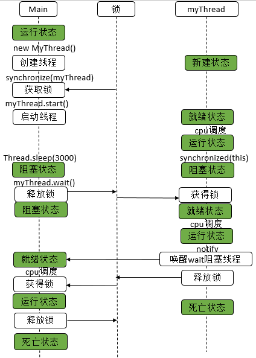
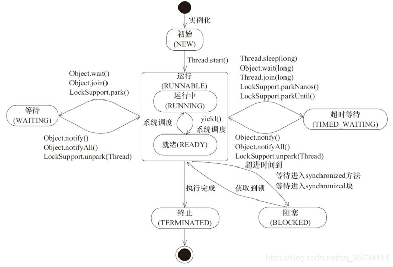

# JUC锁: LockSupport详解
## 面试常问问题
*   为什么LockSupport也是核心基础类? AQS框架借助于两个类：Unsafe(提供CAS操作)和LockSupport(提供park/unpark操作)
*   写出分别通过wait/notify和LockSupport的park/unpark实现同步?
*   LockSupport.park()会释放锁资源吗? 那么Condition.await()呢?
*   Thread.sleep()、Object.wait()、Condition.await()、LockSupport.park()的区别? 重点
*   如果在wait()之前执行了notify()会怎样?
*   如果在park()之前执行了unpark()会怎样?

## LockSupport简介
LockSupport用来创建锁和其他同步类的基本线程阻塞原语。简而言之，当调用LockSupport.park时，表示当前线程将会等待，直至获得许可，当调用LockSupport.unpark时，必须把等待获得许可的线程作为参数进行传递，好让此线程继续运行。

## LockSupport源码分析
### 类的属性
```java
public class LockSupport {
    // Hotspot implementation via intrinsics API
    private static final sun.misc.Unsafe UNSAFE;
    // 表示内存偏移地址
    private static final long parkBlockerOffset;
    // 表示内存偏移地址
    private static final long SEED;
    // 表示内存偏移地址
    private static final long PROBE;
    // 表示内存偏移地址
    private static final long SECONDARY;
    
    static {
        try {
            // 获取Unsafe实例
            UNSAFE = sun.misc.Unsafe.getUnsafe();
            // 线程类类型
            Class<?> tk = Thread.class;
            // 获取Thread的parkBlocker字段的内存偏移地址
            parkBlockerOffset = UNSAFE.objectFieldOffset
                (tk.getDeclaredField("parkBlocker"));
            // 获取Thread的threadLocalRandomSeed字段的内存偏移地址
            SEED = UNSAFE.objectFieldOffset
                (tk.getDeclaredField("threadLocalRandomSeed"));
            // 获取Thread的threadLocalRandomProbe字段的内存偏移地址
            PROBE = UNSAFE.objectFieldOffset
                (tk.getDeclaredField("threadLocalRandomProbe"));
            // 获取Thread的threadLocalRandomSecondarySeed字段的内存偏移地址
            SECONDARY = UNSAFE.objectFieldOffset
                (tk.getDeclaredField("threadLocalRandomSecondarySeed"));
        } catch (Exception ex) { throw new Error(ex); }
    }
}

```
说明：UNSAFE字段表示`sun.misc.Unsafe`类，一般程序中不允许直接调用而long类型的实例对象相应字段在内存中相对于对象指针的偏移量，可以通过对象指针地址+偏移量=字段指针地址，从而可以获取到对应字段的值。

### 类的构造函数
```java
// 私有构造函数，无法被实例化
private LockSupport() {}

```
说明: LockSupport只有一个私有构造函数，无法被实例化。、

### 核心函数分析
在分析LockSupport函数之前，先引入sun.misc.Unsafe类中的park和unpark函数，因为LockSupport的核心函数都是基于Unsafe类中定义的park和unpark函数，下面给出两个函数的定义:
```java
public native void park(boolean isAbsolute, long time);
public native void unpark(Thread thread);

```
说明: 对两个函数的说明如下:
*   park函数，阻塞线程，并且该线程在下列情况发生之前都会被阻塞: ① 调用unpark函数，释放该线程的许可。② 该线程被中断。③ 设置的时间到了。并且，当time为绝对时间时，isAbsolute为true，否则，isAbsolute为false。当time为0时，表示无限等待，直到unpark发生。
*   unpark函数，释放线程的许可，即激活调用park后阻塞的线程。这个函数不是安全的，调用这个函数时要确保线程依旧存活。

#### park函数
park函数有两个重载版本，方法摘要如下
```java
public static void park()；
public static void park(Object blocker)；
```
说明: 两个函数的区别在于park()函数没有没有blocker，即没有设置线程的parkBlocker字段。park(Object)型函数如下。

```java
public static void park(Object blocker) {
    // 获取当前线程
    Thread t = Thread.currentThread();
    // 设置Blocker
    setBlocker(t, blocker);
    // 获取许可
    UNSAFE.park(false, 0L);
    // 重新可运行后再此设置Blocker
    setBlocker(t, null);
}

```
说明: 调用park函数时，首先获取当前线程，然后设置当前线程的parkBlocker字段，即调用setBlocker函数，之后调用Unsafe类的park函数，之后再调用setBlocker函数。那么问题来了，为什么要在此park函数中要调用两次setBlocker函数呢? 原因其实很简单，调用park函数时，当前线程首先设置好parkBlocker字段，然后再调用Unsafe的park函数，此后，当前线程就已经阻塞了，等待该线程的unpark函数被调用，所以后面的一个setBlocker函数无法运行，unpark函数被调用，该线程获得许可后，就可以继续运行了，也就运行第二个setBlocker，把该线程的parkBlocker字段设置为null，这样就完成了整个park函数的逻辑。如果没有第二个setBlocker，那么之后没有调用park(Object blocker)，而直接调用getBlocker函数，得到的还是前一个park(Object blocker)设置的blocker，显然是不符合逻辑的。总之，必须要保证在park(Object blocker)整个函数执行完后，该线程的parkBlocker字段又恢复为null。所以，park(Object)型函数里必须要调用setBlocker函数两次。setBlocker方法如下:
```java
private static void setBlocker(Thread t, Object arg) {
    // 设置线程t的parkBlocker字段的值为arg
    UNSAFE.putObject(t, parkBlockerOffset, arg);
}
```
说明: 此方法用于设置线程t (即当前阻塞线程)的parkBlocker字段的值为arg。

另外一个无参重载版本，park()函数如下。
```java
public static void park() {
    // 获取许可，设置时间为无限长，直到可以获取许可
    UNSAFE.park(false, 0L);
}
```
说明: 调用了park函数后，会禁用当前线程，除非许可可用。在以下三种情况之一发生之前，当前线程都将处于休眠状态，即下列情况发生时，当前线程会获取许可，可以继续运行。
*   其他某个线程将当前线程作为目标调用 unpark。
*   其他某个线程中断当前线程。
*   该调用不合逻辑地(即毫无理由地)返回。

#### parkNanos函数
此函数表示在许可可用前禁用当前线程，并最多等待指定的等待时间。具体函数如下。表示等待多长时间。
```java
public static void parkNanos(Object blocker, long nanos) {
    if (nanos > 0) { // 时间大于0
        // 获取当前线程
        Thread t = Thread.currentThread();
        // 设置Blocker
        setBlocker(t, blocker);
        // 获取许可，并设置了时间
        UNSAFE.park(false, nanos);
        // 设置许可
        setBlocker(t, null);
    }
}
```
说明: 该函数也是调用了两次setBlocker函数，nanos参数表示相对时间，表示等待多长时间。

#### parkUntil函数
此函数表示在指定的时限前禁用当前线程，除非许可可用, 具体函数如下: 即表示多长时间后禁用线程。
```java
public static void parkUntil(Object blocker, long deadline) {
    // 获取当前线程
    Thread t = Thread.currentThread();
    // 设置Blocker
    setBlocker(t, blocker);
    UNSAFE.park(true, deadline);
    // 设置Blocker为null
    setBlocker(t, null);
}
```
说明: 该函数也调用了两次setBlocker函数，deadline参数表示绝对时间，表示指定的时间。

#### unpark函数
此函数表示如果给定线程的许可尚不可用，则使其可用。如果线程在 park 上受阻塞，则它将解除其阻塞状态。否则，保证下一次调用 park 不会受阻塞。如果给定线程尚未启动，则无法保证此操作有任何效果。具体函数如下:
```java
public static void unpark(Thread thread) {
    if (thread != null) // 线程为不空
        UNSAFE.unpark(thread); // 释放该线程许可
}
```
说明: 释放许可，指定线程可以继续运行。

## LockSupport示例说明
### 使用wait/notify实现线程同步
```java
class MyThread extends Thread {
    
    public void run() {
        synchronized (this) {
            System.out.println("before notify");            
            notify();
            System.out.println("after notify");    
        }
    }
}

public class WaitAndNotifyDemo {
    public static void main(String[] args) throws InterruptedException {
        MyThread myThread = new MyThread();            
        synchronized (myThread) {
            try {        
                myThread.start();
                // 主线程睡眠3s
                Thread.sleep(3000);
                System.out.println("before wait");
                // 阻塞主线程
                myThread.wait();
                System.out.println("after wait");
            } catch (InterruptedException e) {
                e.printStackTrace();
            }            
        }        
    }
}
```
运行结果
```
before wait
before notify
after notify
after wait

```
说明: 具体的流程图如下

使用wait/notify实现同步时，必须先调用wait，后调用notify，如果先调用notify，再调用wait，将起不了作用。具体代码如下
```java
class MyThread extends Thread {
    public void run() {
        synchronized (this) {
            System.out.println("before notify");            
            notify();
            System.out.println("after notify");    
        }
    }
}

public class WaitAndNotifyDemo {
    public static void main(String[] args) throws InterruptedException {
        MyThread myThread = new MyThread();        
        myThread.start();
        // 主线程睡眠3s
        Thread.sleep(3000);
        synchronized (myThread) {
            try {        
                System.out.println("before wait");
                // 阻塞主线程
                myThread.wait();
                System.out.println("after wait");
            } catch (InterruptedException e) {
                e.printStackTrace();
            }            
        }        
    }
}
```
运行结果:
```
before notify
after notify
before wait
```
说明: 由于先调用了notify，再调用的wait，此时主线程还是会一直阻塞。

### 使用park/unpark实现线程同步
```java
import java.util.concurrent.locks.LockSupport;

class MyThread extends Thread {
    private Object object;

    public MyThread(Object object) {
        this.object = object;
    }

    public void run() {
        System.out.println("before unpark");
        try {
            Thread.sleep(1000);
        } catch (InterruptedException e) {
            e.printStackTrace();
        }
        // 获取blocker
        System.out.println("Blocker info " + LockSupport.getBlocker((Thread) object));
        // 释放许可
        LockSupport.unpark((Thread) object);
        // 休眠500ms，保证先执行park中的setBlocker(t, null);
        try {
            Thread.sleep(500);
        } catch (InterruptedException e) {
            e.printStackTrace();
        }
        // 再次获取blocker
        System.out.println("Blocker info " + LockSupport.getBlocker((Thread) object));

        System.out.println("after unpark");
    }
}

public class test {
    public static void main(String[] args) {
        MyThread myThread = new MyThread(Thread.currentThread());
        myThread.start();
        System.out.println("before park");
        // 获取许可
        LockSupport.park("ParkAndUnparkDemo");
        System.out.println("after park");
    }
}
```
运行结果:
```
before park
before unpark
Blocker info ParkAndUnparkDemo
after park
Blocker info null
after unpark
```
说明: 本程序先执行park，然后在执行unpark，进行同步，并且在unpark的前后都调用了getBlocker，可以看到两次的结果不一样，并且第二次调用的结果为null，这是因为在调用unpark之后，执行了Lock.park(Object blocker)函数中的setBlocker(t, null)函数，所以第二次调用getBlocker时为null。

上例是先调用park，然后调用unpark，现在修改程序，先调用unpark，然后调用park，看能不能正确同步。具体代码如下：
```java
import java.util.concurrent.locks.LockSupport;

class MyThread extends Thread {
    private Object object;

    public MyThread(Object object) {
        this.object = object;
    }

    public void run() {
        System.out.println("before unpark");        
        // 释放许可
        LockSupport.unpark((Thread) object);
        System.out.println("after unpark");
    }
}

public class ParkAndUnparkDemo {
    public static void main(String[] args) {
        MyThread myThread = new MyThread(Thread.currentThread());
        myThread.start();
        try {
            // 主线程睡眠3s
            Thread.sleep(3000);
        } catch (InterruptedException e) {
            e.printStackTrace();
        }
        System.out.println("before park");
        // 获取许可
        LockSupport.park("ParkAndUnparkDemo");
        System.out.println("after park");
    }
}
```
运行结果:
```
before unpark
after unpark
before park
after park
```
说明: 可以看到，在先调用unpark，再调用park时，仍能够正确实现同步，不会造成由wait/notify调用顺序不当所引起的阻塞。因此park/unpark相比wait/notify更加的灵活。

### 中断响应
看下面示例：
```java
import java.util.concurrent.locks.LockSupport;

class MyThread extends Thread {
    private Object object;

    public MyThread(Object object) {
        this.object = object;
    }

    public void run() {
        System.out.println("before interrupt");        
        try {
            // 休眠3s
            Thread.sleep(3000);
        } catch (InterruptedException e) {
            e.printStackTrace();
        }    
        Thread thread = (Thread) object;
        // 中断线程
        thread.interrupt();
        System.out.println("after interrupt");
    }
}

public class InterruptDemo {
    public static void main(String[] args) {
        MyThread myThread = new MyThread(Thread.currentThread());
        myThread.start();
        System.out.println("before park");
        // 获取许可
        LockSupport.park("ParkAndUnparkDemo");
        System.out.println("after park");
    }
}
```
运行结果:
```
before park
before interrupt
after interrupt
after park
```
说明: 可以看到，在主线程调用park阻塞后，在myThread线程中发出了中断信号，此时主线程会继续运行，也就是说明此时interrupt起到的作用与unpark一样。

## 更深入的理解

### Thread.sleep()和Object.wait()的区别
- Thread.sleep()不会释放锁，Object.wait()会释放锁。
- Thread.sleep()必须传入时间，Object.wait()可传可不传，不传表示一直阻塞下去。
- Thread.sleep()到时间会自动唤醒，然后继续执行。
- Object.wait()不带时间的方法，需要另一个线程使用Object.notify()唤醒。
- Object.wait()带时间的方法，假如没有被notify，到时间了会自动唤醒，这时又分好两种情况，一是立即获取到了锁，线程自然会继续执行；二是没有立即获取锁，线程进入同步队列等待获取锁；
其实，他们俩最大的区别就是Thread.sleep()不会释放锁资源，Object.wait()会释放锁资源。

### Object.wait()和Condition.await()区别
&emsp; Object.wait()和Condition.await()的原理是基本一致的，不同的是Condition.await()底层是调用LockSupport.park()来实现阻塞当前线程的。
&emsp; 实际上，它在阻塞当前线程之前还干了两件事，一是把当前线程添加到条件队列中，二是“完全”释放锁，也就是让state状态变量变为0，然后才是调用LockSupport.park()阻塞当前线程。

### Thread.sleep()和LockSupport.park()的区别
LockSupport.park()还有几个兄弟方法——parkNanos()、parkUtil()等，我们这里说的park()方法统称这一类方法。
*   从功能上来说，Thread.sleep()和LockSupport.park()方法类似，都是阻塞当前线程的执行，且都不会释放当前线程占有的锁资源；
*   Thread.sleep()没法从外部唤醒，只能自己醒过来；
*   LockSupport.park()方法可以被另一个线程调用LockSupport.unpark()方法唤醒；
*   Thread.sleep()方法声明上抛出了InterruptedException中断异常，所以调用者需要捕获这个异常或者再抛出；
*   LockSupport.park()方法不需要捕获中断异常；
*   Thread.sleep()本身就是一个native方法；
*   LockSupport.park()底层是调用的Unsafe的native方法；。

### Object.wait()和LockSupport.park()的区别
二者都会阻塞当前线程的运行，他们有什么区别呢?
*   Object.wait()方法需要在synchronized块中执行；
*   LockSupport.park()可以在任意地方执行；
*   Object.wait()方法声明抛出了中断异常，调用者需要捕获或者再抛出；
*   LockSupport.park()不需要捕获中断异常；
*   Object.wait()不带超时的，需要另一个线程执行notify()来唤醒，但不一定继续执行后续内容；
*   LockSupport.park()不带超时的，需要另一个线程执行unpark()来唤醒，一定会继续执行后续内容；
*   如果在wait()之前执行了notify()会怎样? 抛出IllegalMonitorStateException异常；
*   如果在park()之前执行了unpark()会怎样? 线程不会被阻塞，直接跳过park()，继续执行后续内容；

park()/unpark()底层的原理是“二元信号量”，你可以把它相像成只有一个许可证的Semaphore，只不过这个信号量在重复执行unpark()的时候也不会再增加许可证，最多只有一个许可证。

### LockSupport.park()会释放锁资源吗?
不会，它只负责阻塞当前线程，释放锁资源实际上是在Condition的await()方法中实现的。

----

# 协作式中断
了解interrupt的使用：
*   **Java中线程间是协作式，而非抢占式**. 调用一个线程的interrupt() 方法中断一个线程，并不是强行关闭这个线程，只是跟这个线程打个招呼，将线程的中断标志位置为true，线程是否中断，由线程本身的实现代码决定。
*   isInterrupted() 判定当前线程是否处于中断状态。
*   静态方法 interrupted() 判定当前线程是否处于中断状态，同时中断标志位改为 false。
*   **如果方法里如果抛出中断异常 InterruptedException，则线程的中断标志位会被复位成false**，如果确实是需要中断线程，要求我们自己在catch语句块里再次调用interrupt()。
*   Java 中所有的阻塞方法都会抛出 InterruptedException

## 代码示例
### java中线程间是协作式，非抢占
```java
public class EndThread {
    
    private static class UseThread extends Thread{
        
        public UseThread(String name) {
            super(name);
        }
        
        @Override
        public void run() {
            String threadName = Thread.currentThread().getName();
            while(true) {
                System.out.println(threadName+" is run!");
            }
            //System.out.println(threadName+" interrput flag is "+isInterrupted());
        }
    }

    public static void main(String[] args) throws InterruptedException {
        Thread endThread = new UseThread("endThread");
        endThread.start();
        Thread.sleep(20);
        endThread.interrupt();
    }

}
```
运行结果:

```
    endThread is run!
    endThread is run!
    endThread is run!
    endThread is run!
    ...
```
endThread 一直在运行,主线程调用 interrupt() 方法并没有使 endThread 真正中断。
```java
public class EndRunnable {

    private static class UseRunnable implements Runnable{

        @Override
        public void run() {

            String threadName = Thread.currentThread().getName();
            while(!Thread.currentThread().isInterrupted()) {
                //如果真发生中断后,这行代码不会执行了
                System.out.println(threadName+" is run!");
            }
            System.out.println(threadName+" interrupt flag is " +Thread.currentThread().isInterrupted());
        }
    }

    public static void main(String[] args) throws InterruptedException {
        UseRunnable useRunnable = new UseRunnable();
        Thread endThread = new Thread(useRunnable,"endThread");
        endThread.start();
        Thread.sleep(3);
        endThread.interrupt();
    }
}
```
运行结果：
```
endThread is run!
endThread is run!
endThread is run!
...
endThread is run!
endThread interrupt flag is true

```

通过 while(!Thread.currentThread().isInterrupted()) 这种方式来控制循环能真正实现 interrupt。

由上面两个例子论证了Java中线程间是协作式，而非抢占式

### 异常下的中断补偿
**如果方法里如果抛出中断异常 InterruptedException，则线程的中断标志位会被复位成false**
```java
public class HasInterruptException {
    
    private static SimpleDateFormat formater 
        = new SimpleDateFormat("yyyy-MM-dd HH:mm:ss_SSS");
    
    private static class UseThread extends Thread{
        
        public UseThread(String name) {
            super(name);
        }
        
        @Override
        public void run() {
            String threadName = Thread.currentThread().getName();
            while(!isInterrupted()) {
                try {
                    System.out.println("UseThread:"+formater.format(new Date()));
                    Thread.sleep(3000);
                } catch (InterruptedException e) {
                    System.out.println(threadName + " catch interrput flag is "
                            + isInterrupted() + " at "
                            + (formater.format(new Date())));
                    //方法里如果抛出InterruptedException，线程的中断标志位会被复位成false，
                    // 如果确实是需要中断线程，要求我们自己在catch语句块里再次调用interrupt()。
                    interrupt();
                    e.printStackTrace();
                }
                System.out.println(threadName);                
            }
            System.out.println(threadName+" interrput flag is " +isInterrupted());
        }
    }

    public static void main(String[] args) throws InterruptedException {
        Thread endThread = new UseThread("HasInterrputEx");
        endThread.start();
        System.out.println("Main:"+formater.format(new Date()));
        Thread.sleep(800);
        System.out.println("Main begin interrupt thread:"+formater.format(new Date()));
        endThread.interrupt();
    }

}
```
运行结果:

```
UseThread:2019-09-10 15:06:57_995
Main:2019-09-10 15:06:57_995
Main begin interrupt thread:2019-09-10 15:06:58_795
HasInterrputEx catch interrput flag is false at 2019-09-10 15:06:58_795
java.lang.InterruptedException: sleep interrupted
    at java.lang.Thread.sleep(Native Method)
    at com.xiangxue.ch1.safeend.HasInterrputException$UseThread.run(HasInterrputException.java:28)
HasInterrputEx
HasInterrputEx interrput flag is true
```

----

# 深入理解中断机制
## 线程中断的作用
- 线程中断可以使一个线程从等待状态变成就绪状态，如果中断的线程正处于运行状态，那么这个中断是不会用任何作用的（表面上不会影响正在运行的线程），线程恢复到就绪状态后，可以继续执行逻辑代码，想要让一个线程从等待状态中恢复过来有三种发送：一.等待超时，二.得到一个通知，三.使用中断
- 注意：使用线程中断，并不是要把线程给终止或是杀死，而是让线程不再继续等待，而是让线程不再继续等待，线程可以继续往下执行代码，线程发生中断后，会抛出一个中断的异常，决定如何处理就看业务代码怎么写了。

## 线程中断的原理：
 - Thread.interrupt()方法仅仅是在当前线程中打了一个停止的标识将中断标志修改为true，并没有真正的停止线程。如果在此基础上进入堵塞状态（sleep(),wait(),join()）,马上就会抛出一个InterruptedException，且中断标志被清除，重新设置为false。记住一点，当调用Thread.interrupt()，还没有进行中断时，此时的中断标志位是true，当发生中断之后（执行到sleep(),wait(),join()），这个时候的中断标志位就是false了。
 - 中断是通过调用Thread.interrupt()方法来做的. 这个方法通过修改了被调用线程的中断状态来告知那个线程, 说它被中断了. 对于非阻塞中的线程, 只是改变了中断状态, 即Thread.isInterrupted()将返回true; 对于可取消的阻塞状态中的线程, 比如等待在这些函数上的线程, Thread.sleep(), Object.wait(), Thread.join(), 这个线程收到中断信号后, 会抛出InterruptedException, 同时会把中断状态置回为false.但调用Thread.interrupted()会对中断状态进行复位。

## Thread中关于中断的方法
- `public void interrupt()`方法：中断线程，也就是改变中断标志位为true。
- `public static boolean interrupted()`方法：静态方法，内部实现是调用的当前线程的`isInterrupted()`，并且会重置当前线程的中断状态。
- `public boolean isInterrupted()`方法：判断线程是否被中断，返回ture代表线程被中断了，只是去获取一下，不会该表中断标志位。

```java
// java.lang.Thread
public static boolean interrupted() {
        return currentThread().isInterrupted(true);
}

public boolean isInterrupted() {
    return isInterrupted(false);
}

private native boolean isInterrupted(boolean ClearInterrupted);
```

## 线程的状态
**线程状态图**

- **NEW** 状态是指线程刚创建,**尚未启动,不会出现在Dump中**。
- **RUNNABLE** 状态是线程正在正常运行中, 当然可能会有某种耗时计算/IO等待的操作/CPU时间片切换等, 这个状态下发生的等待一般是其他系统资源, 而不是锁, Sleep等，主要不同是runable里面有2个状态，可以理解为就是JVM调用系统线程的状态。
- **BLOCKED**  **受阻塞并等待监视器锁**。这个状态下, 是在多个线程有同步操作的场景, 比如正在等待另一个线程的synchronized 块的执行释放, 或者可重入的 synchronized块里别人调用wait() 方法, 也就是这里是线程在等待进入临界区
- **WAITING**  **无限期等待另一个线程执行特定操作**。这个状态下是指线程拥有了某个锁之后, 调用了他的wait方法, 等待其他线程/锁拥有者调用 notify / notifyAll 一遍该线程可以继续下一步操作, 这里要区分 BLOCKED 和 WATING 的区别, 一个是在临界点外面等待进入, 一个是在临界点里面wait等待别人notify, 线程调用了join方法 join了另外的线程的时候, 也会进入WAITING状态, 等待被他join的线程执行结束
- **TIMED_WAITING**  **有时限的等待另一个线程的特定操作**。这个状态就是有限的(时间限制)的WAITING, 一般出现在调用wait(long), join(long)等情况下, 另外一个线程sleep后, 也会进入TIMED_WAITING状态
- **TERMINATED** 这个状态下表示 **该线程的run方法已经执行完毕了**, 基本上就等于死亡了(当时如果线程被持久持有, 可能不会被回收)

## 响应和不响应中断的方法：
- 响应中断的方法： 线程进入等待或是超时等待的状态后，调用interrupt方法都是会响应中断的，所以响应中断的方法：Object.wait()、Thread.join、Thread.sleep、LockSupport.park的有参和无参方法。
- 不响应中断的方法：线程进入阻塞状态后，是不响应中断的，等待进入synchronized的方法或是代码块，都是会被阻塞的，此时不会响应中断，另外还有一个不响应中断的，那就是阻塞在ReentrantLock.lock方法里面的线程，也是不响应中断的，如果想要响应中断，可以使用ReentrantLock.lockInterruptibly方法。
-  其ReentrantLock底层是使用LockSupport.park方法进行等待的，前面说了LockSupport.park是响应中断的，当线程进入ReentrantLock.lock方法里面进行阻塞后，此时调用Thread.interrupt()方法之后，该线程是会被中断被唤醒的，但是唤醒之后，会调用LockSupport.park再次进入等待状态，所以仅从宏观（表面）上面看ReentrantLock.lock是不支持响应中断的，从微观（原理）上面讲ReentrantLock.lock内部确实中断了响应，但是还是会被迫进行等待状态。

## 清除中断标志位的方法
&emsp; 在明白了哪些方法会响应中断后，还需要明白响应中断方法的会不会清除中断标志位，对于Object.wait()、Thread.join、Thread.sleep方法都是会清除中断标志位了，这个上面已经说了，而对于LockSupport.park方法，是不会清除中断标志位的，不清除中断标志位意味着调用Thread.interrupt方法之后，碰到多个LockSupport.park方法线程不会进行等待状态了。
```java
public class Test05 {
    public static void main(String[] args) throws InterruptedException {
        Thread thread = new Thread(() -> {
            System.out.println("线程一正在执行，将进入等待状态，当前时间= "+System.currentTimeMillis()+", 此时的中断标志位："+Thread.currentThread().isInterrupted());
            LockSupport.park();
            System.out.println("线程一从等待状态中醒来，当前时间= "+System.currentTimeMillis()+", 此时的中断标志位：" + Thread.currentThread().isInterrupted());
            LockSupport.park();
            System.out.println("线程一从等待状态中醒来，当前时间= "+System.currentTimeMillis()+", 此时的中断标志位："+Thread.currentThread().isInterrupted());
        });
 
        System.out.println("主线程正在执行");
        thread.start();
        System.out.println("主线程等待，睡眠两秒");
        TimeUnit.SECONDS.sleep(2);
        thread.interrupt();
    }
}
 
/*
执行结果：
主线程正在执行
主线程等待，睡眠两秒
线程一正在执行，将进入等待状态，当前时间 = 1592271902514, 此时的中断标志位：false
线程一从等待状态中醒来，当前时间 = 1592271904515, 此时的中断标志位：true
线程一从等待状态中醒来，当前时间 = 1592271904515, 此时的中断标志位：true
*/
```
&emsp; 可以看到当线程一调用 Thread.interrupt方法之后，会从线程会从等待状态中醒来，然后第二次调用LockSupport.park时，根本就不会再次进入等待状态，所以调用LockSupport.park是不会清除中断标志位的。

&emsp;Object.wait()、Thread.join、Thread.sleep方法都是会清除中断标志位，这里就只演示Thread.sleep方法了，TimeUnit.SECONDS.sleep底层是调用Thread.sleep方法。
```java
public class Test06 {
    public static void main(String[] args) throws InterruptedException {
        Thread thread = new Thread(() -> {
            System.out.println("线程一正在执行，将进入等待状态，时间= "+System.currentTimeMillis()+",中断标志位："+Thread.currentThread().isInterrupted());
            try {
                TimeUnit.SECONDS.sleep(5);
            } catch (InterruptedException e) {
 
            }
            System.out.println("线程一从等待状态中醒来，时间= "+System.currentTimeMillis()+",中断标志位："+Thread.currentThread().isInterrupted());
            try {
                TimeUnit.SECONDS.sleep(5);
            } catch (InterruptedException e) {
 
            }
            System.out.println("线程一从等待状态中醒来，时间= "+System.currentTimeMillis()+",中断标志位："+Thread.currentThread().isInterrupted());
        });
 
        System.out.println("主线程正在执行");
        thread.start();
        System.out.println("主线程等待，睡眠两秒");
        TimeUnit.SECONDS.sleep(2);
        thread.interrupt();
    }
}
/*
执行结果：
主线程正在执行
主线程等待，睡眠两秒
线程一正在执行，将进入等待状态，时间= 1592272574294,中断标志位：false
线程一从等待状态中醒来，时间= 1592272576295,中断标志位：false
线程一从等待状态中醒来，时间= 1592272581295,中断标志位：false
*/
```
&emsp; 可以看到中断标志位都是false，而且线程一第二次调用 Thread.sleep时，还是会进行等待状态的。

## synchronized和ReentrantLock不响应中断
### synchronized中断测试：
```java
public class Test03 {
    //使用线程池进行测试
    private static ExecutorService executorService = Executors.newFixedThreadPool(5);
    public static void main(String[] args) throws InterruptedException {
        Object luck = new Object();
        
        executorService.execute(()->{
            System.out.println("线程1打算获取锁");
            synchronized (luck){
                try {
                    System.out.println("线程1打算睡眠");
                    //sleep不会释放锁
                    TimeUnit.SECONDS.sleep(5);
                } catch (InterruptedException e) {
                    e.printStackTrace();
                }
                System.out.println("线程1已经执行完成");
            }
        });
 
        //主线程睡眠1秒，保证线程1已经睡眠了
        TimeUnit.SECONDS.sleep(1);
 
        Thread thread = new Thread(() -> {
            System.out.println("线程2打算获取锁");
            //线程2会在此被阻塞，因为线程1已经拿到了锁，并抱着锁睡觉了
            //在此中断线程是不会有任何响应的
            synchronized (luck) {
                try {
                    //判断当前线程的中断为
                    System.out.println("线程2的中断标志位 " + Thread.currentThread().isInterrupted());
                    //虽然在synchronized (luck) {中不会响应，但是线程的中断标志位还是true，所以执行到此，会响应迟到的中断
                    TimeUnit.SECONDS.sleep(1);
                } catch (InterruptedException e) {
                    e.printStackTrace();
                    System.out.println("InterruptedException 线程2的中断标志位 " + Thread.currentThread().isInterrupted());
                }
            }
            System.out.println("线程2已经执行完成");
        });
 
        thread.start();
        //此时中断线程2，测试线程2在等待获取锁的时候会不会相应中断
        thread.interrupt();
    }
}
 
/*
执行结果：
线程1打算获取锁
线程1打算睡眠
线程2打算获取锁
线程1已经执行完成
线程2的中断标志位 true
java.lang.InterruptedException: sleep interrupted
    at java.lang.Thread.sleep(Native Method)
    at java.lang.Thread.sleep(Thread.java:340)
    at java.util.concurrent.TimeUnit.sleep(TimeUnit.java:386)
    at it.cast.basic.thread.interrupt.Test03.lambda$main$1(Test03.java:43)
    at java.lang.Thread.run(Thread.java:748)
InterruptedException 线程2的中断标志位 false
线程2已经执行完成
*/
```
&emsp; 从上面例子可以得到，当线程等待进行synchronized的方法或是代码块进行执行，是不会响应中断的，如果此时调用Thread.interrupt方法是不会有任何方法，但是在阻塞的时候还是会判断中断标志位置位true的，那么在拿到锁之后，执行到TimeUnit.SECONDS.sleep(5);会迅速抛出一个中断的异常。


### ReentrantLock测试中断
```java
public class Test04 {
    private static ExecutorService executorService = Executors.newFixedThreadPool(5);
 
    public static void main(String[] args) throws InterruptedException {
        Lock lock = new ReentrantLock();
        executorService.execute(()->{
            System.out.println("线程1打算获取锁");
            lock.lock();
            try{
                System.out.println("线程1打算睡眠");
                //sleep不会释放锁
                TimeUnit.SECONDS.sleep(5);
            }catch (InterruptedException e){
 
            }finally {
                lock.unlock();
            }
            System.out.println("线程1已经执行完成");
        });
 
        //主线程睡眠1秒，保证线程1已经睡眠了
        TimeUnit.SECONDS.sleep(1);
 
        Thread thread = new Thread(() -> {
            System.out.println("线程2打算获取锁");
            //在此中断线程是不会有任何响应的
            lock.lock();
            try {
                //判断当前线程的中断为
                System.out.println("线程2的中断标志位 " + Thread.currentThread().isInterrupted());
                //执行到此，会抛出中断异常，虽然这个中断操作是在lock.lock();进行的，但是会在
                //执行sleep的时候响应，就是判断中断标志位
                TimeUnit.SECONDS.sleep(5);
            } catch (InterruptedException e) {
                e.printStackTrace();
                System.out.println("InterruptedException 线程2的中断标志位 " + Thread.currentThread().isInterrupted());
            } finally {
                lock.unlock();
            }
            System.out.println("线程1已经执行完成");
        });
 
        thread.start();
        thread.interrupt();
    }
}
 
/*
执行结果：
线程1打算获取锁
线程1打算睡眠
线程2打算获取锁
java.lang.InterruptedException: sleep interrupted
    at java.lang.Thread.sleep(Native Method)
    at java.lang.Thread.sleep(Thread.java:340)
    at java.util.concurrent.TimeUnit.sleep(TimeUnit.java:386)
    at it.cast.basic.thread.interrupt.Test04.lambda$main$1(Test04.java:47)
    at java.lang.Thread.run(Thread.java:748)
线程1已经执行完成
线程2的中断标志位 true
InterruptedException 线程2的中断标志位 false
线程1已经执行完成
*/
```
分析和synchronized一样，在进行线程2进行lock方法内部之后是不会响应中断的。