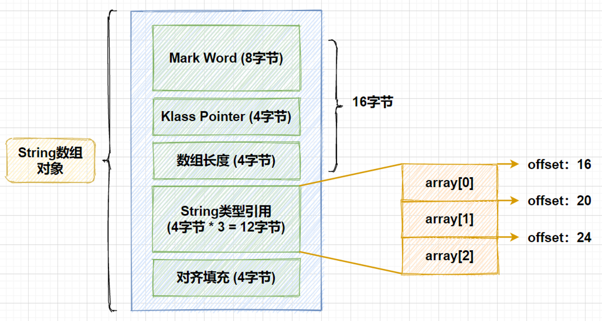
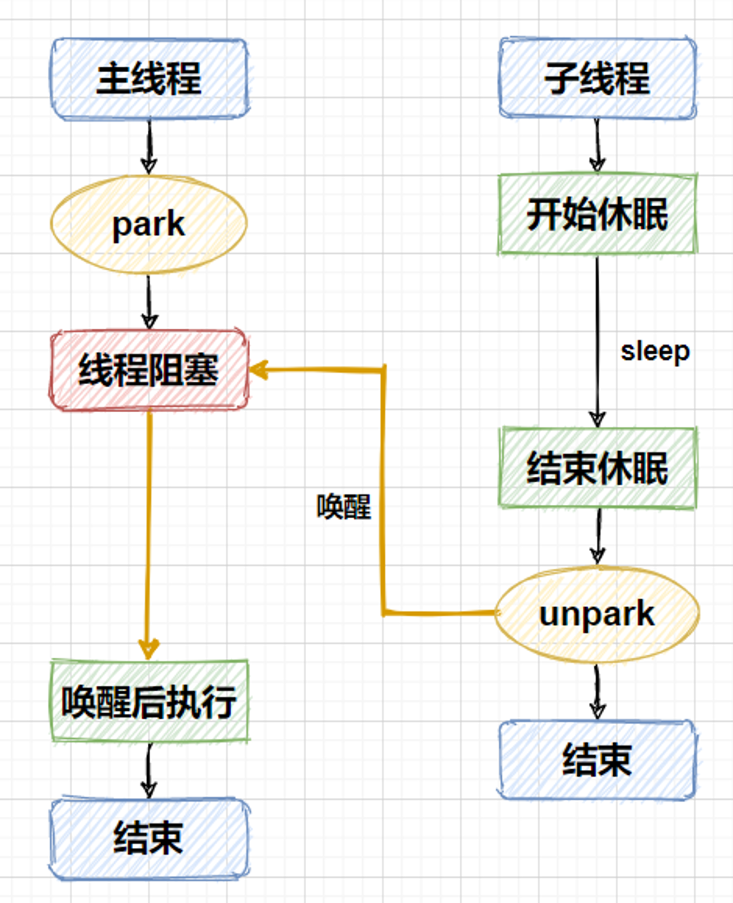
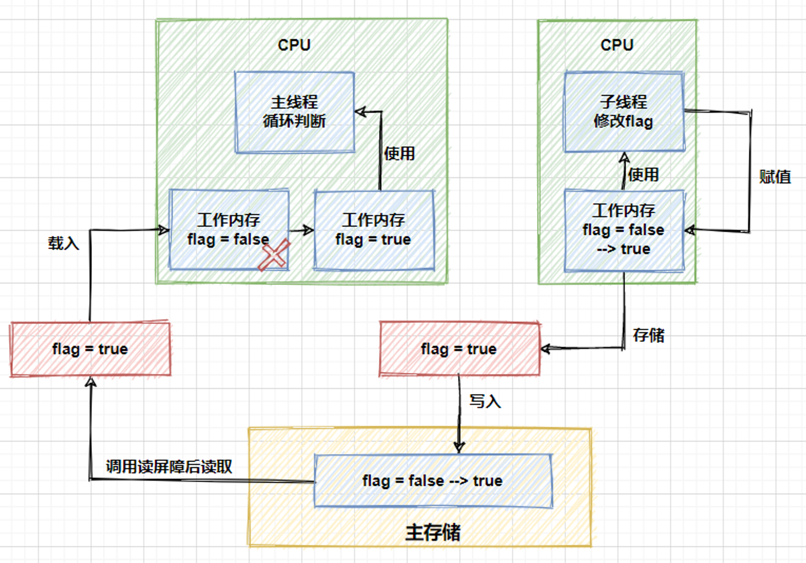
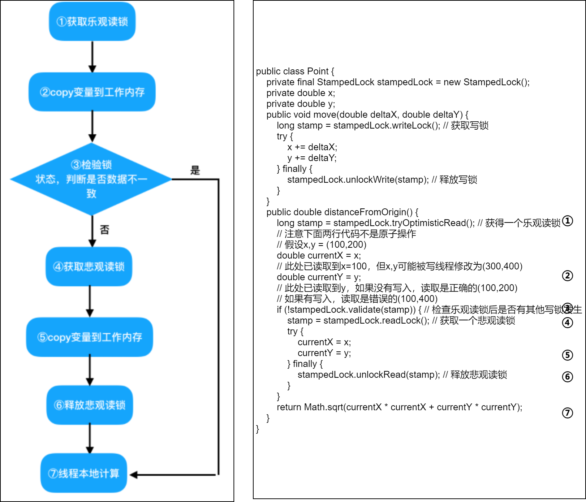

# 前言
&emsp;Unsafe是位于sun.misc包下的一个类，主要提供一些用于执行低级别、不安全操作的方法，如直接访问系统内存资源、自主管理内存资源等，这些方法在提升Java运行效率、增强Java语言底层资源操作能力方面起到了很大的作用。但由于Unsafe类使Java语言拥有了类似C语言指针一样操作内存空间的能力，这无疑也增加了程序发生相关指针问题的风险。在程序中过度、不正确使用Unsafe类会使得程序出错的概率变大，使得Java这种安全的语言变得不再“安全”，因此对Unsafe的使用一定要慎重。
# 基本介绍

如下Unsafe源码所示，Unsafe类为一单例实现，提供静态方法getUnsafe获取Unsafe实例，当且仅当调用getUnsafe方法的类为引导类加载器所加载时才合法，否则抛出SecurityException异常。
```java
public final class Unsafe {
  // 单例对象
  private static final Unsafe theUnsafe;

  private Unsafe() {
  }
  @CallerSensitive
  public static Unsafe getUnsafe() {
    Class var0 = Reflection.getCallerClass();
    // 仅在引导类加载器`BootstrapClassLoader`加载时才合法
    if(!VM.isSystemDomainLoader(var0.getClassLoader())) {    
      throw new SecurityException("Unsafe");
    } else {
      return theUnsafe;
    }
  }
}
```
那如若想使用这个类，该如何获取其实例？有如下两个可行方案。

其一，从`getUnsafe`方法的使用限制条件出发，通过Java命令行命令`-Xbootclasspath/a`把调用Unsafe相关方法的类A所在jar包路径追加到默认的bootstrap路径中，使得A被引导类加载器加载，从而通过`Unsafe.getUnsafe`方法安全的获取Unsafe实例。
```
java -Xbootclasspath/a: ${path}   // 其中path为调用Unsafe相关方法的类所在jar包路径 
```
其二，通过反射获取单例对象theUnsafe。
```java
private static Unsafe reflectGetUnsafe() {
    try {
      Field field = Unsafe.class.getDeclaredField("theUnsafe");
      field.setAccessible(true);
      return (Unsafe) field.get(null);
    } catch (Exception e) {
      log.error(e.getMessage(), e);
      return null;
    }
}
```
# 功能介绍


## 内存操作
在java中是不允许直接对内存进行操作的，对象内存的分配和回收都是由`jvm`自己实现的。但是在Unsafe中，提供的下列接口可以直接进行内存操作：这部分主要包含堆外内存的分配、拷贝、释放、给定地址值操作等方法。
```java
//分配内存, 相当于C++的malloc函数
public native long allocateMemory(long bytes);
//扩充内存
public native long reallocateMemory(long address, long bytes);
//释放内存
public native void freeMemory(long address);
//在给定的内存块中设置值
public native void setMemory(Object o, long offset, long bytes, byte value);
//内存拷贝
public native void copyMemory(Object srcBase, long srcOffset, Object destBase, long destOffset, long bytes);
//获取给定地址值，忽略修饰限定符的访问限制。与此类似操作还有: getInt，getDouble，getLong，getChar等
public native Object getObject(Object o, long offset);
//为给定地址设置值，忽略修饰限定符的访问限制，与此类似操作还有: putInt,putDouble，putLong，putChar等
public native void putObject(Object o, long offset, Object x);
//获取给定地址的byte类型的值（当且仅当该内存地址为allocateMemory分配时，此方法结果为确定的）
public native byte getByte(long address);
//为给定地址设置byte类型的值（当且仅当该内存地址为allocateMemory分配时，此方法结果才是确定的）
public native void putByte(long address, byte x);
```
&emsp;通常，我们在Java中创建的对象都处于堆内内存（heap）中，堆内内存是由JVM所管控的Java进程内存，并且它们遵循JVM的内存管理机制，JVM会采用垃圾回收机制统一管理堆内存。与之相对的是堆外内存，存在于JVM管控之外的内存区域，Java中对堆外内存的操作，依赖于Unsafe提供的操作堆外内存的native方法。

### 使用堆外内存的原因
*   对垃圾回收停顿的改善。由于堆外内存是直接受操作系统管理而不是JVM，所以当我们使用堆外内存时，即可保持较小的堆内内存规模。从而在GC时减少回收停顿对于应用的影响。
*   提升程序I/O操作的性能。通常在I/O通信过程中，会存在堆内内存到堆外内存的数据拷贝操作，对于需要频繁进行内存间数据拷贝且生命周期较短的暂存数据，都建议存储到堆外内存。

### 经典应用
DirectByteBuffer是Java用于实现堆外内存的一个重要类，通常用在通信过程中做缓冲池，如在Netty、MINA等NIO框架中应用广泛。DirectByteBuffer对于堆外内存的创建、使用、销毁等逻辑均由Unsafe提供的堆外内存API来实现。
&emsp; 创建DirectByteBuffer的时候，通过Unsafe.allocateMemory分配内存、Unsafe.setMemory进行内存初始化，而后构建Cleaner对象用于跟踪DirectByteBuffer对象的垃圾回收，以实现当DirectByteBuffer被垃圾回收时，分配的堆外内存一起被释放。

## CAS相关
在`juc`包的并发工具类中大量地使用了CAS操作，例如`synchronized`和`AQS`多次提到了CAS，其作为乐观锁在并发工具类中广泛发挥了作用。在Unsafe类中，提供了`compareAndSwapObject`、`compareAndSwapInt`、`compareAndSwapLong`方法来实现的对`Object`、`int`、`long`类型的CAS操作。针对对象的原子性，AtomicReference和AtomicStampReference(杜绝ABA问题)
```java
/**
    *  CAS
  * @param o         包含要修改field的对象
  * @param offset    对象中某field的偏移量
  * @param expected  期望值
  * @param update    更新值
  * @return          true | false
  */
public final native boolean compareAndSwapObject(Object o, long offset,  Object expected, Object update);
public final native boolean compareAndSwapInt(Object o, long offset, int expected,int update);
public final native boolean compareAndSwapLong(Object o, long offset, long expected, long update);
```

### 典型应用
#### AtomicInteger原子类
CAS在java.util.concurrent.atomic相关类、Java AQS、CurrentHashMap等实现上有非常广泛的应用。如下图所示，AtomicInteger的实现中，静态字段valueOffset即为字段value的内存偏移量，valueOffset的值在AtomicInteger初始化时，在静态代码块中通过Unsafe的objectFieldOffset方法获取。在AtomicInteger中提供的线程安全方法中，通过字段valueOffset的值可以定位到AtomicInteger对象中value的内存地址，从而可以根据CAS实现对value字段的原子操作：
```java
public class AtomicInteger extends Number implements java.io.Serializable {
    private static final long serialVersionUID = 6214790243416807050L;

    // setup to use Unsafe.compareAndSwapInt for updates
    private static final Unsafe unsafe = Unsafe.getUnsafe();
    private static final long valueOffset;

    static {
        try {
            valueOffset = unsafe.objectFieldOffset
                (AtomicInteger.class.getDeclaredField("value"));
        } catch (Exception ex) { throw new Error(ex); }
    }

    private volatile int value;
    // ...
}
```
#### AQS中compareAndSetTail方法
AQS中的`compareAndSetHead()` 和 `compareAndSetTail()` 方法，都是使用了compareAndSwapObject()方法。如下所示：
```java
// AQS相关代码
private final boolean compareAndSetHead(Node update) {
    return unsafe.compareAndSwapObject(this, headOffset, null, update);
}
private final boolean compareAndSetTail(Node expect, Node update) {
    return unsafe.compareAndSwapObject(this, tailOffset, expect, update);
}
```
剖析Unsafe类的compareAndSwapObject方法，它是本地方法，对应的C++源码如下：
```cpp
// Unsafe.h
virtual jboolean compareAndSwapObject(::java::lang::Object *, jlong, ::java::lang::Object *, ::java::lang::Object *);

// natUnsafe.cc
static inline bool
compareAndSwap (volatile jobject *addr, jobject old, jobject new_val)
{
    jboolean result = false;
    spinlock lock;
  
      // 如果字段的地址与期望的地址相等则将字段的地址更新
    if ((result = (*addr == old)))
        *addr = new_val;
    return result;
}

// natUnsafe.cc
jboolean
sun::misc::Unsafe::compareAndSwapObject (jobject obj, jlong offset,
                     jobject expect, jobject update)
{
    // 获取字段地址并转换为字符串
    jobject *addr = (jobject*)((char *) obj + offset);
    // 调用 compareAndSwap 方法进行比较
    return compareAndSwap (addr, expect, update);
}
```
实现原理：
*   通过我们传入的字段在对象中的偏移量来获取到字段的地址（对象首地址 + 字段在对象中的偏移量）；
*   然后调用 **CompareAndSwap** 方法比较字段的地址是否与我们期望的地址相等，如果相等则使用我们传入的新地址更新字段的地址；
总结就是：根据对象地址+字段偏移量可以得到字段的指针。由一个对象的字段指针可以在更新前判断指针对应的值是否是我指定的期望值(旧值)，如果不是说明，在我更新的过程中被修改了，则CAS失败。

## 对象操作
### 普通操作成员属性
```java
public native int getInt(Object o, long offset);
public native void putInt(Object o, long offset, int x);
```
先说作用，`getInt`用于从对象的指定偏移地址处读取一个`int`，`putInt`用于在对象指定偏移地址处写入一个`int`，并且即使类中的这个属性是`private`私有类型的，也可以对它进行读写。native方法的实现是C++实现的，java是通过JNI调用的。
示例如下：
```cpp
public static Unsafe getUnsafe() throws IllegalAccessException {
    Field unsafeField = Unsafe.class.getDeclaredField("theUnsafe");
    //Field unsafeField = Unsafe.class.getDeclaredFields()[0]; //也可以这样，作用相同
    unsafeField.setAccessible(true);
    Unsafe unsafe =(Unsafe) unsafeField.get(null);
    return unsafe;
}
public void fieldTest(Unsafe unsafe) throws NoSuchFieldException {
    User user=new User();
    long fieldOffset = unsafe.objectFieldOffset(User.class.getDeclaredField("age"));
    System.out.println("offset:"+fieldOffset);
    unsafe.putInt(user,fieldOffset,20);
    System.out.println("age:"+unsafe.getInt(user,fieldOffset));
    System.out.println("age:"+user.getAge());
}
```
运行代码输出如下，可以看到通过Unsafe类的`objectFieldOffset`方法获取了对象中字段的偏移地址，这个偏移地址不是内存中的绝对地址而是一个相对地址，之后再通过这个偏移地址对`int`类型字段的属性值进行了读写操作，通过结果也可以看到Unsafe的方法和类中的`get`方法获取到的值是相同的。
```
offset:12
age:20
age:20
```

### volatile读写和有序写操作
对象成员属性的内存偏移量获取。除了前面的`putInt`、`getInt`方法外，Unsafe提供了全部8种基础数据类型以及`Object`的`put`和`get`方法，并且所有的`put`方法都可以越过访问权限，直接修改内存中的数据。阅读openJDK源码中的注释发现，基础数据类型和`Object`的读写稍有不同，基础数据类型是直接操作的属性值（`value`），而`Object`的操作则是基于引用值（`reference value`）。下面是`Object`的读写方法：
```java
//在对象的指定偏移地址获取一个对象引用
public native Object getObject(Object o, long offset);
//在对象指定偏移地址写入一个对象引用
public native void putObject(Object o, long offset, Object x);
```
除了对象属性的普通读写外，Unsafe还提供了**volatile读写**和**有序写入**方法。`volatile`读写方法的覆盖范围与普通读写相同，包含了全部基础数据类型和`Object`类型，以`int`类型为例：
```java
//在对象的指定偏移地址处读取一个int值，支持volatile load语义
public native int getIntVolatile(Object o, long offset);
//在对象指定偏移地址处写入一个int，支持volatile store语义
public native void putIntVolatile(Object o, long offset, int x);
```
相对于普通读写来说，`volatile`读写具有更高的成本，因为它需要保证可见性和有序性。在执行`get`操作时，会强制从主存中获取属性值，在使用`put`方法设置属性值时，会强制将值更新到主存中，从而保证这些变更对其他线程是可见的。
有序写入的方法有以下三个：
```java
public native void putOrderedObject(Object o, long offset, Object x);
public native void putOrderedInt(Object o, long offset, int x);
public native void putOrderedLong(Object o, long offset, long x);
```
有序写入的成本相对`volatile`较低，因为它只保证写入时的有序性，而不保证可见性，也就是一个线程写入的值不能保证其他线程立即可见。为了解决这里的差异性，需要对内存屏障的知识点再进一步进行补充，首先需要了解两个指令的概念：
*  `Load`：将主内存中的数据拷贝到处理器的缓存中
*  `Store`：将处理器缓存的数据刷新到主内存中
顺序写入与`volatile`写入的差别在于，在顺序写时加入的内存屏障类型为`StoreStore`类型，而在`volatile`写入时加入的内存屏障是`StoreLoad`类型，如下图所示：

&emsp; 在有序写入方法中，使用的是`StoreStore`屏障，该屏障确保`Store1`立刻刷新数据到内存，这一操作先于`Store2`以及后续的存储指令操作。而在`volatile`写入中，使用的是`StoreLoad`屏障，该屏障确保`Store1`立刻刷新数据到内存，这一操作先于`Load2`及后续的装载指令，并且，`StoreLoad`屏障会使该屏障之前的所有内存访问指令，包括存储指令和访问指令全部完成之后，才执行该屏障之后的内存访问指令。
综上所述，在上面的三类写入方法中，在写入效率方面，按照`put`、`putOrder`、`putVolatile`的顺序效率逐渐降低。

### 创建实例对象
使用Unsafe的`allocateInstance`方法，允许我们使用非常规的方式进行对象的实例化，首先定义一个实体类，并且在构造函数中对其成员变量进行赋值操作：
```java
@Data
public class A {
    private int b;
    public A(){
        this.b =1;
    }
}
```
分别基于构造函数、反射以及Unsafe方法的不同方式创建对象进行比较：
```java
public void objTest() throws Exception{
    A a1=new A();
    System.out.println(a1.getB());
    A a2 = A.class.newInstance();
    System.out.println(a2.getB());
    A a3= (A) unsafe.allocateInstance(A.class);
    System.out.println(a3.getB());
}
```
打印结果分别为1、1、0，说明通过`allocateInstance`方法创建对象过程中，不会调用类的构造方法。使用这种方式创建对象时，只用到了`Class`对象，所以说如果想要跳过对象的初始化阶段或者跳过构造器的安全检查，就可以使用这种方法。在上面的例子中，如果将A类的构造函数改为`private`类型，将无法通过构造函数和反射创建对象，但`allocateInstance`方法仍然有效。

## 数组操作
```java
//返回数组中第一个元素的偏移地址
public native int arrayBaseOffset(Class<?> arrayClass);
//返回数组中一个元素占用的大小
public native int arrayIndexScale(Class<?> arrayClass);
```
在Unsafe中，可以使用`arrayBaseOffset`方法可以获取数组中第一个元素的偏移地址，使用`arrayIndexScale`方法可以获取数组中元素间的偏移地址增量。使用下面的代码进行测试：
```java
private void arrayTest() {
    String[] array=new String[]{"str1str1str","str2","str3"};
    int baseOffset = unsafe.arrayBaseOffset(String[].class);
    System.out.println(baseOffset);
    int scale = unsafe.arrayIndexScale(String[].class);
    System.out.println(scale);

    for (int i = 0; i < array.length; i++) {
        int offset=baseOffset+scale*i;
        System.out.println(offset+" : "+unsafe.getObject(array,offset));
    }
}
```
上面代码的输出结果为：
```
16
4
16 : str1str1str
20 : str2
24 : str3
```
通过配合使用数组偏移首地址和各元素间偏移地址的增量，可以方便的定位到数组中的元素在内存中的位置，进而通过`getObject`方法直接获取任意位置的数组元素。需要说明的是，`arrayIndexScale`获取的并不是数组中元素占用的大小，而是地址的增量，按照openJDK中的注释，可以将它翻译为**元素寻址的转换因子**（`scale factor for addressing elements`）。在上面的例子中，第一个字符串长度为11字节，但其地址增量仍然为4字节。
String数组对象布局如下：

在String数组对象中，对象头包含3部分，`mark word`标记字占用8字节，`klass point`类型指针占用4字节，数组对象特有的数组长度部分占用4字节，总共占用了16字节。第一个String的引用类型相对于对象的首地址的偏移量是就16，之后每个元素在这个基础上加4，正好对应了我们上面代码中的寻址过程，之后再使用前面说过的`getObject`方法，通过数组对象可以获得对象在堆中的首地址，再配合对象中变量的偏移量，就能获得每一个变量的引用。

## 线程调度
Unsafe类中提供了`park`、`unpark`、`monitorEnter`、`monitorExit`、`tryMonitorEnter`方法进行线程调度，在前面介绍AQS的文章中我们提到过使用`LockSupport`挂起或唤醒指定线程，看一下`LockSupport`的源码，可以看到它也是调用的Unsafe类中的方法：
```java
// LockSupport
public static void park(Object blocker) {
    Thread t = Thread.currentThread();
    setBlocker(t, blocker);
    UNSAFE.park(false, 0L);
    setBlocker(t, null);
}
public static void unpark(Thread thread) {
    if (thread != null)
        UNSAFE.unpark(thread);
}
```
LockSupport的`park`方法调用了Unsafe的`park`方法来阻塞当前线程，此方法将线程阻塞后就不会继续往后执行，直到有其他线程调用`unpark`方法唤醒当前线程。下面的例子对Unsafe的这两个方法进行测试：
```java
public static void main(String[] args) {
    Thread mainThread = Thread.currentThread();
    new Thread(()->{
        try {
            TimeUnit.SECONDS.sleep(5);
            System.out.println("subThread try to unpark mainThread");
            unsafe.unpark(mainThread);
        } catch (InterruptedException e) {
            e.printStackTrace();
        }
    }).start();

    System.out.println("park main mainThread");
    unsafe.park(false,0L);
    System.out.println("unpark mainThread success");
}
```
程序输出为：
```
park main mainThread
subThread try to unpark mainThread
unpark mainThread success
```
程序运行的流程也比较容易看懂，子线程开始运行后先进行睡眠，确保主线程能够调用`park`方法阻塞自己，子线程在睡眠5秒后，调用`unpark`方法唤醒主线程，使主线程能继续向下执行。整个流程如下图所示：

此外，Unsafe源码中`monitor`相关的三个方法已经被标记为`deprecated`，不建议被使用：
```java
//获得对象锁
@Deprecated
public native void monitorEnter(Object var1);
//释放对象锁
@Deprecated
public native void monitorExit(Object var1);
//尝试获得对象锁
@Deprecated
public native boolean tryMonitorEnter(Object var1);
```
`monitorEnter`方法用于获得对象锁，`monitorExit`用于释放对象锁，如果对一个没有被`monitorEnter`加锁的对象执行此方法，会抛出`IllegalMonitorStateException`异常。`tryMonitorEnter`方法尝试获取对象锁，如果成功则返回`true`，反之返回`false`。

## 系统信息
Unsafe中提供的`addressSize`和`pageSize`方法用于获取系统信息，调用`addressSize`方法会返回系统指针的大小，如果在64位系统下默认会返回8，而32位系统则会返回4。调用pageSize方法会返回内存页的大小，值为2的整数幂。使用下面的代码可以直接进行打印：
```java
private void systemTest() {
    System.out.println(unsafe.addressSize());
    System.out.println(unsafe.pageSize());
}
```
执行结果：
```
8
4096
```

这两个方法的应用场景比较少，在`java.nio.Bits`类中，在使用`pageCount`计算所需的内存页的数量时，调用了`pageSize`方法获取内存页的大小。另外，在使用`copySwapMemory`方法拷贝内存时，调用了`addressSize`方法，检测32位系统的情况。

## 内存屏障
在Java 8中引入，用于定义内存屏障（也称内存栅栏，内存栅障，屏障指令等，是一类同步屏障指令，是CPU或编译器在对内存随机访问的操作中的一个同步点，使得此点之前的所有读写操作都执行后才可以开始执行此点之后的操作），避免代码重排序。java8中，引入了3个内存屏障的函数，它屏蔽了操作系统底层的差异，允许在代码中定义、并统一由jvm来生成内存屏障指令，来实现内存屏障的功能。Unsafe中提供了下面三个内存屏障相关方法：
```java
//内存屏障，禁止load操作重排序。屏障前的load操作不能被重排序到屏障后，屏障后的load操作不能被重排序到屏障前
public native void loadFence();
//内存屏障，禁止store操作重排序。屏障前的store操作不能被重排序到屏障后，屏障后的store操作不能被重排序到屏障前
public native void storeFence();
//内存屏障，禁止load、store操作重排序
public native void fullFence();
```
### loadFence使用
如果在字段上添加了`volatile`关键字，就能够实现字段在多线程下的可见性。基于读内存屏障，我们也能实现相同的功能。下面定义一个线程方法，在线程中去修改`flag`标志位，注意这里的`flag`是没有被`volatile`修饰的：
```java
@Getter
class ChangeThread implements Runnable{
    /**volatile**/ boolean flag=false;
    @Override
    public void run() {
        try {
            Thread.sleep(3000);
        } catch (InterruptedException e) {
            e.printStackTrace();
        }
        System.out.println("subThread change flag to:" + flag);
        flag = true;
    }
}
```
在主线程的`while`循环中，加入内存屏障，测试是否能够感知到`flag`的修改变化：
```java
public static void main(String[] args){
    ChangeThread changeThread = new ChangeThread();
    new Thread(changeThread).start();
    while (true) {
        boolean flag = changeThread.isFlag();
        unsafe.loadFence(); //加入读内存屏障
        if (flag){
            System.out.println("detected flag changed");
            break;
        }
    }
    System.out.println("main thread end");
}
```
运行结果：
```java
subThread change flag to:false
detected flag changed
main thread end
```
而如果删掉上面代码中的`loadFence`方法，那么主线程将无法感知到`flag`发生的变化，会一直在`while`中循环。可以用图来表示上面的过程：

运行中的线程不是直接读取主内存中的变量的，只能操作自己工作内存中的变量，然后同步到主内存中，并且线程的工作内存是不能共享的。上面的图中的流程就是子线程借助于主内存，将修改后的结果同步给了主线程，进而修改主线程中的工作空间，跳出循环。

### 剖析StampedLock
`ReadWriteLock`可以解决多线程同时读，但只有一个线程能写的问题。
&emsp;如果我们深入分析`ReadWriteLock`，会发现它有个潜在的问题：如果有线程正在读，写线程需要等待读线程释放锁后才能获取写锁，即读的过程中不允许写，这是一种悲观的读锁。
&emsp; 要进一步提升并发执行效率，Java 8引入了新的读写锁：`StampedLock`。
`StampedLock`和`ReadWriteLock`相比，改进之处在于：读的过程中也允许获取写锁后写入！这样一来，我们读的数据就可能不一致，所以，需要一点额外的代码来判断读的过程中是否有写入，这种读锁是一种乐观锁。
&emsp;乐观锁的意思就是乐观地估计读的过程中大概率不会有写入，因此被称为乐观锁。反过来，悲观锁则是读的过程中拒绝有写入，也就是写入必须等待。显然乐观锁的并发效率更高，但一旦有小概率的写入导致读取的数据不一致，需要能检测出来，再读一遍就行。
代码示例：
```java
public class Point {
    private final StampedLock stampedLock = new StampedLock();

    private double x;
    private double y;

    public void move(double deltaX, double deltaY) {
        long stamp = stampedLock.writeLock(); // 获取写锁
        try {
            x += deltaX;
            y += deltaY;
        } finally {
            stampedLock.unlockWrite(stamp); // 释放写锁
        }
    }

    public double distanceFromOrigin() {
        long stamp = stampedLock.tryOptimisticRead(); // 获得一个乐观读锁
        // 注意下面两行代码不是原子操作
        // 假设x,y = (100,200)
        double currentX = x;
        // 此处已读取到x=100，但x,y可能被写线程修改为(300,400)
        double currentY = y;
        // 此处已读取到y，如果没有写入，读取是正确的(100,200)
        // 如果有写入，读取是错误的(100,400)
        if (!stampedLock.validate(stamp)) { // 检查乐观读锁后是否有其他写锁发生
            stamp = stampedLock.readLock(); // 获取一个悲观读锁
            try {
                currentX = x;
                currentY = y;
            } finally {
                stampedLock.unlockRead(stamp); // 释放悲观读锁
            }
        }
        return Math.sqrt(currentX * currentX + currentY * currentY);
    }
}
```
和`ReadWriteLock`相比，写入的加锁是完全一样的，不同的是读取。注意到首先我们通过`tryOptimisticRead()`获取一个乐观读锁，并返回版本号。接着进行读取，读取完成后，我们通过`validate()`去验证版本号，如果在读取过程中没有写入，版本号不变，验证成功，我们就可以放心地继续后续操作。如果在读取过程中有写入，版本号会发生变化，验证将失败。在失败的时候，我们再通过获取悲观读锁再次读取。由于写入的概率不高，程序在绝大部分情况下可以通过乐观读锁获取数据，极少数情况下使用悲观读锁获取数据。
&emsp; 可见，`StampedLock`把读锁细分为乐观读和悲观读，能进一步提升并发效率。但这也是有代价的：一是代码更加复杂，二是`StampedLock`是不可重入锁，不能在一个线程中反复获取同一个锁。
&emsp;`StampedLock`还提供了更复杂的将悲观读锁升级为写锁的功能，它主要使用在if-then-update的场景：即先读，如果读的数据满足条件，就返回，如果读的数据不满足条件，再尝试写。
注意：
- `StampedLock`提供了乐观读锁，可取代`ReadWriteLock`以进一步提升并发性能；
- `StampedLock`是不可重入锁。

剖析原理如下：

下为StampedLock.validate方法的源码实现，通过锁标记与相关常量进行位运算、比较来校验锁状态，在校验逻辑之前，会通过Unsafe的loadFence方法加入一个load内存屏障，目的是避免上图用例中步骤②和StampedLock.validate中锁状态校验运算发生重排序导致锁状态校验不准确的问题。
```java
// StampedLock
public boolean validate(long stamp) {
    U.loadFence();
    return (stamp & SBITS) == (state & SBITS);
}
```
