# 前言
读者在阅读本文前最好有 Java 的 IO 编程经验（知道 Java 的各种 IO 流），以及 Java 网络编程经验（用 ServerSocket 和 Socket 写过 demo），并对 Java NIO 有基本的认识（至少知道 Channel、Buffer、Selector 中的核心属性和方法，以及三者如何配合使用的），以及 JUC 编程经验（至少知道其中的 Future 异步处理机制），没有也没关系，文中多数会介绍，不影响整体的理解。

文中对于 Reactor 的讲解使用了几张来自网络上的深灰色背景的示意图，但未找到原始出处，文中已标注“图片来源于网络”。

# 1. Netty基础
## 1.1 Netty 是什么
1）Netty是JBoss开源项目，是异步的、基于事件驱动的网络应用框架，它以高性能、高并发著称。所谓基于事件驱动，简单的说就是Netty会根据客户端事件(连接、读、写等)做出响应。后面会介绍。
2）Netty主要应用于开发基于TCP协议的网络IO程序（TCP/IP是网络通信的基石，当然也是Netty的基石，Netty并没有去改变这些底层的网络基础设施，而是在这之上提供更高层的网络基础设施），例如高性能服务端/客户端、P2P程序等。
3）Netty是基于Java NIO构建出来的，Java NIO又是基于Linux提供的高性能IO接口/系统调用构建出来的。关于Netty在网络中的地位，如下图所示：
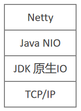

## 1.2 Netty的应用场景
&emsp;在互联网领域中，Netty作为异步高并发的网络组件，常常应用于构建高性能RPC框架，以提升分布式服务群之间调用或者数据传输的并发度和速度。例如Dubbo的网络层就可以(但并非一定)使用Netty。
&emsp; 一些大数据基础设施，比如Hadoop，在处理海量数据的时候，数据在计算节点之间传输，也采用Netty构建性能更高的网络IO层。
在游戏行业，Netty 被用于构建高性能的游戏交互服务器，Netty 提供了 TCP/UDP、HTTP 协议栈，方便开发者基于 Netty 进行私有协议的开发。

……

&emsp; Netty 作为成熟的高性能异步通信框架，无论是应用在互联网分布式应用开发中，还是在大数据基础设施构建中，亦或是用于实现应用层基于公私协议的服务器等等，都有出色的表现，是一个极好的轮子。

## 1.3 Java中的网络IO模型
Java 中的网络 IO 模型有三种：BIO、NIO、AIO。
1）**BIO**：同步式、阻塞式IO。在这种模型中，服务器上一个线程处理一次连接。即客户端每发起一个请求，服务端都要开启一个线程专门处理该请求。这种模型对线程量的耗费极大，且线程利用率低，难以承受请求的高并发。BIO虽然可以使用线程池+等待队列进行优化，避免使用过多线程但是依然无法解决线程利用率低的问题。

&emsp; 使用BIO构建C/S系统的Java编程组件是ServerSocket和Socket服务器端代码如下：
```java
public static void main(String[] args) throws IOException {
    ExecutorService threadPool = Executors.newCachedThreadPool();
    ServerSocket serverSocket = new ServerSocket(8080);

    while (true) {
        Socket socket = serverSocket.accept();
        threadPool.execute(() -> {
            handler(socket);
        });
    }
}

/**
 * 处理客户端请求
 */
private static void handler(Socket socket) throws IOException {
    byte[] bytes = new byte[1024];

    InputStream inputStream = socket.getInputStream();
    socket.close();

    while (true) {
        int read = inputStream.read(bytes);
        if (read != -1) {
            System.out.println("msg from client: " + new String(bytes, 0, read));
        } else {
            break;
        }
    }
}
```
2）**NIO**：同步的、非阻塞式IO。在这种模型中，服务器上一个线程处理多个连接，即多个客户端请求都会被注册到多路复用器(selector)上，多路复用器会轮询这些连接，轮训到连接上有 IO 活动就进行处理。NIO 降低了线程的需求量，提高了线程的利用率。Netty 就是基于 NIO 的（这里有一个问题：前文大力宣扬 Netty 是一个异步高性能网络应用框架，为何这里又说 Netty 是基于同步的 NIO 的？请读者跟着文章的描述找寻答案）。
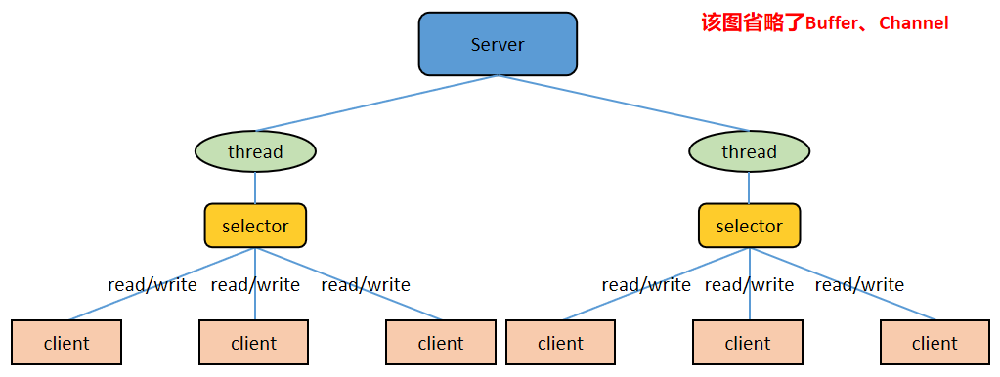
&emsp; NIO是面向缓冲区编程的，从缓冲区读取数据的时候游标在缓冲区中是可以前后移动的，这就增加了数据处理的灵活性，这和面向流的BIO只能顺序读取流中数据有很大的不同。
&emsp; Java NIO的非阻塞模式，使得一个线程从某个通道读取数据的时候，若当前有数据可读，则该线程进行处理，若当前无可用数据，则该线程不会保持阻塞等待状态，而是可以去处理其他工作(比如处理其他通道的读写)；同样，一个线程向某个通道写入数据的时候，一旦开始写入，该线程无需等到写完即可去处理其他工作（比如处理其他通道的读写）。这种特性使得一个线程能够处理多个客户端请求，而不是像 BIO 那样，一个线程只能处理一个请求。
&emsp; 使用NIO构建C/S系统的Java编程组件是Channel、Buffer、Selector。服务器端示例代码为：
```java
public static void main(String[] args) throws IOException {
    ServerSocketChannel serverSocketChannel = ServerSocketChannel.open();
    Selector selector = Selector.open();

    // 绑定端口
    serverSocketChannel.socket().bind(new InetSocketAddress(8080));

    // 设置 serverSocketChannel 为非阻塞模式
    serverSocketChannel.configureBlocking(false);

    // 注册 serverSocketChannel 到 selector，关注 OP_ACCEPT 事件
    serverSocketChannel.register(selector, SelectionKey.OP_ACCEPT);

    while (true) {
        // 没有事件发生
        if (selector.select(1000) == 0) {
            continue;
        }

        // 有事件发生，找到发生事件的 Channel 对应的 SelectionKey 的集合
        Set<SelectionKey> selectionKeys = selector.selectedKeys();

        Iterator<SelectionKey> iterator = selectionKeys.iterator();
        while (iterator.hasNext()) {
            SelectionKey selectionKey = iterator.next();

            // 发生 OP_ACCEPT 事件，处理连接请求
            if (selectionKey.isAcceptable()) {
                SocketChannel socketChannel = serverSocketChannel.accept();

                // 将 socketChannel 也注册到 selector，关注 OP_READ
                // 事件，并给 socketChannel 关联 Buffer
                socketChannel.register(selector, SelectionKey.OP_READ, ByteBuffer.allocate(1024));
            }

            // 发生 OP_READ 事件，读客户端数据
            if (selectionKey.isReadable()) {
                SocketChannel channel = (SocketChannel) selectionKey.channel();
                ByteBuffer buffer = (ByteBuffer) selectionKey.attachment();
                channel.read(buffer);

                System.out.println("msg form client: " + new String(buffer.array()));
            }

            // 手动从集合中移除当前的 selectionKey，防止重复处理事件
            iterator.remove();
        }
    }
}
```
3）**AIO**：异步非阻塞IO。在这种模型中，由操作系统完成与客户端间的read/write，之后再由操作系统主动通知服务器线程去处理后面的工作，在这个过程中，服务器线程不必同步等待read/write 完成。由于不同的操作系统对 AIO 的支持程度不同，AIO 目前未得到广泛应用。因此本文对 AIO 不做过多描述。
&emsp; 使用 Java NIO 构建的 IO 程序，它的工作模式是：主动轮训 IO 事件，IO 事件发生后程序的线程主动处理 IO 工作，这种模式也叫做 Reactor 模式。使用 Java AIO 构建的 IO 程序，它的工作模式是：将 IO 事件的处理托管给操作系统，操作系统完成 IO 工作之后会通知程序的线程去处理后面的工作，这种模式也叫做 Proactor 模式。
&emsp;本节最后，讨论一下网路 IO 中阻塞、非阻塞、异步、同步这几个术语的含义和关系：
*   阻塞：如果线程调用 read/write 过程，但 read/write 过程没有就绪或没有完成，则调用 read/write 过程的线程会一直等待，这个过程叫做阻塞式读写。
*   非阻塞：如果线程调用 read/write 过程，但 read/write 过程没有就绪或没有完成，调用 read/write 过程的线程并不会一直等待，而是去处理其他工作，等到 read/write 过程就绪或完成后再回来处理，这个过程叫做阻塞式读写。
*   异步：read/write 过程托管给操作系统来完成，完成后操作系统会通知（通过回调或者事件）应用网络 IO 程序（其中的线程）来进行后续的处理。
*   同步：read/write 过程由网络 IO 程序（其中的线程）来完成。

&emsp; 基于以上含义，可以看出：异步 IO 一定是非阻塞 IO；同步 IO 既可以是阻塞 IO、也可以是非阻塞 IO。

## 1.4 Java NIO API简单回顾
&emsp; BIO以流的方式处理数据，而NIO以缓冲区（也叫作块）的方式处理数据块，块IO效率比流IO效率高很多。BIO基于字符流或者字节流进行操作，而NIO基于Channel和Buffer进行操作，数据总是从通道读取到缓冲区或者从缓冲区写入到通道。Selector用于监听多个通道上的事件（比如收到连接请求、数据到达等等），因此使用单个线程就可以监听多个客户端通道。如下图所示：

&emsp;关于上图，再进行几点说明：
- 一个Selector对应一个处理线程；
- 一个Selector上可以注册多个Channel；
- 每个Channel都会对应一个Buffer（有时候一个channel可以使用多个Buffer，这时候程序要进行多个Buffer的分散和聚集操作），Buffer的本质是一个内存块，底层是一个数组；
- Selector会根据不同的事件在各个Channel上切换；
- Buffer是双向的，既可以读也可以写，切换读写方向要调用Buffer的`flip()`方法；
- 同样Channel也是双向的，数据既可以流入也可以流出；

### 1.4.1 缓冲区(Buffer)
&emsp; 缓冲区(Buffer)本质上一个可读可写的内存块，可以理解成一个容器对象，Channel读写文件或者网络都要通过Buffer。在Java NIO中，Buffer是一个顶层的抽象类，它的常用子类有(前缀表示存储哪种类型的数据)：
- ByteBuffer
- CharBuffer
- ShortBuffer
- IntBuffer
- LongBuffer
- DoubleBuffer
- FloatBuffer

&emsp; 涵盖了Java中除了boolean之外的所有的基本数据类型。其中ByteBuffer支持类型化的数据存取，既可以往ByteBuffer中存放byte类型的数据，也可以放 char、int、long、double 等类型的数据，但读取的时候要做好类型匹配处理，否则会抛出 BufferUnderflowException。
&emsp;另外Buffer体系中还有一个重要的MappedByteBuffer（ByteBuffer的子类），可以让文件内容直接在堆外内存中被修改(MMAP内存映射)。

### 1.4.2 通道(Channel)
&emsp; 通道(Channel)是双向的，可读可写。在Java NIO中，Buffer是一个顶层接口，它的常用子类有：
- FileChannel：用于文件读写；
- DatagramChannel: 用于UDP数据包收发；
- ServerSocketChannel：用于服务器端TCP数据包收发；
- SocketChannel：用于客户端TCP数据包收发；

### 1.4.3 选择器(Selector)
&emsp;选择器（Selector）是实现 IO 多路复用的关键，多个 Channel 注册到某个 Selector 上，当 Channel 上有事件发生时，Selector 就会取得事件然后调用线程去处理事件。也就是说只有当连接上真正有读写等事件发生时，线程才会去进行读写等操作，这就不必为每个连接都创建一个线程，一个线程可以应对多个连接。这就是 IO 多路复用的要义。
&emsp;Netty 的 IO 线程 NioEventLoop 聚合了 Selector，可以同时并发处理成百上千的客户端连接，后文会展开描述。

在 Java NIO 中，Selector 是一个抽象类，它的常用方法有：
```java
public abstract class Selector implements Closeable {
    /**
     * 得到一个选择器对象
     */
    public static Selector open() throws IOException {
        return SelectorProvider.provider().openSelector();
    }

    /**
     * 返回所有发生事件的 Channel 对应的 SelectionKey 的集合，通过
     * SelectionKey 可以找到对应的 Channel
     */
    public abstract Set<SelectionKey> selectedKeys();

    /**
     * 返回所有 Channel 对应的 SelectionKey 的集合，通过 SelectionKey
     * 可以找到对应的 Channel
     */
    public abstract Set<SelectionKey> keys();

    /**
     * 监控所有注册的 Channel，当其中的 Channel 有 IO 操作可以进行时，
     * 将这些 Channel 对应的 SelectionKey 找到。参数用于设置超时时间
     */
    public abstract int select(long timeout) throws IOException;

    /**
    * 无超时时间的 select 过程，一直等待，直到发现有 Channel 可以进行
    * IO 操作
    */
    public abstract int select() throws IOException;

    /**
    * 立即返回的 select 过程
    */
    public abstract int selectNow() throws IOException;

    /**
    * 唤醒 Selector，对无超时时间的 select 过程起作用，终止其等待
    */
    public abstract Selector wakeup();
    ......
}
```
在上文的使用 Java NIO 编写的服务端示例代码中，服务端的工作流程为：
1.  当客户端发起连接时，会通过ServerSocketChannel创建对应的SocketChannel。
2. 调用 SocketChannel 的注册方法将 SocketChannel 注册到 Selector 上，注册方法返回一个 SelectionKey，该 SelectionKey 会被放入 Selector 内部的 SelectionKey 集合中。该 SelectionKey 和 Selector 关联（即通过 SelectionKey 可以找到对应的 Selector），也和 SocketChannel 关联（即通过 SelectionKey 可以找到对应的 SocketChannel）。
4. Selector 会调用 select()/select(timeout)/selectNow()方法对内部的 SelectionKey 集合关联的 SocketChannel 集合进行监听，找到有事件发生的 SocketChannel 对应的 SelectionKey。
5. 通过 SelectionKey 找到有事件发生的 SocketChannel，完成数据处理。

以上过程的相关源码为：
```java
/**
* SocketChannel 继承 AbstractSelectableChannel
*/
public abstract class SocketChannel
    extends AbstractSelectableChannel
    implements ByteChannel, 
               ScatteringByteChannel, 
               GatheringByteChannel, 
               NetworkChannel
{
    ......
}

public abstract class AbstractSelectableChannel
    extends SelectableChannel
{
    /**
     * AbstractSelectableChannel 中包含注册方法，SocketChannel 实例
     * 借助该注册方法注册到 Selector 实例上去，该方法返回 SelectionKey
     */
    public final SelectionKey register(
        // 指明注册到哪个 Selector 实例
        Selector sel, 
        // ops 是事件代码，告诉 Selector 应该关注该通道的什么事件
        int ops,
        // 附加信息 attachment
        Object att) throws ClosedChannelException {
        ......
    }
    ......
}

public abstract class SelectionKey {
    /**
     * 获取该 SelectionKey 对应的 Channel
     */
    public abstract SelectableChannel channel();

    /**
     * 获取该 SelectionKey 对应的 Selector
     */
    public abstract Selector selector();

    /**
     * 事件代码，上面的 ops 参数取这里的值
     */
    public static final int OP_READ = 1 << 0;
    public static final int OP_WRITE = 1 << 2;
    public static final int OP_CONNECT = 1 << 3;
    public static final int OP_ACCEPT = 1 << 4;
    ......

    /**
     * 检查该 SelectionKey 对应的 Channel 是否可读
     */
    public final boolean isReadable() {
        return (readyOps() & OP_READ) != 0;
    }

    /**
     * 检查该 SelectionKey 对应的 Channel 是否可写
     */
    public final boolean isWritable() {
        return (readyOps() & OP_WRITE) != 0;
    }

    /**
     * 检查该 SelectionKey 对应的 Channel 是否已经建立起 socket 连接
     */
    public final boolean isConnectable() {
        return (readyOps() & OP_CONNECT) != 0;
    }

    /**
     * 检查该 SelectionKey 对应的 Channel 是否准备好接受一个新的 socket 连接
     */
    public final boolean isAcceptable() {
        return (readyOps() & OP_ACCEPT) != 0;
    }

    /**
     * 添加附件（例如 Buffer）
     */
    public final Object attach(Object ob) {
        return attachmentUpdater.getAndSet(this, ob);
    }

    /**
     * 获取附件
     */
    public final Object attachment() {
        return attachment;
    }
    ......
}
```
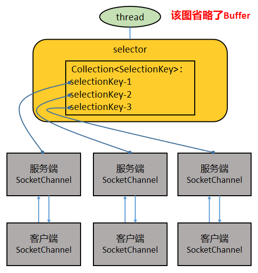
首先说明，本文以 Linux 系统为对象来研究文件 IO 模型和网络 IO 模型。

## 1.5 零拷贝技术
注：本节讨论的是 Linux 系统下的 IO 过程。并且对于零拷贝技术的讲解采用了一种浅显易懂但能触及其本质的方式，因为这个话题，展开来讲实在是有太多的细节要关注。
&emsp; 在“将本地磁盘中文件发送到网络中”这一场景中，零拷贝技术是提升 IO 效率的一个利器，为了对比出零拷贝技术的优越性，下面依次给出使用直接 IO 技术、内存映射文件技术、零拷贝技术实现将本地磁盘文件发送到网络中的过程。
### 1) 直接IO技术
使用直接 IO 技术实现文件传输的过程如下图所示。

上图中，内核缓冲区是 Linux 系统的 Page Cahe。为了加快磁盘的 IO，Linux 系统会把磁盘上的数据以 Page 为单位缓存在操作系统的内存里，这里的 Page 是 Linux 系统定义的一个逻辑概念，一个 Page 一般为 4K。
&emsp;可以看出，整个过程有四次数据拷贝，读进来两次，写回去又两次：磁盘-->内核缓冲区-->Socket 缓冲区-->网络。
&emsp;直接 IO 过程使用的 Linux 系统 API 为：
```java
ssize_t read(int filedes, void *buf, size_t nbytes);
ssize_t write(int filedes, void *buf, size_t nbytes);
```
等函数。

### 2) 内存映射文件技术
使用内存映射文件技术实现文件传输的过程如下图所示。
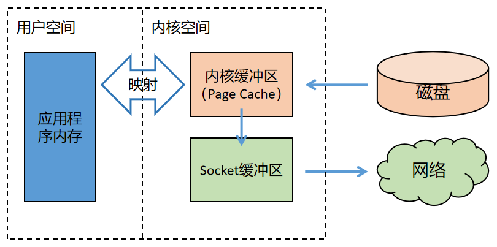
可以看出，整个过程有三次拷贝，不再经过应用程序内存，直接在内核空间中从内核缓冲区拷贝到Socket缓冲区。
&emsp; 内存映射文件过程使用的Linux系统API为：
```c
void *mmap(void *addr, size_t length, int prot, int flags, int fd, off_t offset);
```
### 3) 零拷贝技术
使用零拷贝技术，连内核缓冲区到Socket缓冲区的拷贝也省略了。如下图所示：
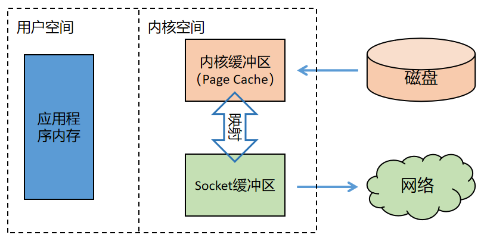
&emsp; 内核缓冲区到 Socket 缓冲区之间并没有做数据的拷贝，只是一个地址的映射。底层的网卡驱动程序要读取数据并发送到网络上的时候，看似读取的是 Socket 的缓冲区中的数据，其实直接读的是内核缓冲区中的数据。
零拷贝中所谓的“零”指的是**内存中数据拷贝的次数为 0**。
零拷贝过程使用的 Linux 系统 API 为：

```c
ssize_t sendfile(int out_fd, int in_fd, off_t *offset, size_t count);
```

在 JDK 中，提供的：

```java
FileChannel.transderTo(long position, long count, WritableByteChannel target);
```
方法实现了零拷贝过程，其中的第三个参数可以传入 SocketChannel 实例。例如客户端使用以上的零拷贝接口向服务器传输文件的代码为：
```java
public static void main(String[] args) throws IOException {
    SocketChannel socketChannel = SocketChannel.open();
    socketChannel.connect(new InetSocketAddress("127.0.0.1", 8080));
    String fileName = "test.zip";

    // 得到一个文件 channel
    FileChannel fileChannel = new FileInputStream(fileName).getChannel();

    // 使用零拷贝 IO 技术发送
    long transferSize = fileChannel.transferTo(0, fileChannel.size(), socketChannel);
    System.out.println("file transfer done, size: " + transferSize);
    fileChannel.close();
}
```
----

# 2. Netty 的架构原理
## 2.1 为什么要制造Netty?
既然 Java 提供了 NIO，为什么还要制造一个 Netty，主要原因是 Java NIO 有以下几个缺点：
1. Java NIO 的类库和 API 庞大繁杂，使用起来很麻烦，开发工作量大。
2. 使用 Java NIO，程序员需要具备高超的 Java 多线程编码技能，以及非常熟悉网络编程，比如要处理断连重连、网络闪断、半包读写、失败缓存、网络拥塞和异常流处理等一系列棘手的工作。
3. Java NIO 存在 Bug，例如 Epoll Bug 会导致 Selector 空轮训，极大耗费 CPU 资源。

Netty 对于 JDK 自带的 NIO 的 API 进行了封装，解决了上述问题，提高了 IO 程序的开发效率和可靠性，同时 Netty：
1. 设计优雅，提供阻塞和非阻塞的 Socket；提供灵活可拓展的事件模型；提供高度可定制的线程模型。
2. 具备更高的性能和更大的吞吐量，使用零拷贝技术最小化不必要的内存复制，减少资源的消耗。
3. 提供安全传输特性。
4. 支持多种主流协议；预置多种编解码功能，支持用户开发私有协议。

> **注：所谓支持 TCP、UDP、HTTP、WebSocket 等协议，就是说 Netty 提供了相关的编程类和接口，因此本文后面主要对基于 Netty 的 TCP Server/Client 开发案例进行讲解，以展示 Netty 的核心原理，对于其他协议 Server/Client 开发不再给出示例

下图为 Netty 官网给出的 Netty 架构图。
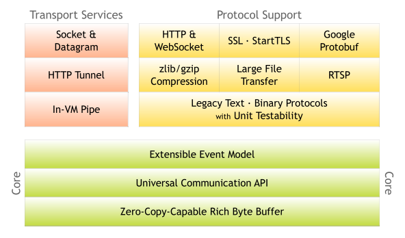
从其中的几个关键词就能看出 Netty 的强大之处：**零拷贝、可扩展事件模型；支持TCP、UDP、HTTP、WebSocket等协议；提供安全传输、压缩、大文件传输、编解码支持等。**

## 2.2 几种Reactor线程模式
传统的BIO服务端编程采用 "每线程每连接" 的处理模型，弊端很明显，就是面对大量的客户端并发连接时，服务端的资源压力很大；并且线程的利用率很低，如果当前线程没有数据可读，它会阻塞的read操作上。这个基本形态如下所示：
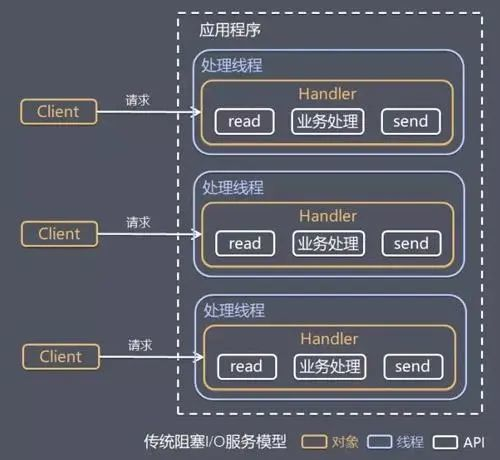
BIO服务端编程采用的是Reactor模式(也叫作Dispatcher模式，分派模式)，Reactor模式有两个要义：
1）**基于IO多路复用技术**，多个连接共用一个多路复用器，应用程序的线程无需等到所有连接，只需阻塞等待多路复用器即可。当某个连接上有数据可以处理时，应用程序的线程从阻塞状态返回，开始处理这个连接上的业务。
2）**基于线程池技术复用线程资源**，不必为每个连接创建专用的线程，应用程序将连接上的业务处理任务分配给线程池中的线程进行处理，一个线程可以处理多个连接的业务。
下图反应了Reactor的基本形态：
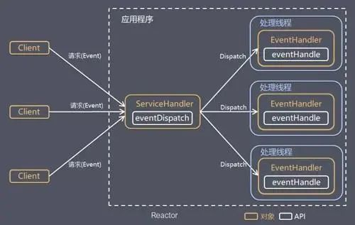
Reactor模式有两个核心组成部分：
- Reactor（图中的ServiceHandler）：Reactor在一个单独的线程中运行，负责监听和分发事件，分发给适当的处理线程来对IO事件做出反应。
- Handlers(图中的EventHandler)：处理线程执行处理方法来响应IO事件，处理线程执行的是非阻塞操作。

### 2.2.1 单Reactor单线程模式
单 Reactor 单线程模式的基本形态如下（图片来源于网络）：
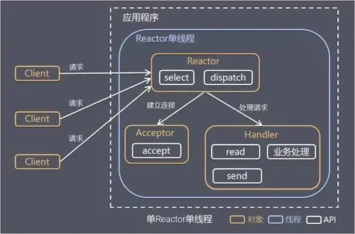
这种模式的基本工作流程为：
1. Reactor通过select监听客户端请求事件，收到事件之后通过dispatch进行分发。
2. 如果事件是建立连接的请求事件，则由Acceptor通过accept处理连接请求，然后创建一个Handler对象处理连接建立后的后续业务处理。
3. 如果事件不是建立连接的请求事件，则由Reactor对象分发给对应的Handler进行处理。
4. Handler 会完成 read-->业务处理-->send 的完整处理流程。

这种模式的优点是：模型简单，没有多线程、进程通信、竞争的问题，一个线程完成所有的事件响应和业务处理。当然缺点也很明显：
1. **存在性能问题**。只有一个线程，无法完全发挥多核CPU的性能。Handler在处理某个连接上的业务时，整个进程无法处理其他连接事件，很容易导致性能瓶颈。
2. **存在可靠性问题**。若线程意外终止或者进入死循环，会导致整个通信模块不可用，不能接收和处理外部消息，造成节点故障。

单Reactor单线程模式使用场景为：客户端的数量有限，业务处理非常快速，比如Redis在业务处理的时间复杂度为O(1)的情况。

### 2.2.2 单Reactor多线程模式
单 Reactor 单线程模式的基本形态如下（图片来源于网络）：

1. Reactor 对象通过 select 监听客户端请求事件，收到事件后通过 dispatch 进行分发。
2. 如果事件是建立连接的请求事件，则由 Acceptor 通过 accept 处理连接请求，然后创建一个 Handler 对象处理连接建立后的后续业务处理。
3. 如果事件不是建立连接的请求事件，则由 Reactor 对象分发给连接对应的 Handler 处理。Handler 只负责响应事件，不做具体的业务处理，Handler 通过 read 读取到请求数据后，会分发给后面的 Worker 线程池来处理业务请求。
4. Worker 线程池会分配独立线程来完成真正的业务处理，并将处理结果返回给 Handler。Handler 通过 send 向客户端发送响应数据。

这种模式的**优点是可以充分利用CPU多核的处理能力执行业务，缺点是多线程处理数据共享和控制比较复杂，Reactor处理所有的事件的监听和响应，在单线程中运行，面对高并发场景还是很容易出现性能瓶颈**。

### 2.2.3 主从Reactor多线程模式
主从 Reactor 多线程模式的基本形态如下（第一章图片来源于网络，第二章图片是 JUC 作者 Doug Lea 老师在《Scalable IO in Java》中给出的示意图，两张图表达的含义一样）：
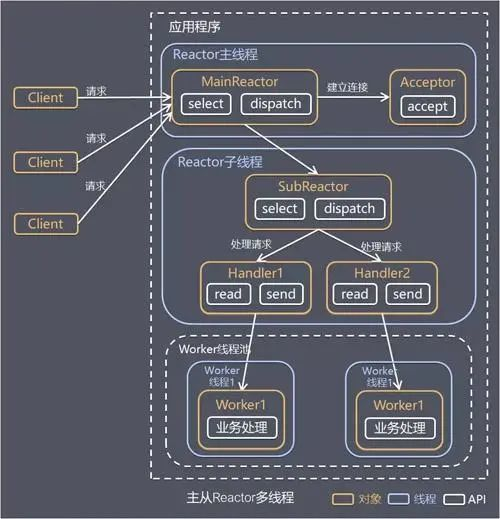
如下图：


&emsp; 针对单Reactor多线程模型中，Reactor 在单个线程中运行，面对高并发的场景易成为性能瓶颈的缺陷，主从 Reactor 多线程模式让 Reactor 在多个线程中运行（分成 MainReactor 线程与 SubReactor 线程）。这种模式的基本工作流程：
1. Reactor主线程MainReactor对象通过select监听客户端连接事件，收到事件后，通过Acceptor处理客户端连接事件。
2. 当Acceptor处理完客户端连接事件之后 (与客户端建立好Socket连接)，MainReactor将连接分配给SubReactor。（即MainReactor只负责监听客户端连接请求，和客户端建立连接之后将连接交由SubReactor监听后面的IO事件。）
3. SubReactor将连接加入到自己的连接队列进行监听，并创建Handler对各种事件进行处理。
4. 当连接上有新事件发生的时候，SubReactor就会调用对应Handler进行处理。
5. Handler通过read从连接上读取请求数据，将请求数据分发给Worker线程池进行业务处理。
6. Worker线程池会分配独立线程来完成真正的业务处理，并将处理结果返回给Handler。Handler通过Send向客户端发送响应数据。
7. 一个 MainReactor 可以对应多个 SubReactor，即一个 MainReactor 线程可以对应多个 SubReactor 线程。

这种模式的优点是：
1. MainReactor线程与SubReactor线程的数据交互简单职责明确，MainReactor线程只需要接收新链接，SubReactor线程完成后续的业务处理。
2. MainReactor线程与SubReactor线程的数据交互简单，MainReactor线程只需要把新连接传给SubReactor，SubReactor无需返回数据。
3. 多个SubReactor线程能够应对更高的并发请求。

这种模式的缺点是编程复杂度高。但是由于优点明显，在许多项目中被广泛使用，包括Nginx、Memcached、Netty等。
&emsp; 这种模式也被叫做服务器的1+M+N线程模式，即使用该模式开发的服务器包含一个（或多个，1只是表示相对较少）建立连接的线程+M个IO线程+N个业务处理线程。这是业界成熟的服务器程序设计模式。

## 2.3 Netty的架构
Netty设计主要基于主从Reactor多线程模式，并做了一定的改进。
简单版本的Netty雏形如下：
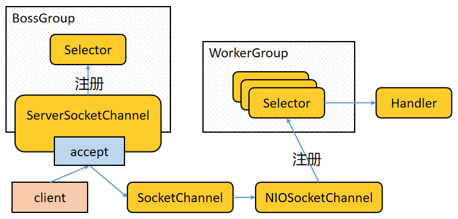
关于这张图，作以下几点说明：
1. BossGroup线程维护Selector，ServerSocketChannel注册到这个Selector上，只关注连接建立请求事件(相当于主Reactor)。
2. 当接收到来自客户端的连接建立请求事件时，通过ServerSocketChannel.accept()方法获得对应的SocketChannel，并封装成NioSocketChannel注册到WorkGroup线程中的Selector，每个Selector运行在一个线程中(相当于从Reactor)。
3. 当WorkGroup线程中的Selector监听到自己感兴趣的IO事件后，就调用Handler进行处理。

添加具体细节后如下图：
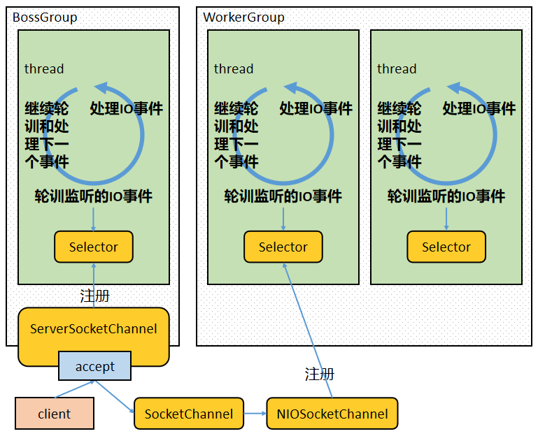
关于这张图，有几点需要说明：
1. 有两组线程池：BossGroup和WorkerGroup，BossGroup中的线程(可以有多个，图中只画一个)专门负责和客户端建立连接，WorkGroup中的线程专门处理连接上的读写。
2. BossGroup和WorkerGroup含有多个不断循环的执行事件处理的线程，每个线程都包含一个Selector，用于监听注册在其上的Channel。
3. 每个BossGroup中线程循环执行以下三个步骤：
    - 轮训注册在其上的ServerSocketChannel的accept事件(OP_ACCEPT事件)。
    - 处理accept事件，与客户端建立连接，生成一个NioSocketChannel，并将其注册到WorkGroup中某个线程上的Selector上。
    - 再去以此循环处理任务队列中的下一个事件。
4. 每个WorkGroup中的线程循环执行以下三个步骤：
    - 轮询注册在其上的NioSocketChannel的read/write事件（OP_READ/OP_WRITE事件）。
    - 在对应NioSocketChannel上处理read/write事件。
    - 再去以此循环处理任务队列中的下一个事件。

再来看下终极版的 Netty 的模样，如下图所示（图片来源于网络）：

关于这张图，作以下说明：
1. Netty抽象出两组线程池：BossGroup和WorkerGroup，也可以叫做BossEventNioLoopGroup和WorkerNioEventLoopGroup。每个线程池中都有NioEventLoop线程。BossGroup中的线程专门负责和客户端建立连接，WorkGroup中的线程专门处理连接上的读写。BossGroup和WorkerGroup的类型都是NioEventLoopGroup。
2. NioEventLoopGroup相当于一个事件循环组，这个组中含有多个事件循环，每个事件循环就是一个NioEventLoop。
3. NioEventLoop 表示一个不断循环的执行事件处理的线程，每个NioEventLoop都包含一个Selector，用于监听注册在其上的的Socket网络连接(Channel)。
4. NioEventLoopGroup可以包含多个线程，即可以含有多个NioEventLoop。
5. 每个BossNioEventLoop中循环执行以下三个步骤：
    - **select**：轮询注册在其上的的ServerSocketChannel的accept事件(OP_ACCEPT事件)。
    - **processSelectedKeys**：处理accept事件，与客户端建立连接，生成一个NioSocketChannel，并将其注册到某个WorkerNioEventLoop中的Selector上。
    - **runAllTasks**: 再去以此循环处理任务队列中的其他任务。
6. 每个WorkerNioEventLoop中循环执行以下三个步骤：
    - **select**：轮询注册在其上的NioSocketChannel的read/write事件（OP_READ/OP_WRITE事件）。
    - **processSelectedKeys**：在对应的 NioSocketChannel 上处理 read/write 事件
    - **runAllTasks**：再去以此循环处理任务队列中的其他任务。
7. 在以上两个**processSelectedKeys**步骤中，会使用 Pipeline（管道），Pipeline 中引用了 Channel，即通过 Pipeline 可以获取到对应的 Channel，Pipeline 中维护了很多的处理器（拦截处理器、过滤处理器、自定义处理器等）。这里暂时不详细展开讲解 Pipeline。


## 2.4 基于 Netty 的 TCP Server/Client 案例
下面两段代码分别是基于 Netty 的 TCP Server 和 TCP Client。
服务端代码为：
```java
/**
 * 需要的依赖：
 * <dependency>
 * <groupId>io.netty</groupId>
 * <artifactId>netty-all</artifactId>
 * <version>4.1.52.Final</version>
 * </dependency>
 */
public static void main(String[] args) throws InterruptedException {

    // 创建 BossGroup 和 WorkerGroup
    // 1. bossGroup 只处理连接请求
    // 2. 业务处理由 workerGroup 来完成
    EventLoopGroup bossGroup = new NioEventLoopGroup();
    EventLoopGroup workerGroup = new NioEventLoopGroup();

    try {
        // 创建服务器端的启动对象
        ServerBootstrap bootstrap = new ServerBootstrap();
        // 配置参数
        bootstrap
                // 设置线程组
                .group(bossGroup, workerGroup)
                // 说明服务器端通道的实现类（便于 Netty 做反射处理）
                .channel(NioServerSocketChannel.class)
                // 设置等待连接的队列的容量（当客户端连接请求速率大
             // 于 NioServerSocketChannel 接收速率的时候，会使用
                // 该队列做缓冲）
                // option()方法用于给服务端的 ServerSocketChannel
                // 添加配置
                .option(ChannelOption.SO_BACKLOG, 128)
                // 设置连接保活
                // childOption()方法用于给服务端 ServerSocketChannel
                // 接收到的 SocketChannel 添加配置
                .childOption(ChannelOption.SO_KEEPALIVE, true)
                // handler()方法用于给 BossGroup 设置业务处理器
                // childHandler()方法用于给 WorkerGroup 设置业务处理器
                .childHandler(
                        // 创建一个通道初始化对象
                        new ChannelInitializer<SocketChannel>() {
                            // 向 Pipeline 添加业务处理器
                            @Override
                            protected void initChannel(
                                    SocketChannel socketChannel
                            ) throws Exception {
                                socketChannel.pipeline().addLast(
                                        new NettyServerHandler()
                                );
                                
                                // 可以继续调用 socketChannel.pipeline().addLast()
                                // 添加更多 Handler
                            }
                        }
                );

        System.out.println("server is ready...");

        // 绑定端口，启动服务器，生成一个 channelFuture 对象，
        // ChannelFuture 涉及到 Netty 的异步模型，后面展开讲
        ChannelFuture channelFuture = bootstrap.bind(8080).sync();
        // 对通道关闭进行监听
        channelFuture.channel().closeFuture().sync();
    } finally {
        bossGroup.shutdownGracefully();
        workerGroup.shutdownGracefully();
    }
}

/**
 * 自定义一个 Handler，需要继承 Netty 规定好的某个 HandlerAdapter（规范）
 * InboundHandler 用于处理数据流入本端（服务端）的 IO 事件
 * InboundHandler 用于处理数据流出本端（服务端）的 IO 事件
 */
static class NettyServerHandler extends ChannelInboundHandlerAdapter {
    /**
     * 当通道有数据可读时执行
     *
     * @param ctx 上下文对象，可以从中取得相关联的 Pipeline、Channel、客户端地址等
     * @param msg 客户端发送的数据
     * @throws Exception
     */
    @Override
    public void channelRead(ChannelHandlerContext ctx, Object msg)
            throws Exception {
        // 接收客户端发来的数据

        System.out.println("client address: "
                + ctx.channel().remoteAddress());

        // ByteBuf 是 Netty 提供的类，比 NIO 的 ByteBuffer 性能更高
        ByteBuf byteBuf = (ByteBuf) msg;
        System.out.println("data from client: "
                + byteBuf.toString(CharsetUtil.UTF_8));
    }

    /**
     * 数据读取完毕后执行
     *
     * @param ctx 上下文对象
     * @throws Exception
     */
    @Override
    public void channelReadComplete(ChannelHandlerContext ctx)
            throws Exception {
        // 发送响应给客户端
        ctx.writeAndFlush(
                // Unpooled 类是 Netty 提供的专门操作缓冲区的工具
                // 类，copiedBuffer 方法返回的 ByteBuf 对象类似于
                // NIO 中的 ByteBuffer，但性能更高
                Unpooled.copiedBuffer(
                        "hello client! i have got your data.",
                        CharsetUtil.UTF_8
                )
        );
    }

    /**
     * 发生异常时执行
     *
     * @param ctx   上下文对象
     * @param cause 异常对象
     * @throws Exception
     */
    @Override
    public void exceptionCaught(ChannelHandlerContext ctx, Throwable cause)
            throws Exception {
        // 关闭与客户端的 Socket 连接
        ctx.channel().close();
    }
}
```
客户端端代码为：
```java
/**
 * 需要的依赖：
 * <dependency>
 * <groupId>io.netty</groupId>
 * <artifactId>netty-all</artifactId>
 * <version>4.1.52.Final</version>
 * </dependency>
 */
public static void main(String[] args) throws InterruptedException {

    // 客户端只需要一个事件循环组，可以看做 BossGroup
    EventLoopGroup eventLoopGroup = new NioEventLoopGroup();

    try {
        // 创建客户端的启动对象
        Bootstrap bootstrap = new Bootstrap();
        // 配置参数
        bootstrap
                // 设置线程组
                .group(eventLoopGroup)
                // 说明客户端通道的实现类（便于 Netty 做反射处理）
                .channel(NioSocketChannel.class)
                // handler()方法用于给 BossGroup 设置业务处理器
                .handler(
                        // 创建一个通道初始化对象
                        new ChannelInitializer<SocketChannel>() {
                            // 向 Pipeline 添加业务处理器
                            @Override
                            protected void initChannel(
                                    SocketChannel socketChannel
                            ) throws Exception {
                                socketChannel.pipeline().addLast(
                                        new NettyClientHandler()
                                );
                                
                                // 可以继续调用 socketChannel.pipeline().addLast()
                                // 添加更多 Handler
                            }
                        }
                );

        System.out.println("client is ready...");

        // 启动客户端去连接服务器端，ChannelFuture 涉及到 Netty 的异步模型，后面展开讲
        ChannelFuture channelFuture = bootstrap.connect(
                "127.0.0.1",
                8080).sync();
        // 对通道关闭进行监听
        channelFuture.channel().closeFuture().sync();
    } finally {
        eventLoopGroup.shutdownGracefully();
    }
}

/**
 * 自定义一个 Handler，需要继承 Netty 规定好的某个 HandlerAdapter（规范）
 * InboundHandler 用于处理数据流入本端（客户端）的 IO 事件
 * InboundHandler 用于处理数据流出本端（客户端）的 IO 事件
 */
static class NettyClientHandler extends ChannelInboundHandlerAdapter {
    /**
     * 通道就绪时执行
     *
     * @param ctx 上下文对象
     * @throws Exception
     */
    @Override
    public void channelActive(ChannelHandlerContext ctx)
            throws Exception {
        // 向服务器发送数据
        ctx.writeAndFlush(
                // Unpooled 类是 Netty 提供的专门操作缓冲区的工具
                // 类，copiedBuffer 方法返回的 ByteBuf 对象类似于
                // NIO 中的 ByteBuffer，但性能更高
                Unpooled.copiedBuffer(
                        "hello server!",
                        CharsetUtil.UTF_8
                )
        );
    }

    /**
     * 当通道有数据可读时执行
     *
     * @param ctx 上下文对象
     * @param msg 服务器端发送的数据
     * @throws Exception
     */
    @Override
    public void channelRead(ChannelHandlerContext ctx, Object msg)
            throws Exception {
        // 接收服务器端发来的数据

        System.out.println("server address: "
                + ctx.channel().remoteAddress());

        // ByteBuf 是 Netty 提供的类，比 NIO 的 ByteBuffer 性能更高
        ByteBuf byteBuf = (ByteBuf) msg;
        System.out.println("data from server: "
                + byteBuf.toString(CharsetUtil.UTF_8));
    }

    /**
     * 发生异常时执行
     *
     * @param ctx   上下文对象
     * @param cause 异常对象
     * @throws Exception
     */
    @Override
    public void exceptionCaught(ChannelHandlerContext ctx, Throwable cause)
            throws Exception {
        // 关闭与服务器端的 Socket 连接
        ctx.channel().close();
    }
}
```
可以看到以两段简单的代码就可以构建了基于主从 Reactor 多线程模式的服务器，一个高吞吐量和并发量的服务器，一个异步处理服务器。
对上面的两段代码，作以下简单说明：

1. Bootstrap 和 ServerBootstrap 分别是客户端和服务器端的引导类，一个 Netty 应用程序通常由一个引导类开始，主要是用来配置整个 Netty 程序、设置业务处理类（Handler）、绑定端口、发起连接等。
2. 客户端创建一个 NioSocketChannel 作为客户端通道，去连接服务器。
3. 服务端首先创建一个 NioServerSocketChannel 作为服务器端通道，每当接收一个客户端连接就产生一个 NioSocketChannel 应对该客户端。
4. 使用 Channel 构建网络 IO 程序的时候，不同的协议、不同的阻塞类型和 Netty 中不同的 Channel 对应，常用的 Channel 有：
    - **NioSocketChannel**：非阻塞的 TCP 客户端 Channel（本案例的客户端使用的 Channel。
    - **NioServerSocketChannel**：非阻塞的 TCP 服务器端 Channel（本案例的服务器端使用的 Channel）。
    - **NioDatagramChannel**：非阻塞的 UDP Channel。
    - **NioSctpChannel**：非阻塞的 SCTP 客户端 Channel。
    - **NioSctpServerChannel**：非阻塞的 SCTP 服务器端 Channel。

启动服务端和客户端代码，调试以上的服务端代码，发现：
1）默认情况下 BossGroup 和 WorkerGroup 都包含 16 个线程（NioEventLoop），这是因为我的 PC 是 8 核的 NioEventLoop 的数量=coreNum*2。这 16 个线程相当于主 Reactor。 其实创建 BossGroup 和 WorkerGroup 的时候可以指定 NioEventLoop 数量，如下：
```java
EventLoopGroup bossGroup = new NioEventLoopGroup(1);
EventLoopGroup workerGroup = new NioEventLoopGroup(16);
```
这样就能更好地分配线程资源。
2）每一个 NioEventLoop 包含如下的属性（比如自己的 Selector、任务队列、执行器等）。
3）将代码断在服务端的 NettyServerHandler.channelRead 上：

可以看到：
*   当前 ChannelHandlerContext ctx 是位于 ChannelHandlerContext 责任链中的一环，可以看到其 next、prev 属性
*   当前 ChannelHandlerContext ctx 包含一个 Handler
*   当前 ChannelHandlerContext ctx 包含一个 Pipeline
*   Pipeline 本质上是一个双向循环列表，可以看到其 tail、head 属性
*   Pipeline 中包含一个 Channel，Channel 中又包含了该 Pipeline，两者互相引用。

## 2.5 Netty 的 Handler 组件
无论是服务端代码中自定义的 NettyServerHandler 还是客户端代码中自定义的 NettyClientHandler，都继承于 ChannelInboundHandlerAdapter，ChannelInboundHandlerAdapter 又继承于 ChannelHandlerAdapter，ChannelHandlerAdapter 又实现了 ChannelHandler：
```java
public class ChannelInboundHandlerAdapter 
    extends ChannelHandlerAdapter 
    implements ChannelInboundHandler {
    ......

public abstract class ChannelHandlerAdapter 
    implements ChannelHandler {
    ......
```
因此无论是服务端代码中自定义的 NettyServerHandler 还是客户端代码中自定义的 NettyClientHandler，都可以统称为 ChannelHandler。
&emsp; Netty 中的 ChannelHandler 的作用是，在当前 ChannelHandler 中处理 IO 事件，并将其传递给 ChannelPipeline 中下一个 ChannelHandler 处理，因此多个 ChannelHandler 形成一个责任链，责任链位于 ChannelPipeline 中。
&emsp; 数据在基于 Netty 的服务器或客户端中的处理流程是：读取数据-->解码数据-->处理数据-->编码数据-->发送数据。其中的每个过程都用得到 ChannelHandler 责任链。
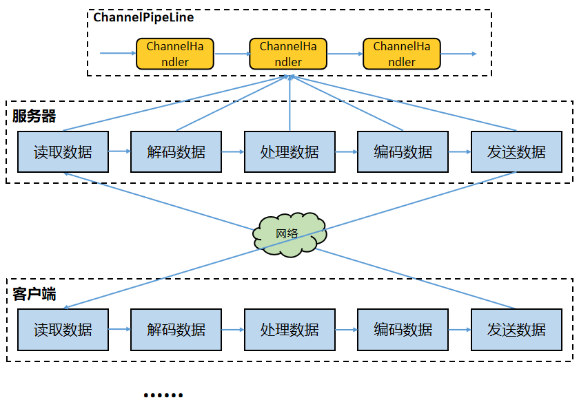
Netty 中的 ChannelHandler 体系如下（第一张图来源于网络）：
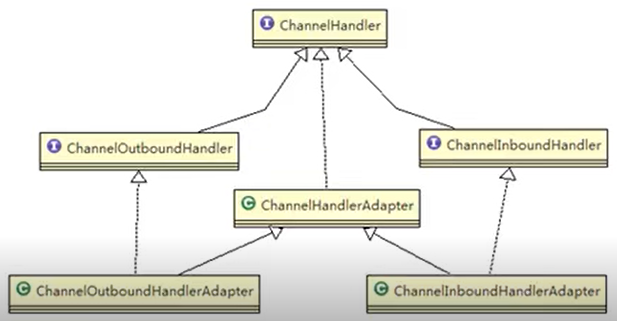
ChannelHandler接口方法如下：
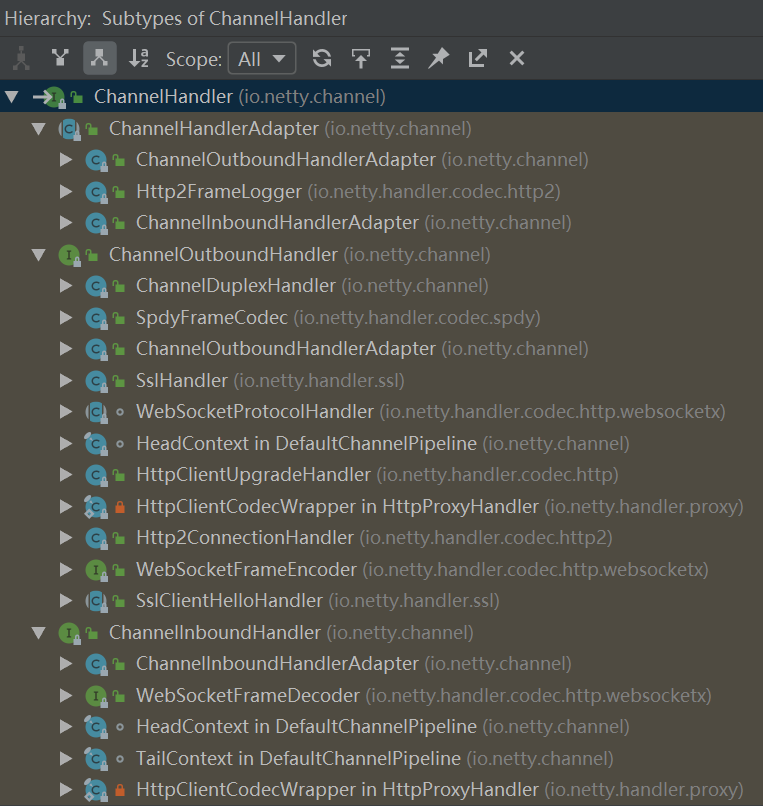

其中：
- ChannelInboundHandler 用于处理入站 IO 事件
- ChannelOutboundHandler 用于处理出站 IO 事件
- ChannelInboundHandlerAdapter 用于处理入站 IO 事件
- ChannelOutboundHandlerAdapter 用于处理出站 IO 事件

ChannelPipeline 提供了 ChannelHandler 链的容器。以客户端应用程序为例，如果事件的方向是从客户端到服务器的，我们称事件是出站的，那么客户端发送给服务器的数据会通过 Pipeline 中的一系列 ChannelOutboundHandler 进行处理；如果事件的方向是从服务器到客户端的，我们称事件是入站的，那么服务器发送给客户端的数据会通过 Pipeline 中的一系列 ChannelInboundHandler 进行处理。
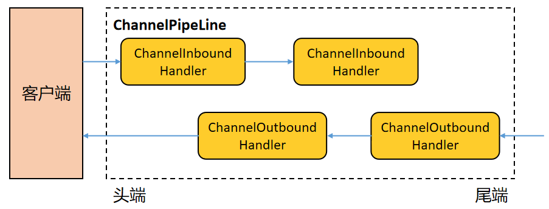
无论是服务端代码中自定义的 NettyServerHandler 还是客户端代码中自定义的 NettyClientHandler，都继承于 ChannelInboundHandlerAdapter，ChannelInboundHandlerAdapter 提供的方法如下：

从方法名字可以看出，它们在不同的事件发生后被触发，例如注册 Channel 时执行 channelRegistred()、添加 ChannelHandler 时执行 handlerAdded()、收到入站数据时执行 channelRead()、入站数据读取完毕后执行 channelReadComplete()等等。

## 2.6 Netty 的 Pipeline 组件
&emsp; 上一节说到，Netty 的 ChannelPipeline，它维护了一个 ChannelHandler 责任链，负责拦截或者处理 inbound（入站）和 outbound（出站）的事件和操作。这一节给出更深层次的描述。
&emsp; ChannelPipeline 实现了一种高级形式的拦截过滤器模式，使用户可以完全控制事件的处理方式，以及 Channel 中各个 ChannelHandler 如何相互交互。
&emsp; 每个 Netty Channel 包含了一个 ChannelPipeline（其实 Channel 和 ChannelPipeline 互相引用），而 ChannelPipeline 又维护了一个由 ChannelHandlerContext 构成的双向循环列表，其中的每一个 ChannelHandlerContext 都包含一个 ChannelHandler。（前文描述的时候为了简便，直接说 ChannelPipeline 包含了一个 ChannelHandler 责任链，这里给出完整的细节。）

如下图所示（图片来源于网络）：

基于 Netty 的 Server 程序的调试截图，可以从中看到 ChannelHandlerContext 中包含了哪些成分：
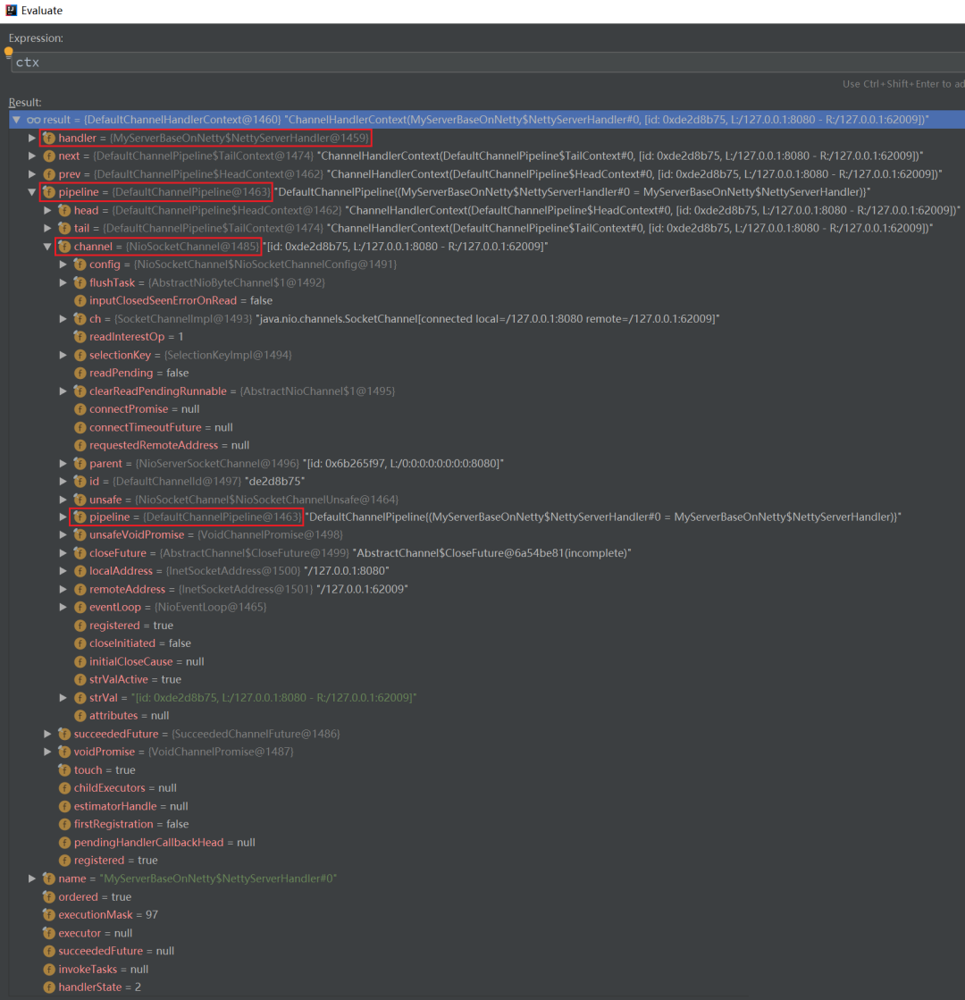
&emsp; ChannelHandlerContext 除了包含 ChannelHandler 之外，还关联了对应的 Channel 和 Pipeline。可以这么来讲：ChannelHandlerContext、ChannelHandler、Channel、ChannelPipeline 这几个组件之间互相引用，互为各自的属性，你中有我、我中有你。
&emsp; 在处理入站事件的时候，入站事件及数据会从 Pipeline 中的双向链表的头 ChannelHandlerContext 流向尾 ChannelHandlerContext，并依次在其中每个 ChannelInboundHandler（例如解码 Handler）中得到处理；出站事件及数据会从 Pipeline 中的双向链表的尾 ChannelHandlerContext 流向头 ChannelHandlerContext，并依次在其中每个 ChannelOutboundHandler（例如编码 Handler）中得到处理。
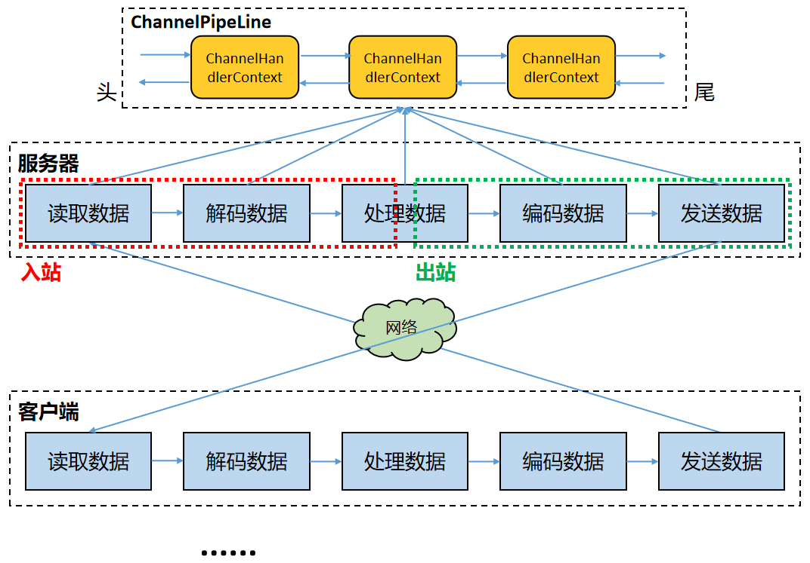.

## 2.7 Netty的EventLoopGroup组件
在基于 Netty 的 TCP Server 代码中，包含了两个 EventLoopGroup——bossGroup 和 workerGroup，EventLoopGroup 是一组 EventLoop 的抽象。

&emsp;追踪 Netty 的 EventLoop 的继承链，可以发现 EventLoop 最终继承于 JUC Executor，因此 EventLoop 本质就是一个 JUC Executor，即线程，JUC Executor 的源码为：
```java
public interface Executor {
    /**
     * Executes the given command at some time in the future.
     */
    void execute(Runnable command);
}
```
- Netty 为了更好地利用多核 CPU 的性能，一般会有多个 EventLoop 同时工作，每个 EventLoop 维护着一个 Selector 实例，Selector 实例监听注册其上的 Channel 的 IO 事件。
- EventLoopGroup 含有一个 next 方法，它的作用是按照一定规则从 Group 中选取一个 EventLoop 处理 IO 事件。
- 在服务端，通常 Boss EventLoopGroup 只包含一个 Boss EventLoop（单线程），该 EventLoop 维护者一个注册了 ServerSocketChannel 的 Selector 实例。该 EventLoop 不断轮询 Selector 得到 OP_ACCEPT 事件（客户端连接事件），然后将接收到的 SocketChannel 交给 Worker EventLoopGroup，Worker EventLoopGroup 会通过 next()方法选取一个 Worker EventLoop 并将这个 SocketChannel 注册到其中的 Selector 上，由这个 Worker EventLoop 负责该 SocketChannel 上后续的 IO 事件处理。整个过程如下图所示：
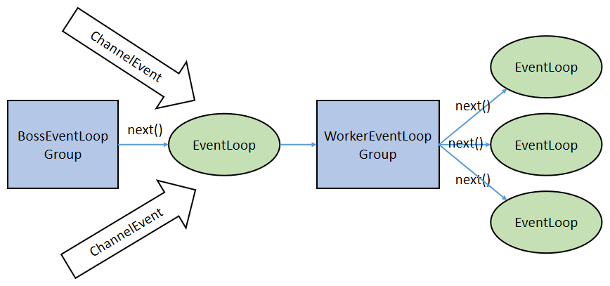

## 2.8 Netty的TaskQueue
在 Netty 的每一个 NioEventLoop 中都有一个 TaskQueue，设计它的目的是在任务提交的速度大于线程的处理速度的时候起到缓冲作用。或者用于异步地处理 Selector 监听到的 IO 事件。
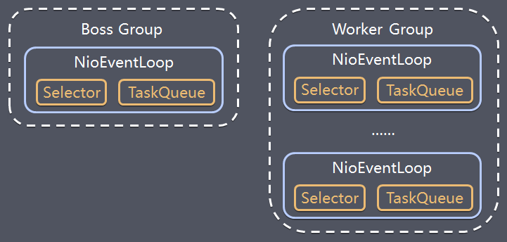
Netty 中的任务队列有三种使用场景：<font color="green">**
1）处理用户程序的自定义普通任务的时候
2）处理用户程序的自定义定时任务的时候
3）非当前 Reactor 线程调用当前 Channel 的各种方法的时候。
**</font>

对于第一种场景，举个例子，2.4 节的基于 Netty 编写的服务端的 Handler 中，假如 channelRead 方法中执行的过程很耗时，那么以下的阻塞式处理方式无疑会降低当前 NioEventLoop 的并发度：
```java
/**
 * 当通道有数据可读时执行
 *
 * @param ctx 上下文对象
 * @param msg 客户端发送的数据
 * @throws Exception
 */
@Override
public void channelRead(ChannelHandlerContext ctx, Object msg)
        throws Exception {
    // 借助休眠模拟耗时操作
    Thread.sleep(LONG_TIME);

    ByteBuf byteBuf = (ByteBuf) msg;
    System.out.println("data from client: "
            + byteBuf.toString(CharsetUtil.UTF_8));
}
```
改进方法就是借助任务队列，代码如下：
```java
/**
 * 当通道有数据可读时执行
 *
 * @param ctx 上下文对象
 * @param msg 客户端发送的数据
 * @throws Exception
 */
@Override
public void channelRead(ChannelHandlerContext ctx, Object msg)
        throws Exception {
    // 假如这里的处理非常耗时，那么就需要借助任务队列异步执行

    final Object finalMsg = msg;

    // 通过 ctx.channel().eventLoop().execute()将耗时
    // 操作放入任务队列异步执行
    ctx.channel().eventLoop().execute(new Runnable() {
        public void run() {
            // 借助休眠模拟耗时操作
            try {
                Thread.sleep(LONG_TIME);
            } catch (InterruptedException e) {
                e.printStackTrace();
            }

            ByteBuf byteBuf = (ByteBuf) finalMsg;
            System.out.println("data from client: "
                    + byteBuf.toString(CharsetUtil.UTF_8));
        }
    });
    
    // 可以继续调用 ctx.channel().eventLoop().execute()
    // 将更多操作放入队列
    
    System.out.println("return right now.");
}
```
断点跟踪这个函数的执行，可以发现该耗时任务确实被放入的当前 NioEventLoop 的 taskQueue 中了。
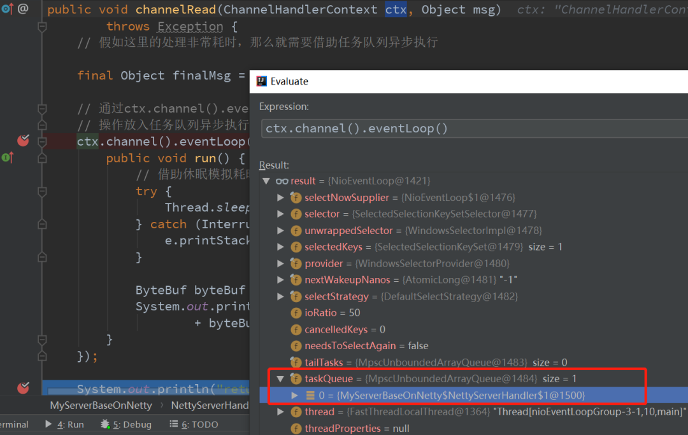


对于第二种场景，举个例子，2.4 节的基于 Netty 编写的服务端的 Handler 中，假如 channelRead 方法中执行的过程并不需要立即执行，而是要定时执行，那么代码可以这样写：
```java
/**
 * 当通道有数据可读时执行
 *
 * @param ctx 上下文对象
 * @param msg 客户端发送的数据
 * @throws Exception
 */
@Override
public void channelRead(ChannelHandlerContext ctx, Object msg)
        throws Exception {

    final Object finalMsg = msg;

    // 通过 ctx.channel().eventLoop().schedule()将操作
    // 放入任务队列定时执行（5min 之后才进行处理）
    ctx.channel().eventLoop().schedule(new Runnable() {
        public void run() {

            ByteBuf byteBuf = (ByteBuf) finalMsg;
            System.out.println("data from client: "
                    + byteBuf.toString(CharsetUtil.UTF_8));
        }
    }, 5, TimeUnit.MINUTES);
    
    // 可以继续调用 ctx.channel().eventLoop().schedule()
    // 将更多操作放入队列

    System.out.println("return right now.");
}
```
断点跟踪这个函数的执行，可以发现该定时任务确实被放入的当前 NioEventLoop 的 scheduleTaskQueue 中了。
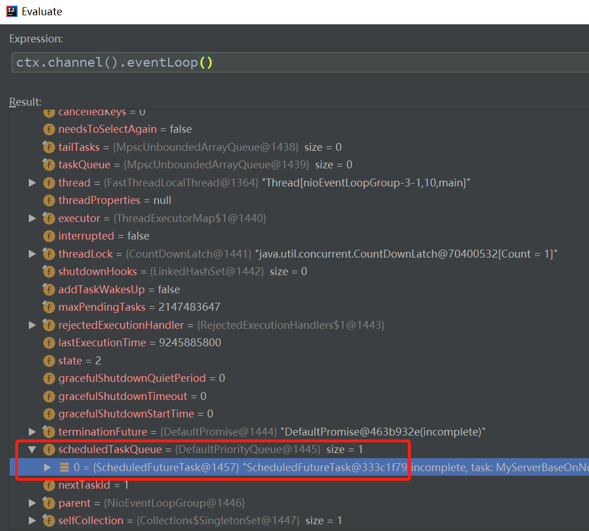

对于第三种场景，举个例子，比如在基于 Netty 构建的推送系统的业务线程中，要根据用户标识，找到对应的 SocketChannel 引用，然后调用 write 方法向该用户推送消息，这时候就会将这一 write 任务放在任务队列中，write 任务最终被异步消费。这种情形是对前两种情形的应用，且涉及的业务内容太多，不再给出示例代码，读者有兴趣可以自行完成，这里给出以下提示：


## 2.9 Netty的Future和Promise
Netty**对使用者提供的多数 IO 接口（即 Netty Channel 中的 IO 方法）**是异步的（**即都立即返回一个 Netty Future，而 IO 过程异步进行**），因此，调用者调用 IO 操作后是不能直接拿到调用结果的。要想得到 IO 操作结果，可以借助 Netty 的 Future（上面代码中的 ChannelFuture 就继承了 Netty Future，Netty Future 又继承了 JUC Future）查询执行状态、等待执行结果、获取执行结果等，使用过 JUC Future 接口的同学会非常熟悉这个机制，这里不再展开描述了。也可以通过 Netty Future 的 addListener()添加一个回调方法来异步处理 IO 结果，如下
```java
// 启动客户端去连接服务器端
// 由于 bootstrap.connect()是一个异步操作，因此用.sync()等待
// 这个异步操作完成
final ChannelFuture channelFuture = bootstrap.connect(
        "127.0.0.1",
        8080).sync();

channelFuture.addListener(new ChannelFutureListener() {
    /**
     * 回调方法，上面的 bootstrap.connect()操作执行完之后触发
     */
    public void operationComplete(ChannelFuture future)
            throws Exception {
        if (channelFuture.isSuccess()) {
            System.out.println("client has connected to server!");
            // TODO 其他处理
        } else {
            System.out.println("connect to serverfail!");
            // TODO 其他处理
        }
    }
});
```
> 注：会有一些资料给出这样的描述：“Netty 中所有的 IO 操作都是异步的”，这显然是错误的。Netty 基于 Java NIO，Java NIO 是同步非阻塞 IO。Netty 基于 Java NIO 做了封装，向使用者提供了异步特性的接口，因此本文说 Netty**对使用者提供的多数 IO 接口（即 Netty Channel 中的 IO 方法）**是异步的。例如在 io.netty.channel.ChannelOutboundInvoker（Netty Channel 的 IO 方法多继承于此）提供的多数 IO 接口都返回 Netty Future：

Promise 是可写的 Future，Future 自身并没有写操作相关的接口，Netty 通过 Promise 对 Future 进行扩展，用于设置 IO 操作的结果。Future 继承了 Future，相关的接口定义如下图所示，相比于上图 Future 的接口，它多出了一些 setXXX 方法：

Netty 发起 IO 写操作的时候，会创建一个新的 Promise 对象，例如调用 ChannelHandlerContext 的 write(Object object)方法时，会创建一个新的 ChannelPromise，相关代码如下：
```java
@Override
public ChannelFuture write(Object msg) {
    return write(msg, newPromise());
}
......
@Override
public ChannelPromise newPromise() {
    return new DefaultChannelPromise(channel(), executor());
}
......
```

当 IO 操作发生异常或者完成时，通过 Promise.setSuccess()或者 Promise.setFailure()设置结果，并通知所有 Listener。关于 Netty 的 Future/Promise 的工作原理，我将在下一篇文章中进行源码级的解析。

----

# 结束语
最后谨记Netty的核心原理图
